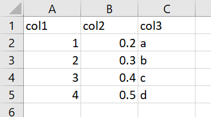

class: logo-slide

---

class: title-slide

## Wrangling Data in the Tidyverse

## Applications of Data Science - Class 1

### Giora Simchoni

#### `gsimchoni@gmail.com and add #dsapps in subject`

### Stat. and OR Department, TAU
### `r Sys.Date()`

---
```{r child = "../setup.Rmd"}
```

```{r packages, echo=FALSE, message=FALSE, warning=FALSE}
library(tidyverse)
```

# So, what's wrong with Excel?

(MS Excel is one amazing software. But it lacks:)

- Structure (or rather, structure is up to the user)
- Types to variables
- Automization (you could learn VBA Excel, but the horror)
- Reproducibility
- Open Source
- Extensibility
- Speed and Scale
- Modeling (there *is* a t-test, but the horror)

[MS Excel might be the most dangerous software on the planet](https://www.forbes.com/sites/timworstall/2013/02/13/microsofts-excel-might-be-the-most-dangerous-software-on-the-planet/#667084f5633d) (Tim Worstall, Forbes)

---

# So, what's wrong with base R?

(Base R is one amazing software. But it lacks:)

- Consistency:
  - Function names
  - Function arguments names
  - Function arguments order
  - Function return types (sometimes the same function!)
- Meaningful errors and warnings
- Good choices of default values to arguments
- Speed
- Good and easy visualizations
- One other thing

---

### Consistency - Example 1: Strings

.font80percent[
```{r Strings1}
# split a string by pattern: strsplit(string, pattern)
strsplit("Who dis?", " ")
```

```{r Strings2}
# find if a pattern exists in a string: grepl(pattern, string)
grepl("di", "Who dis?")
```

```{r String3}
# substitute a pattern in a string: sub(pattern, replace, string)
sub("di", "thi", "Who dis?")
```

```{r String4}
# length of a string: nchar(string); length of object: length(obj)
nchar("Who dis?"); length("Who dis?")
```
]

---

### Consistency - Example 2: Models

```{r GLM-Data}
n <- 10000
x1 <- runif(n)
x2 <- runif(n)
t <- 1 + 2 * x1 + 3 * x2
y <- rbinom(n, 1, 1 / (1 + exp(-t)))
```

```{r GLM, eval=FALSE}
glm(y ~ x1 + x2, family = "binomial")
```

```{r GLMNET, eval=FALSE}
glmnet(as.matrix(cbind(x1, x2)), as.factor(y), family = "binomial")
```

```{r RF, eval=FALSE}
randomForest(as.factor(y) ~ x1 + x2)
```


```{r GBM, eval=FALSE}
gbm(y ~ x1 + x2, data = data.frame(x1 = x1, x2 = x2, y = y))
```

`r emo::ji("scream")`

---

### Meaningful Errors - Example

```{r Error, error=TRUE, linewidth=80}
df <- data.frame(Education = 1:5, Ethnicity = c(2, 4, 5, 2, 1))
table(df$Eduction, df$Ethnicity)
```

---

### Default Values - Example



```{r Args1}
df <- read.csv("data/bad_args_test.csv")
df$col3
```

```{r Args2}
df <- read.csv("data/bad_args_test.csv", stringsAsFactors = FALSE)
df$col3
```

---

### Speed - Example

```{r, Microbenchmark1}
file_path <- "data/mediocre_file.csv"
df <- read.csv(file_path)
dim(df)
```

```{r, Microbenchmark2}
library(microbenchmark)

microbenchmark(
  read_base = read.csv(file_path),
  read_tidy = read_csv(file_path, col_types = cols()),
  read_dt = data.table::fread(file_path),
  times = 10)
```

---

### Good Vizualizations - Example

```{r Viz-Read}
df <- read_csv(file_path, col_types = cols())
```

```{r Viz-Base, out.width = "40%"}
plot(df$var10, df$var12,
     col = c("red", "green", "blue", "purple", "pink")[
       as.factor(df$var9)])
```

---

```{r Viz-Tidy, out.width = "40%"}
ggplot(df, aes(var10, var12, color = var9)) + geom_point()
```

---

### One other thing

Manager: "Give me the average Horse Power of automatic Toyota cars with 4 cylinders and weight in tons smaller than no. of gears"

You:

```{r Not-Functional}
mean(mtcars$hp[startsWith(rownames(mtcars), "Toyota") & mtcars$am == 0 & mtcars$cyl == 4 & mtcars$wt < mtcars$gear], na.rm = TRUE)
```

Or the slightly better you:

```{r Not-Functional-Better}
car_names <- rownames(mtcars)
mean(
  with(mtcars,
       hp[startsWith(car_names, "Toyota") & am == 0 & wt < gear]),
  na.rm = TRUE)
```

---

Or the best you:

```{r Not-Functional-Best}
is_toyota <- startsWith(rownames(mtcars), "Toyota")
is_automatic <- mtcars$am == 0
is_4_cylinders <- mtcars$cyl == 4
is_weight_smaller_gear <- mtcars$wt < mtcars$gear

mtcars_filtered <- mtcars[is_toyota & is_automatic & is_4_cylinders & is_weight_smaller_gear, ]

mean(mtcars_filtered$hp, na.rm = TRUE)
```

