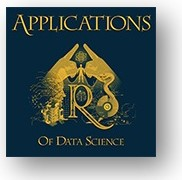

# DSApps @ TAU 2020: Course Repo

### Welcome!

* For the syllabus see [here](Apps_of_DS_syllabus.pdf)
* For installations instructions see [here](Apps_of_DS_installations.pdf)
* For running HW Assignments see [here](Apps_of_DS_HW.pdf)
* For the course RStudio Cloud Workspace see [here](https://rstudio.cloud/spaces/53391/join?access_code=%2BbJf2rOUHoqYTmNTNHqAwXUehBgvPL18R7uxksJB)
* For all other info and links to slides see the [course website](https://dsapps-2020.github.io/Class_Slides). Have fun :smiley:

###### Giora Simchoni