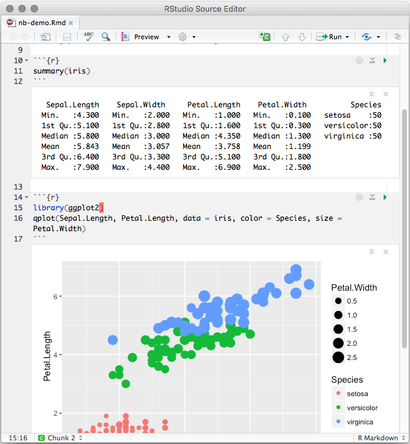
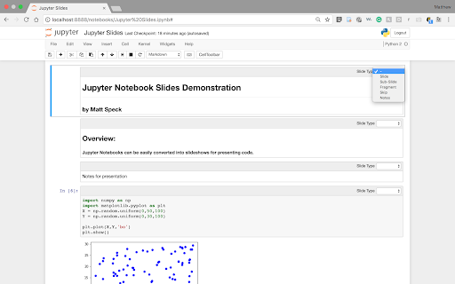
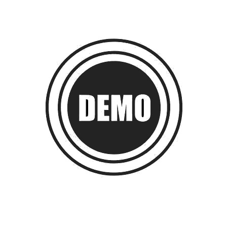

class: logo-slide

---

class: title-slide

## Introduction

### Applications of Data Science - Class 0

### Giora Simchoni

#### `gsimchoni@gmail.com and add #dsapps in subject`

### Stat. and OR Department, TAU
### `r Sys.Date()`

---
```{r child = "../setup.Rmd"}
```

```{r packages, echo=FALSE, message=FALSE, warning=FALSE}
library(tidyverse)
```

# You are here.

- You have a basic background in Statistics, Data Science, Machine Learning
(Stat. Learning is a prerequisite)
- You’re OK with R, Python or both
(Some CS introduction is a prerequisite)
- You want to know more
- You need some experience in real data projects
- You’re thinking about actually getting a job
- You need a portfolio

---

# I must insist.

- You have a terminal, a.k.a shell (Mac/Windows 10 - See installation instructions here. Windows 7 and less - 😧)
- You start becoming friendly with your terminal
<br></br>
- You have git on your system
- You have a personal Github account
- You are familiar with Google. And later, [Stack Overflow](https://stackoverflow.com/).

---

# And either:

- You have Docker on your system
- And then, you won’t need to install anything and we’ll work on the exact same environment. Almost.


## Or:

- You have the latest R (3.6.1) and latest RStudio IDE (1.2) and you are able to install packages with `install.packages(“package_name”)`
- You have Python (at least 3.6), Jupyter, and you are able to install packages with `pip install`. Consider working with Anaconda/PyCharm.

---

## Speak absolutely no R? Absolutely no Python?

- Well you better start (R):
  - [DataCamp: Introduction to R](https://www.datacamp.com/courses/free-introduction-to-r)
  - [Swirl](https://swirlstats.com/)
  - [edX: Data Science: R Basics](https://www.edx.org/course/data-science-r-basics-2)
  - [RStudio: R for Data Science](https://r4ds.had.co.nz/)
- Well you better start (Python):
  - [DataCamp: Introduction to Python](https://www.datacamp.com/courses/intro-to-python-for-data-science)
  - [W3Schools: Python Introduction](https://www.w3schools.com/python/python_intro.asp)
  - [edX](https://www.edx.org/learn/python), [Coursera](https://www.coursera.org/specializations/python) (really, just pick one)
  - [Andreas Ernst: Python-Lectures](https://gitlab.erc.monash.edu.au/andrease/Python4Maths)

---

## We learn by doing, we strive for reproducibility

.pull-left[
[R notebooks](https://bookdown.org/yihui/rmarkdown/notebook.html) for R


]

.pull-right[
[Jupyter notebooks](https://jupyter.org/) for Python


]

---

# Grade

- 4-7 home assignments (10% each)
  - Miss one or have your lowest grade dismissed
  - Submitted via Github, more on that later
- One final project (100% - (n_assignments - 1) * 10%)
  - Something you can show other humans
  - More on that later

- Though I strongly encourage you to not worry about the grade, start submerging yourselves into the material or if you have to worry about something, worry about what you’re going to show future employers

---

# Finally, what we’ll learn

- Part I: Data Wrangling + Viz in the Tidyverse (R) and in pandas (Python)
- Part II: Intro to Network Analysis (Python)
- Part III: More Predictive Modeling (R)
- Part IV: Deep Learning – beyond the basics. Or maybe not, up to you. (Python)
- Part V: Building a DS Project (R and a bit of Python)

---
class: center, middle
# Don't Panic.

---

## RStudio Cloud and Binder Demo

<div class = "no_shadow">
  <p align="center">
    
  </p>
<div/>

---

## Git Demo

<div class = "no_shadow">
  <p align="center">
    
  </p>
</div>

---

## Docker Demo

<div class = "no_shadow">
  <p align="center">
    
  </p>
</div>

---

# Are you ready?

<p align="center">
  
</p>

Go to: http://bit.ly/dsapps2020_tidy
