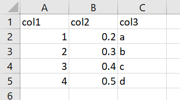
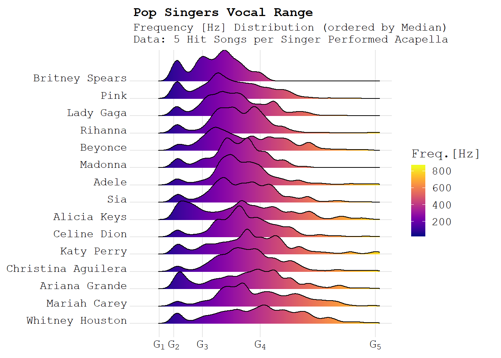
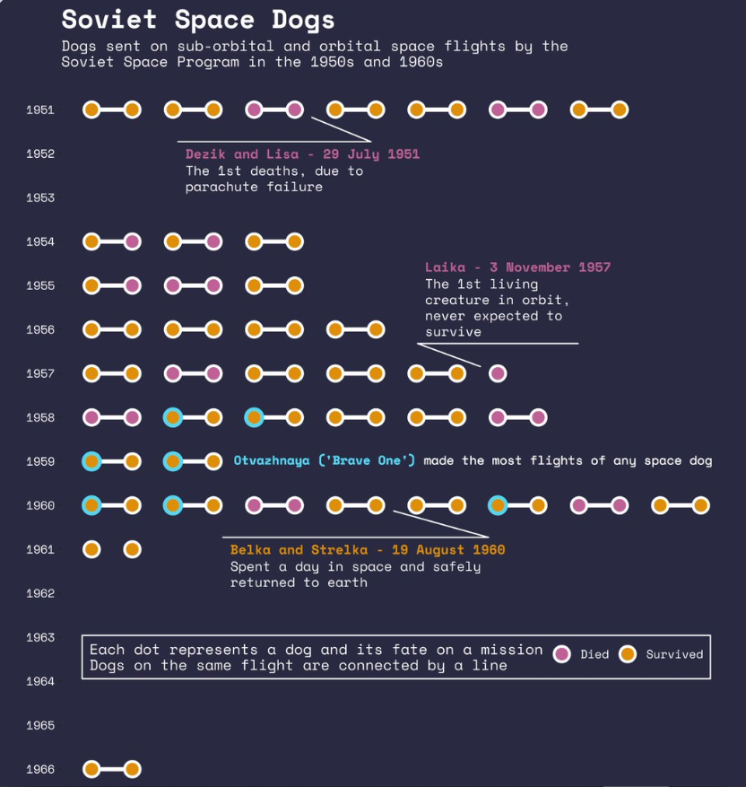
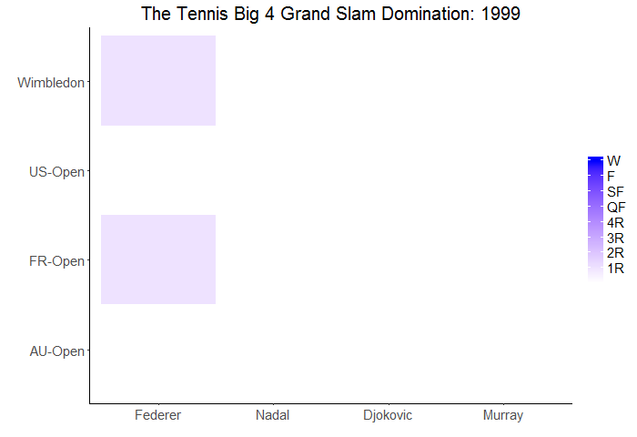
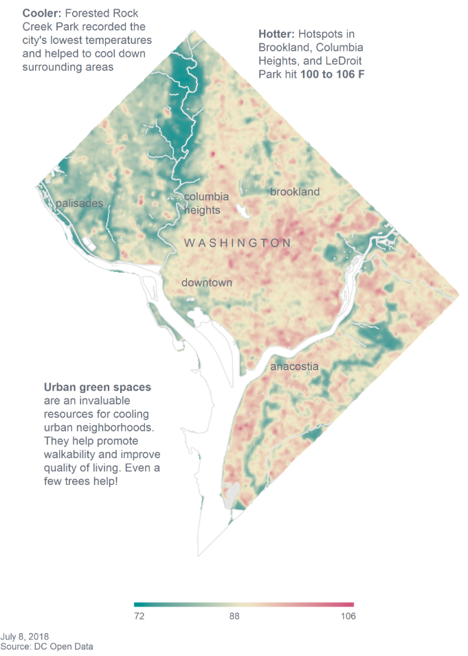
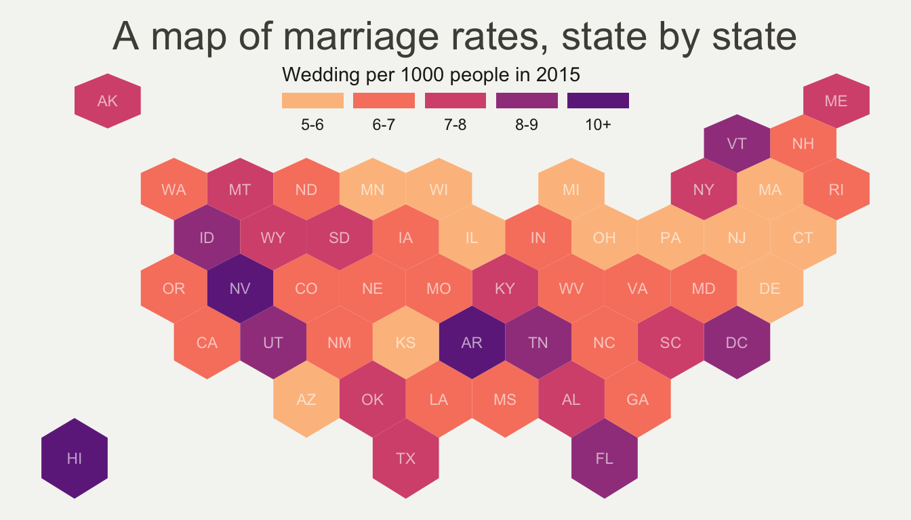
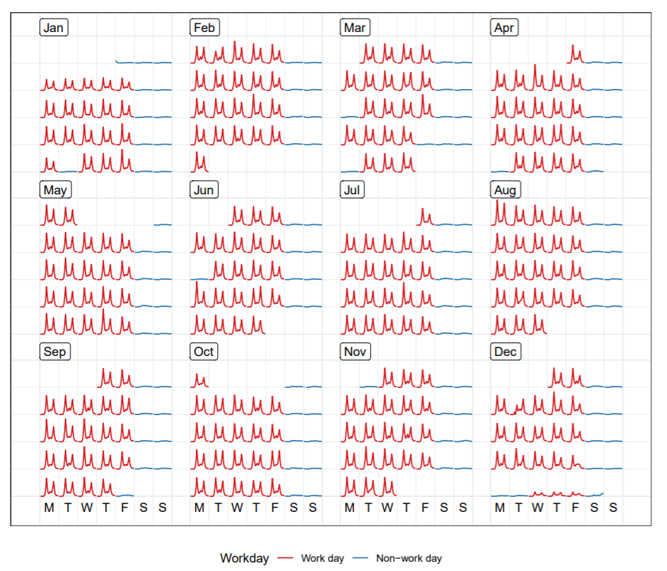
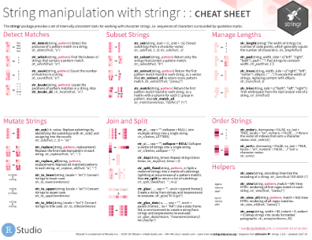

class: logo-slide

---

class: title-slide

## The Tidyverse

### Applications of Data Science - Class 1

### Giora Simchoni

#### `gsimchoni@gmail.com and add #dsapps in subject`

### Stat. and OR Department, TAU
### `r Sys.Date()`

---
```{r child = "../setup.Rmd"}
```

```{r packages, echo=FALSE, message=FALSE, warning=FALSE}
library(tidyverse)
```

class: section-slide

# I don't need to know about wrangling data, I get by.

---

# So, what's wrong with Excel?

(MS Excel is one amazing software. But it lacks:)

- Structure (or rather, structure is up to the user)
- Types to variables
- Automization (you could learn VBA Excel, but the horror)
- Reproducibility
- Open Source
- Extensibility
- Speed and Scale
- Modeling (there *is* a t-test, but the horror)

[MS Excel might be the most dangerous software on the planet](https://www.forbes.com/sites/timworstall/2013/02/13/microsofts-excel-might-be-the-most-dangerous-software-on-the-planet/#667084f5633d) (Tim Worstall, Forbes)

---

# So, what's wrong with base R?

(Base R is one amazing software. But it lacks:)

- Consistency:
  - Function names
  - Function arguments names
  - Function arguments order
  - Function return types (sometimes the same function!)
- Meaningful errors and warnings
- Good choices of default values to arguments
- Speed
- Good and easy visualizations
- One other thing

---

### (In) Consistency - Example 1: Strings

.font80percent[
```{r Strings1}
# split a string by pattern: strsplit(string, pattern)
strsplit("Who dis?", " ")
```

```{r Strings2}
# find if a pattern exists in a string: grepl(pattern, string)
grepl("di", "Who dis?")
```

```{r String3}
# substitute a pattern in a string: sub(pattern, replace, string)
sub("di", "thi", "Who dis?")
```

```{r String4}
# length of a string: nchar(string); length of object: length(obj)
nchar("Who dis?"); length("Who dis?")
```
]

---

### (In) Consistency - Example 2: Models

```{r GLM-Data}
n <- 10000
x1 <- runif(n)
x2 <- runif(n)
t <- 1 + 2 * x1 + 3 * x2
y <- rbinom(n, 1, 1 / (1 + exp(-t)))
```

```{r GLM, eval=FALSE}
glm(y ~ x1 + x2, family = "binomial")
```

```{r GLMNET, eval=FALSE}
glmnet(as.matrix(cbind(x1, x2)), as.factor(y), family = "binomial")
```

```{r RF, eval=FALSE}
randomForest(as.factor(y) ~ x1 + x2)
```


```{r GBM, eval=FALSE}
gbm(y ~ x1 + x2, data = data.frame(x1 = x1, x2 = x2, y = y))
```

`r emo::ji("scream")`

---

### (Un) Meaningful Errors - Example

```{r Error, error=TRUE, linewidth=80}
df <- data.frame(Education = 1:5, Ethnicity = c(2, 4, 5, 2, 1))
table(df$Eduction, df$Ethnicity)
```

---

### (Bad) Default Values - Example



```{r Args1}
df <- read.csv("data/bad_args_test.csv")
df$col3
```

```{r Args2}
df <- read.csv("data/bad_args_test.csv", stringsAsFactors = FALSE)
df$col3
```

---

### (No) Speed - Example

```{r, Microbenchmark1}
file_path <- "data/mediocre_file.csv"
df <- read.csv(file_path)
dim(df)
```

```{r, Microbenchmark2}
library(microbenchmark)

microbenchmark(
  read_base = read.csv(file_path),
  read_tidy = read_csv(file_path, col_types = cols()),
  read_dt = data.table::fread(file_path),
  times = 10)
```

---
class: section-slide

# Detour: The OKCupid Dataset

---

## The OKCupid Dataset

- ~60K active OKCupid users scraped on June 2012
- 35K Male, 25K Female (less awareness for non-binary back then)
- Answers to questions like:
  - Body Type
  - Diet
  - Substance Abuse
  - Education
  - Do you like pets?
  - Open questions, e.g. "On a typical Friday night I am..."
  - And the more boring demographic details like age, height, location, sign, religion etc.
- See [here](https://github.com/rudeboybert/JSE_OkCupid/blob/master/okcupid_codebook.txt) for the full codebook

---
class: section-slide

# End of Detour

---

### (Not) Good Vizualizations - Example

.font80percent[
```{r Viz-Read}
okcupid <- read_csv("data/okcupid.csv.zip", col_types = cols())
okcupid$income[okcupid$income == -1] <- NA
okcupid$height_cm <- okcupid$height * 2.54
```

```{r Viz-Base, out.width = "40%"}
plot(okcupid$height_cm, log10(okcupid$income + 1),
     col = c("red", "green")[as.factor(okcupid$sex)])
```
]

---

```{r Viz-Tidy, out.width = "50%"}
ggplot(okcupid, aes(height_cm, log10(income + 1), color = sex)) +
  geom_point()
```

---

## One other thing

Manager: "Give me the average income of women respondents above age 30 grouped by sexual orientation!"

You:

```{r Not-Functional}
mean_bi <- mean(okcupid$income[okcupid$sex == "f" & okcupid$age > 30 & okcupid$orientation == "bisexual"], na.rm = TRUE)
mean_gay <- mean(okcupid$income[okcupid$sex == "f" & okcupid$age > 30 & okcupid$orientation == "gay"], na.rm = TRUE)
mean_straight <- mean(okcupid$income[okcupid$sex == "f" & okcupid$age > 30 & okcupid$orientation == "straight"], na.rm = TRUE)

data.frame(orientation = c("bisexual", "gay", "straight"),
           income_mean = c(mean_bi, mean_gay, mean_straight))
```

---

Or the slightly better you:

```{r Not-Functional-Better}
mean_income_function <- function(orientation) {
  mean(okcupid$income[okcupid$sex == "f" & okcupid$age > 30 & okcupid$orientation == orientation], na.rm = TRUE)
}

mean_bi <- mean_income_function("bisexual")
mean_gay <- mean_income_function("gay")
mean_straight <- mean_income_function("straight")

data.frame(orientation = c("bisexual", "gay", "straight"),
           income_mean = c(mean_bi, mean_gay, mean_straight))
```

---

Or the even better you:

```{r Not-Functional-Even-Better}
orientations <- c("bisexual", "gay", "straight")
income_means <- numeric(3)

for (i in seq_along(orientations)) {
  income_means[i] <- mean_income_function(orientations[i])
}

data.frame(orientation = orientations, income_mean = income_means)
```

---

Or the best you:

```{r Not-Functional-Best}
okcupid_females_over30 <- with(okcupid, okcupid[sex == "f" & age > 30, ])
aggregate(okcupid_females_over30$income,
          by = list(orientation = okcupid_females_over30$orientation),
          FUN = mean, na.rm = TRUE)
```

<br>

Manager: "What? Why would bisexual women have a higher income than straight or gay women? Could you add the median, trimmed mean, standard error and n?"

You: `r emo::ji("scream")`

---
class: section-slide

# The Tidyverse

---

## What *is* The Tidyverse?

> The [tidyverse](https://www.tidyverse.org/) is an opinionated collection of R packages designed for data science. All packages share an underlying design philosophy, grammar, and data structures.

- `tibble`: the `data.frame` re-imagined
- `readr`: importing/exporting (mostly rectangular) data for humans
- `dplyr` + `tidyr`: a grammar of data manipulation
- `purrr`: functional programming in R
- `stringr`: string manipulation
- `ggplot2`: a grammar of graphics

---

The above can all be installed and loaded under the `tidyverse` package:

```{r Load-Tidyverse}
library(tidyverse)
```

Many more:
- `lubridate`: manipulating dates
- `modelr`, `recipes`, `rsample`, `infer`: tidy modeling/statistics
- `rvest`: web scraping
- `tidytext`: tidy text analysis (life saver)
- `tidygraph` + `ggraph`: manipulating and plotting networks
- `glue`: print like a boss
- countless `gg` extensions (`ggmosaic`, `ggbeeswarm`, `gganimate`, `ggridges` etc.)

---

# What's so great about the Tidyverse?

- Tidy Data
- Consistentcy (in function names, args, return types, documentation)
- The Pipe
- `ggplot2`
- The Community

---

## Tidy Data

- Each variable must have its own column.
- Each observation must have its own row.
- Each value must have its own cell.

<br>


---

### Which one of these datasets is tidy? (I)

```{r Read-Tidy-Tables, echo=FALSE}
tidy_tables <- read_rds("data/tidy_tables.rds")
table1 <- tidy_tables$table1
table2 <- tidy_tables$table2
table3 <- tidy_tables$table3
table4 <- tidy_tables$table4
```

```{r Table1}
table1
```

---

### Which one of these datasets is tidy? (II)

```{r Table2}
table2
```

---

### Which one of these datasets is tidy? (III)

```{r Table3}
table3
```

---

### Which one of these datasets is tidy? (IV)

```{r Table4}
table4
```

---

### Why Tidy?

> Happy families are all alike; every unhappy family is unhappy in its own way. (Leo Tolstoy)

<br>

> It allows R’s vectorised nature to shine. (Hadley Wickham)

---

### A Tidy dataset will be much easier to transform

```{r Table1-Add-Column}
table1$pct_straight = table1$n_straight / table1$n_total
table1
```

---

### A Tidy dataset will be much easier to plot

```{r Table1-Plot, warning=FALSE, out.width = "50%"}
ggplot(table1, aes(x = yob, y = pct_straight, color = religion)) +
  geom_smooth(method = "loess", se = FALSE)
```

---
class: section-slide

# Detour: The `tibble`

---

### The `tibble`: the `data.frame` re-imagined

- Prints nicer:

```{r Tibble-Print}
tib1 <- tibble(day = lubridate::today() + runif(1e3) * 30,
               type = sample(letters, 1e3, replace = TRUE),
               quantity = sample(seq(0, 100, 10), 1e3, replace = TRUE))
tib1
```

---

```{r DF-Print}
df1 <- data.frame(day = lubridate::today() + runif(1e3) * 30,
                  type = sample(letters, 1e3, replace = TRUE),
                  quantity = sample(seq(0, 100, 10), 1e3, replace = TRUE))
df1
```

---

- Warns you when you make mistakes (!):

```{r Tibble-Subset}
tib1$quanitty
```

```{r DF-Subset}
df1$quanitty
```

---

- Can also create via `tribble()`:

```{r Tibble-Tribble}
tribble(
  ~a, ~b, ~c,
  "a", 1, 2.2,
  "b", 2, 4.3,
  "c", 3, 3.4
)
```

---

- Can build on top variables during creation:

```{r Tibble-Existing-Vars}
tibble(x = 1:5, y = x^2)
```

```{r DF-Existing-Vars, error=TRUE, linewidth=80}
data.frame(x = 1:5, y = x^2)
```

---

- Will never turn your strings into factors, will never change your column names:

```{r Read_CSV}
tib1 <- readr::read_csv("data/bad_args_test.csv", col_types = cols())
colnames(tib1)
tib1$col3
```

```{r Read.CSV}
df1 <- read.csv("data/bad_args_test.csv")
colnames(df1)
df1$col3
```

---

Though one ought to remember a `tibble` is still a `data.frame`:

```{r Tibble-Class}
class(tib1)
```

```{r DF-Class}
class(df1)
```

---
class: section-slide

# End of Detour

---

## Consistency - Example: `stringr`

> a cohesive set of functions designed to make working with strings as easy as possible.

```{r Stringr-Basic}
strings_vec <- c("I'm feeling fine", "I'm perfectly OK",
                 "Nothing is wrong!")
str_length(strings_vec)

str_c(strings_vec, collapse = ", ")

str_sub(strings_vec, 1, 3)
```

---

```{r Stringr-Basic2}
str_detect(strings_vec, "I'm")

str_replace(strings_vec, "I'm", "You're")

str_split("Do you know regex?", " ")

str_extract(strings_vec, "[aeiou]")

str_count(strings_vec, "[A-Z]")
```

---

## The Pipe

Remember you?

```{r Not-Functional-Again}
mean_bi <- mean(okcupid$income[okcupid$sex == "f" & okcupid$age > 30 & okcupid$orientation == "bisexual"], na.rm = TRUE)
mean_gay <- mean(okcupid$income[okcupid$sex == "f" & okcupid$age > 30 & okcupid$orientation == "gay"], na.rm = TRUE)
mean_straight <- mean(okcupid$income[okcupid$sex == "f" & okcupid$age > 30 & okcupid$orientation == "straight"], na.rm = TRUE)

data.frame(orientation = c("bisexual", "gay", "straight"),
           income_mean = c(mean_bi, mean_gay, mean_straight))
```

---

Doesn't this make much more sense?

```{r Functional}
okcupid %>%
  filter(sex == "f", age > 30) %>%
  group_by(orientation) %>%
  summarize(income_mean = mean(income, na.rm = TRUE))
```

- Read as:
  - Take the OKCupid data,
  - Filter only women above the age of 30,
  - And for each group of sexual orientation,
  - Give me the average income

---

- Make verbs, not nouns
- Can always access the dataset last stage with "`.`":
```{r Pipe1, eval=FALSE}
okcupid %>%
  filter(str_count(essay0) > median(str_count(.$essay0), na.rm = T))
```
- Operates not just on data frames or tibbles:
```{r Pipe2}
strings_vec %>% str_to_title()
```
- No intermediate objects
- Don't strive to make the longest possible pipe (though it is a fun experiment)
- Tools exist for debugging

---

And, if you want to throw in the n, the median:

```{r Functional2}
okcupid %>%
  filter(sex == "f", age > 30) %>%
  group_by(orientation) %>%
  summarize(income_mean = mean(income, na.rm = TRUE),
            income_median = median(income, na.rm = TRUE),
            n = n())
```

---

And if you want this for the age as well:

```{r Functional3}
okcupid %>%
  filter(sex == "f", age > 30) %>%
  group_by(orientation) %>%
  summarize_at(vars(income, age),
               list(mean = mean, median = median), na.rm = TRUE)
```

Now *this* is a language for Data Science.

But we're getting ahead of ourselves.

---

## `ggplot2`



.font80percent[
[Ave Mariah / Giora Simchoni](http://giorasimchoni.com/2017/12/10/2017-12-10-ave-mariah/)
]
---

## `ggplot2`



.font80percent[
[Soviet Space Dogs / David Smale](https://davidsmale.netlify.com/portfolio/soviet-space-dogs-part-2/)
]
---

## `ggplot2`



.font80percent[
[Federer, Nadal, Djokovic and Murray, Love. / Giora Simchoni](http://giorasimchoni.com/2017/05/01/2017-05-01-federer-nadal-djokovic-and-murray-love/)
]
---

## `ggplot2`



.font80percent[
[NYT-style urban heat island maps / Katie Jolly](https://www.katiejolly.io/blog/2019-08-28/nyt-urban-heat)
]
---

## `ggplot2`



.font80percent[
[A map of marriage rates, state by state / Unkown](https://www.r-graph-gallery.com/328-hexbin-map-of-the-usa.html)
]
---

## `ggplot2`



.font80percent[
[Calendar-based graphics for visualizing people’s daily schedules / Earo Wang](https://pdf.earo.me/calendar-vis.pdf)
]
---

## The Community

.pull-left[
- 100% Open Source on Github
- Cheatsheet for everything
- Documentation for humans, Packages websites, Webinars, Free Books (start with [R4DS](https://r4ds.had.co.nz/))
- [Rstudio Community forum](https://community.rstudio.com/)
- [RLadies](https://rladies.org/) worldwide branches .font80percent[(who will pick up the `r emo::ji("boxing")` and create RLadies TLV?)]
- Very strong on Twitter [#rstats](https://twitter.com/search?q=%23rstats)
]

.pull-right[
<a href="https://rstudio.com/resources/cheatsheets/"></a>
]