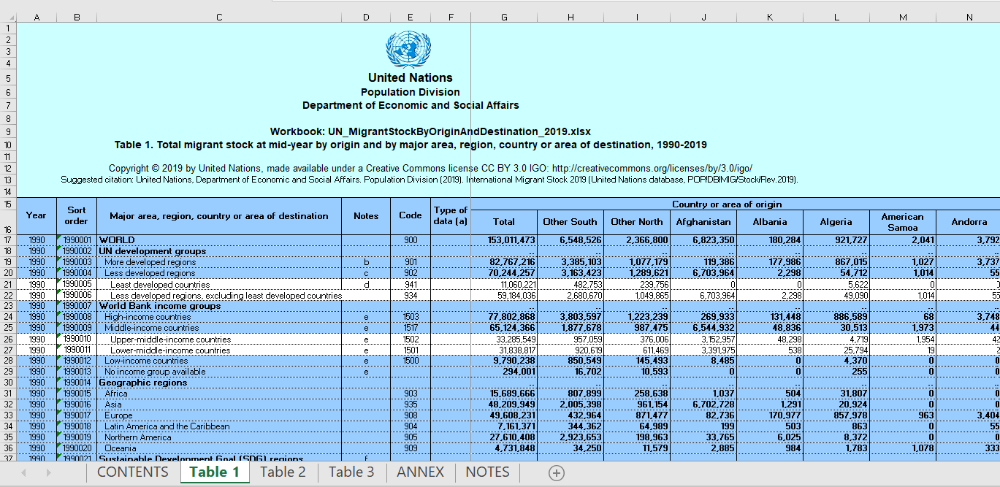

class: logo-slide

---

class: title-slide

## Tidy Data Wrangling - Part B

### Applications of Data Science - Class 3

### Giora Simchoni

#### `gsimchoni@gmail.com and add #dsapps in subject`

### Stat. and OR Department, TAU
### `r Sys.Date()`

---
```{r child = "../setup.Rmd"}
```

```{r packages, echo=FALSE, message=FALSE, warning=FALSE}
library(tidyverse)
```

class: section-slide

# Joining Tables

---
class: section-slide

# Detour: The Starwars Dataset(s)

---

## The Starwars Dataset(s)


```{r Read-Starwars}
sw_tables <- read_rds("../data/sw_tables.rds")
characters <- sw_tables$characters
planets <- sw_tables$planets
films <- sw_tables$films
```

.insight[
`r emo::ji("bulb")` What are the advantages/disadvantages of storing data in such a way?
]
---

```{r Characters}
glimpse(characters)
```

---

```{r Planets}
glimpse(planets)
```

```{r Films}
glimpse(films)
```

---
class: section-slide

# End of Detour

---

#### Q: Which characters appear in SW films directed by George Lucas?

```{r BaseR-NoJoin, eval=FALSE}
unique(
  characters$name[
    characters$film_id %in%
      films$film_id[films$director == "George Lucas"]
    ]
  )

# or dplyr approach:
characters %>%
    filter(film_id %in% (films %>%
                           filter(director=="George Lucas") %>%
                           pull(film_id))) %>%
    pull(name) %>%
    unique()
```

First problem with this approach: code gets messier and messier, prone to bugs and hard to debug.
---

#### Q: Which characters, whose homeworld is Alderaan, appear in SW films directed by George Lucas?

```{r BaseR-NoJoin2, eval=FALSE}
unique(
  characters$name[
    characters$film_id %in%
      films$film_id[films$director == "George Lucas"] &
    characters$homeworld_id ==
      planets$planet_id[planets$name == "Alderaan"]
  ]
)

# or dplyr approach:
characters %>%
    filter(film_id %in% (films %>%
                           filter(director=="George Lucas") %>%
                           pull(film_id)),
           homeworld_id == (planets %>%
                              filter(name == "Alderaan") %>%
                              pull(planet_id))) %>%
    pull(name) %>%
    unique()

# [1] "Leia Organa"         "Bail Prestor Organa" "Raymus Antilles"
```

---

#### Now imagine these two tables

`lines`: each film, each scene, each minute, each character, the line

```{r SW-Lines}
lines <- tibble::tribble(
  ~film_id, ~scene_id, ~minute_id, ~character_id,                           ~line,
         1,         1,          1,            23,                "blah blah blah",
         1,         1,          2,            15,           "something something",
         1,         1,          2,            23, "something something to you to",
         1,         1,          3,            15,                              NA,
         1,         1,          3,            23,                              NA,
         1,         1,          4,             8,             "whatever whatever"
  )
```

`locations`: for each film, each scene, each minute, its location

```{r SW-Locations}
locations <- tibble::tribble(
  ~film_id, ~scene_id, ~minute_id,            ~location,
         1,         1,          1,          "spaceship",
         1,         1,          2, "Alderaan, outdoors",
         1,         1,          3,          "spaceship",
         1,         1,          4,                "bar"
  )
```

---

#### Q: Which characters say "something" in a bar?

- filter only `lines` which contain "something"
- filter only "bar" `locations` and then...
- if the two filtered tables match on film, scene and minute...
- we take the unique characters
- but how do we match? `for` loop*?

`r emo::ji("right arrow")` Clearly, second problem with this approach: it doesn't generalize well to more complex scenarios, where we need to match on multiple criteria

And third problem: speed .font80percent[(but only in a complex scenario!)]

.font80percent[&#42; There *is* a way without using a for loop, without joining, still not recommended.]

---

## `inner_join()`

(Inner) Joining two tables:

```{r Join-Two-Tables}
characters %>%
  inner_join(films) %>%
  select(character_id, name, film_id, title, director) %>%
  head(7)
```

---

(Inner) Joining multiple tables:

```{r Join-Three-Tables}
characters %>%
  inner_join(films) %>%
  inner_join(planets, by = c("homeworld_id" = "planet_id")) %>%
  select(character_id, name.x, film_id, title, director, name.y, climate) %>% head(7)
```

---

(Inner) Joining on multiple keys:

```{r Join-Multiple-Keys}
lines %>%
  inner_join(locations, by = c("film_id", "scene_id", "minute_id"))
```

.insight[
`r emo::ji("bulb")` The base R function for joining is `merge()` which tends to be slower.
]

---

## What would `inner_join()` do?

Q: Which characters appear in SW films directed by George Lucas?

```{r Join1, eval=FALSE}
# naive
characters %>%
  inner_join(films, by = "film_id") %>%
  filter(director == "George Lucas") %>%
  pull(name) %>%
  unique()

# smarter
characters %>%
  inner_join(films %>% filter(director == "George Lucas"),
             by = "film_id") %>%
  pull(name) %>%
  unique()
```

.insight[
`r emo::ji("bulb")` What else could you do to make `inner_join`'s life easier?
]
---

## What would `inner_join()` do?

Q: Which characters, whose homeworld is Alderaan, appear in SW films directed by George Lucas?

```{r Join2}
characters %>%
  inner_join(films %>% filter(director == "George Lucas"),
             by = "film_id") %>%
  inner_join(planets %>% filter(name == "Alderaan"),
             by = c("homeworld_id" = "planet_id"),
                    suffix = c("_char", "_planet")) %>%
  pull(name_char) %>%
  unique()
```

---

### Note of caution: Join is not always faster!

```{r Join-Slow}
baseR_no_join <- function() {
  unique(characters$name[characters$film_id %in% films$film_id[films$director == "George Lucas"]])
}

baseR_with_join <- function() {
  unique(merge(characters, films[films$director == "George Lucas", ], by = "film_id")$name)
}

dplyr_no_join <- function() {
  characters %>%
    filter(film_id %in% (films %>%
                           filter(director=="George Lucas") %>%
                           pull(film_id))) %>%
    pull(name) %>%
    unique()
}

dplyr_with_join <- function() {
  characters %>%
    inner_join(films %>% filter(director=="George Lucas"), by = "film_id") %>%
    pull(name) %>%
    unique()
}
```

---

```{r Join-Slow2, message=FALSE, out.width="50%"}
library(microbenchmark)
res <- microbenchmark(baseR_no_join(), baseR_with_join(),
                      dplyr_no_join(), dplyr_with_join(), times = 20)
autoplot(res)
```

---

### So when does it shine?

- See [this](https://stackoverflow.com/q/59183599/4095235) StackOverflow question and answer for a good example*
- But in general: when data gets bigger, when multiple keys are involved

.font80percent[&#42; Yes, I know, I answered my own question, `r emo::ji("person_facepalming")`]

### Other types of Joins?

Definitely, read [here](https://stat545.com/join-cheatsheet.html), [here](https://r4ds.had.co.nz/relational-data.html) and [here](https://rstudio-education.github.io/tidyverse-cookbook/transform-tables.html#joins) about:
- `left_join()`
- `right_join()`
- `full_join()`
- `anti_join()`
- `semi_join()`

---

## All Joins


.font80percent[
Source: [The Tidyverse Cookbook](https://rstudio-education.github.io/tidyverse-cookbook/transform-tables.html#joins)
]
---

## All Joins


.font80percent[
Source: [The Tidyverse Cookbook](https://rstudio-education.github.io/tidyverse-cookbook/transform-tables.html#joins)
]
---
class: section-slide

# Tidying Tables

---
class: section-slide

# Detour: The Migration Dataset

---

## The Migration Dataset

- Straight from the [UN, Dept. of Economic and Social Affairs, Population Division](https://www.un.org/en/development/desa/population/index.asp)
- "Monitoring global population trends"
- For each country, how many (men, women and total) migrated to each country
- In 1990, 1995, 2000, 2005, 2010, 2015, 2019
- How would *you* give access to these data?

---

### You want dirty data? Well dirty data costs!



---

### What's untidy about the migration Excel file?

- It's an Excel file `r emo::ji("angry")`
- Multiple sheets
- Color coded, font coded (bold), space coded!
- Logo, free text in header lines
- Merged cells
- French letters (anything but [A-Za-z] can break code)
- Spaces, parentheses in column names
- Different `NA` values: "..", "-"
- Variable "country_dest" contains sub-total and totals for categories, continents...
- Variable "country_orig" violates Tidy rule no. 1: not in its own column

---

### "Today Only, The Landlord Went Nuts!"

- ~~It's an Excel file `r emo::ji("angry")`~~
- ~~Multiple sheets~~
- ~~Color coded, font coded (bold), space coded!~~
- ~~Logo, free text in header lines~~
- ~~Merged cells~~
- ~~French letters (anything but [A-Za-z] can break code)~~
- ~~Spaces, parentheses in column names~~
- ~~Different `NA` values: "..", "-"~~
- ~~Variable "country_dest" contains sub-total and totals for categories, continents...~~
- Variable "country_orig" violates Tidy rule no. 1: not in its own column

---

## The much nicer `migration` table

```{r Migration1}
migration <- read_rds("../data/migration.rds")

migration
```

---

## It's not right, but it's Ok:

- How many men immigrated from Russia to Israel in 1990?

```{r Migration2}
migration %>%
  filter(country_dest == "israel", year == 1990, gender == "men") %>%
  pull(russian_federation)
```

- How many men immigrated from Israel to Russia in 1990?

```{r Migration3}
migration %>%
  filter(country_dest == "russian_federation", year == 1990, gender == "men") %>%
  pull(israel)
```

---

## It would have been much nicer to have:

```{r Migration4, eval=FALSE}
migration %>%
  filter(country_orig == "israel", country_dest == "russian_fedration",
         year == 1990, gender == "men") %>%
  pull(n_migrants)
```

Then we could put in a (simpler) function and call the opposite:

```{r Migration5, eval=FALSE}
get_1way_migration <- function(orig, dest, gen, .year) {
  migration %>%
  filter(country_orig == orig, country_dest == dest,
         year == .year, gender == gen) %>%
  pull(n_migrants)
}

get_1way_migration("russian_federation", "israel")
```

---
class: section-slide

# End of Detour

---

## `pivot_longer()`

```{r Pivot-Longer}
migration_long <- migration %>%
  pivot_longer(cols = -c(1:4),
               names_to = "country_orig",
               values_to = "n_migrants")

migration_long
```

---

## What sorcery is this?


.font80percent[Source: [The Carpentries](http://swcarpentry.github.io/r-novice-gapminder/14-tidyr/index.html)]

---

## `pivot_wider()`

```{r Pivot-Wider}
migration_wide <- migration_long %>%
  pivot_wider(id_cols = 1:4,
              names_from = country_orig,
              values_from = n_migrants)

migration_wide
```

---

### Where is this going to?
.font80percent[
```{r Where-Is-This-Going-To, eval=FALSE}
get_1way_migration <- function(.country_dest, .country_orig) {
  migration_long %>%
    filter(country_dest == .country_dest, country_orig == .country_orig) %>%
    group_by(year) %>%
    tally(n_migrants) %>%
    mutate(direction = str_c(.country_orig, " to ", .country_dest))
}
get_2way_migration <- function(country_a, country_b) {
  a2b <- get_1way_migration(country_b, country_a)
  b2a <- get_1way_migration(country_a, country_b)
  bind_rows(a2b, b2a)
}

get_2way_migration("israel", "russian_federation") %>%
  ggplot(aes(year, n)) + geom_line() +
  geom_point(color = "orange", size = 5) +
  labs(x = "", y = "", title = "Israel-Russia Yearly No. of immigrants") +
  theme_dark() +
  facet_wrap(~direction, scales = "free", labeller = labeller(direction = rus_isr_names)) +
  scale_y_continuous(labels = scales::comma_format()) +
  theme(axis.text = element_text(size = 12, hjust=0.9, family = "mono"),
        strip.text.x = element_text(size = 14, family = "mono"),
        plot.title = element_text(hjust = 0.5, size = 18, family = "mono"))
```
]

---

```{r Where-Is-This-Going-To2, echo=FALSE, fig.asp=0.62, out.width="100%"}
get_1way_migration <- function(.country_dest, .country_orig) {
  migration_long %>%
    filter(country_dest == .country_dest, country_orig == .country_orig) %>%
    group_by(year) %>%
    tally(n_migrants) %>%
    mutate(direction = str_c(.country_orig, " to ", .country_dest))
}

get_2way_migration <- function(country_a, country_b) {
  a2b <- get_1way_migration(country_b, country_a)
  b2a <- get_1way_migration(country_a, country_b)
  bind_rows(a2b, b2a)
}

rus_isr_names <- c(
  "israel to russian_federation" = "Israel to Russia",
  "russian_federation to israel" = "Russia to Israel"
)

get_2way_migration("israel", "russian_federation") %>%
  ggplot(aes(year, n)) +
  geom_line() +
  geom_point(color = "orange", size = 5) +
  labs(x = "", y = "", title = "Israel-Russia Yearly No. of immigrants") +
  theme_dark() +
  facet_wrap(~direction, scales = "free",
             labeller = labeller(direction = rus_isr_names)) +
  scale_y_continuous(labels = scales::comma_format()) +
  theme(axis.text = element_text(size = 12, hjust=0.9, family = "mono"),
        strip.text.x = element_text(size = 14, family = "mono"),
        plot.title = element_text(hjust = 0.5, size = 18, family = "mono"))
```

---

## Some more useful Tidying up verbs

Remember?

```{r Untidy-Okcupid}
table3 <- read_rds("../data/tidy_tables.rds")$table3

table3
```

---

## `separate()`

```{r Unite}
table3_tidy <- table3 %>%
  separate(pct_straight, into = c("straight", "total"), sep = "/")

table3_tidy
```

---

## `unite()`

(Though see a much more generalizable approach with `purrr`)

```{r Separate}
table3_tidy %>%
  unite(col = "pct_straight", straight, total, sep = "/")
```

---
class: section-slide

# Iteration without looping

---

## Fun fact: you're already not-looping!

- Say you want the lengths of all of these strings:

```{r Not-Looping1}
strings_vec <- c("I'm feeling fine", "I'm perfectly OK",
                 "Nothing is wrong!")
```

- Do you `for` loop?

```{r Not-Looping2}
strings_len <- numeric(length(strings_vec))
for (i in seq_along(strings_vec)) {
  strings_len[i] <- nchar(strings_vec[i])
}
strings_len
```

---

- No, you use R's vectorized functions nature:

```{r Not-Looping3}
nchar(strings_vec)
```

- In case you were wondering:

```{r Not-Looping4a, echo=FALSE}
nchar_loop <- function() {
  strings_len <- numeric(length(strings_vec))
  for (i in seq_along(strings_vec)) {
    strings_len[i] <- nchar(strings_vec[i])
  }
  strings_len
}

nchar_vectorized <- function() {
  nchar(strings_vec)
}
```
```{r Not-Looping4b}
microbenchmark(nchar_loop(), nchar_vectorized())
```

- So why should iterating through a `data.frame` columns or rows be any different?

---

## The problem:

```{r Iteration1}
okcupid <- read_csv("../data/okcupid.csv.zip", col_types = cols())
okcupid %>% select(essay0:essay2) %>% head(3)
```

- I want to apply some transformation to one or more columns (say the length of each `essay` question for each user)
- I want to apply some transformation to one or more rows (say the average length of all `essay` questions for each user)

- BTW, you can always use a `for` loop, see how it is done [here](https://r4ds.had.co.nz/iteration.html#for-loops)

---

## The `apply` family

- There *is* a solution in base R
  - `apply()`
  - `sapply()`
  - `lapply()`
  - `tapply()`
  - `vapply()`
  - `mapply()`
- What do you think is the issue with these? See [this](https://stackoverflow.com/questions/45101045/why-use-purrrmap-instead-of-lapply).

---

## I don't `for`, I `purrr`

The `purrr` package provides a set of functions to make iteration easier:

- No boilerplate code for looping --> less looping bugs
- Focus on the function, the action, not the plumbing
- Generally faster (implemented in C)
- Definitely more clear, concise and elegant code

TBH, I'm addicted `r emo::ji("cry")`

---

## You get a `map()`, you get a `map()`!

```{r Maps-Table, results="asis", echo=FALSE}
tabl <- "
| Single | Two | Multiple | Returns | Of |
|---------------|-------------|------|--------|-------|
| `map()`      | `map2()` | `pmap()` | `list` | `?`|
| `map_lgl()`      | `map2_lgl()`      |   `pmap_lgl()` |`vector`| `logical` |
| `map_chr()`      | `map2_chr()`      |   `pmap_chr()` |`vector`| `character` |
| `map_int()`      | `map2_int()`      |   `pmap_int()` |`vector`| `integer` |
| `map_dbl()`      | `map2_dbl()`      |   `pmap_dbl()` |`vector`| `double` |
| `map_df()` | `map2_df()`      |    `pmap_df()` | `tibble` | `?` |
"
cat(tabl)
```

Where "Single" means "single vector/column input", "Two" means "two vectors/columns input" etc.

.font80percent[(Tip of the iceberg really, I want you to survive this slide)]

---

### Example1: Vectorizing a Function

Take a clearly not-vectorized function:

```{r Map-Example1A}
my_func <- function(x) {
  if (x %% 2 == 0) return("even")
  "odd"
}

my_func(10)

my_func(1:5)
```

.insight[
`r emo::ji("bulb")` This is silly example, do you know how to easily vectorize this function?
]

---

`map()` will always return a list:

```{r Map-Example1B}
map(1:3, my_func)

1:3 %>% map(my_func)
```

---

`map_chr()` will always return a vector of `character`:

```{r Map-Example1C}
map_chr(1:3, my_func)

1:3 %>% map_chr(my_func)
```

But here is the beautiful thing:

```{r Map-Example1D}
my_func_vectorized <- function(vec) map_chr(vec, my_func)

my_func_vectorized(1:3)
```

Look Ma, no loops!

---

### Example2: Complex `mutate()`

Manager: Add me a column, for each OkCupid user, whether he/she's above average height.

```{r Example20, echo=FALSE}
okcupid <- okcupid %>%
  mutate(height_cm = height * 2.54,
         income = ifelse(income == -1, NA, income))
```

```{r Example2A}
is_above_average_height <- function(sex, height_cm) {
  ifelse(sex == "m", height_cm > 180, height_cm > 165)
}

okcupid <- okcupid %>%
  mutate(is_tall = map2_lgl(sex, height_cm, is_above_average_height))

okcupid %>% select(sex, height_cm, is_tall) %>% sample_n(4)
```

.font80percent[Girl, I dare you to do this in base R.]

---

### Example2: You could even supply args

```{r Example2B}
is_above_average_height <- function(sex, height_cm, men_avg, women_avg) {
  ifelse(sex == "m", height_cm > men_avg, height_cm > women_avg)
}

okcupid <- okcupid %>%
  mutate(is_tall = map2_lgl(sex, height_cm, is_above_average_height,
                            men_avg = 180, women_avg = 165))

okcupid %>% select(sex, height_cm, is_tall) %>% sample_n(4)
```

---

### Example2: Anonymous Functions

```{r Example2C}
okcupid <- okcupid %>%
  mutate(is_tall = map2_lgl(sex, height_cm,
                            function(x, y) ifelse(x == "m", y > 180, y > 165)))
```

Heck, you can even:

```{r Example2D}
okcupid <- okcupid %>%
  mutate(is_tall = map2_lgl(sex, height_cm,
                            ~ifelse(.x == "m", .y > 180, .y > 165)))
```

.insight[
`r emo::ji("bulb")` There's a thin line between elegance and unreadable undebuggable bragging.
]
---

### Example 3: Remember our problem?

For each `essay` column, add a column with its length:

```{r Example3A}
okcupid %>%
  mutate_at(vars(essay0:essay9), list("len" = str_length)) %>%
  select(starts_with("essay")) %>%
  head(3)
```

`purrr` not needed, like I said, you've already been non-looping!

---

### Example 3: Input multiple columns

~~For each user, compute the average `essay` length:~~

Wait, before that, for each user compute the average of the 3 first `essay`s:

```{r Example3B}
mean_length_3essay <- function(x, y, z) {
  mean(str_length(c(x, y, z)), na.rm = TRUE)
}

okcupid %>%
  mutate(essay3_avglen = pmap_dbl(
    list(essay0, essay1, essay2),
    mean_length_3essay)) %>%
  select(essay0:essay2, essay3_avglen) %>%
  head(2)
```

---

OK now, for each user, compute the average `essay` length:

```{r Example3C}
mean_length_essay <- function(...) {
  mean(str_length(c(...)), na.rm = TRUE)
}

okcupid %>%
  mutate(essay_avglen = pmap_dbl(
    select(., starts_with("essay")),
    mean_length_essay)) %>%
  select(essay0:essay3, essay_avglen) %>%
  head(3)
```

---

### Example4: Output multiple columns

```{r Example4A}
essay0_features <- function(essay0) {
 contains_love <- str_detect(essay0, "love")
 contains_obama <- str_detect(essay0, "obama")
 contains_rel <- str_detect(essay0, "relationship")
 list(
   essay0_love = contains_love,
   essay0_obama = contains_obama,
   essay0_ser_rel = contains_rel
 )
}

okcupid %>% select(essay0) %>% map_dfc(essay0_features)
# or: map_dfc(okcupid$essay0, essay0_features)
```

---

Or if you want those features as additional columns, you could bind them with `bind_cols()`:

```{r Example4B}
okcupid %>%
  bind_cols(
    okcupid %>% select(essay0) %>% map_dfc(essay0_features)
  ) %>%
  select(age, sex, starts_with("essay0"))
```

---

## Dealing with failure

```{r Safely1, error=TRUE, linewidth=80}
my_func("a")
```

Silly example, but:

(a) When dealing with big data expect the unexpected (input)

(b) You don't want your app to crash

Look at: `safely()`, `quietly()` and `possibly()` which wrap your code nicely and protect you from the unexpected (crash).

---

### My favorite: `possibly()`

```{r Safely2}
my_func_safe <- possibly(my_func, otherwise = NA)

my_func_safe("a")

map_chr(list(1, 2, "3", 4), my_func_safe)
```

.insight[
`r emo::ji("bulb")` See a more realistic example when we talk about Web Scraping
]

.insight[
`r emo::ji("bulb")` What would `map_chr(c(1, 2, "3", 4), my_func_safe)` return?
]
---

## `walk()`, `walk2()`, `pwalk()`

You don't always need to *return* anything, you just wanna loop

```{r Walk}
walk(1:10, ~print("Hey Girrrl"))
```

---

```{r Walk2, fig.asp=0.62, out.width="80%"}
plot_norm <- function(mu, sd) {
  plot(density(rnorm(100, mu, sd)),
       main = str_c("mu: ", mu, ", sd: ", sd))
}

par(mfcol = c(1, 2))
walk2(c(0, 10), c(1, 0.1), plot_norm)
```

---

### In the words of Hadley

> Once you master these functions, you’ll find it takes much less time to solve iteration problems.

<br>

> But you should never feel bad about using a for loop instead of a map function.

<br>

> The important thing is that you solve the problem that you’re working on, not write the most concise and elegant code.

<br>

> Some people will tell you to avoid for loops because they are slow. They’re wrong!
