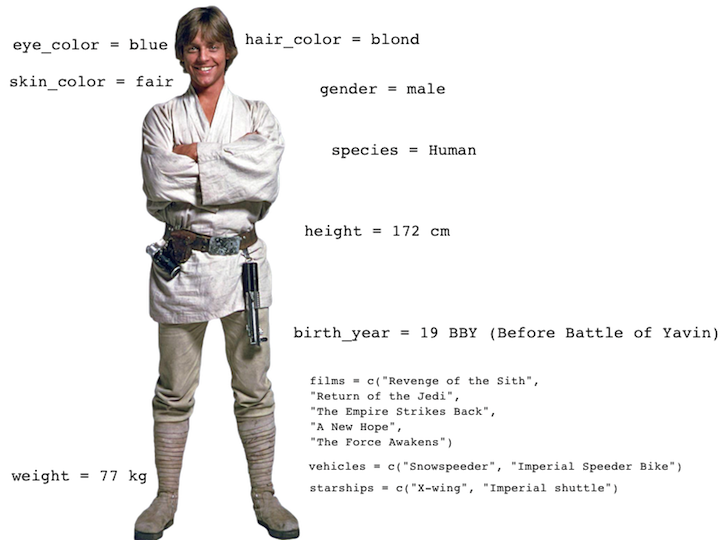

class: logo-slide

---

class: title-slide

## Visualizing in the Tidyverse

### Applications of Data Science - Class 4

### Giora Simchoni

#### `gsimchoni@gmail.com and add #dsapps in subject`

### Stat. and OR Department, TAU
### `r Sys.Date()`

---
```{r child = "../setup.Rmd"}
```

```{r packages, echo=FALSE, message=FALSE, warning=FALSE}
library(tidyverse)
```

class: section-slide

# Welcome to `ggplot2`

#### Heavily inspired by datascienceinabox.org / @minebocek
---

## `ggplot()`

- **ggplot2** is tidyverse's data visualization package
- The `gg` in "ggplot2" stands for Grammar of Graphics
- It is inspired by the book [Grammar of Graphics](https://www.springer.com/gp/book/9780387245447) by Leland Wilkinson
- A grammar of graphics is a tool that enables us to concisely describe the components of a graphic

<center></center>

---

### Remember the Force, Luke!

```{r Characters}
sw_tables <- read_rds("../data/sw_tables.rds")
characters <- sw_tables$characters
planets <- sw_tables$planets
films <- sw_tables$films

glimpse(characters)
```

---

What are the functions doing the plotting? What is the dataset being plotted? 
Which variable is on the x-axis and which variable is on the y-axis? What does the warning mean?

```{r Mass-Height1, fig.asp=0.62, out.width="70%"}
ggplot(data = characters, mapping = aes(x = height, y = mass)) +
  geom_point() +
  labs(title = "Mass vs. Height of Starwars characters",
       x = "Height (cm)", y = "Weight (kg)")
```

---

What does `geom_smooth()` do? What else changed between the previous plot and this one?

```{r Mass-Height2, fig.asp=0.62, out.width="70%", warning=FALSE, message=FALSE}
ggplot(data = characters, mapping = aes(x = height, y = mass)) +
  geom_point() +
  geom_smooth() + #<<
  labs(title = "Mass vs. Height of Starwars characters",
       x = "Height (cm)", y = "Weight (kg)")
```

---

## Who dis!

- `ggplot()` is the main function in ggplot2 and plots are constructed in layers
- The structure of the code for plots can often be summarized as
```{r Ggplot0, eval = FALSE}
ggplot + 
  geom_xxx
```

or, more precisely
```{r Ggplot1, eval = FALSE}
ggplot(data = [dataset], mapping = aes(x = [x-variable], y = [y-variable])) +
   geom_xxx() +
   other options
```

- To use ggplot2 functions, first load tidyverse
```{r, eval=FALSE}
library(tidyverse)
```
- For help with the ggplot2, see [ggplot2.tidyverse.org](http://ggplot2.tidyverse.org/)

---

## Mass vs. Height

```{r Ggplot2, fig.asp=0.62, out.width="70%", warning=FALSE}
ggplot(characters, aes(height, mass)) + geom_point()
```

How would you describe this relationship? What other variables would help us understand data points that don't follow the overall trend? Who is the not so tall but really chubby character?

---

## Jabba!

```{r JabbaPlot, warning=FALSE, message=FALSE, fig.asp=0.62, out.width="70%"}
library(magick)

jabba <- image_read("images/jabba.png")
fig <- image_graph(width = 2400, height = 1200, res = 300)
ggplot(data = characters, mapping = aes(x = height, y = mass)) +
  geom_point(size = 1.5) + 
  labs(title = "Mass vs. Height of Starwars characters",
       x = "Height (cm)", y = "Weight (kg)")
fig %>% image_composite(jabba, offset = "+1000+30")
```

---

### But seriously, Luke

<center></center>

---

## Additional variables

We can map additional variables to various features of the plot:

- aesthetics
    - shape
    - colour
    - size
    - alpha (transparency)
- faceting: small multiples displaying different subsets

---
class: section-slide

# Aesthetics

---

## Aesthetics options

Visual characteristics of plotting characters that can be **mapped to a specific variable**
in the data are

- `color`
- `fill`
- `size`
- `shape`
- `alpha` (transparency)

---

### Mass vs. Height + Gender

```{r Ggplot3, fig.asp=0.62, out.width="70%", warning=FALSE}
ggplot(data = characters,
       mapping = aes(x = height, y = mass, color = gender)) +
  geom_point()
```

---

### Mass vs. Height + Gender + Birth Year

Let's map the size to `birth_year`:

```{r Aes1, fig.asp=0.62, out.width="70%", warning=FALSE}
ggplot(data = characters,
       mapping = aes(x = height, y = mass, color = gender, 
                     size = birth_year)) + #<<
  geom_point()
```

---

### Mass vs. Height + Gender

Let's now increase the size of all points **not** based on the values of a 
variable in the data:

```{r Aes2, fig.asp=0.62, out.width="70%", warning=FALSE}
ggplot(data = characters,
       mapping = aes(x = height, y = mass, color = gender)) +
  geom_point(size = 2) #<<
```

---

## Aesthetics Summary

- Continuous variable are measured on a continuous scale
- Discrete variables are measured (or often counted) on a discrete scale

aesthetics    | discrete                 | continuous
------------- | ------------------------ | ------------
color         | rainbow of colors        | gradient
size          | discrete steps           | linear mapping between radius and value
shape         | different shape for each | shouldn't (and doesn't) work

- Use aesthetics for mapping features of a plot to a variable, define the 
features in the geom for customization **not** mapped to a variable

---
class: section-slide

# Faceting

---

### Faceting options

- Smaller plots that display different subsets of the data
- Useful for exploring conditional relationships and large data

```{r Facet1, warning=FALSE, fig.asp=0.35, out.width="100%"}
ggplot(data = characters, mapping = aes(x = height, y = mass)) +
  facet_grid(. ~ gender) + #<<
  geom_point() +
  labs(title = "Mass vs. Height of Starwars characters",
       subtitle = "Faceted by Gender",  #<<
       x = "Height (cm)", y = "Weight (kg)")
```

---

### Many ways to facet


```{r Facet2, warning=FALSE, out.width="50%"}
ggplot(data = characters, mapping = aes(x = height, y = mass)) +
  geom_point() +
  facet_grid(gender ~ .)
```

---

```{r Facet3, warning=FALSE, fig.asp=0.35, out.width="100%"}
ggplot(data = characters, mapping = aes(x = height, y = mass)) +
  geom_point() +
  facet_wrap(. ~ gender, scales = "free")
```

---

```{r Facet4, warning=FALSE, out.width="60%"}
ggplot(data = characters, mapping = aes(x = height, y = mass)) +
  geom_point() +
  facet_wrap(~ eye_color)
```

---

## Facet summary

- `facet_grid()`: 
    - 2d grid
    - `rows ~ cols`
    - use `.` for no split
- `facet_wrap()`: 1d ribbon wrapped into 2d

---
class: section-slide

# Take Control

---

```{r Control0, echo=FALSE}
okcupid <- read_csv("../data/okcupid.csv.zip", col_types = cols())
okcupid <- okcupid %>%
  mutate(height_cm = height * 2.54,
         income = ifelse(income == -1, NA, income),
         religion2 = case_when(
           str_detect(religion, "agnosticism") | str_detect(religion, "atheism") ~ "atheist",
           str_detect(religion, "buddhism") ~ "buddhist",
           str_detect(religion, "christianity") | str_detect(religion, "catholicism") ~ "christian",
           str_detect(religion, "judaism") ~ "jewish",
           str_detect(religion, "hinduism") ~ "hindu",
           str_detect(religion, "islam") ~ "muslim",
           TRUE ~ "NA"))
```

```{r Control1, out.width="60%"}
okcupid_lgbt_relig <- okcupid %>%
  group_by(religion2) %>%
  summarise(pct_lgbt = mean(orientation %in% c("gay", "bisexual"))) %>%
  mutate(religion = fct_reorder(religion2, desc(pct_lgbt)))

okcupid_lgbt_relig
```

---

```{r Control2, out.width="60%"}
okcupid_lgbt_relig %>%
  ggplot(aes(religion, pct_lgbt)) +
  geom_bar(stat="identity")
```

.font80percent[Meh.]

---

## Pimp my plot

```{r Control3, eval = FALSE}
p <- ggplot(okcupid_lgbt_relig, aes(religion, pct_lgbt)) +
  geom_bar(stat="identity", fill="#f68060", alpha=.6, width=.4) +
  labs(x = "", y = "",
       title = "OkCupid: %Reported LGBTQ+ by Religion") +
  theme(text = element_text(size = 14, color = "#163f59", family = "mono"),
        axis.text.y = element_text(size = 14)) +
  scale_y_continuous(breaks = seq(0.05, 0.2, 0.05),
                     labels=scales::percent_format(accuracy = 1)) +
  coord_flip()
p
```

---

## Pimp my plot

```{r Control4, out.width="100%", fig.asp = 0.5, echo=FALSE}
p <- ggplot(okcupid_lgbt_relig, aes(religion, pct_lgbt)) +
  geom_bar(stat="identity", fill="#f68060", alpha=.6, width=.4) +
  labs(x = "", y = "",
       title = "OkCupid: %Reported LGBTQ+ by Religion") +
  theme(text = element_text(size = 14, color = "#163f59",
                            family = "mono"),
        axis.text.y = element_text(size = 14)) +
  scale_y_continuous(breaks = seq(0.05, 0.2, 0.05),
                     labels=scales::percent_format(accuracy = 1)) +
  coord_flip()
p
```

---

## Annotate, Add lines

```{r Control5, out.width="100%", fig.asp = 0.5}
p + geom_hline(yintercept = 0.139, lty = 2, color = "#163f59") +
  annotate("text", x = 4, y = 0.139 + 0.02, label = "Overall %",
           color = "#163f59", family = "mono")
```

---
class: section-slide

# Themes

---

```{r Themes1, out.width="100%", fig.asp = 0.5}
p + theme_classic()
```
---

```{r Themes2, out.width="100%", fig.asp = 0.5}
p + theme_light()
```

---

```{r Themes3, out.width="100%", fig.asp = 0.5}
p + theme_dark()
```

---

```{r Themes4, out.width="100%", fig.asp = 0.5}
p + theme_linedraw()
```

---

```{r Themes5, out.width="100%", fig.asp = 0.5, message=FALSE}
library(tvthemes)
# import_simpsons()
extrafont::loadfonts(device="win")

p + theme_simpsons(title.font = "Akbar",
                 text.font = "Akbar",
                 axis.text.size = 12)
```

---

```{r Themes6, out.width="100%", fig.asp = 0.5, message=FALSE}
ggplot(okcupid_lgbt_relig, aes(religion, pct_lgbt)) +
  geom_bar(aes(fill = pct_lgbt), stat="identity", alpha=.6, width=.4) +
  labs(x = "", y = "", title = "This was supposed to be GoT") +
  scale_y_continuous(breaks = seq(0.05, 0.2, 0.05), labels=scales::percent_format(accuracy = 1)) +
  coord_flip() +
  scale_fill_westeros(palette = "Tyrell", type = "continuous") + theme_minimal() +
  theme(text = element_text(family = "Cinzel", size = 12),
        title = element_text(family = "Cinzel", size = 14)) + guides(fill=FALSE)
```

---
class: section-slide

# Common Plots à la GG

---

## Line Plot

---

## Histogram

---

## Density Plot

---

## Box Plot

---

## Swarm Plot

---

## Bar Plot

---

## Segmented Bar Plots: Counts

---

## Segmented Bar Plots: Proportions

---

## Mosaic Plots

---

## Dumbbel Plot

---

## Radar Chart

---

## Sankey Diagram (Alluvial Plot)

---

## Heatmap

---
class: logo-slide

# Amazing Extensions

---

## `ggraph`

---

## `gganimate`

---

## `ggrepel`

---

## `ggridges`

---

## `ggExtra`

---

## `sf`, `ggmap`

---

## `ggchicklet`

---

## `rayshader`

---

## `magick`

---

## `brickr`