class: logo-slide

---

class: title-slide

## Introduction to Networks

### Applications of Data Science - Class 6

### Giora Simchoni

#### `gsimchoni@gmail.com and add #dsapps in subject`

### Stat. and OR Department, TAU
### `r Sys.Date()`

---
```{r child = "../setup.Rmd"}
```

```{r packages, echo=FALSE, message=FALSE, warning=FALSE}
library(tidyverse)

printmrow <- function(x) cat(cat(x,sep=" & "),"\\\\")

matrix2latex <- function(matr) {
  cat("$\\begin{bmatrix}")
  body <- apply(matr,1,printmrow)
  cat("\\end{bmatrix}$")
}
```

class: section-slide

# Why Networks?

---

## Because this

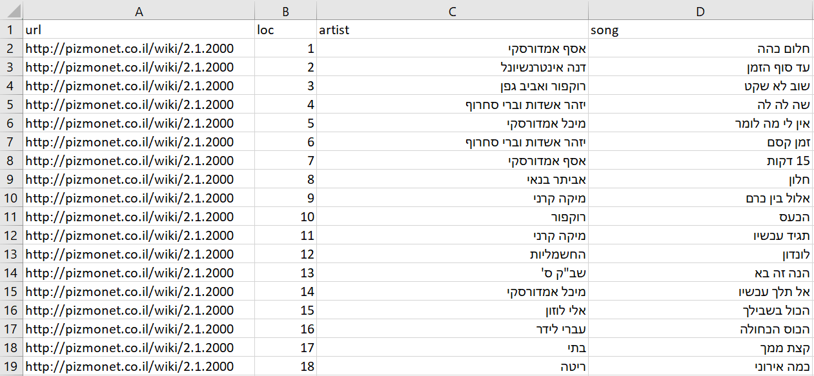

Can only get you so far.
---

## Divided they sing

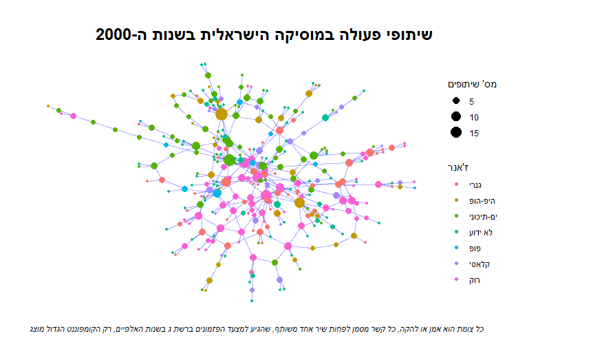

---

class: section-slide

# Networks Overview

---

## A Network

A network, is comprised of:

- Nodes (vertices, points, actors), joined together in pairs by
- Edges (links, connections, ties)

Many types of networks:

- Physical networks: telephone lines, roads, airline routes, rivers
- Information networks: WWW, citation networks
- Social networks: Facebook, Twitter, but not just: this class, Marriage between Royal Houses
- Biological networks: "food webs" (what eats what?), metabolical networks

---

## Physical Networks

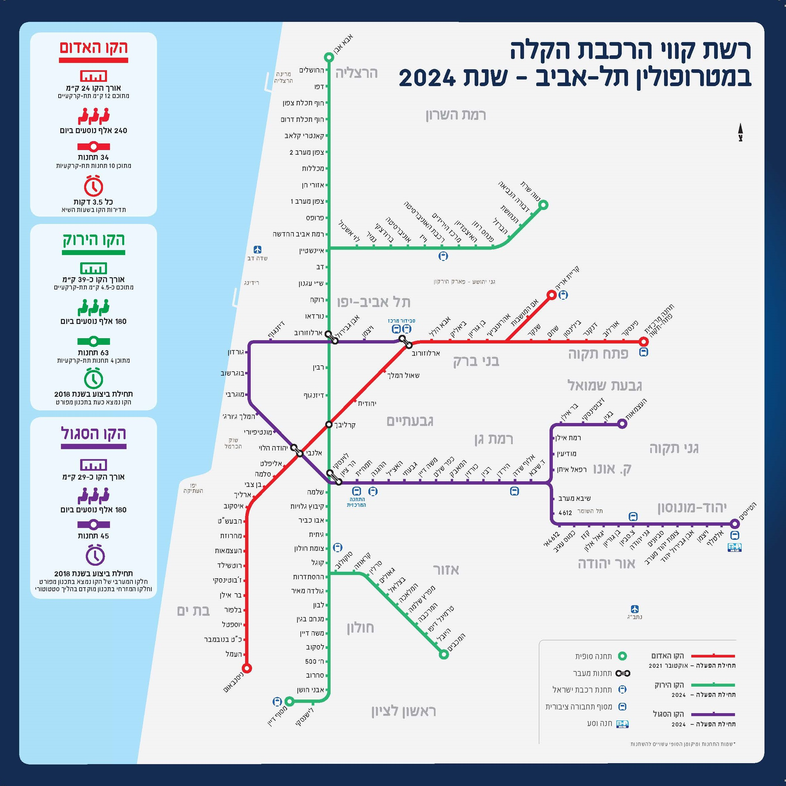

.font80percent[
[מערכת להסעת המונים במטרופולין תל אביב](https://he.wikipedia.org/wiki/%D7%9E%D7%A2%D7%A8%D7%9B%D7%AA_%D7%9C%D7%94%D7%A1%D7%A2%D7%AA_%D7%94%D7%9E%D7%95%D7%A0%D7%99%D7%9D_%D7%91%D7%9E%D7%98%D7%A8%D7%95%D7%A4%D7%95%D7%9C%D7%99%D7%9F_%D7%AA%D7%9C_%D7%90%D7%91%D7%99%D7%91)
]
---

## Information Networks

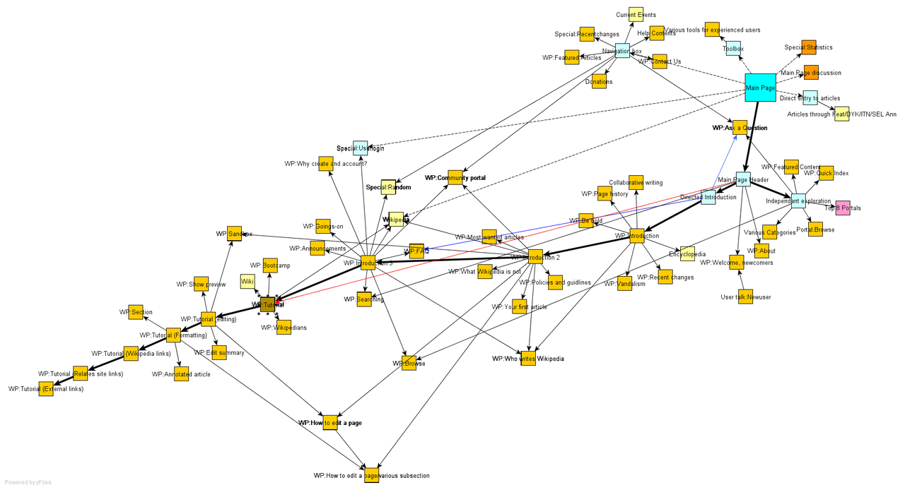

.font80percent[
[Wikipedia Main Page Site Map](https://en.wikipedia.org/wiki/Site_map)
]
---

## Social Networks


.font80percent[
[חשיפה: הרשימה שכל עורך דין חייב להכיר](https://www.themarker.com/law/1.3065986)
]
---

## Biological Networks


.font80percent[
[The structure of the nervous system of the nematode Caenorhabditis elegans](https://royalsocietypublishing.org/doi/abs/10.1098/rstb.1986.0056)
]
---

## Harder to classify Networks

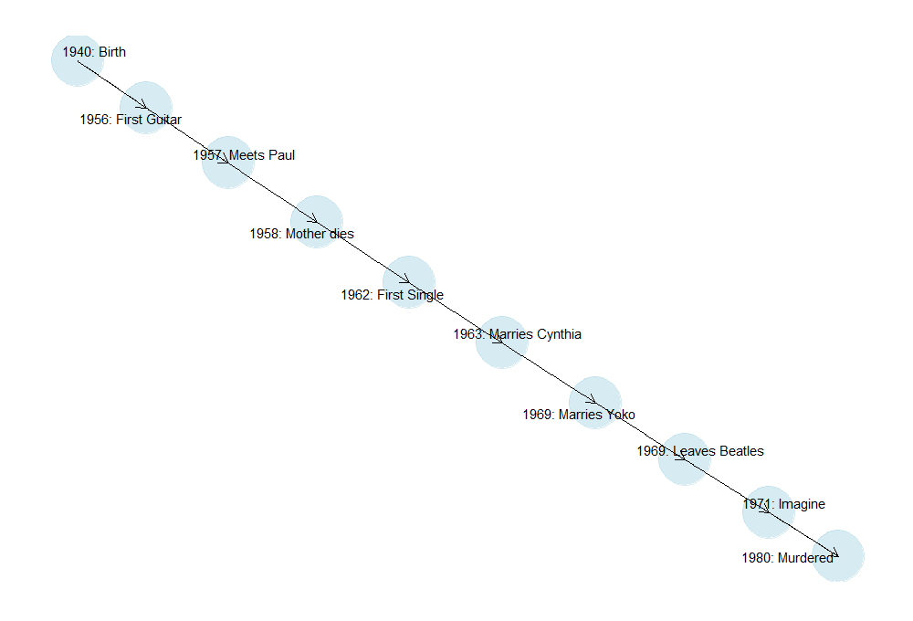

---

## Bipartite Networks

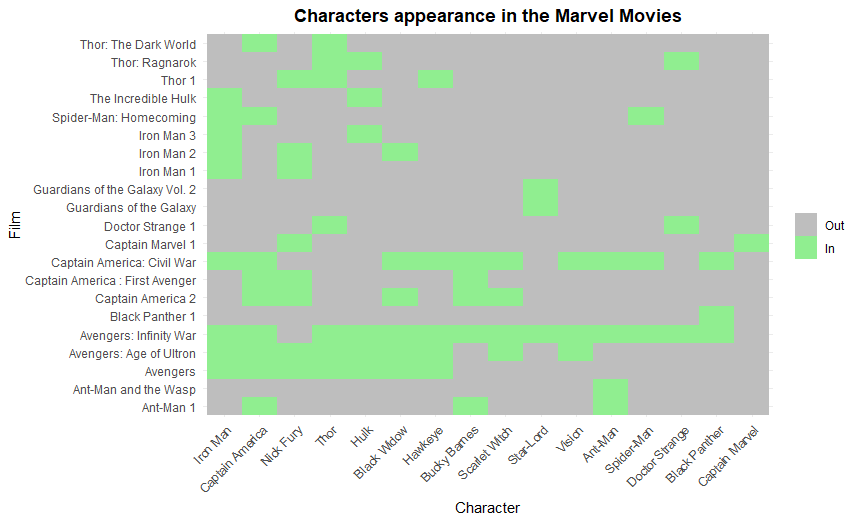

`r emo::ji("arrow_right")`

---

## Bipartite Networks

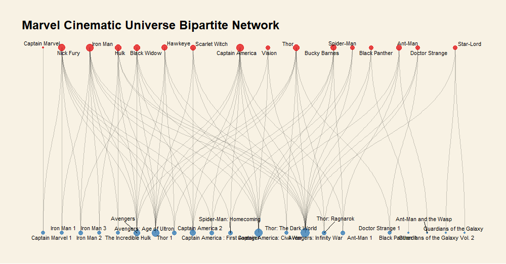

.font80percent[
[Adapted from: Which Marvel Characters and Movies are the Most Central? / Félix Luginbühl](https://felixluginbuhl.com/network/)
]

---

## Similarity Networks

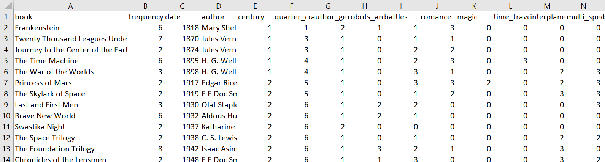

`r emo::ji("arrow_right")`

---

## Similarity Networks

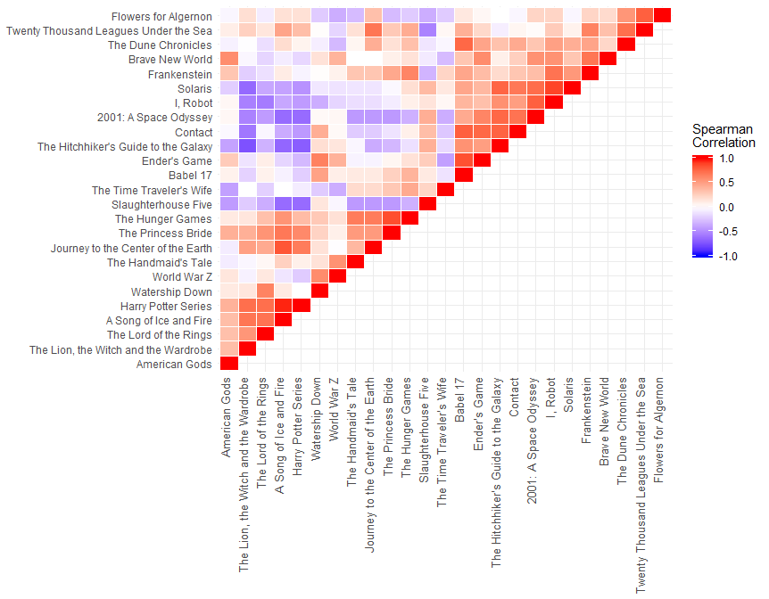

`r emo::ji("arrow_right")`

---

## Similarity Networks

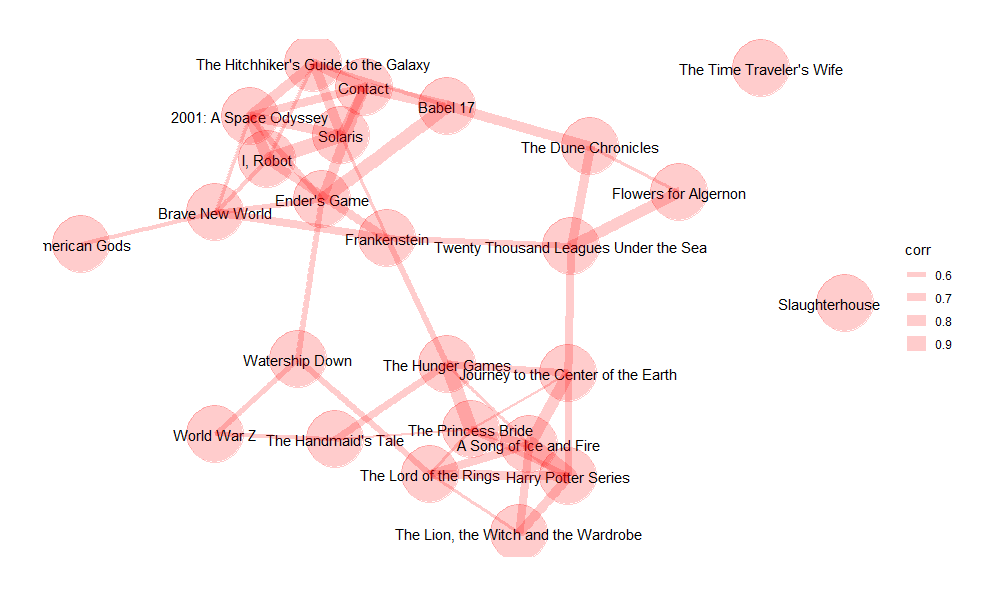

.font80percent[
[Sci-Fi Books data set / Kathleen M. Carley](http://www.casos.cs.cmu.edu/tools/datasets/internal/index.php#sci-fi)
]

---

## Multilayer Networks

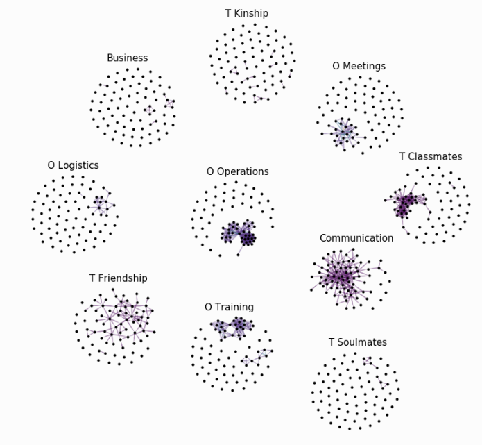

.font80percent[
[Strategies for Combating Dark Networks (a.k.a Noordin Mohammad Top’s terrorist network of South East Asia](https://pdfs.semanticscholar.org/e680/6d8f86c5ddc3daf6f65572e39f65bd0d2990.pdf)
]

---

## Trees 

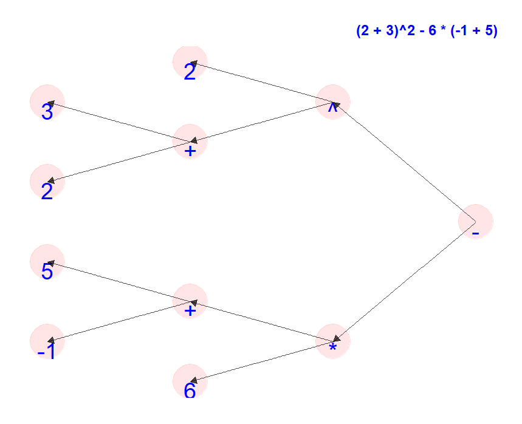

.insight[
`r emo::ji("bulb")` Does this remind you of anything?
]

---

## Networks Properties

- Directed/Not: Do the edges have orientation?
- Weighted edges/Not: Do the edges have weight/strength/length?
- Connected/Not: Can you "get to" any node from any node?
- Self-edges/Not: Can a node be linked to itself?
- Acyclic/Not: Are there cycles? Can you get from one node to itself not by a self-loop?
- Time-varied/Not: Does the network change over time?

---

## The networks we've seen

.font80percent[
Network                    | Directed | Weighted | Connected | Self-edges | Acyclic | Time-Varied
-------------------------- | -------- | -------- | --------- | ---------- | ------- | -----------
Israeli Artists Coops      |          |          |           |            |         | 
Gush Dan Trains            |          |          |           |            |         | 
Wikipedia Site Map         |          |          |           |            |         | 
Israeli Judges Connections |          |          |           |            |         | 
Worm Nervous System        |          |          |           |            |         | 
John Lennon Timeline       |          |          |           |            |         | 
Marvel Cinematic Universe  |          |          |           |            |         | 
Sci-Fi Books               |          |          |           |            |         | 
Noordin Terrorist Net      |          |          |           |            |         | 
Math Expression            |          |          |           |            |         | 

]

---

## The networks we've seen

```{r Emojis, echo=FALSE}
v <- emo::ji("check")
```

.font80percent[
Network                    | Directed | Weighted | Connected | Self-edges | Acyclic | Time-Varied
-------------------------- | -------- | -------- | --------- | ---------- | ------- | -----------
Israeli Artists Coops      |          |          |    `r v`  |            |         | `r v`
Gush Dan Trains            |          |          |    `r v`  |            |         | 
Wikipedia Site Map         |  `r v`   |          |    weakly |            |  `r v`  | 
Israeli Judges Connections |          |          |           |            |         | `r v`
Worm Nervous System        |  `r v`   | `r v`    |    weakly |  `r v`     |         | 
John Lennon Timeline       |  `r v`   |          |    weakly |            |  `r v`  | `r emo::ji("sad")`
Marvel Cinematic Universe  |          |          |    `r v`  |            |         | `r v`
Sci-Fi Books               |          |  `r v`   |           |            |         | 
Noordin Terrorist Net      |          |          |           |            |         | 
Math Expression            |   `r v`  |          |    weakly |            | `r v`   | 

]

---

## Typical Questions About Networks

### Macro:

- Is the network connected?
- Is the network dense or sparse?
- What is the maximum/average shortest path? .font80percent[small world effect]
- Is the network homophilic for attribute X?
- Are there interesting communities in the network?
- Will a "message" percolate through the whole network? How fast?
- Can we model the network to give insight on how it developed? Predict how it *will* develop?

---

## Typical Questions About Networks

### Micro:

- Which is the "best connected" node?
- Which is the "most important" node? .font80percent[Not necessarily the same thing]
- Is there a node or edge which "break" the network?
- Is there a path between node A and node B?
- What is the shortest path between node A and node B?
- Are nodes A and B likely to connect?
- What node should we recommend connect with node A?

---

## Obtaining Networks

- Surveys, Interviews, Questionnaires, Observations .font80percent[(Moreno's schoolchildren)]
- Archives, sometimes historical .font80percent[(Padget's families of Florence)]
- Snowball Sampling .font80percent[(Drug users' ego networks)]
- Web Scraping .font80percent[(Adamic's political blogs)]
- Web APIs .font80percent[(Twitter)]
- Co-occurrence matrices .font80percent[(Marvel's cinematic universe)]
- Any tabular dataset? .font80percent[(Sci-Fi books)]
- Just really hard work .font80percent[(Milgram's Small world experiment)]

---

class: section-slide

# The Adjacency Matrix

---

## Undirected Networks

The Adjacency matrix $A$ of an unweighted network is defined as a $n\times n$ matrix with elements $A_{ij}$ such that:

$$A_{i,j} =
 \begin{cases}
   1 & \mbox{if there is an edge between nodes}\ i \mbox{ and}\ j \\
   0 & \mbox{otherwise}
 \end{cases}$$

- The adjacency of a simple undirected network would be symmetric and contain only zeros on its diagonal
- If the network has multiedges - if there are $q$ edges between elements $i$ and $j$ - then $A_{ij} = q$
- If the network has self-edges - if there is an edge between element $i$ and itself - then $A_{ii} = 2$ (useful convention)
---

So this unweighted, undirected network:

```{r Simple-Graph, echo=FALSE, warning=FALSE, message=FALSE, out.width="30%"}
library(tidygraph)
library(ggraph)
g <- tbl_graph(nodes = tibble(id = 1:5),
               edges = tibble(from = c(1:3, 1, 2),
                              to = c(2, 3, 5, 3, 5),
                              weight = c(0.2, 1, 2, 0.4, 0.1)))
ggraph(g, layout = "fr") +
  geom_node_point(size = 5) +
  geom_edge_link() +
  geom_node_text(aes(label = id), size = 15, vjust = 0.3, hjust = -0.2) +
  theme_graph()
```

Would be represented as $A_{5\times 5}$:

```{r Adj-Matrix-Test, echo = FALSE, results='asis'}
x <- as.matrix(rbind(c(0, 1, 1, 0, 0),
                     c(1, 0, 1, 0, 1),
                     c(1, 1, 0, 0, 1),
                     c(0, 0, 0, 0, 0),
                     c(0, 1, 1, 0, 0)))

matrix2latex(x)
```

---

For an undirected *weighted* network, $A_{ij}$ would contain the weight.
- The higher the weight - the stronger the connection
- (In absolute value - because a weight needs not be positive)

```{r Weighted-Graph, echo=FALSE, warning=FALSE, out.width="30%"}
ggraph(g, layout = "fr") +
  geom_node_point(size = 5) +
  geom_edge_link(aes(label = weight, width = weight),
                 label_size = 10, alpha = 0.5, show.legend = FALSE) +
  geom_node_text(aes(label = id), size = 15, vjust = 0.3, hjust = -0.2) +
  theme_graph()
```

```{r Adj-Matrix-Weighted, echo = FALSE, results='asis'}
x <- as.matrix(rbind(c(0, 0.2, 0.4, 0, 0),
                     c(0.2, 0, 1, 0, 0.1),
                     c(0.4, 1, 0, 0, 2),
                     c(0, 0, 0, 0, 0),
                     c(0, 0.1, 2, 0, 0)))

matrix2latex(x)
```

---

## Directed Networks (a.k.a DiGraph)

The Adjacency matrix $A$ of an unweighted network is defined as a $n\times n$ matrix with elements $A_{ij}$ such that:

$$A_{i,j} =
 \begin{cases}
   1 & \mbox{if there is an edge from node}\ j \mbox{ to node}\ i \\
   0 & \mbox{otherwise}
 \end{cases}$$

Note the convention from *column* index to *row* index can be confusing.

---

So this unweighted, directed network:

```{r Directed-Graph, echo=FALSE, warning=FALSE, out.width="30%"}
g <- tbl_graph(nodes = tibble(id = 1:5),
               edges = tibble(from = c(1, 2, 5, 3, 2),
                              to = c(2, 3, 3, 1, 5),
                              weight = c(0.2, 1, 2, 0.4, 0.1)), directed = TRUE)
ggraph(g, layout = "fr") +
  geom_edge_link(arrow = arrow(length = unit(6, 'mm'), type = "closed")) +
  geom_node_text(aes(label = id), size = 15, vjust = 0.2, hjust = -0.2) +
  theme_graph()
```

Would be represented as $A_{5\times 5}$:

```{r Adj-Matrix-Directed, echo = FALSE, results='asis'}
x <- as.matrix(rbind(c(0, 0, 1, 0, 0),
                     c(1, 0, 0, 0, 0),
                     c(0, 1, 0, 0, 1),
                     c(0, 0, 0, 0, 0),
                     c(0, 1, 0, 0, 0)))

matrix2latex(x)
```

---

## Directed Acyclic Graphs (DAG)

- If the network is directed and has no cycles, it is possible to draw the network such that all edges point downward, from a higher-numbered node into a lower-numbered node.
- If the network can be drawn where any edge from $j$ to $i$ implies that $j > i$, its adjacency matrix is *upper triangular*
- Since the diagonal contains only zeros (why) it is *strictly traingular*
- The other direction also holds (iff)

Is the netwok from previous page acyclic? Try both directions.

---

For example, this acyclic network can be numbered so that its adjacency matrix is strictly triangular:

```{r DAG, echo=FALSE, warning=FALSE, out.width="30%"}
g <- tbl_graph(nodes = tibble(id = 5:1),
               edges = tibble(from = c(1, 2, 3, 1, 2),
                              to = c(2, 3, 5, 4, 5),
                              weight = c(0.2, 1, 2, 0.4, 0.1)), directed = TRUE)
ggraph(g, layout = "sugiyama") +
  geom_edge_link(arrow = arrow(length = unit(6, 'mm'), type = "closed")) +
  geom_node_text(aes(label = id), size = 15, vjust = 0.5, hjust = 0) +
  theme_graph()
```

Would be represented as $A_{5\times 5}$:

```{r Adj-Matrix-DAG, echo = FALSE, results='asis'}
x <- as.matrix(rbind(c(0, 0, 1, 1, 0),
                     c(0, 0, 0, 0, 1),
                     c(0, 0, 0, 1, 0),
                     c(0, 0, 0, 0, 1),
                     c(0, 0, 0, 0, 0)))

matrix2latex(x)
```

---

### Example: the Math Expression Parse Tree

```{r Math-Expr-Network1, echo=FALSE, warning=FALSE, out.width="30%"}
nodes <- tribble(
  ~id, ~label,
  11, "-",
  2, "2",
  6, "+",
  1, "3",
  8, "6",
  10, "*",
  4, "-1",
  7, "+",
  3, "5",
  5, "2",
  9, "^"
)

edges <- tribble(
  ~from, ~to,
  1, 11,
  11, 3,
  11, 10,
  3, 4,
  3, 2,
  1, 6,
  6, 5,
  6, 8,
  8, 7,
  8, 9
)

math_expr <- tbl_graph(nodes = nodes, edges = edges, directed = TRUE)

ggraph(math_expr, layout = "tree") +
  geom_node_point(size = 20, color = "red", alpha = 0.1) +
  coord_flip() +
  geom_node_text(aes(label = label), repel = FALSE, size = 10, color = "blue", vjust = 1) +
  geom_edge_link(arrow = arrow(length = unit(3, 'mm'), type = "closed"), alpha = 0.7) +
  theme_graph() +
  theme(plot.title = element_text(hjust = 1, color = "blue")) +
  labs(title = "(2 + 3)^2 - 6 * (-1 + 5)")
```

```{r Math-Expr-Network2, echo=FALSE, warning=FALSE, out.width="30%"}
nodes <- tribble(
  ~id, ~label,
  11, "-",
  2, "2",
  6, "+",
  1, "3",
  8, "6",
  10, "*",
  4, "-1",
  7, "+",
  3, "5",
  5, "2",
  9, "^"
)

edges <- tribble(
  ~from, ~to,
  1, 11,
  11, 3,
  11, 10,
  3, 4,
  3, 2,
  1, 6,
  6, 5,
  6, 8,
  8, 7,
  8, 9
)

math_expr <- tbl_graph(nodes = nodes, edges = edges, directed = TRUE)

ggraph(math_expr, layout = "tree") +
  geom_node_point(size = 20, color = "red", alpha = 0.1) +
  geom_node_text(aes(label = id), repel = FALSE, size = 10, color = "blue", vjust = 1) +
  geom_edge_link(arrow = arrow(length = unit(3, 'mm'), type = "closed"), alpha = 0.7) +
  theme_graph() +
  theme(plot.title = element_text(hjust = 1, color = "blue"))
```

---

```{r Adj-Matrix-Math-Expr, echo = FALSE, results='asis'}
x <- as.matrix(rbind(c(0, 0, 0, 0, 0, 1, 0, 0, 0, 0, 0),
                     c(0, 0, 0, 0, 0, 1, 0, 0, 0, 0, 0),
                     c(0, 0, 0, 0, 0, 0, 1, 0, 0, 0, 0),
                     c(0, 0, 0, 0, 0, 0, 1, 0, 0, 0, 0),
                     c(0, 0, 0, 0, 0, 0, 0, 0, 1, 0, 0),
                     c(0, 0, 0, 0, 0, 0, 0, 0, 1, 0, 0),
                     c(0, 0, 0, 0, 0, 0, 0, 0, 0, 1, 0),
                     c(0, 0, 0, 0, 0, 0, 0, 0, 0, 1, 0),
                     c(0, 0, 0, 0, 0, 0, 0, 0, 0, 0, 1),
                     c(0, 0, 0, 0, 0, 0, 0, 0, 0, 0, 1),
                     c(0, 0, 0, 0, 0, 0, 0, 0, 0, 0, 0)
                     ))

matrix2latex(x)
```

---

class: section-slide

# Bipartite Networks

---

## Incidence Matrix

We can write an Adjacency Matrix for a Bipartite Network (a.k.a *Two-Mode Network*) but a more compact representation exists: the Incidence Matrix.

If $n$ items belong to $g$ groups, the incidence matrix representing this bipartite network is $B_{g\times n}$ with elements $B_{ij}$ such that:

$$B_{i,j} =
 \begin{cases}
   1 & \mbox{if item}\ j \mbox{ belongs to group}\ i \\
   0 & \mbox{otherwise}
 \end{cases}$$
 
---

So this unweighted, undirected bipartite network of 5 items belonging to 4 groups:

```{r Bipartite-Network, echo=FALSE, out.width="30%"}
g <- tbl_graph(nodes = tibble(id = 1:9, name = c(1:4, letters[1:5]),
                              type = c(rep(TRUE, 4), rep(FALSE, 5))),
               edges = tibble(from = c(5, 5, 8, 8, 7, 7, 7, 6, 6, 6, 9, 9),
                              to = c(1, 2, 2, 4, 2, 4, 3, 1, 2, 3, 4, 3)))
ggraph(g, layout = "bipartite") +
  geom_node_point(aes(color = type), size = 5, show.legend = FALSE) +
  geom_edge_link() +
  geom_node_text(aes(label = name), size = 15, vjust = 0.3, hjust = -0.2) +
  theme_graph()
```

Would be represented as $B_{4\times 5}$:

```{r Incidence-Matrix, echo = FALSE, results='asis'}
x <- as.matrix(rbind(c(1, 1, 0, 0, 0),
                     c(1, 1, 1, 1, 0),
                     c(0, 1, 1, 0, 1),
                     c(0, 0, 1, 1, 1)))

matrix2latex(x)
```

---

## Bipartite Networks Projections

We can manually "project" a two-mode $g$ groups x $n$ items network into a one-mode undirected unweighted network of only $g$ groups or only $n$ items:

- If two items share a group - draw an edge between them.
- If two groups share an item - draw an edge between them.

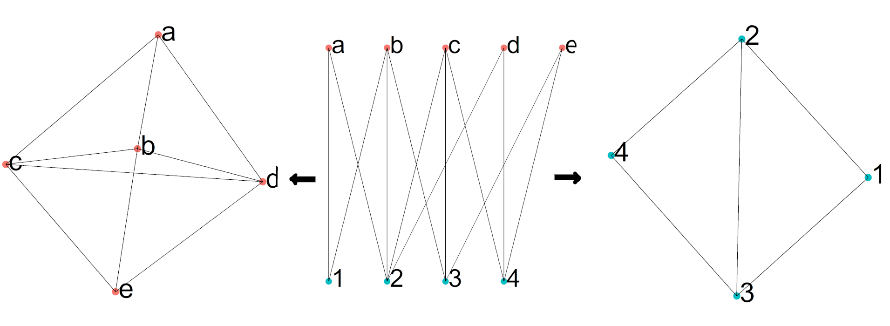

---

However, this representation results in a loss of information.

For example, we could add for each pair of items (groups) how many groups (items) they share, with a weighted edge:

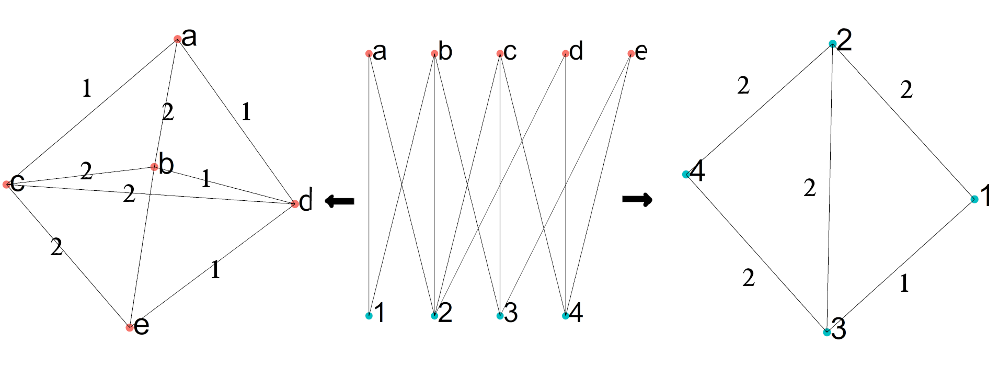

What does it mean in terms of incidence matrix $B$?

---

Exploiting the fact that $B$ contains only zeros and ones, the number of groups shared by two items $i$ and $j$, i.e. their *weight*:

$w(i, j) = \sum_{k=1}^{g} B_{ki}B_{kj} = \sum_{k=1}^{g} B^\intercal_{ik}B_{kj}$

And if we treat $w(i, j)$ as elements of matrix $P_{n\times n}$ we could write:

$P = B^\intercal B$

And $P$ is *almost* the adjacency matrix of the items graph we've manually built. On its diagonal for each item $i$ there is the total number of groups it belongs to:

$P_{ii} = w(i, i) = \sum_{k=1}^{g} B_{ki}B_{ki} = \sum_{k=1}^{g} B^2_{ki} = \sum_{k=1}^{g} B_{ki}$

And so, if we wanted a proper weighted adjacency matrix, we would need to put zeros on $P$'s diagonal.

How would we reach the $P'_{g\times g}$ adjacency matrix of the groups network?

---

### Example: The Marvel Cinematic Universe Bipartite Network

```{python MCU1}
import pandas as pd
import numpy as np

marvel = pd.read_csv("../data/marvel_incidence_matrix.csv")

marvel.shape
marvel.iloc[:4, :5]
```

---

Get $B$ of Marvel Films x Characters:

```{python MCU2}
B = marvel.iloc[:, 1:].values
B.shape
```

Get $P$ of Marvel characters:

```{python MCU3}
P = B.transpose() @ B
P.shape
P[:5, :5]
```

---

Why `P[1, 1] = 9`? Because Iron Man appears in 9 films.

```{python MCU4}
marvel['Iron Man'].sum()
```

Why `P[1, 2] = 5`? Because Iron Man and Captain America appear together in 5 films.

```{python MCU5}
marvel['Film'][(marvel['Iron Man'] == 1) & (marvel['Captain America'] == 1)]
```

Putting zero in the diagonal to make $P$ an actual adjacency matrix:

```{python MCU6}
np.fill_diagonal(P, 0)
```

---

class: section-slide

# Degree and Density

---

## Undirected Networks

The degree of a node in an undirected unweighted network is the number of edges connected to it (NOT number of its neighbors!).

The weighted degree of a node in an undirected weighted network is the sum of edges weights connected to it.

In terms of adjacency matrix $A$:

$deg(i) = k_i = \sum_{i=1}^n A_{ij}$

.insight[
`r emo::ji("bulb")` Does this definition work for networks with multiedges or self-edges?
]

---

For an unweighted network: if $m$ is the number of edges, there are $2m$ ends of edges. This is also the sum of the nodes degrees:

$2m = \sum_{i=1}^n k_i = \sum_{ij}A_{ij}$

.insight[
`r emo::ji("bulb")` How would you define $m$ to make this definition "work" for a weighted network?
]

This means that the average degree $c$ of an unweighted undirected network is:

$c = \frac{2m}{n}$

---

The *density* of a network is defined as the fraction of existing edges from potential edges:

$\rho = \frac{m}{n\choose 2} = \frac{2m}{n(n-1)}$

Which means the density for large networks is roughly the ratio of average degree to network size:

$\rho = \frac{c}{n-1} \propto \frac{c}{n}$

- If we could prove somehow that as $n\to\infty$ $\rho\to 0$, we'd call such network *sparse*. Alternatively, if $\rho$ remains non-zero, we'd call such a network *dense*
- We can write $c=\rho n$. For some networks the average degree does not change. This means that as $n$ grows $\rho$ shrinks at rate $1/n$, and the network is called *extremely sparse*

.insight[
`r emo::ji("bulb")` Think of an example of a network for which the average degree should remain constant as $n$ grows.
]

---

## Directed Networks

When adding directions to edges, we talk about the *in-degree* and *out-degree* of a node, as the number of ingoing or outgoing edges connected to it:

$k^{\text{in}}_i = \sum^{n}_{j=1}A_{ij}\quad k^{\text{out}}_j = \sum^{n}_{i=1}A_{ij}$

The number of edges $m$ equals the sum of in- or out-degrees:

$m = \sum^{n}_{i=1}k^{\text{in}}_i = \sum^{n}_{j=1}k^{\text{out}}_j = \sum^{n}_{ij}A_{ij}$

The average in-degree is the average out-degree:

$c_{\text{in}} = \frac{1}{n}\sum^{n}_{i=1}k^{\text{in}}_i = \frac{1}{n}\sum^{n}_{j=1}k^{\text{out}}_j = c_{\text{out}}$

---

This means that the average degree $c$ of an unweighted directed network is:

$c = \frac{m}{n}$

Which means the definition of density $\rho$ remains the same for directed networks **in terms of average degree**:

$\rho = \frac{m}{n(n-1)} = \frac{c}{n-1}$

---

### Example: The Marvel Cinematic Universe Characters Network

Let's convert the weighted undirected adjacency matrix $P$ into unweighted:

```{python MCU7}
P[P > 0] = 1
P[:4, :4]
```

Get the list of degrees:

```{python MCU8}
k = P.sum(axis=0)
k
```

---

No. of nodes $n$:

```{python MCU9}
n = P.shape[0]
m = np.triu(P).sum()
print('n nodes: %d; m edges: %d' % (n, m))
```

Average degree:

```{python MCU10}
k.mean()
```

See that the simple definition is equivalent:

```{python MCU11}
2 * m / n
```

---

Density $\rho$:

```{python MCU12}
k.mean() / (n - 1)
```

We can see that most characters are connected to most characters (16 overall). One character, however, is connected to only 1 character:

```{python MCU13}
characters = marvel.columns[1:]
characters[np.argmin(k)]
```

is connected with:

```{python MCU14}
characters[np.argmax(P[np.argmin(k), :])]
```

---

class: section-slide

# Walks and Paths

---

### Unweighted, Directed and Undirected Networks

A *walk* in a network is a route from node A to node B along the edges.

A *path* is a walk which does not intersect itself.

Walks and paths are extremely important in algorithms answering questions regarding a network's structure and the flow of information it. Of particular importance is the *shortest path* between two nodes.

Shortest?

---

The *length* of a walk/path of an unweighted network is the number of edges traversed along the walk (NOT number of nodes!)

For example, exploiting the fact that $A$ contains only zeros and ones, we can easily compute the number of all walks of length 2 between two nodes:

$N^{(2)}_{ij} = \sum^n_{k=1}A_{ik}A_{kj}={[A^2]_{ij}}$

(the $ij$-th element of the "squared" matrix $A^2$)

Similarly the number of walks of length 3 between two nodes:

$N^{(3)}_{ij} = \sum^n_{k,l=1}A_{ik}A_{kl}A_{kj}={[A^3]_{ij}}$

And in general, the number of walks of length $r$ between two nodes:

$N^{(r)}_{ij} = {[A^r]_{ij}}$

---

## Shortest Paths

The shortest path (a.k.a *geodesic path*) between two nodes is the path of minimum length between the two nodes.

The *shortest distance* (a.k.a *geodesic distance*) is the length of the shortest path, in other words the smallest value of $r$ such that ${[A^r]_{ij}} > 0$.

.insight[
Why is it not called "the shortest walk"? Must it be unique?

What is the shortest distance between nodes which are not connected?
]

The *diameter* of a network is the maximal shortest distance between any pair of nodes.

.insight[
What is the meaning of the diameter in networks we've seen?
]

---

class: section-slide

# Components

---

## Undirected Networks

- Some parts of a network are disconnected from each other
- A *component* is a subset of nodes such that there exists at least one path between each pair of nodes in the subset
- No other node in the network can be added and preserve this property
- A singleton node is a single component
- A network in which every pair of nodes are connected, has a single component and is said to be *connected*
- The adjacency matrix of a disconnected network *can be* written in block diagonal form

.insight[
How many components are there in the Sci-Fi books network? Is it connected?

What is an easy way of making the network "more" or "less" connected?
]

---

## Directed Networks

Type I Definition:
- *weakly connected* components: a subset of nodes such there exists at least one directed path between each pair of nodes in the subset, direction can be either way
- *strongly connected* components: a subset of nodes such that there exists at least one directed path between each pair of nodes, in both direction

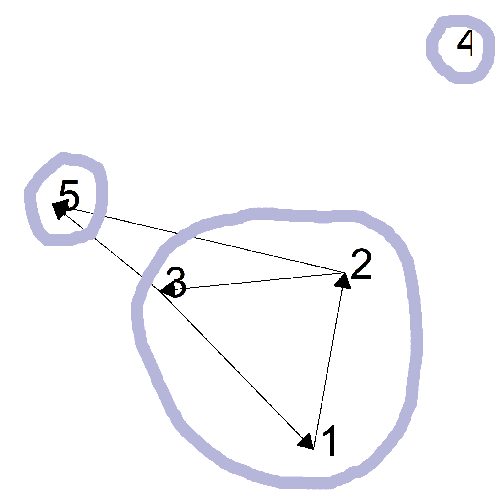

---

Type II Definition:
- *out-component* of node $i$: subset of all nodes reacheable by a directed path from node $i$ including $i$ itself
- *in-component* of node $i$: subset of all nodes from which node $i$ can be reached by a directed path, including $i$ itself

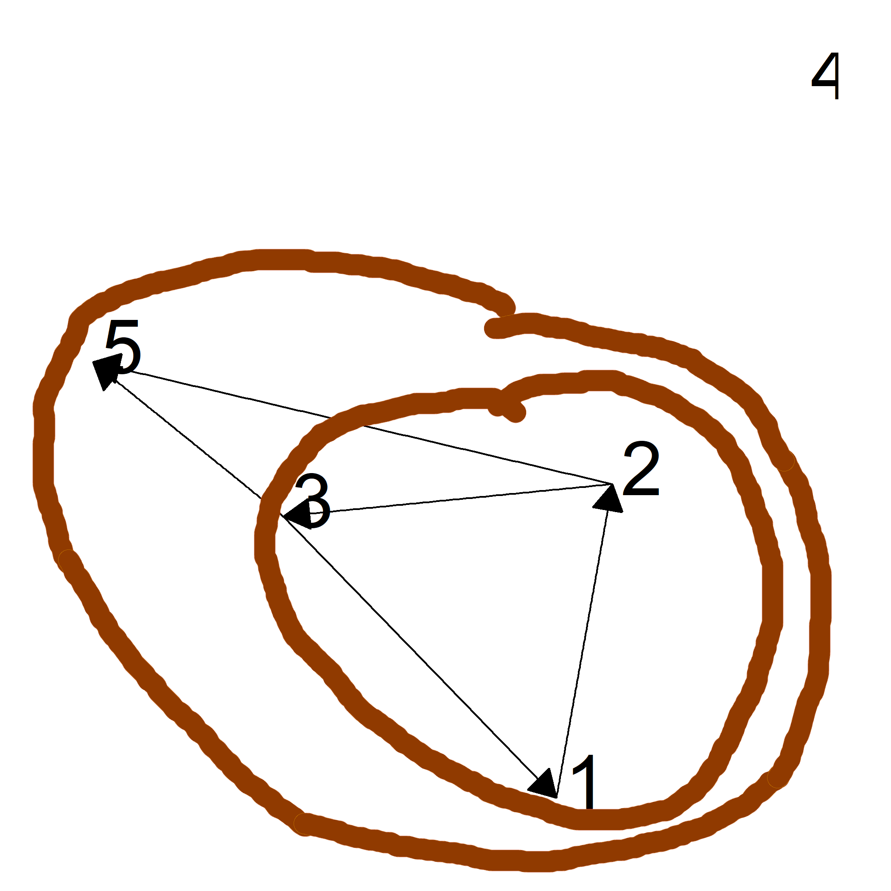

.font80percent[
The out-component of node 2 (or 1, or 3) is {1, 2, 3, 5}.

The in-component of node 2 (or 1, or 3) is {1, 2, 3}
]
---

class: section-slide

# The Graph Laplacian

---

### Udirected, Weighted and Unweighted Networks

A different matrix representation of a network which proves useful in many situations is the Laplacian $L_{n\times n}$:

$$L_{i,j} =
 \begin{cases}
    k_i & \mbox{if } i = j \\
   -1 & \mbox{if } i \neq j \mbox{ and there is an edge between nodes}\ i \mbox{ and}\ j \\
   0 & \mbox{otherwise}
 \end{cases}$$

Where $k_i$ is node $i$'s degree as defined before.

In other words:

$L = D - A$

Where $A$ is defined as before, and $D$ the diagonal matrix with a nodes degrees along the diagonal.
