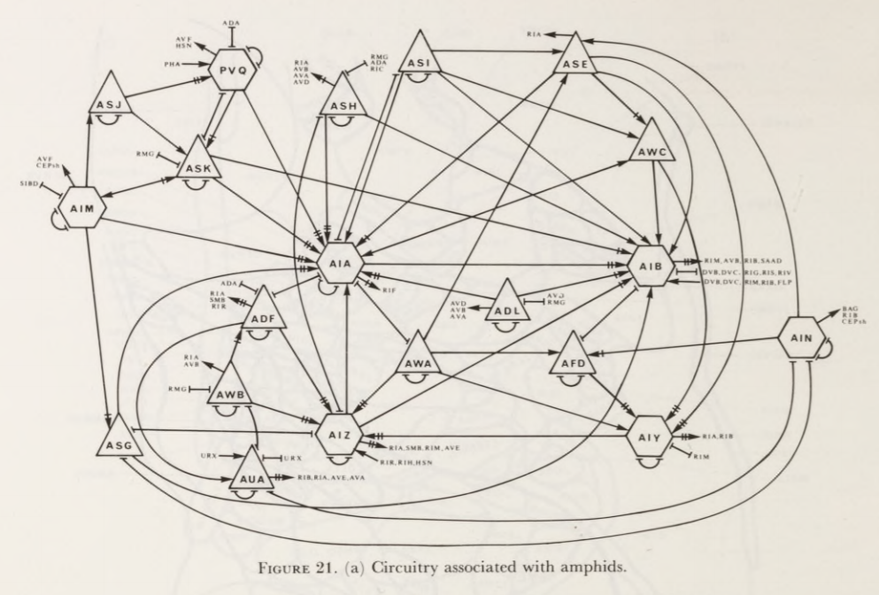

class: logo-slide

---

class: title-slide

## Introduction to Networks

### Applications of Data Science - Class 6

### Giora Simchoni

#### `gsimchoni@gmail.com and add #dsapps in subject`

### Stat. and OR Department, TAU
### `r Sys.Date()`

---
```{r child = "../setup.Rmd"}
```

```{r packages, echo=FALSE, message=FALSE, warning=FALSE}
library(tidyverse)
```

class: section-slide

# Why Networks?

---

## Because this


Can only get you so far.
---

## Divided we sing


---

class: section-slide

# Networks Overview

---

## A Network

A network, is comprised of:

- Nodes (vertices, points, actors), joined together in pairs by
- Edges (links, connections, ties)

Many types of networks:

- Physical networks: telephone lines, roads, airline routes, rivers
- Information networks: WWW, citation networks
- Social networks: Facebook, Twitter, but not just: this class, Marriage between Royal Houses
- Biological networks: "food webs" (what eats what?), metabolical networks

---

## Physical Networks


.font80percent[
[מערכת להסעת המונים במטרופולין תל אביב](https://he.wikipedia.org/wiki/%D7%9E%D7%A2%D7%A8%D7%9B%D7%AA_%D7%9C%D7%94%D7%A1%D7%A2%D7%AA_%D7%94%D7%9E%D7%95%D7%A0%D7%99%D7%9D_%D7%91%D7%9E%D7%98%D7%A8%D7%95%D7%A4%D7%95%D7%9C%D7%99%D7%9F_%D7%AA%D7%9C_%D7%90%D7%91%D7%99%D7%91)
]
---

## Information Networks


.font80percent[
[Wikipedia Main Page Site Map](https://en.wikipedia.org/wiki/Site_map)
]
---

## Social Networks


.font80percent[
[חשיפה: הרשימה שכל עורך דין חייב להכיר](https://www.themarker.com/law/1.3065986)
]
---

## Biological Networks



.font80percent[
[The structure of the nervous system of the nematode Caenorhabditis elegans](https://royalsocietypublishing.org/doi/abs/10.1098/rstb.1986.0056)
]
---

## Harder to classify Networks


---

## Bipartite Networks


`r emo::ji("arrow_right")`

---

## Bipartite Networks


.font80percent[
[Adapted from: Which Marvel Characters and Movies are the Most Central? / Félix Luginbühl](https://felixluginbuhl.com/network/)
]

---

## Similarity Networks


`r emo::ji("arrow_right")`

---

## Similarity Networks


`r emo::ji("arrow_right")`

---

## Similarity Networks


.font80percent[
[Sci-Fi Books data set / Kathleen M. Carley](http://www.casos.cs.cmu.edu/tools/datasets/internal/index.php#sci-fi)
]

---

## Multilayer Networks


.font80percent[
[Strategies for Combating Dark Networks (a.k.a Noordin Mohammad Top’s terrorist network of South East Asia](https://pdfs.semanticscholar.org/e680/6d8f86c5ddc3daf6f65572e39f65bd0d2990.pdf)
]

---

## Trees 


.insight[
`r emo::ji("bulb")` Does this remind you of anything?
]

---

## Networks Properties

- Directed/Not: Do the edges have orientation?
- Weighted edges/Not: Do the edges have weight/strength/length?
- Connected/Not: Can you "get to" any node from any node?
- Self-edges/Not: Can a node be linked to itself?
- Acyclic/Not: Are there cycles? Can you get from one node to itself not by a self-loop?
- Time-varied/Not: Does the network change over time?

---

## The networks we've seen

.font80percent[
Network                    | Directed | Weighted | Connected | Self-edges | Acyclic | Time-Varied
-------------------------- | -------- | -------- | --------- | ---------- | ------- | -----------
Israeli Artists Coops      |          |          |           |            |         | 
Gush Dan Trains            |          |          |           |            |         | 
Wikipedia Site Map         |          |          |           |            |         | 
Israeli Judges Connections |          |          |           |            |         | 
Worm Nervous System        |          |          |           |            |         | 
John Lennon Timeline       |          |          |           |            |         | 
Marvel Cinematic Universe  |          |          |           |            |         | 
Sci-Fi Books               |          |          |           |            |         | 
Noordin Terrorist Net      |          |          |           |            |         | 
Math Expression            |          |          |           |            |         | 

]

---

## The networks we've seen

```{r Emojis, echo=FALSE}
v <- emo::ji("check")
```

.font80percent[
Network                    | Directed | Weighted | Connected | Self-edges | Acyclic | Time-Varied
-------------------------- | -------- | -------- | --------- | ---------- | ------- | -----------
Israeli Artists Coops      |          |          |    `r v`  |            |         | `r v`
Gush Dan Trains            |          |          |    `r v`  |            |         | 
Wikipedia Site Map         |  `r v`   |          |    weakly |            |  `r v`  | 
Israeli Judges Connections |          |          |           |            |         | `r v`
Worm Nervous System        |  `r v`   | `r v`    |    weakly |  `r v`     |         | 
John Lennon Timeline       |  `r v`   |          |    weakly |            |  `r v`  | `r emo::ji("sad")`
Marvel Cinematic Universe  |          |          |    `r v`  |            |         | `r v`
Sci-Fi Books               |          |  `r v`   |           |            |         | 
Noordin Terrorist Net      |          |          |           |            |         | 
Math Expression            |   `r v`  |          |    weakly |            | `r v`   | 

]

---

## Typical Questions About Networks

### Macro:

- Is the network connected?
- Is the network dense or sparse?
- What is the maximum/average shortest path? .font80percent[small world effect]
- Is the network homophilic for attribute X?
- Are there interesting communities in the network?
- Will a "message" percolate through the whole network? How fast?
- Can we model the network to give insight on how it deveoped? Predict how it *will* develop?

---

## Typical Questions About Networks

### Micro:

- Which is the "best connected" node?
- Which is the "most important" node? .font80percent[Not necessarily the same thing]
- Is there a node or edge which "break" the network?
- Is there a path between node A and node B?
- What is the shortest path between node A and node B?
- Are nodes A and B likely to connect?
- What node should we recommend connect with node A?

---

## Obtaining Networks

- Surveys, Interviews, Questionnaires, Observations .font80percent[(Moreno's schoolchildren)]
- Archives, sometimes historical .font80percent[(Padget's families of Florence)]
- Snowball Sampling .font80percent[(Drug users' ego networks)]
- Web Scraping .font80percent[(Adamic's political blogs)]
- Web APIs .font80percent[(Twitter)]
- Co-occurrence matrices .font80percent[(Marvel's cinematic universe)]
- Any tabular dataset? .font80percent[(Sci-Fi books)]
- Just really hard work .font80percent[(Milgram's Small world experiment)]

---

class: section-slide

# Intro. to Networks Math
