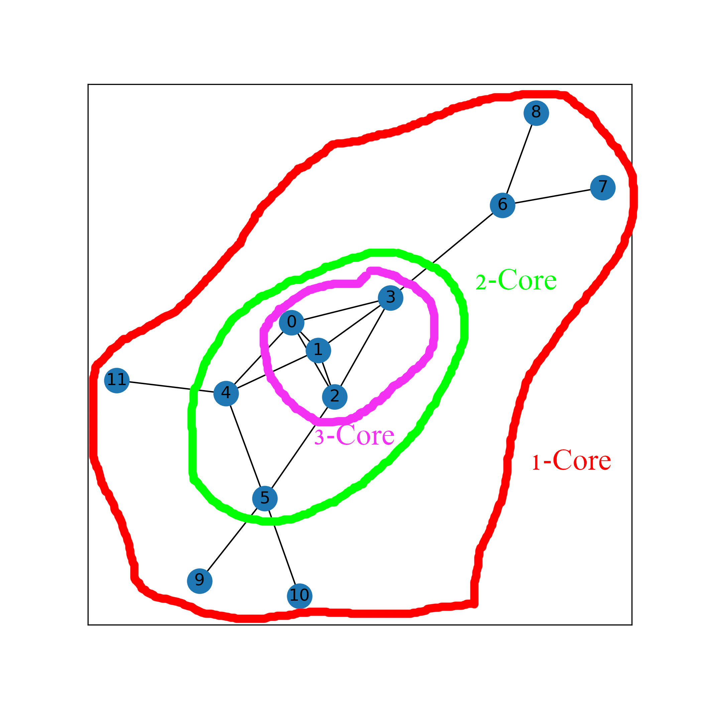
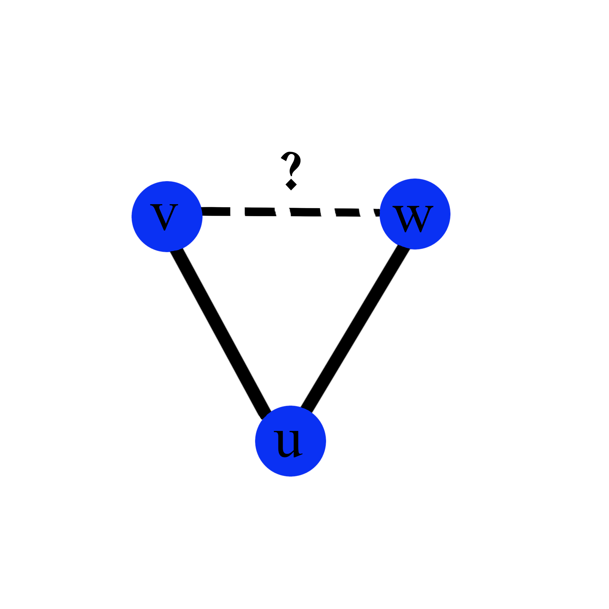
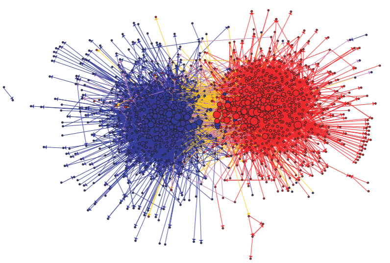
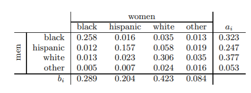

class: logo-slide

---

class: title-slide

## Network Metrics

### Applications of Data Science - Class 8

### Giora Simchoni

#### `gsimchoni@gmail.com and add #dsapps in subject`

### Stat. and OR Department, TAU
### `r Sys.Date()`

---
```{r child = '../setup.Rmd'}
```

```{python packages, echo=FALSE, message=FALSE, warning=FALSE}
def get_top_n_dict(d, n=5):
  return dict(sorted(d.items(), key = lambda x: x[1], reverse=True)[:n])

def pretty_print(top_n_dict):
  for element, value in top_n_dict.items():
    print('%s: %.2f' % (element, value))
```

class: section-slide

# Centrality

---

## What makes a node central to a network?

A central node is...               | Centrality
---------------------------------- | -------- 
Connected to many nodes            | Degree
Connected to other important nodes | Eigenvector, Katz, PageRank
Close to many nodes                | Closeness
"Mediator", without it the network might "break" | Betweenness

---

```{python Sci-Fi, out.width="50%"}
import pandas as pd
import numpy as np
import networkx as nx
import matplotlib.pyplot as plt

scifi_edgelist = pd.read_csv('../data/sci_fi_final_edgelist.csv')
G = nx.from_pandas_edgelist(scifi_edgelist, 'book', 'book2', ['corr'])

nx.draw_networkx(G)
plt.show()
```

---

## Degree Centrality

- $x_i = k_i = \sum_{i=1}^n A_{ij}$
- NetworkX also normalizes by dividing by $n - 1$
- Or in directed netwroks: in-degree and out-degree centralities
- Makes sense in social networks, co-citation networks

```{python}
cent_deg = nx.degree_centrality(G)

pretty_print(get_top_n_dict(cent_deg))
```

---

```{python Sci-Fi-Degree, out.width="70%"}
nx.draw_networkx(G, node_list = cent_deg.keys(),
  node_size = [c * 500 for c in cent_deg.values()])
plt.show()
```

---

## Eigenvector Centrality

It's not *how many* you're connected to, it's *who* you're connected to...

Let's make your centrality proportional to the sum of centralities of your neighbors:

$x_i = \delta \sum_{j\in neigh(i)}x_j=\delta\sum^n_{j=1} A_{ij}x_j$

The vector of centralities can be written as:

$\mathbf{x}=\delta\mathbf{Ax}$

Marking $\lambda=1/\delta$ we get:

$\mathbf{Ax}=\lambda\mathbf{x}$

Which means our vector of centralities is an eigenvector of the adjacency matrix.

---

Now there are $n$ eigenvetors to this $n\text{x}n$ matrix

But according to the *Perron-Frobenius* theorem, since $A$'s elements are all non-negative, there exists only one eigenvector with all elements non-negative, the leading eigenvector, corresponding to the largest eigenvalue $\lambda$

```{python}
cent_eig = nx.eigenvector_centrality(G)
pretty_print(get_top_n_dict(cent_eig))

# Compare this to:
# A = nx.to_numpy_matrix(G)
# eigenvalues, eigenvectors = np.linalg.eigh(A)
# eigenvectors[:, -1]
```

---

```{python Sci-Fi-Eigen, out.width="70%"}
nx.draw_networkx(G, node_list = cent_eig.keys(),
  node_size = [c * 500 for c in cent_eig.values()])
plt.show()
```

---

### Issues with Eigenvector Centrality

- What to do with directed networks?

Common solution: you are more "central" if many central nodes point *to* you --> definition remains the same only we stress that the eigenvector taken is the *right* leading eigenvector.

- What about DAGs?

```{python}
A = np.array([
[0, 0, 1, 1, 0],
[0, 0, 0, 0, 1],
[0, 0, 0, 1, 0],
[0, 0, 0, 0, 1],
[0, 0, 0, 0, 0]
])
Dag = nx.from_numpy_matrix(A.transpose(), create_using=nx.DiGraph)
```

---

```{python, out.width="50%"}
nx.draw_networkx(Dag)
plt.show()
```

```{python, error=TRUE, linewidth=80}
nx.eigenvector_centrality(Dag)
```

---

## Katz Centrality

Let us give each node a "baseline" centrality $\beta$:

$x_i = \alpha\sum^n_{j=1} A_{ij}x_j + \beta$

It can be shown that:

$\mathbf{x}=\beta(\mathbf{I} - \alpha\mathbf{A})\cdot\mathbf{1}$

And therefore $\beta$ itself isn't really important.

It is custom to have $\beta=1$ and $\alpha$ vary between 0 (constant $\beta$ centrality) and $1/\lambda$ where $\lambda$ is the maximum eigenvalue of $A$, in which case you get centrality very similiar to the eigenvector centrality, plus a little addition to avoid degeneration.

---

So this now works:

```{python}
nx.katz_centrality(Dag)
```

And in the Sci-Fi books case:

```{python}
cent_katz = nx.katz_centrality(G)
pretty_print(get_top_n_dict(cent_katz))
```

---

```{python Sci-Fi-Katz, out.width="70%"}
nx.draw_networkx(G, node_list = cent_katz.keys(),
  node_size = [c * 500 for c in cent_katz.values()])
plt.show()
```

---

## PageRank

One issue with Katz centrality is that it gives equal weights to all of a node's edges. This becomes a problem in large networks like the WWW, in which a directory website could have links to potentially millions and billions of sites. PageRank improves on Katz centrality by dividing the contribution of each node by its (out) degree:

$x_i = \alpha\sum^n_{j=1} A_{ij}\frac{x_j}{\max(k^{\text{out}}_j, 1)} + \beta$

It can be shown that:

$\mathbf{x}=\beta(\mathbf{I} - \alpha\mathbf{AD^{-1}})\cdot\mathbf{1}$

Where $\mathbf{D}$ is a diagonal matrix with $D_{ii}=\max(k^{\text{out}}_i, 1)$

---

Again $\beta$ itself isn't really important and is usually set to 1.

For undirected networks it can be shown that $\alpha$ should vary between 0 and 1. For directed networks there is no such limit, often a value close to 1 is used, Google and NetworkX use 0.85 by default.

```{python}
cent_pagerank = nx.pagerank(G)
pretty_print(get_top_n_dict(cent_pagerank))
```

---

```{python Sci-Fi-PageRank, out.width="70%"}
nx.draw_networkx(G, node_list = cent_pagerank.keys(),
  node_size = [c * 500 for c in cent_pagerank.values()])
plt.show()
```

---

## Closeness

Closeness is the *inverse mean shortest distance* from node $i$ to every other node:

$x_i = \frac{n}{\sum_jd(i, j)}$

.insight[
`r emo::ji("bulb")` What might be an issue with Closeness centrality?
]

```{python}
cent_closeness = nx.closeness_centrality(G)
pretty_print(get_top_n_dict(cent_closeness))
```

---

```{python Sci-Fi-Closeness, out.width="70%"}
nx.draw_networkx(G, node_list = cent_closeness.keys(),
  node_size = [c * 500 for c in cent_closeness.values()])
plt.show()
```

---

## Betweenness

How "in between" is a node? If we keep pushing messages from one random node to another, how many messages will go through node $i$?

$x_i = \sum_{u,v}\frac{\tau(u,v|i)}{\tau(u,v)}$

Where $\tau(u,v)$ is the number of shortest paths from node $u$ to node $v$ and $\tau(u,v|i)$ is the number of those shortest paths which pass through node $i$.

When $\tau(u,v)$ the contribution is "0/0" and is defined as zero.

.insight[
`r emo::ji("bulb")` What is assumed regarding the motivation for Betweenness centrality above?

How would you "normalize" Betweeness to range from 0 to 1?

How would you imagine a node with high Betweenness (a *broker*) "looks like"?
]

---

```{python}
cent_betweenness = nx.betweenness_centrality(G)
pretty_print(get_top_n_dict(cent_betweenness))
```

---

```{python Sci-Fi-Betweenness, out.width="70%"}
nx.draw_networkx(G, node_list = cent_betweenness.keys(),
  node_size = [c * 500 for c in cent_betweenness.values()])
plt.show()
```

---

## Group Centrality

In recent years there is also interest in measuring the centrality of a *group* of nodes. We can naturally extend some of the definitions we have seen:

- Group degree centrality: the fraction of non-group members connected to group members
- Group closeness centrality: inverse mean of the *minimum* shortest distance (minimum across all nodes in the group) to all nodes in the non-group
- Group betweenness centrality: sum of the fraction of number of shortest paths between two nodes in the non-group, passing through any node in the group, from the number of all shortest paths between the two nodes

See NetworkX [docs](https://networkx.github.io/documentation/stable/reference/algorithms/centrality.html#group-centrality) for further details

---

class: section-slide

# Detour: Cliques

---

### You know what a clique is...

A clique is a group of nodes in an undirected network so that each node is connected to each other node.

```{python Clique, out.width="40%"}
Clique = nx.Graph()
Clique.add_edges_from([(0, 1), (0, 2), (0, 3), (1, 2), (1, 3), (2, 3), (1, 4)])
nx.draw_networkx(Clique)
plt.show()
```

---
class: section-slide

# End of Detour

---

## Cores

*k*-Cores are a type of relaxation of Cliques which is also useful in describing centrality of a group of nodes.

*k*-Core is a group of nodes where each node is connected to at least *k* of the other nodes.



```{python, eval=FALSE, echo=FALSE}
Cores = nx.Graph()
Cores.add_edges_from([(0, 1), (0, 2), (0, 3), (1, 2), (1, 3), (2, 3), (1, 4), (0, 4), (4, 5), (2, 5), (3, 6), (6, 7), (6, 8), (5,9), (5, 10), (4, 11)])
nx.core_number(Cores)
```

---

For a given connected component the *k*-Cores are nested within each other: the 2-cores are a subset of the 1-cores (since if a node is connected to at least 2 nodes it must be connected to at least 1 node), the 3-cores are subsets of the 2-cores, etc.

We get an onion or mountain-like structure which might be useful in describing centrality.

```{python}
k_cores = nx.core_number(G)
pretty_print(get_top_n_dict(k_cores))
```

.insight[
`r emo::ji("bulb")` How would you find all k-Cores?
]

---

class: section-slide

# Cohesion

---

## Density

We've seen density before: the fraction of existing edges from potential edges:

$\rho = \frac{m}{n\choose 2} = \frac{2m}{n(n-1)}$

Which means the density for large networks is roughly the ratio of average degree to network size:

$\rho = \frac{c}{n-1} \propto \frac{c}{n}$

```{python}
nx.density(G)
```

---

## Transitivity



If Virginia is friends with Ursula, and Ursula is friends with Winona, is Ursula friends with Winona? Is the $vuw$ *connected triple* or *triad* a *closed triad*?

---

The graph *transitvity* is the proportion of closed triads or triangles out of all triads:

$Transitivity(G)=\frac{\text{#closed triads}}{\text{#triads}}=\frac{3 \text{x #triangles}}{\text{#triads}}=\frac{6 \text{x #triangles}}{\text{#paths of length 2}}$

.insight[
`r emo::ji("bulb")` Where did the 3 and 6 factors come from?
]

```{python}
nx.transitivity(G)
```

Is this high? One way is to compare a graph transitivity to its density. If nodes connected to other nodes by random we would expect transitivity of about 20%. This is much higher, implying that the network is far from "random" and there is some logic to its edges.

.insight[
`r emo::ji("bulb")` How would a network with transitivity 0 or 1 look like?
]

---

## Local Clustering Coefficient

The local equivalent of transitivity to a single node is the proportion of closed triads the node is part of, out of all pairs of neighbors:

$LCC(i)=\frac{\text{#closed triads involving node i}}{\text{#pairs of neighbors of i}}=\frac{2\text{x#closed triads involving node i}}{k_i(k_i-1)}$

.insight[
`r emo::ji("bulb")` How would a node with clustering coefficient 0 or 1 look like?
]

```{python}
clust_coefs = nx.clustering(G)
pretty_print(get_top_n_dict(clust_coefs))
```

---

### LCC vs. Betweenness Centrality

```{python lCC-Betweenness, echo=FALSE, out.width="30%"}
lcc = []
betweenness = []
for k, v in clust_coefs.items():
  lcc.append(clust_coefs[k])
  betweenness.append(cent_betweenness[k])

plt.scatter(lcc, betweenness)
plt.xlabel('lcc')
plt.ylabel('betweenness')
plt.show()
```

In many realistic networks we see a negative correlation between LCC and betweenness centrality. Since for a given node the LCC is much easier to compute it is often a good enough approximation of (inverse) betweenness.

.insight[
`r emo::ji("bulb")` Can you explain this pattern?
]

---

class: section-slide

# Similarity

---

## Sructural Equivalence

- Which nodes in a given network are most similar to one another?
- Which node is most similar to a given node $i$?

*Structural Equivalence* is only one type of similarity and it is concerned with $n_{ij}$: how many neighbors two nodes $i$ and $j$ share.

.insight[
`r emo::ji("bulb")` Why not just use *that* as a measure of similarity?
]

.warning[
`r emo::ji("warning")` The Sci-Fi books is already a network based on pairwise similarities. Structural Equivalence does not deal with this type of similarity, calculated over a vector of features.
]

---

### Working with the Adjacency Matrix

Cosine Distance and Pearson Correlation are two obvious choices:

$S(i, j) =\cos(\theta)=\frac{\sum_kA_{ik}A_{kj}}{\sqrt{\sum_kA^2_{ik}}\sqrt{\sum_kA^2_{jk}}}=\frac{n_{ij}}{\sqrt{k_ik_j}}$

$S(i, j) =r(i,j)=\frac{\sum_k(A_{ik}-\overline{A_i})(A_{jk}-\overline{A_j})}{\sqrt{\sum_k(A_{ik}-\overline{A_i})^2}\sqrt{\sum_k(A_{jk}-\overline{A_j})^2}}$

.warning[
`r emo::ji("warning")` Not implemented in NetworkX, you could extract the adjacency matrix yourself and use Scikit-Learn for cosine distance and SciPy for pearson correlation.
]

---

### Jaccard Coefficient

$S(i, j)=J(i,j)=\frac{neigh(i) \cap neigh(j)}{neigh(i) \cup neigh(j)}=\frac{n_{ij}}{k_i+k_j-n_{ij}}$

```{python}
sim_jaccard = nx.jaccard_coefficient(G)

sim_jaccard_top5 = {(u, v): j for u, v, j in sorted(sim_jaccard, key = lambda x: x[2], reverse=True)[:5]}

pretty_print(sim_jaccard_top5)
```

---

class: section-slide

# Homophily

---

## Assortative Mixing

This has just arrived: people tend to connect with other people similar to them! a.k.a *assortative mixing* .font80percent[(Sorry to burst your bubble)] 



.font80percent[
[The Political Blogosphere and the 2004 U.S. Election:
Divided They Blog / Lada Adamic](http://www.ramb.ethz.ch/CDstore/www2005-ws/workshop/wf10/AdamicGlanceBlogWWW.pdf)
]

.insight[
`r emo::ji("bulb")` What would be an easy example of a network displaying *dis*assortative mixing?
]

---

### Categorical Attribute Assortative Mixing

- Is the network of Israeli musical cooperations assortative for musical style?
- Is the Sci-Fi books network assortative for author gender?
- Is the choice of spouse assortative for race?

Behold the joint probability distribution of attribute race for a real-life network:



The percentages in the cells refer to the proportion of *edges* for which the 1st node (a man) is of race $i$ (e.g. black) and the 2nd node (a woman) is of race $j$ (e.g. white)

---

We wish to measure to what extent all edges are found on the diagonal of the above matrix (perfect assortativity).

Let $M$ be the joint probability distribution matrix of the specified categorical attribute, so that $\sum_{ij}M_{ij}=1$. And let $a_i$ and $b_j$ be the marginal probabilities of 1st and 2nd nodes (row and column) being of type $i$ and $j$ respectively, such that:

$\sum_j M_{ij}=a_i; \space \sum_i M_{ij}=b_j$

If the nodes formed edges randomly, the expected probability of 1st and 2nd nodes (row and column) being both of type $i$ would be: $a_ib_i$. So the "distance" between the observed and expected over $M$ is: $\sum_i(M_{ii}-a_ib_i)$ and we divide this by the maximum value this distance can reach under perfect assortativity and get:

$Assortativity_1(attribute)=\frac{\sum_iM_{ii}-\sum_ia_ib_i}{1-\sum_ia_ib_i}=\frac{\text{Tr}(M)-||M^2||}{1-||M^2||}$

Where $||B||$ means the sum of all elements in matrix $B$.

---

This *assortative coefficient* is positive for attributes which demonstrate assortativity (up to a maximum of 1), 0 for attributes with no apparent assortativity and negative for attributes which demonstrate disassortativity.

.insight[
`r emo::ji("bulb")` Why not use a $\chi^2$ test for independence?

How would you perform hypothesis testing on such a statistic?
]

```{python}
scifi_books = pd.read_csv('../data/sci_fi_books.csv')
scifi_author_gender = scifi_books[scifi_books['book'].isin(G.nodes)].set_index('book')['author_gender'].to_dict()
nx.set_node_attributes(G, scifi_author_gender, 'author_gender')
print(nx.attribute_mixing_matrix(G, 'author_gender'))
```

```{python}
nx.attribute_assortativity_coefficient(G, 'author_gender')
```

---

### Ordered/Numeric Attribute Assortative Mixing

- Is the network of Israeli musical cooperations assortative for artists popularity?
- Is the Sci-Fi books network assortative for year of release?
- Is the choice of spouse assortative for age?


---

For this specific case we *could* use a simple Pearson correlation coefficient.

In general though we might be dealing with a discrete numeric attribute with not many levels (e.g. year, grade) and the *weighted* correlation coefficient is used.

Let $M$ be the same joint probability distribution matrix for a discrete numeric attribute (if not discrete we can discretize it or use integration). And let $a_{x_i}$ and $b_{y_j}$ be the marginal probabilities of 1st and 2nd nodes (row and column) being of type $x_i$ and $y_j$ respectively.

As before: $\sum_{ij}M_{ij}=1; \sum_j M_{ij}=a_{x_i}; \space \sum_i M_{ij}=b_{y_j}$

The weighted mean of attribute (variable) $x$: $\hat{E}(x;a)=\frac{\sum_ix_ia_{x_i}}{\sum_ia_{x_i}}=\sum_ix_ia_{x_i}=\sum_{ij}x_iM_{ij}$

---

$Assortativity_2(attribute)=r(x,y;M)=\frac{\hat{cov}(x,y;M)}{\hat{\sigma}(x)\hat{\sigma}(y)}=$

$=\frac{\hat{E}(xy;E)-\hat{E}(x;a)\hat{E}(y;b)}{\hat{\sigma}(x)\hat{\sigma}(y)}=\frac{\sum_{ij}M_{ij}x_iy_j - \sum_ix_ia_{x_i}\cdot \sum_jy_jb_{y_j}}{\sqrt{\hat{cov}(x,x;M)\hat{cov}(y,y;M)}}$

$= \frac{\sum_{ij}M_{ij}x_iy_j - \sum_{ij}a_{x_i}b_{y_j}x_iy_j}{\sqrt{\hat{cov}(x,x;M)\hat{cov}(y,y;M)}} = \frac{\sum_{ij}x_iy_j(M_{ij} - a_{x_i}b_{y_j})}{\sqrt{\hat{cov}(x,x;M)\hat{cov}(y,y;M)}}$

This is a proper correlation coefficient, which ranges from -1 (perfect disassortativity) to 1 (perfect assortativity).

```{python}
scifi_quarter = scifi_books[scifi_books['book'].isin(G.nodes)].set_index('book')['quarter_century'].to_dict()
nx.set_node_attributes(G, scifi_quarter, 'quarter_century')

# print(nx.numeric_mixing_matrix(G, 'quarter_century'))
nx.numeric_assortativity_coefficient(G, 'quarter_century')
```
