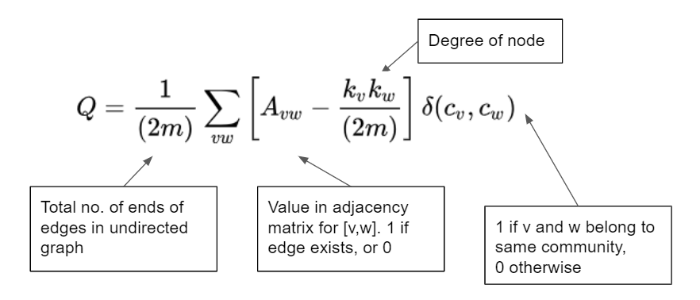
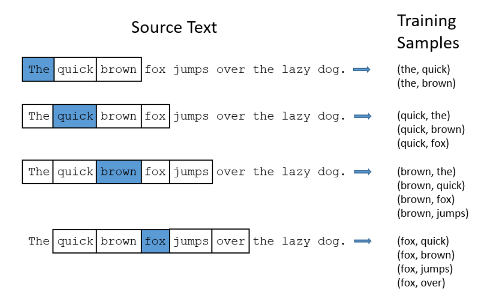

class: logo-slide

---

class: title-slide

## Community Detection

### Applications of Data Science - Class 9

### Giora Simchoni

#### `gsimchoni@gmail.com and add #dsapps in subject`

### Stat. and OR Department, TAU
### `r Sys.Date()`

---
```{r child = '../setup.Rmd'}
```

```{python, echo=FALSE}
def get_node_colors_by_communities(communities, nodes, colors = ['green', 'blue', 'red', 'purple']):
  colors = ['red', 'blue', 'green', 'purple'] # cheating...
  node_colors = []
  books = []
  color_ind = 0
  for comm in communities:
    node_colors.extend([colors[color_ind]] * len(comm))
    color_ind += 1
    books.extend(list(comm))
  colors_dict = {book: color for book, color in zip(books, node_colors)}
  book_index = {book: i for i, book in enumerate(nodes)}
  sorted_colors_dict = sorted(colors_dict.items(), key=lambda pair: book_index[pair[0]])
  node_colors = [color for book, color in sorted_colors_dict]
  return node_colors
```

class: section-slide

# Intro

---

### Why detect communities?

- Understand hidden structure
- Identify separate functionalities
- Categorize (e.g. for automating Search & Browse)
- Divide & Conquer (e.g. for visualization)
- Optimize (e.g. with software)
- Reduce size of large networks
- Sheer Coolness

### What's a "good" community?

- Either "ground truth" .font80percent[(supervised)]
- Many edges within (dense), few edges between (sparse) .font80percent[(unsupervised)]

---

class: section-slide

# Spectral Partitioning

---

Start with dividing the network into 2 communities ("bisection").

.insight[
`r emo::ji("bulb")` What is the number of ways to divide n nodes into two distinct groups?
]

The *cut size* between two sets of nodes is the number of edges between them:

$R=\frac{1}{2}\sum_{ij \text{ in different groups}}A_{ij}$

Define $\mathbf{s}$ the vector which indicates to which community a network belongs:

$$s_i =
 \begin{cases}
   +1 & \mbox{if node}\ i \mbox{ belongs to community 1} \\
   -1 & \mbox{if node}\ i \mbox{ belongs to community 2}
 \end{cases}$$

Then:
 
$$\frac{1}{2}(1-s_is_j) =
 \begin{cases}
   1 & \mbox{if nodes}\ i,j \mbox{ belong to different communities} \\
   -1 & \mbox{if nodes}\ i,j \mbox{ belong to the same community}
 \end{cases}$$

---

So we can sum over all $i,j$ to express $R$:

$R=\frac{1}{4}\sum_{ij}A_{ij}(1-s_is_j)=\frac{1}{4}\sum_{ij}(A_{ij}-A_{ij}s_is_j)$

Do you see where we're going with this?

$\sum_{ij}A_{ij}=\sum_i\sum_jA_{ij}=\sum_ik_i=\sum_ik_is_i^2=\sum_{ij}k_i\delta_{ij}s_is_j$

Where $\delta_{ij}$ is the *Kronecker delta*, which is 1 if $i = j$ and 0 otherwise.

Then the cut size can be written as:

$R=\frac{1}{4}\sum_{ij}(k_i\delta_{ij}-A_{ij})s_is_j=\frac{1}{4}\sum_{ij}L_{ij}s_is_j=\frac{1}{4}\mathbf{s}^\intercal\mathbf{L}\mathbf{s}$

Where $L$ is the network Laplacian defined earlier.

And so we want to minimize $\frac{1}{4}\mathbf{s}^\intercal\mathbf{L}\mathbf{s}$ s.t. $s_i=\pm1$.

---

Now suppose $n_1$ and $n_2$, no. of nodes expected in community 1 and 2 are known .font80percent[(not unrealistic, especially with equal sizes and when you want to avoid degenerate scenarios)].

$\sum_is_i=\mathbf{1}^\intercal\cdot\mathbf{s}=n_1-n_2$

**Relaxation**:

We get rid of having $s_i=\pm1$, instead we'll require its $l2$ norm to be: $\sum_is_i^2=\mathbf{s}^\intercal\mathbf{s}=n$

Applying Lagrange multipliers we get:

$\frac{\partial R}{\partial s}=\frac{\partial}{\partial s}\frac{1}{4}\mathbf{s}^\intercal\mathbf{L}\mathbf{s}+\lambda(n-\mathbf{s}^\intercal\mathbf{s})+2\mu((n_1-n_2)-\mathbf{1}^\intercal\cdot\mathbf{s})$

Equating to 0 to find the minimum and performing the derivatives we get:

$\mathbf{Ls}=\lambda\mathbf{s}+\mu\mathbf{1}$

---

.font80percent[(Here if we have time I can show you how we get to...)]

Finally, the solution for $\mathbf{s}$ is:

$\mathbf{s}=\mathbf{v_2}+\frac{n1-n2}{n}$

Where $\mathbf{v_2}$ is the Fiedler vector: eigenvector of $L$, which corresponds to $\lambda$, the second smallest (after zero) eigenvalue of $L$.

But $\mathbf{s}$ needs to be at $\pm1$, so bottom line we take the $n_1$ most positive values in $\mathbf{v_2}$ and put the relevant nodes in community 1, and the rest of the $n_2$ nodes in community 2.

It can be shown that $R=\frac{n_1n_2}{n}\lambda$, hence $\lambda$, the second smallest eigenvalue of $L$ (a.k.a *algebraic connectivity*) determines the cut size, how easy it is to divide the network into two communities of sizes $n_1$ and $n_2$

.insight[
`r emo::ji("bulb")` What if $\lambda=0$? What if we didn't assume we knew $n_1$ and $n_2$?
]

---

Regarding implementation, I do not think Spectral Clustering is implemented in NetworkX, however you can either implement it yourself or use [`SpectralClustering()`](https://scikit-learn.org/stable/modules/generated/sklearn.cluster.SpectralClustering.html) from Scikit-Learn.

.font80percent[
The `SpectralClustering()` of Scikit-Learn isn't identical to what we defined though. I believe that after obtaining $\mathbf{v_2}$, there is no way of specifying $n_1$ and $n_2$, instead all nodes with positive values in $\mathbf{v_2}$ are taken for community 1 and all nodes with negative values are taken to community 2.
]

```{python}
import pandas as pd
import numpy as np
import networkx as nx
import matplotlib.pyplot as plt
from sklearn.cluster import SpectralClustering

scifi_edgelist = pd.read_csv('../data/sci_fi_final_edgelist.csv')
G = nx.from_pandas_edgelist(scifi_edgelist, 'book', 'book2', ['corr'])
A = nx.to_numpy_matrix(G)
sc = SpectralClustering(2, affinity='precomputed', n_init=100,
  assign_labels='discretize')
communities = sc.fit_predict(A)

communities[:10]
```

---

```{python SpectralClustering, out.width="50%"}
color_dict = {0: 'blue', 1: 'red'}
nx.draw_networkx(G, node_list = G.nodes,
  node_color = [color_dict[comm] for comm in communities])
plt.show()
```

---

class: section-slide

# Girvan-Newman (Betweennees)

---

[Girvan & Newman (2002)](https://www.pnas.org/content/pnas/99/12/7821.full.pdf) suggested a divisive strategy of repeatedly removing "strongest" edges from the network, slowly uncovering the community structure of the network, until we're left with $n$ communities for $n$ nodes.

This will create a dendrogram of nodes, from a point where all are connected to where all are "leaves":


To choose the community structure best for you either cut the dendrogram where you get $k$ communities or use some other metric.

But what criterion to choose for "strongest" edges?

---

Girvan & Newman suggested *edge betweenness* which is the same *betweenness centrality* we have defined, using edges:

$x_e = \sum_{u,v}\frac{\tau(u,v|e)}{\tau(u,v)}$

Where $\tau(u,v)$ is the number of shortest paths from node $u$ to node $v$ and $\tau(u,v|e)$ is the number of those shortest paths which pass through edge $e$.

To summarize:

1. Calculate the betweenness for all edges in the network.
2. Remove the edge with the highest betweenness.
3. Recalculate betweennesses for all edges affected by the removal.
4. Repeat from step 2 until no edges remain.

.insight[
`r emo::ji("bulb")` Why recalculate betweenness at each iteration?
]

---

```{python Girvan-Newman, out.width="50%"}
communities = nx.community.girvan_newman(G) # returns an iterator on tuples of sets of nodes
communities = list(next(communities)) # we take the first tuple for 2 communities

nx.draw_networkx(G, node_list = G.nodes,
  node_color = get_node_colors_by_communities(communities, G.nodes))

plt.show()
```

---

Getting the actual dendrogram turned out to be quite laborious, you can see [here](https://stackoverflow.com/questions/59821151/plot-the-dendrogram-of-communities-found-by-networkx-girvan-newman-algorithm/59827653#59827653) how I got it to work or see the slides source (this chunk is hidden because it's a lot of code...)

```{python scifi-dendrogram, echo=FALSE, out.width="70%", fig.asp=0.4}
import networkx as nx
import matplotlib.pyplot as plt
from itertools import chain, combinations
from scipy.cluster.hierarchy import dendrogram, set_link_color_palette

# get Girvan-Newman communities list
communities = nx.community.girvan_newman(G) # returns an iterator on tuples of sets of nodes
communities = list(communities)

# building initial dict of node_id to each possible subset:
node_id = 0
init_node2community_dict = {node_id: communities[0][0].union(communities[0][1])}
for comm in communities:
    for subset in list(comm):
        if subset not in init_node2community_dict.values():
            node_id += 1
            init_node2community_dict[node_id] = subset

# turning this dictionary to the desired format in @mdml's answer
node_id_to_children = {e: [] for e in init_node2community_dict.keys()}
for node_id1, node_id2 in combinations(init_node2community_dict.keys(), 2):
    for node_id_parent, group in init_node2community_dict.items():
        if len(init_node2community_dict[node_id1].intersection(init_node2community_dict[node_id2])) == 0 and group == init_node2community_dict[node_id1].union(init_node2community_dict[node_id2]):
            node_id_to_children[node_id_parent].append(node_id1)
            node_id_to_children[node_id_parent].append(node_id2)

# also recording node_labels dict for the correct label for dendrogram leaves
node_labels = dict()
for node_id, group in init_node2community_dict.items():
    if len(group) == 1:
        node_labels[node_id] = list(group)[0]
    else:
        node_labels[node_id] = ''

# also needing a subset to rank dict to later know within all k-length merges which came first
subset_rank_dict = dict()
rank = 0
for e in communities[::-1]:
    for p in list(e):
        if tuple(p) not in subset_rank_dict:
            subset_rank_dict[tuple(sorted(p))] = rank
            rank += 1
subset_rank_dict[tuple(sorted(chain.from_iterable(communities[-1])))] = rank

# my function to get a merge height so that it is unique (probably not that efficient)
def get_merge_height(sub):
    sub_tuple = tuple(sorted([node_labels[i] for i in sub]))
    n = len(sub_tuple)
    other_same_len_merges = {k: v for k, v in subset_rank_dict.items() if len(k) == n}
    min_rank, max_rank = min(other_same_len_merges.values()), max(other_same_len_merges.values())
    range = (max_rank-min_rank) if max_rank > min_rank else 1
    return float(len(sub)) + 0.8 * (subset_rank_dict[sub_tuple] - min_rank) / range

# finally using @mdml's magic, slightly modified:
G1 = nx.DiGraph(node_id_to_children)
nodes = G1.nodes()
leaves = set( n for n in nodes if G1.out_degree(n) == 0 )
inner_nodes = [ n for n in nodes if G1.out_degree(n) > 0 ]

# Compute the size of each subtree
subtree = dict( (n, [n]) for n in leaves )
for u in inner_nodes:
    children = set()
    node_list = list(node_id_to_children[u])
    while len(node_list) > 0:
        v = node_list.pop(0)
        children.add( v )
        node_list += node_id_to_children[v]
    subtree[u] = sorted(children & leaves)

inner_nodes.sort(key=lambda n: len(subtree[n])) # <-- order inner nodes ascending by subtree size, root is last

# Construct the linkage matrix
leaves = sorted(leaves)
index  = dict( (tuple([n]), i) for i, n in enumerate(leaves) )
Z = []
k = len(leaves)
for i, n in enumerate(inner_nodes):
    children = node_id_to_children[n]
    x = children[0]
    for y in children[1:]:
        z = tuple(sorted(subtree[x] + subtree[y]))
        i, j = index[tuple(sorted(subtree[x]))], index[tuple(sorted(subtree[y]))]
        Z.append([i, j, get_merge_height(subtree[n]), len(z)]) # <-- float is required
        index[z] = k
        subtree[z] = list(z)
        x = z
        k += 1

# dendrogram
# plt.figure()
set_link_color_palette(['b', 'r'])
d = dendrogram(Z, labels=[node_labels[node_id] for node_id in leaves],
  orientation='top', above_threshold_color='k', leaf_font_size=10, leaf_rotation=90)
plt.gcf().subplots_adjust(bottom=0.35)
plt.show()
```

---

class: section-slide

# Label Propagation

---

### Proposition 1: Synchronous

Completely different, beautiful, democratic idea:

1. Initialize a unique label (community) for each node
2. For each node (in parallel): choose the the most common label in neighbors
3. If there is a tie: choose label at random
4. Go back to 2 until some stopping criteria (e.g. no change)

Pros                          | Cons
----------------------------- | -----------------------
Relatively fast (in parallel) | May not converge
                              | Reproducibility issue
                              
.insight[
`r emo::ji("bulb")` Can you think of a network that will never converge?
]

---

### Proposition 2: Asynchronous

1. Initialize a unique label (community) for each node
2. Decide on a nodes permutation
3. For each node (one after the other): choose the the most common label in neighbors
4. If there is a tie: choose label at random
5. Go back to 2 until some stopping criteria (e.g. no change)


Pros               | Cons
------------------ | -----------------------
Relatively slow    | Even worse reproducibility issue, no single solution
Better convergence | "Monster communities"

---

### Improving Convergence

- Smarter tie breakers:
  - If the node is labelled with one of the tied labels in its neighborhood - keep it
  - Set an order on labels (e.g. $1, ..., l$) and always choose the max label
  - Or both

- Stopping Criterion
  - Unfortunately "no change in labels" may be too an optimistic criterion to achieve.
  - "Equilibrium": if in the current structure each node has a label no different than the majority label in its neighborhood - stop. In other words: if in the next iteration nodes will change label only due to ties - stop.

---

class: section-slide

# Detour: The Network Coloring Problem

---

Can you color a network using as few colors as possible, where no two adjacent nodes share the same nodes?

```{python Coloring-Problem, out.width = "30%"}
F = nx.petersen_graph()
color_dict = nx.coloring.greedy_color(F)
colors = ['green', 'red', 'blue']
node_colors = [colors[color_ind] for node, color_ind in color_dict.items()]
nx.draw_shell(F, node_list=F.nodes, node_color=node_colors)
plt.show()
```

.insight[
`r emo::ji("bulb")` Think of a not-so-fast simple algorithm to get this done (A fast algorithm can make this in O(max(deg(G))) time!)
]

---

The smallest number of colors required to color a given network $G$ is called its *chromatic number*, $\chi(G)$

.insight[
`r emo::ji("bulb")` What is an "easy" upper bound on $\chi(G)$?
]

What is it good for?

- Scheduling: imagine each node is a university course and two courses share an edge if they have common students. How would you schedule exam times, such that no student has to attend two exams at the same time?
- Political map coloring: no two adjacent countries share a color
- A network $G$ is bipartite iff $\chi(G)=2$
- Sudoku: 9x9=81 cells (nodes), two cells are connected if they are in the same row/column/square. Can you put in each cell 1 out of 9 numbers (colors) such that no two adjacent cells share the same number?
- And...

---

class: section-slide

# End of Detour

---

### Proposition 3: Both ("Semi-Synchronous")

[Cordasco & Gargano (2010)](https://arxiv.org/abs/1103.4550):

1. Initialize a unique label (community) for each node
2.  Network coloring: assign a "color" to the nodes of the network such that no two adjacent nodes share the same color
3. **In each color group** (one after the other), for each node (in parallel): choose the the most common label in neighbors
4. If there is a tie: choose a label by one of the "smarter" tie breakers
5. Go back to 3 until some stopping criteria ("Equilibrium")

.insight[
`r emo::ji("bulb")` Do you see the sense in iterating the nodes in parallel *in each color group*?
]
---

```{python Label-Propagation, out.width="50%"}
communities = nx.community.label_propagation_communities(G)

plt.figure()
nx.draw_networkx(G, node_list = G.nodes,
  node_color = get_node_colors_by_communities(communities, G.nodes))
plt.show()
```

---

class: section-slide

# Modularity Maximization

---

## Modularity



Modularity in words: “the fraction of the edges that fall within the given groups minus the expected fraction if edges were distributed at random.”

.insight[
`r emo::ji("bulb")` Statisticians might know this from the "observed minus expected" approach for Goodness of Fit statistics.
]

---

If the number of within-community edges is no better than random, $Q=0$ .font80percent[(why?)].

In general $Q$ ranges from -0.5 to (nearly) 1. You can see the full proof [here](https://www.uni-konstanz.de/mmsp/pubsys/publishedFiles/BrDeGa08.pdf), but you can also develop some intuition:

```{python Modularity1, out.width = "40%"}
F = nx.Graph()
F.add_nodes_from(range(4))
F.add_edges_from([(0, 1), (2, 3)])
nx.draw_networkx(F)
plt.show()
```

---

```{python}
print(nx.community.modularity(F, [{0, 1}, {2, 3}]))
print(nx.community.modularity(F, [{0, 2}, {1, 3}]))
```

```{python}
F = nx.Graph()
F.add_nodes_from(range(8)) # Add more communities
F.add_edges_from([(0, 1), (2, 3), (4, 5), (6, 7)])
print(nx.community.modularity(F, [{0, 1}, {2, 3}, {4, 5}, {6, 7}]))
print(nx.community.modularity(F, [{0, 2, 4, 6}, {1, 3, 5, 7}]))
```

.insight[
`r emo::ji("bulb")` A good $Q$ is said to be above 0.3. What do you think of that?

What would you do with a weighted network?
]

---

### Bisection, inspired by Spectral Partitioning

Define $M$ to be the *modularity matrix*:

$M_{ij}=A_{ij}-\frac{k_ik_j}{2m}$

Note that:

$\sum_iM_{ij}=\sum_iA_{ij}-\frac{k_j}{2m}\sum_ik_i=k_j-\frac{k_j}{2m}2m=0$

Define as in Spectral Partitioning community vector $\mathbf{s}$:

$$s_i =
 \begin{cases}
   +1 & \mbox{if node}\ i \mbox{ belongs to community 1} \\
   -1 & \mbox{if node}\ i \mbox{ belongs to community 2}
 \end{cases}$$
 
Follow the same logic and you'll get:

$Q=\frac{1}{4m}\mathbf{s}^\intercal \mathbf{M}\mathbf{s}$

---

So our goal is to maximize $\mathbf{s}^\intercal \mathbf{M}\mathbf{s}$ s.t. $s_i=\pm1$.

And as before we will relax $\mathbf{s}$ to have a norm of $n$: $\sum_is_i^2=\mathbf{s}^\intercal\mathbf{s}=n$

Applying Lagrange multplier, taking derivative, equating to zero:

$\frac{\partial Q}{\partial s}=\frac{\partial}{\partial s}\mathbf{s}^\intercal\mathbf{M}\mathbf{s}+\lambda(n-\mathbf{s}^\intercal\mathbf{s})=0$

$\mathbf{Ms}=\lambda\mathbf{s}$

Which means that $s$ is an eigenvector of $M$ with eigenvalue $\lambda$.

Since we can now write: $Q=\frac{1}{4m}\mathbf{s}^\intercal \mathbf{M}\mathbf{s}=\frac{1}{4m}\lambda\mathbf{s^\intercal s}=\frac{\lambda n}{4m}$

It is clear we need the maximum eigenvalue $\lambda$, corresponding to the leading eigenvector $\mathbf{u_1}$ of $M$.

---

But $\mathbf{s}$ still needs to be $\pm1$, and so usually:

$$s_i =
 \begin{cases}
   +1 & \mbox{if }\ [u_1]_i > 0 \\
   -1 & \mbox{if }\ [u_1]_i < 0 \\
 \end{cases}$$

This "Spectral bisection" modularity maximization version isn't implemented in NetworkX, probably because you don't necessarily desire only two communities, and finding the leading eigenvector of a $M$ takes time $O(n^2)$, not that fast for large networks.

Still, modularity is widely used.

---

### Greedy Modularity Maximization

[Clauset, Newman & Moore (2004)](https://arxiv.org/abs/cond-mat/0408187) suggested an *agglomerative* strategy of greedily combining communities to find the partition with maximum modularity:

1. Start with $n$ communities: each node as a community of its own
2. Choose the pair of communities that grouping together would result in maximum increase or minimum decrease in Modularity
3. Go back to 2 until only one community is left
4. Review resulting dendrogram choosing the partition (cut) with maximum modularity

The authors show that for sparse networks where $n \sim m$ the complexity is $O(nlog^2(n))$

---

```{python Greedy-Modularity, out.width="50%"}
communities = nx.community.greedy_modularity_communities(G)
print(nx.community.modularity(G, communities))

nx.draw_networkx(G, node_list = G.nodes,
  node_color = get_node_colors_by_communities(communities, G.nodes))
plt.show()
```

---

### The Louvain Method .font80percent[(What everyone uses...)]


[Blondel et. al. (2008)](https://arxiv.org/abs/0803.0476) were all researchers at Louvain Uni., so...

---

1. Start with $n$ communities: each node as a community of its own
2. For each node $i$, go over all its neighbors communities:
  Switch node $i$'s community with the community for which $max_j(\Delta Q)$ is reached, s.t. $max_j(\Delta Q) > 0$ (otherwise leave node $i$). 
  Keep going (passing all nodes as many times necessary) until no improvement in $Q$ is possible
3. Build a new network: amalgamate each community into a single node, where all its within edges are are summed into a single self-loop edge with weight x 2
4. Go back to 2 until no improvement in $Q$ is possible

---

The Louvain method is extremely fast, "empirical" complexity appears to be linear. It is not implemented in NetworkX but there is a library called [python-louvain](https://github.com/taynaud/python-louvain) .font80percent[(import name is `community`, not confusing at all)] which works with a NetworkX `Graph()` object:

```{python}
import community

communities = community.best_partition(G) # returns a dict: node to community
print(community.modularity(communities, G))
```

---
```{python Louvain, out.width="50%"}
color_dict = {0: 'blue', 1: 'red', 2: 'green'}
node_colors = [color_dict[communities[book]] for book in G.nodes]
nx.draw_networkx(G, node_list = G.nodes, node_color = node_colors)
plt.show()
```

---

class: section-slide

# Graph Embeddings

---

### Embeddings aren't new.

- A different name for "Embeddings" could be "Dimensionality Reduction".

- In modern Machine Learning, we often get a high-demensional dataset (say $X_{n\text{x}p}$ and $p$ is very large) some methods cannot handle. One go-to strategy is to reduce the dimension of this dataset matrix by PCA or NMF.

- In Network Analysis too, imagine a huge adjacency matrix $A$. Especially for the purpose of Community Detection (a.k.a clustering) what if you could reduce the dimensionality of $A$ first, then perform your clustering method of choice (e.g. K-Means)?

- These reduced-dimension vectors are "Embeddings".

- The only question left is: how to reduce the dimensionality?

---

class: section-slide

# Detour: word2vec

---

### Bag of Words Model (BOW)

.insight[
`r emo::ji("bulb")` What is the dimensionality of "words"?
]

- In the Oxford English dictionary there are 171K words. When expanding to jargon etc. the estimate is 1M words
- Now suppose you have 3,000 Yelp reviews classified as "positive" or "negative", which you would use train a classification model to deploy on the Yelp website
- Each sentence is comprised of a few words
- If a word is a categorical variable which can receive 1 in 1M levels, using the classic approach of dummy variables, in order to build a simple $X_{n\text{x}p}$ matrix for say, logistic regression, you would need to build a 3K x 1M matrix

Don't do it .font80percent[(why?)].

---

### The road to word2vec

"Regular" dimensionality reduction methods do not work well on text data. 

1. They tend to be slow.
2. They ignore (and therefore lose) semantic meaning and grammatical function of a word, as can be seen by unsatisfactory performance in NLP tasks such as transaltion, finding synonyms and analogies.


Q: What model *would* preserve semantic/sytactic meaning?

A: A model which would be excellent at predicting a word out of context (or the opposite!).

---

That's exactly what [Mikolov et. al. (2013)](https://arxiv.org/abs/1301.3781) did:


They had a 2-layer (not that deep) neural network predict:
1. CBOW - a few past and future context-words from a single middle-word
2. Skip-Gram - a single middle-word from a few past and future context-words

---

### Skip-Gram



.font80percent[
Actually these aren't all the pairs, the final version also includes "negative sampling" of non-correct words.
]

.font80percent[
Source: [Chris McCormick](http://mccormickml.com/2016/04/19/word2vec-tutorial-the-skip-gram-model/)
]

---

### Network Architecture

So for a vocabulary size of 10K words...


Q: How well did this network do in predicting words?

A: I have no idea. Because...

---

### word2vec

The model was only trained to find the weight matrix $W$ of dimension $|V|\text{x}D$ where:
- $|V|$ is the vocabulary size, the length of the dummy vectors input to the network
- $D$ the size of the hidden layer

In the above example this would be a 10K x 300 matrix where for each word there would be a 300-long *word vector* or *embedding* hopefully representing its sematic/syntactic better than traditional dimensionality reduction methods.

This form of learning is also called *Representation Learning*.

Now take these "embeddings" and do whatever with them, from regression to clustering.


---

Or just do the usual trick of "King - Man + Woman = ?" to get "Queen"...

Note that it doesn't always work!


---

class: section-slide

# End of Detour

---

# node2vec

[Grover & Leskovec (2016)](https://arxiv.org/abs/1607.00653):

> learn a mapping of nodes to a low-dimensional space
of features that maximizes the likelihood of preserving network
neighborhoods of nodes.

In short, if:
- a word is a node
- a sentence .font80percent[or a window of words] is a neighborhood

We could just use word2vec to get *meaningful* node emebeddings!

Then, in this low-dimensional space perform node clustering to communities with your clustering method of choice (original article uses K-Means).

---

### How to sample a neighborhood?

The researchers differentiate between two similarities between a pair of nodes:

- Homophily: which are your immediate neighbors? .font80percent[similar to semantics?]
- Structural Equivalence: what is your *role* in the neighborhood? .font80percent[similar to syntactics?]

In addition they point out that the two common serach strategies BFS and DFS "play a key role in producing representations that reflect either of the above equivalences".


---

### The biased random walk procedure


For each node $v$, the "search bias" $\alpha_{vx}$ of advancing to the following node $x$ after coming from node $t$ is computed before hand, using parameters $p$ and $q$:

- if node $x$ is $t$ iteslf: $1/p$
- if node $x$ is connected to $t$: 1
- if node $x$ isn't connected to $t$: $1/q$

Obviously these aren't probabilities, these are weights whose sum needs to be normalized to 1.

---

### The biased random walk procedure

Which $p, q$ to use?

- low $p$, high $q$: we are unlikely to progress, and stick to the local neighborhood of $t$ (related to BFS, emphasis on Homophily)
- high $p$, low $q$: we are unlikely to go back to $t$, we are progressing (related to DFS, emphasis on Structural Equivalence)


---

node2vec isn't implemented in NetworkX but has been implemented by Elior Cohen in the [`node2vec`](https://github.com/eliorc/node2vec) library, based on [`gensim`](https://radimrehurek.com/gensim/) word2vec fitting.

Initialize the random walk probabilities, say $p=q=1$ and the dimensionality of the embeddings is 64:

```{python}
from node2vec import Node2Vec

node2vec = Node2Vec(G, dimensions=64, walk_length=30, num_walks=200, workers=1, p=1, q=1)
```

---

Perform SGD to fit the $W_{23\text{x}64}$ matrix which we call `X` here for what's coming next:

```{python}
model = node2vec.fit(window=6, min_count=1, batch_words=4)

X = model.wv.vectors

print(X.shape)
```

Perform K-means on `X`, specifying k = 2:

```{python}
from sklearn.cluster import KMeans

kmeans = KMeans(n_clusters=2, random_state=0).fit(X)
```

---

```{python Node2Vec, out.width="50%"}
color_dict = {0: 'blue', 1: 'red'}
book_color_dict = {book: color_dict[color] for book, color in zip(model.wv.index2entity, kmeans.labels_)}
node_colors = [book_color_dict[book] for book in G.nodes]

nx.draw_networkx(G, node_list = G.nodes, node_color = node_colors)
plt.show()
```

---

class: section-slide

# Other methods

---

.pull-left[
Adjacency matrix based:
- Hierarchical Clustering
- K-Means
- Whatever you find in Scikit-Learn...

Heuristics:
- Kernighan-Lin

Modularity Maximization:
- Simulated Annealing
- Genetic Algorithms
]

.pull-right[
Nonnegative Matrix Factorization:
- BigCLAM

Graph Embeddings (Deep Learning):
- Graph Neural Networks
- SDNE

Game Theory:
- GLEAM
]