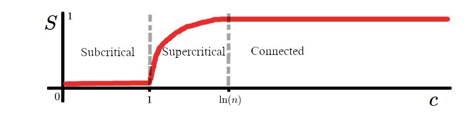

class: logo-slide

---

class: title-slide

## Network Models

### Applications of Data Science - Class 11

### Giora Simchoni

#### `gsimchoni@gmail.com and add #dsapps in subject`

### Stat. and OR Department, TAU
### `r Sys.Date()`

---
```{r child = '../setup.Rmd'}
```

```{python, echo=FALSE}
import pandas as pd
import networkx as nx
import matplotlib.pyplot as plt
import numpy as np

def degree_hist(G, xlabel='Degree', ylabel='Freq'):
  deg = [deg for node, deg in G.degree()]
  plt.hist(deg)
  plt.xlabel(xlabel, fontsize=16)
  plt.ylabel(ylabel, fontsize=16)

def degree_hist_with_pl_fit(G, alpha, dmin, xlabel='Degree', ylabel='%Freq or f(d)'):
  deg = [deg for node, deg in G.degree()]
  N, bins, patches = plt.hist(deg, density=True, bins=range(dmin, min(max(deg), 1000)))
  d = bins
  f_d = ((alpha-1)/dmin**alpha)*(d/dmin)**(-alpha)
  plt.plot(d, f_d, color='red')
  res = plt.ylim(0, np.max(N))
  plt.xlabel(xlabel, fontsize=16)
  plt.ylabel(ylabel, fontsize=16)

def degree_hist_with_pl_fit_log_log(G, alpha, dmin, xlabel='log(Degree)', ylabel='log(%Freq) or log(f(d))'):
  max_pow = 9
  deg = [deg for node, deg in G.degree() if deg > 0]
  N, bins = np.histogram(deg, bins = list(np.exp(np.arange(max_pow))))
  d = np.exp(np.arange(1, max_pow))
  f_d = ((alpha-1)/dmin)*(d/dmin)**(-alpha)
  plt.plot(np.arange(1, max_pow), np.log(N/len(deg)), 'bo')
  plt.plot(np.arange(1, max_pow), np.log(f_d), color='red')
  plt.xlabel(xlabel, fontsize=16)
  plt.ylabel(ylabel, fontsize=12)

def plot_lorenz_curve(P, W, WE, xlabel='P', ylabel='W'):
  plt.plot(P, W, linestyle=':')
  plt.plot(P, WE, color='red')
  plt.plot([0,1], [0,1], color='black', linestyle='--')
  plt.xlabel(xlabel, fontsize=16)
  plt.ylabel(ylabel, fontsize=16)
```

class: section-slide

# Motivation

---

### *Degree histograms* of 3 real networks:

- The cast of RuPaul's Drag Race Twitterverse
- The Israeli artists musical cooperations in the 21st century
- The Sci-Fi themed correlation network

```{python Degree-Hists, echo=FALSE, fig.asp=0.5, out.width="80%"}
rupaul = pd.read_csv('../data/queens_edges.csv')
Ru = nx.from_pandas_edgelist(rupaul, source='from', target='to', create_using=nx.Graph)
scifi_books = pd.read_csv('../data/sci_fi_final_edgelist.csv')
Sc = nx.from_pandas_edgelist(scifi_books, 'book', 'book2', ['corr'])
israeli_artists = pd.read_csv('../data/israeli_artists_coops.csv')
I = nx.from_pandas_edgelist(israeli_artists, 'from', 'to')


plt.gcf().subplots_adjust(bottom=0.15)
plt.subplot(1, 3, 1)
degree_hist(I, xlabel='')
plt.subplot(1, 3, 2)
degree_hist(Sc, ylabel='')
plt.subplot(1, 3, 3)
degree_hist(Ru, xlabel='', ylabel='')
plt.show()
```

.insight[
`r emo::ji("bulb")` Which is which?
]

---

### Why model networks?

- Know your network better:
  - how it was formed
  - what class it belongs to (clustering)
  - how and why it deviates from model
- Predict behavior in network:
  - epidemic spread/resistance
  - search
  - link prediction
  - node disambiguation
- Generalization
- Simulations and the ability to estimate metrics on huge networks
  
---

class: section-slide

# The Erdős–Rényi model .font80percent[(Random Graphs)]

---

## You know the ER model

In a $n$ nodes undirected network, suppose edges form identically and independently from each other.

Each possible edge is a Bernoulli trial with probability $p$.

Then the no. of edges $M$ is a Binomial RV $\sim Binom({n\choose 2},p)$

.insight[
`r emo::ji("bulb")` So what is $P(M=m)$? What is $E(M)$? What is $Var(M)$?
]

The $G(n, p)$ collection of all simple networks formed this way is the Erdős–Rényi model.

---

## Mean Degree

The mean number of edges is: $E(M)={n\choose 2}p$

We have defined the mean degree to be: $c = \frac{2m}{n}$, but now we treat $m$ as a RV, so the mean degree would be:

$c=E(D)=E(\frac{2M}{n})=\frac{2E(M)}{n}=\frac{2}{n}{n\choose 2}p=(n-1)p$

.insight[
`r emo::ji("bulb")` Say it in words, it makes sense.
]

But this implies we could have formulated the ER model slightly different:

Let $D$ be the degree of a particular node in an undirected network with $n$ nodes. Suppose each node "chooses" its neighbors with probability $p$, then:  $D\sim Binom(n-1,p)$

---

Estimating $n$, $p$ and $c$ from our networks:

```{python}
def estimate_p(m, n): return m / (n * (n - 1) / 2)
def estimate_c(G, l=1): return np.mean(np.array(list(dict(G.degree()).values()))**l)

n_isr, n_sci, n_ru = I.number_of_nodes(), Sc.number_of_nodes(), Ru.number_of_nodes()
m_isr, m_sci, m_ru = I.number_of_edges(), Sc.number_of_edges(), Ru.number_of_edges()
p_isr, p_sci, p_ru = estimate_p(m_isr, n_isr), estimate_p(m_sci, n_sci), estimate_p(m_ru, n_ru)
c_isr, c_sci, c_ru = estimate_c(I), estimate_c(Sc), estimate_c(Ru)

pd.DataFrame({
  'network': ['Israeli Artists', 'Sci-Fi Books', 'RuPaul Verse'],
  'n': [n_isr, n_sci, n_ru],
  'm': [m_isr, m_sci, m_ru],
  'p': [p_isr, p_sci, p_ru],
  'c': [c_isr, c_sci, c_ru]
})
```


---

## Degree Distribution

And since we're dealing with large *sparse* networks, we might mention that as $n\to\infty$ and $p$ is small, we expect the Binomial distribution to be approximated by the Poisson distribution, such that:

$D \sim Pois((n-1)p)$ or $D \sim Pois(c)$

Which is why the ER model is sometimes referred to as the Poisson random graph.

---

## ER model In NetworkX

```{python ER, out.width="50%"}
G = nx.erdos_renyi_graph(n = 100, p = 0.3)

plt.figure()
nx.draw_networkx(G)
plt.show()
```

---

```{python ER-Deg_Dist, out.width="50%"}
deg = [deg for node, deg in G.degree()]
h = plt.hist(deg)
plt.show()
```

.insight[
`r emo::ji("bulb")` Does this degree distribution resemble any of the distributions we've seen?
]

---

## Transitivity

$Transitivity(G)=\frac{\text{#closed triads}}{\text{#triads}}$

In other words it is the probability of two neighbors of the same node to also be connected.

.insight[
`r emo::ji("bulb")` What is that probability in the ER model? Reasonable?
]

```{python}
pd.DataFrame({'network': ['Israeli Artists', 'Sci-Fi Books', 'RuPaul Verse'],
  'n': [n_isr, n_sci, n_ru],
  'p': [p_isr, p_sci, p_ru],
  'transitivity': [nx.transitivity(I), nx.transitivity(Sc), nx.transitivity(Ru)]})
```

---

## Diameter

We have defined the diameter as the maximal shortest distance between any pair of nodes.

It turns out this has a nice expression in the ER model:

- Take a random node in a ER network, how many neighbors do you expect it to have?
- Take each one of these neighbors, and take each of *its* neighbors - what do you get?
- Do this $l$ times, what do you get? What would you get "in the end"?

The average path length from a node to all other nodes is $\sim \frac{\ln(n)}{\ln(c)}$.

Similarly one can show the diameter is $\sim \frac{\ln(n)}{\ln(c)}$

---

```{python}
d_isr = nx.diameter(I)
d_sci = nx.diameter(Sc)
d_ru = nx.diameter(Ru)

pd.DataFrame({
  'network': ['Israeli Artists', 'Sci-Fi Books', 'RuPaul Verse'],
  'n': [n_isr, n_sci, n_ru],
  'c': [c_isr, c_sci, c_ru],
  'ln(n)/ln(c)': [np.log(n_isr)/np.log(c_isr), np.log(n_sci)/np.log(c_sci), np.log(n_ru)/np.log(c_ru)],
  'd': [d_isr, d_sci, d_ru]
})
```

.insight[
`r emo::ji("bulb")` What famous phenomenon this could help explain?
]

---

## The Giant Component

.insight[
`r emo::ji("bulb")` What is the size of the largest component with $p=0$?

What is the size of the largest component with $p=1$?
]

```{python GCC-Size0, fig.show="hide"}
n = 100
s = []
for p in np.linspace(0, 1, 101):
  s_p = []
  for i in range(10):
    G = nx.erdos_renyi_graph(n = n, p = p)
    Gcc = sorted(nx.connected_components(G), key=len, reverse=True)
    Gcc_n = G.subgraph(Gcc[0]).number_of_nodes()
    s_p.append(Gcc_n / n)
  s.append(np.mean(s_p))

plt.plot(s, marker='*')
locs, labels = plt.xticks(np.linspace(0, 100, 11), np.round(np.linspace(0, 1, 11), 1))
plt.xlabel('p (where n = 100)')
plt.ylabel('GCC size S')
plt.show()
```

---

```{python GCC-Size, ref.label = "GCC-Size0", echo = FALSE, out.width = "50%"}

```

Surprisingly, for a given $n$, when $p$ is varied from 0 to 1, the giant component size $S$ suddenly "jumps"!

This is also true for a given $p$ as you increase $n$: imagine sitting at the comfort of your home watching your ER network form, when suddenly...

---

```{python GCC-Size2, echo=FALSE, out.width="50%"}
p = 0.1
s = []
for n in np.int8(np.linspace(10, 100, 100)):
  s_n = []
  for i in range(20):
    G = nx.erdos_renyi_graph(n = n, p = p)
    Gcc = sorted(nx.connected_components(G), key=len, reverse=True)
    Gcc_n = G.subgraph(Gcc[0]).number_of_nodes()
    s_n.append(Gcc_n / n)
  s.append(np.mean(s_n))

plt.plot(s, marker='*')
locs, labels = plt.xticks(np.linspace(0, 90, 10), np.int8(np.linspace(10, 100, 10)))
plt.xlabel('n (where p = 0.1)')
plt.ylabel('GCC size S')
plt.show()
```

Don't blink! Because there seems to be a *critical point*, a *transition point*, a *percolation point* where $S$ increases from 0 and finally reaches to 1 making your network fully connected.

---

### A slight wave of hands

$S$ is the probability of a node being connected to the GCC.

$S = P(\text{node i is connected to GCC})=$
$= 1-P(\text{node i is disconnected from GCC})=$
$= 1-P(\text{node i is disconnected from GCC via node j})^{n-1}$

For a given $i,j$:

$P(\text{node i is disconnected via node j})=$
$= P(\text{node i is disconnected with j}) +$
$P(\text{node i is connected with j but j is disconnected from GCC})=$
$= (1-p) + p(1-S) = 1-pS$

---

So:

$S = 1-(1-pS)^{n-1}$

And you can immediately tell finding a closed solution for $S$ would be hard.

Substituting $p=\frac{c}{n-1}$ where $c$ is the mean degree:

$S = 1-(1-\frac{c}{n-1}S)^{n-1}$

Recall that $e^x=\lim_{n\to \infty}(1+\frac {x}{n})^{n}$ so in the limit of $n$:

$S = 1-e^{-cS}$

Now there is no closed solution for $S$ but we can isolate $c=(n-1)p$:

$c=-\frac{\ln(1-S)}{S}$

---

```{python GCC-Size3, out.width="30%", echo=FALSE}
s = np.linspace(0, 1, 101)
plt.plot(s, -np.log(1-s)/s)
plt.xlabel("S", fontsize=16)
plt.ylabel("c", fontsize=16)
plt.show()
```

We can see that around $c=1$ (or $p=1/n$) the size of the GCC starts increasing .font80percent[(makes sense)].

It can be shown that around $c=\ln(n)$ (or $p=\frac{\ln(n)}{n}$) we expect the network to be fully connected.

.insight[
`r emo::ji("bulb")` So according to the ER model, for 1K nodes, a probability of 0.7% of an edge is enough to make the network connected. What do you think of that?
]

---

All of the 3 networks we've talked about are fully connected .font80percent[(though notice how the Israeli Artists and the Sci-Fi Books networks were created)].

But the model gives us a way of describing at what *stage* they are and how *robust* they are to node failures:

```{python}
pd.DataFrame({
  'network': ['Israeli Artists', 'Sci-Fi Books', 'RuPaul Verse'],
  'n': [n_isr, n_sci, n_ru],
  'c': [c_isr, c_sci, c_ru],
  'ln(n)': [np.log(n_isr), np.log(n_sci), np.log(n_ru)],
  'stage': ['supercritical', 'connected', 'connected']
})
```

---

## ER Model Summary

Models well:
- Diameter, average path length
- Giant Component, Percolation, Network Robustness

Does not model well:
- Degree distribution
- Transitivity (CC)
- Communities
- Homophily

---

class: section-slide

# The Power-Law Distribution

---

Let's see some larger real-life networks:

- The clients of a high-end Brazilian escort service, connected by whether they hired the same escort
- European cities, connected by whether a E-Road connects them
- Hyves - A Dutch social network

```{python, echo=FALSE}
# escort = pd.read_csv('../data/escort.csv', skiprows=24,
#   sep=';', header=None, usecols=[0,1], names=['escort_id', 'client_id'])
# E = nx.from_pandas_edgelist(escort, 'client_id', 'escort_id', create_using=nx.Graph)
# E = nx.bipartite.projected_graph(E, escort['client_id'].to_list())
# df = nx.to_pandas_edgelist(E, nodelist=E.nodes)
# df.to_csv('../data/escort_clients.csv')
# isolated_clients = [node for node, degree in E.degree() if degree == 0]
# pd.DataFrame({'isolated_client_id': isolated_clients}).to_csv('../data/escort_clients_isolated.csv')

escort = pd.read_csv('../data/escort_clients.csv')
isolated_clients = pd.read_csv('../data/escort_clients_isolated.csv')['isolated_client_id'].to_list()
E = nx.from_pandas_edgelist(escort)
E.add_nodes_from(isolated_clients)

hyves = pd.read_csv('../data/hyves.zip', skiprows=1, sep=' ', names=['source', 'target'], usecols=[0, 1])
H =nx.from_pandas_edgelist(hyves)

euroroad = pd.read_csv('../data/euroroad.net', skiprows=1185, sep=' ', names=['source', 'target'], header=None)
Euro =nx.from_pandas_edgelist(euroroad)
```

```{python, echo=FALSE}
def size_of_GCC(G): return round(len(max(nx.connected_components(G), key=len))/G.number_of_nodes(), 2)

n_e, n_eu, n_h = E.number_of_nodes(), Euro.number_of_nodes(), H.number_of_nodes()
m_e, m_eu, m_h = E.number_of_edges(), Euro.number_of_edges(), H.number_of_edges()
p_e, p_eu, p_h = estimate_p(m_e, n_e), estimate_p(m_eu, n_eu), estimate_p(m_h, n_h)
c_e, c_eu, c_h = estimate_c(E), estimate_c(Euro), estimate_c(H)
S_e, S_eu, S_h = size_of_GCC(E), size_of_GCC(Euro), size_of_GCC(H)

pd.DataFrame({
  'network': ['Escort', 'EuroRoad', 'Hyves'],
  'n': [n_e, n_eu, n_h],
  'm': [m_e, m_eu, m_h],
  'p': [p_e, p_eu, p_h],
  'c': [c_e, c_eu, c_h],
  'S': [S_e, S_eu, S_h]
})
```

---

### Degree histograms

```{python Degree-Hists2, echo=FALSE, fig.asp=0.5, out.width="80%"}
plt.figure()
plt.gcf().subplots_adjust(bottom=0.15)
plt.subplot(1, 3, 1)
degree_hist(E, xlabel='')
plt.subplot(1, 3, 2)
degree_hist(Euro, ylabel='')
plt.subplot(1, 3, 3)
degree_hist(H, xlabel='', ylabel='')
plt.show()
```

One of the main shortcomings of the ER model is that none of these look even remotely Poisson.

---

## Power Law

If $X \sim PL(\alpha, x_\text{min})$, then:

$f(x) = Cx^{-\alpha}\space\mbox{for}\ x\ge x_\text{min}>0;\alpha>1$

where $C=\frac{\alpha - 1}{x^{1-\alpha}_\text{min}}$

and we can write: $f(x)=\frac{\alpha-1}{x_\text{min}}(\frac{x}{x_\text{min}})^{-\alpha}$

.insight[
`r emo::ji("bulb")` What do you need to check in order to verify this is a proper density function?
]

---

The CDF of $X$:

$F_X(x)=\int_{-\infty}^x f(x)dx=C\int_{x_{\text{min}}}^x x^{-\alpha}dx=C \cdot [\frac{x^{1-\alpha}}{1-\alpha}]^x_{x_{\text{min}}}=$
$\frac{\alpha - 1}{x^{1-\alpha}_\text{min}}[\frac{x^{1-\alpha}}{1-\alpha}-\frac{x_{\text{min}}^{1-\alpha}}{1-\alpha}]=1-(\frac{x}{x_{\text{min}}})^{1-\alpha}$

The Expectation of $X$:

$E(X)=\int_{-\infty}^{\infty} xf(x)dx=C\int_{x_{\text{min}}}^{\infty} x^{1-\alpha}dx=\frac{\alpha - 1}{x^{1-\alpha}_\text{min}}[\frac{x^{2-\alpha}}{2-\alpha}]^{\infty}_{x_\text{min}}=x_\text{min}(\frac{\alpha-1}{\alpha-2})$

Where $E(X)$ converges only if $\alpha>2$.

The MLE for $\alpha$ is: $\hat\alpha=1+\frac{n}{\sum_i\ln(\frac{x_i}{x_\text{min}})}$

.warning[
`r emo::ji("bulb")` The estimate for $x_\text{min}$ is not simply $min(X)$! With empirical data it is best advised to first estimate $x_\text{min}$, i.e. from *where* the distribution behaves like PL. See [Clauset et. al.](https://arxiv.org/abs/0706.1062) article and the [powerlaw](https://github.com/jeffalstott/powerlaw) library.
]

---

### Fitting the PL to our networks

```{python}
def fit_pl(G):
  degree_seq = np.array(list(dict(G.degree()).values()))
  n = G.number_of_nodes()
  # estimating d_min as min(d) is NOT right!
  d_min = np.min(degree_seq)
  if d_min == 0:
    d_min = 1
    degree_seq = degree_seq[degree_seq >= 1]
    n = len(degree_seq)
  alpha = 1 + n/np.sum(np.log(degree_seq/d_min))
  davg = np.mean(degree_seq)
  Ed = d_min * (alpha - 1)/(alpha - 2) if alpha > 2 else np.inf
  dvar = np.var(degree_seq)
  Ed2 = d_min**2 * (alpha - 1)/(alpha - 3) if alpha > 3 else np.inf
  Vd = Ed2 - (Ed)**2 if alpha > 3 else np.inf
  return d_min, alpha, davg, Ed, dvar, Vd
```

---

```{python}
dmin_e, alpha_e, davg_e, Ed_e, dvar_e, Vd_e = fit_pl(E)
dmin_eu, alpha_eu, davg_eu, Ed_eu, dvar_eu, Vd_eu = fit_pl(Euro)
dmin_h, alpha_h, davg_h, Ed_h, dvar_h, Vd_h = fit_pl(H)

pd.DataFrame({
  'network': ['Escort', 'EuroRoad', 'Hyves'],
  'dmin': [dmin_e, dmin_eu, dmin_h],
  'alpha': [alpha_e, alpha_eu, alpha_h],
  'Avg(d)': [davg_e, davg_eu, davg_h],
  'E(d)': [Ed_e, Ed_eu, Ed_h],
  'Var(d)': [dvar_e, dvar_eu, dvar_h],
  'V(d)': [Vd_e, Vd_eu, Vd_h],
})
```

---

```{python Degree-Hists3, echo=FALSE, fig.asp=0.5, out.width="100%"}
res = plt.figure()
plt.gcf().subplots_adjust(bottom=0.15)
res = plt.subplot(1, 3, 1)
degree_hist_with_pl_fit(E, alpha_e, dmin_e, xlabel='')
res = plt.subplot(1, 3, 2)
degree_hist_with_pl_fit(Euro, alpha_eu, dmin_eu, ylabel='')
res = plt.subplot(1, 3, 3)
degree_hist_with_pl_fit(H, alpha_h, dmin_h, xlabel='', ylabel='')
plt.show()
```

---

### Why do we like the Power Law distribution so much?

- scale invariance
- heavy tail
- the 80/20 (Pareto) rule

---

### Scale Invariance

If we multiply $X$ by constant $m$ the density "scales":

$f(mx)=C(mx)^{-\alpha}=Cm^{-\alpha}x^{-\alpha}=C'x^{-\alpha}\propto f(x)$

Thus, $mX$ will distribute Power-Law with the same $\alpha$ parameter and a different constant.

.insight[
`r emo::ji("bulb")` How would $mX$ distribute if $X$ distributed Normal? Exponential?
]

---

Meaning, the relative likelihood between small and large events is the same, no matter what choice of "small" we make:

```{r Scale-Invariance, echo=FALSE, out.width="80%", fig.asp=0.5}
x <- seq(1, 10, 0.1)
par(mfcol = c(1, 2))
plot(x, (2.5-1)/1 * (x/1)^(-2.5), type = "l", ylab = "f(mx)", main="Power Law (alpha=2.5)")
lines(x, (2.5-1)/1 * (x/1)^(-2.5)*(2^(-2.5)), col="red")
lines(x, (2.5-1)/1 * (x/1)^(-2.5)*(3^(-2.5)), col="green")
legend("topright", legend = paste0("m=", 1:3), col = 1:3, lty = 1)
plot(x, exp(-x), type = "l", xlab = "x", ylab = "f(mx)", main="Exponential (lambda=1)")
lines(x, (1/2)*exp(-x/2), col="red")
lines(x, (1/3)*exp(-x/3), col="green")
legend("topright", legend = paste0("m=", 1:3), col = 1:3, lty = 1)
```

---

Another way of seeing this:

If we take the log transformation of the Power-Law distribution we get:

$\ln(f(x))=\ln(Cx^{-\alpha})=\ln(C)-\alpha\ln(x)$

Thus the log-log plot of Power-Law should show a straight line with slope $-\alpha$, and multiplying by $m$ only changes the intercept.

```{r Scale-Invariance2, echo=FALSE, out.width="80%", fig.asp=0.5}
x <- seq(1, 10, 0.1)
par(mfcol = c(1, 2))
plot(x, (2.5-1)/1 * (x/1)^(-2.5), type = "l", ylab = "f(mx)", xlab = "x")
lines(x, (2.5-1)/1 * (x/1)^(-2.5)*(2^(-2.5)), col="red")
lines(x, (2.5-1)/1 * (x/1)^(-2.5)*(3^(-2.5)), col="green")
legend("topright", legend = paste0("m=", 1:3), col = 1:3, lty = 1)
plot(log(x), log((2.5-1)/1 * (x/1)^(-2.5)), type = "l", xlab = "ln(x)", ylab = "ln(f(mx))")
lines(log(x), log((2.5-1)/1 * (x/1)^(-2.5)*(2^(-2.5))), col="red")
lines(log(x), log((2.5-1)/1 * (x/1)^(-2.5)*(3^(-2.5))), col="green")
legend("topright", legend = paste0("m=", 1:3), col = 1:3, lty = 1)
```

---

Seeing the log-log transformation with our distributions should also result in a straight line with a slope roughly $-\alpha$:

```{python Degree-Hists4, echo=FALSE, fig.asp=0.5, out.width="100%"}
res = plt.figure()
plt.gcf().subplots_adjust(bottom=0.15)
res = plt.subplot(1, 3, 1)
degree_hist_with_pl_fit_log_log(E, alpha_e, dmin_e, xlabel='')
res = plt.subplot(1, 3, 2)
degree_hist_with_pl_fit_log_log(Euro, alpha_eu, dmin_eu, ylabel='')
res = plt.subplot(1, 3, 3)
degree_hist_with_pl_fit_log_log(H, alpha_h, dmin_h, xlabel='', ylabel='')
plt.show()
```

`r emo::ji("sad")`

---

### Do not estimate $\alpha$ from log-log plots

This does not look "good" for a few reasons:
- $n$, choice of log
- We did not estimate $x_\text{min}$ correctly (and therefor $\alpha$), using simply the minimum degree
- log-log plots, even when done right, are misleading, do not extrapolate $\alpha$ out of them
- Maybe the PL fit is useful but just not right

---

### Heavy Tail

The $k$-th moment of the PL distribution converges only for $k < \lfloor{\alpha-1}\rfloor$:

$E(X^k)=\int_{x_\text{min}}^{\infty}x^kf(x)dx=\frac{\alpha-1}{x^{1-\alpha}_\text{min}}\int_{x_\text{min}}^{\infty}x^{k-\alpha}dx=x^k_\text{min}(\frac{\alpha-1}{\alpha-1-k})$

- For $1<\alpha\le2$ the mean is infinite (and all higher moments)
- For $2<\alpha\le3$ the mean is finite but the variance is infinite

As a result, the PL distribution is very good for modeling extreme distributions, where we *expect* extreme values, as opposed to e.g. the Normal distribution.

Also, if we sample from a typical PL distribution with $2<\alpha<3$ the value could be "anywhere" and isn't confined by a scale parameter

.insight[
`r emo::ji("bulb")` When sampling from a Normal distribution, we can expect in 95% of cases...
]

---

For example, here is a [post](http://giorasimchoni.com/2019/03/04/2019-03-04-on-fechner-weber-whorf-zipf-and-pareto/) of mine, showing how the PL distribution is much more suitable for modeling how words are distributed in a large corpus of text such as Wikipedia, in comparison with the Exponential distribution, both fitted via MLE:


---

Another nice way of showing this is comparing $1-F_X(x)$ under the PL distribution vs. $1-F_X(x)$ under the Exponential distribution for suitable values of $\alpha$ and $\lambda$:


---

### 80/20 (Pareto) Rule

The Pareto rule says that "80% of the wealth is in the hands of the richest 20% of people".

But the Pareto distribution is just a different formulation of the Power Law distribution, and this phenomenon is indeed characteristic to the PL distribution.

If $X$ is "wealth" and we want to know what is the probability of being "wealthy", i.e. the part *of population* which holds at least $m$ wealth:

$P(X)=P(X>m)=1-F_X(m)=(\frac{m}{x_\text{min}})^{1-\alpha}$

The part *of wealth* that those "wealthy" have is the division of expectations:

$W(X) = \frac{E(X > m)}{E(X)}=\frac{\int_{m}^{\infty}xCx^{-\alpha}dx}{x_\text{min}(\frac{\alpha-1}{\alpha-2})}=(\frac{m}{x_\text{min}})^{2-\alpha}$

---

So, being wealthy isn't dependent on $m$, only on $\alpha$:

$W(X)=P(X)^{\frac{\alpha-2}{\alpha-1}}$

And this is how we get to the 80/20 rule without defining what wealthy is, the Lorenz curve:


.insight[
`r emo::ji("bulb")` The dashed line shows the empirical Lorenz curve for the wealthiest individuals in the USA (data from the Forbes, 2003)!
]

---

```{python}
def lorenz_curve(G, alpha):
  deg = [deg for node, deg in G.degree()]
  deg_sorted = np.array(sorted(deg, reverse=True))
  W = deg_sorted.cumsum() / deg_sorted.sum()
  P = np.linspace(0.0, 1.0, W.size)
  alpha = alpha if alpha > 2 else 2.2
  WE = P**((alpha-2)/(alpha-1))
  return P, W, WE
P_e, W_e, WE_e = lorenz_curve(E, alpha_e)
P_eu, W_eu, WE_eu = lorenz_curve(Euro, alpha_eu)
P_h, W_h, WE_h = lorenz_curve(H, alpha_h)
```

```{python Lorenz-Curves, echo=FALSE, fig.asp=0.5, out.width="90%"}
res = plt.figure()
plt.gcf().subplots_adjust(bottom=0.15)
res = plt.subplot(1, 3, 1)
plot_lorenz_curve(P_e, W_e, WE_e, xlabel='')
res = plt.subplot(1, 3, 2)
plot_lorenz_curve(P_eu, W_eu, WE_eu, ylabel='')
res = plt.subplot(1, 3, 3)
plot_lorenz_curve(P_h, W_h, WE_h, xlabel='', ylabel='')
plt.show()
```

---

## Nice, but. 

So we agree many large networks degree distributions behave Power-Law.

- That is not a model of a how a network was formed, what process causes "scale-free" networks?
- How do all *other* network metrics behave? Do we see improvement where the ER model did not make sense?

---

class: section-slide

# The Configuration Model

---

### Scenario 1

- We have a sequence of each node's degree: ${k_1, ..., k_n}$
- Each node is given a number of "stubs" of edges equal to its required degree.
- Choose a random pair of stubs, connect.
- From the stubs left, choose another random pair, connect.
- Repeat until all stubs are left.


---

### Scenario 2:

- We have a degree *distribution*: ${k_1:p_{k_1}, ..., k_m: p_{k_m}}$ where $\sum_{i=1}^{m}p_{k_i}=1$
- We sample $n$ degrees from this distribution and continue as usual.

.insight[
`r emo::ji("bulb")` What if $p_{k_i}$ is Poisson? What if it is Power-Law?
]

Finally notice that as with the ER model, we get a *distribution* of networks from every sequence or degree-distribution specified. And this distribution of networks is Uniform!

---

### Two issues

.insight[
`r emo::ji("bulb")` Try building a network with degree sequence $\{1,2,2\}$
]

1. If $m$ is no. of edges $\sum_i k_i = 2m$ --> the sum of degrees must be even! Even those sampled from $p_{k_i}$

2. Nothing preventing connecting two of node $i$'s stubs together
Nothing preventing connecting nodes $i$ and $j$ more than once
--> Self-edges and multi-edges are possible! .font80percent[(But with large n chances are small)]

---

## Configuration model In NetworkX

```{python Configuration, out.width="50%"}
G = nx.configuration_model([1,2,3,4,6])
print(G.degree())
nx.draw_networkx(G)
plt.show()
```

Unfortunately matplotlib cannot draw self edges easily `r emo::ji("swearing")`

---

Again:

```{python Configuration2, out.width="50%"}
G = nx.configuration_model([1,2,3,4,6])
nx.draw_networkx(G)
plt.show()
```

Each such graph is a sample from the same sequence/distribution of degrees.

---

## Transitivity

It can be shown that the Clustering Coefficient can be defined via the degree distribution moments:

$Transitivity(G_{Conf})=\frac{1}{n}\frac{[E(D^2) - E(D)]^2}{E(D)^3}$

Which can be estimated by: $\frac{1}{n}\frac{[\overline{D^2} - \overline D]^2}{\overline D^3}$

In the case $D_G \sim Pois(\lambda)$:

$Transitivity(G_{Conf})=\frac{1}{n}\frac{[\lambda + \lambda^2 - \lambda]^2}{\lambda^3}=\frac{\lambda}{n}$

But $\lambda \approx np$ under the ER model, so we get the original estimate: $Transitivity(G_{Conf})=p$

---

In the case $D_G \sim PL(\alpha,d_\text{min})$, notice this estimate will only be valid if $\alpha>3$, otherwise the second moment does not converge:

$Transitivity(G_{Conf})=\frac{1}{nx_\text{min}}[\frac{\alpha-2}{\alpha-1}](x_\text{min}[\frac{\alpha-2 }{\alpha-3}]-1)^2$

So we now have a way of seeing the actual Transitivity of our networks, vs. a theoretical result of two models:

```{python}
def transitivity_conf(G):
  D = estimate_c(G, l=1)
  D2 = estimate_c(G, l=2)
  n = G.number_of_nodes()
  return (1/n)*((D2-D)**2/(D**3))

def transitivity_pl_theoretical(n, alpha, dmin):
  if dmin > 0 and alpha > 3:
    return (1/(alpha*dmin)) * ((alpha-2)/(alpha-1)) * (dmin*(alpha-2)/(alpha-3)-1)**2
  else:
    return np.nan
```

---

```{python}
tc_e = transitivity_conf(E); tpl_e = transitivity_pl_theoretical(n_e, alpha_e, dmin_e)
tc_eu = transitivity_conf(Euro); tpl_eu = transitivity_pl_theoretical(n_eu, alpha_eu, dmin_eu)
tc_h = transitivity_conf(H); tpl_h = transitivity_pl_theoretical(n_h, alpha_h, dmin_h)

pd.DataFrame({
  'network': ['Escort', 'EuroRoad', 'Hyves'],
  'Trans_actual': [0.377628, nx.transitivity(Euro), 0.001559],
  'Trans_ER': [p_e, p_eu, p_h],
  'Trans_conf': [tc_e, tc_eu, tc_h],
  'Trans_pl_theoretical': [tpl_e, tpl_eu, tpl_h]})
```

- The Configuration model is (maybe) slightly better than ER in estimating Transitivity
- For large networks I input the actual Transitivity (too long! that's why we need an estimator)
- But it seems that with these types of Random Graphs models, estimating Transitivity is hard

---

## Diameter

It can be shown that the maximal shortest distance between any pair of nodes in the Configuration model is:

$Diameter(G_{Conf})=\frac{\ln(n)}{\ln(\frac{E(D^2)-E(D)}{E(D)})}$

Which can be estimated by: $\frac{\ln(n)}{\ln(\frac{\overline{D^2}- \overline D}{\overline D})}$

In the case $D_G \sim Pois(\lambda)$:

$Diameter(G_{Conf})=\frac{\ln(n)}{\ln(\frac{\lambda + \lambda^2- \lambda}{\lambda})}=\frac{\ln(n)}{\ln(\lambda)}$

But $\lambda \approx np \approx c$ under the ER model, so we get the original number: $Diameter(G_{Conf})=\frac{\ln(n)}{\ln(c)}$

---

In the case $D_G \sim PL(\alpha,d_\text{min})$, again this estimate is only valid if $\alpha>3$, otherwise the second moment does not converge:

$Diameter(G_{Conf})=\frac{\ln(n)}{\ln(x_\text{min}[\frac{\alpha-2}{\alpha-3}]-1)}$

```{python}
def diameter_conf(G):
  D = estimate_c(G, l=1)
  D2 = estimate_c(G, l=2)
  n = G.number_of_nodes()
  return np.log(n) / np.log((D2-D)/D)

def diameter_pl_theoretical(n, alpha, dmin):
  if dmin > 0 and alpha > 3:
    return np.log(n) / np.log(dmin * (alpha - 2)/(alpha - 3) - 1)
  else:
    return np.nan
```

---

```{python}
dc_e = diameter_conf(E); dpl_e = diameter_pl_theoretical(n_e, alpha_e, dmin_e)
dc_eu = diameter_conf(Euro); dpl_eu = diameter_pl_theoretical(n_eu, alpha_eu, dmin_eu)
dc_h = diameter_conf(H); dpl_h = diameter_pl_theoretical(n_h, alpha_h, dmin_h)

pd.DataFrame({
  'network': ['Escort', 'EuroRoad', 'Hyves'],
  'Diameter_actual': ['8*', '62*', 10],
  'Diameter_ER': [np.log(n_e)/np.log(c_e), np.log(n_eu)/np.log(c_eu), np.log(n_h)/np.log(c_h)],
  'Diameter_conf': [dc_e, dc_eu, dc_h],
})
```

---

## The Giant Component

In the ER model we found:



.insight[
`r emo::ji("bulb")` What is the maximum value $c$ can reach?
]

In the Configuration model we find a similar pattern. It can be shown that once $E(D^2)>2E(D)$ (estimated by $\overline{D^2}>2\overline{D}$) the giant component starts forming, until the network is fully connected.

---

In the case $D_G \sim Pois(\lambda)$ this means $\lambda > 1$ but again we note $\lambda=c$ and this is the original ER critical point.

In the case $D_G \sim PL(\alpha,d_\text{min})$ it can be shown the critical point is determined by $\alpha$ and $d_\text{min}$. But for a pure PL distribution one can show:

- for $\alpha > 3.478$ we would expect a subcritical phase and no giant component
- once $\alpha<3.478$ (critical point) the giant component starts to emerge
- for $2<\alpha\le3$ the second moment is infinite, the first moment is finite and so the $E(D^2)>2E(D)$ definitely holds an we are still in the supercritical phase
- for $\alpha<2$ the network is fully connected

---

## Configuration Model Summary

Models well:
- Diameter, average path length
- Giant Component, Percolation, Network Robustness
- Degree Distribution

Does not model well:
- Transitivity (CC)
- Communities
- Homophily

---

### Why model networks?

- Know your network better:
  - how it was formed
  - what class it belongs to (clustering)
  - how and why it deviates from model
- Predict behavior in network:
  - epidemic spread/resistance
  - search
  - link prediction
  - node disambiguation
- Generalization
- Simulations and the ability to estimate metrics on huge networks
