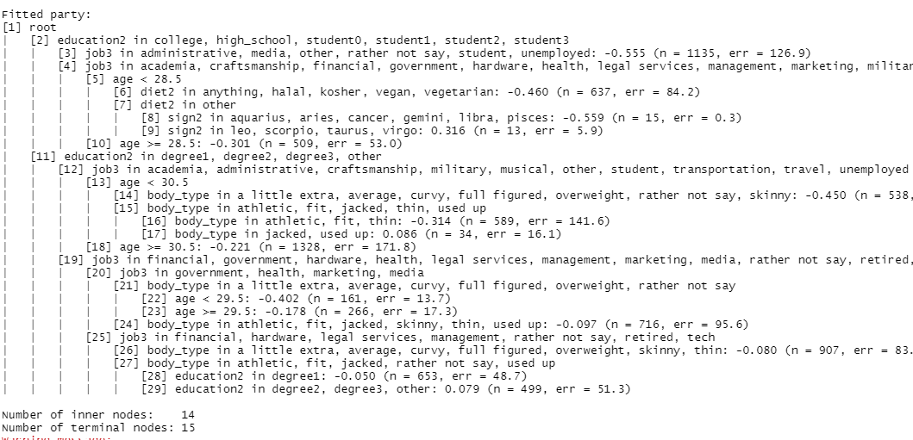
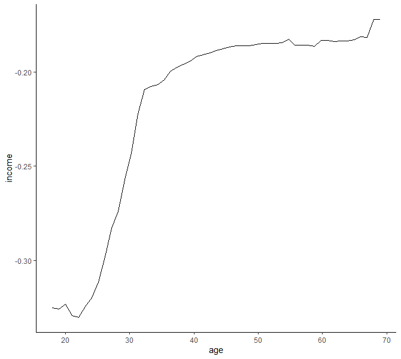

class: logo-slide

---

class: title-slide

## The Trees

### Applications of Data Science - Class 12

### Giora Simchoni

#### `gsimchoni@gmail.com and add #dsapps in subject`

### Stat. and OR Department, TAU
### `r Sys.Date()`

---
```{r child = "../setup.Rmd"}
```

```{r packages, echo=FALSE, message=FALSE, warning=FALSE}
library(tidyverse)
```

class: section-slide

# The Pros and Cons of Trees

---

## Pros

- It's just a set of if-else statements my 7 y/o can get
- Highly interpretable (when tree is not large)
- Easy to implement
- Fast? (to predict)
- Little pre-processing of predictors needed
- Handle all types of predictors (continuous, categorical)
- Handle missing data, *predict* missing data
- Assumption free
- Feature selection built-in (but when predictors are correlated...)
- Low bias, in general

---

## Cons

- High variance, in general
- Rectangular predictor regions - not always a good thing
- Complexity of prediction limited in no. of leaves! (For a simple CART)
- Not so fast? (to train)
- Greedy
- Selection Bias of predictors with more distinct values?
- Variable Importance when predictors are correlated

---

class: section-slide

# Detour: A Regression Problem

---

### OKCupid: Predicting Annual Income

It won't be easy:

```{r, message=FALSE}
okcupid <- read_csv("../data/okcupid.csv.zip")

okcupid %>% count(income, sort = TRUE) %>% head(20)
```

---

We will stick to non-NA (income) observations, and predict $\log_{10}(income/100000)$:

```{r, warning=FALSE}
okcupid2 <- okcupid %>%
  mutate(income = ifelse(income == -1, NA, log10(income/100000))) %>%
  drop_na(income)
```

```{r, echo=FALSE}
ethnicities_keep <- c("white", "asian", "hispanic / latin", "black", "indian", "pacific islander", "middle eastern", "native american")
not_perfect <- c("a little extra", "average", "curvy", "full figured", "overweight", "rather not say")
signs <- c("leo", "libra", "cancer", "virgo", "scorpio", "gemini", "taurus", "aries", "pisces", "aquarius", "sagittarius", "capricorn")
job_underpaid <- c("administrative", "media", "other", "rather not say", "student", "unemployed")
narrow_category <- function(category, sep = " ") {
  if (is.na(category)) return(NA_character_)
  split_diet <- str_split(category, sep)
  if (length(split_diet[[1]]) == 1) return(category)
  return(split_diet[[1]][2])
}
okcupid2 <- okcupid2 %>%
  mutate(height_cm = 2.54 * height,
         religion2 = case_when(
           str_detect(religion, "agnosticism") | str_detect(religion, "atheism") ~ "atheist",
           str_detect(religion, "buddhism") ~ "buddhist",
           str_detect(religion, "christianity") | str_detect(religion, "catholicism") ~ "christian",
           str_detect(religion, "judaism") ~ "jewish",
           str_detect(religion, "hinduism") ~ "hindu",
           str_detect(religion, "islam") ~ "muslim",
           TRUE ~ NA_character_),
         education_kind = case_when(
           str_detect(education, "^dropped") ~ "dropped",
           str_detect(education, "^graduated") ~ "graduated",
           str_detect(education, "^working") ~ "working",
           TRUE ~ "other"),
         ethnicity2 = ifelse(ethnicity %in% ethnicities_keep, ethnicity, "other"),
         part_black = str_detect(ethnicity, "black"),
         part_white = str_detect(ethnicity, "white"),
         part_asian = str_detect(ethnicity, "asian"),
         part_hispanic = str_detect(ethnicity, "hispanic"),
         body_type_not_perfect = body_type %in% not_perfect,
         diet2 = map_chr(diet, narrow_category),
         location_sf = location == "san francisco, california",
         pets_has_dogs = str_detect(pets, "has dogs"),
         pets_has_cats = str_detect(pets, "has cats"),
         pets_likes_dogs = str_detect(pets, "likes dogs"),
         pets_likes_cats = str_detect(pets, "likes cats"),
         sign_fun = str_detect(sign, "fun"),
         sign_not_matter = str_detect(sign, "but it does"),
         sign_matters = str_detect(sign, "matters"),
         sign2 = str_extract(sign, str_c(signs, collapse = "|")),
         speaks_spanish = str_detect(speaks, "spanish"),
         speaks_french = str_detect(speaks, "french"),
         speaks_german = str_detect(speaks, "german"),
         speaks_chinese = str_detect(speaks, "chinese"),
         education2 = case_when(
           education == "graduated from high school" ~ "high_school",
           education == "graduated from two-year college" ~ "college",
           education == "graduated from college/university" ~ "degree1",
           education == "graduated from masters program" ~ "degree2",
           education == "graduated from ph.d program" ~ "degree3",
           education == "working on two-year college" ~ "student0",
           education == "working on college/university" ~ "student1",
           education == "working on masters program" ~ "student2",
           education == "working on ph.d program" ~ "student3",
           is.na(education) ~ NA_character_,
           TRUE ~ "other"
         ),
         education_academic = education2 %in% c("degree1", "degree2", "degree3", "student2", "student3"),
         status = ifelse(status == "unknown", NA_character_, status),
         job2 = map_chr(job, narrow_category, sep = " / "),
         job3 = case_when(
           is.na(job2) ~ "other",
           TRUE ~ job2
         ),
         job_underpaid = job2 %in% job_underpaid) %>%
  mutate_at(vars(essay0:essay9), list("len" = ~log(str_length(.x) + 0.016))) %>%
  mutate_if(is.character, as.factor) %>%
  mutate_if(is.logical, as.factor)

predictors <- c("age", "height_cm", "sex", "body_type", "body_type_not_perfect",
                "diet2", "drinks", "drugs", "religion2",
                "education2" ,"education_kind", "education_academic",
                "ethnicity2", "part_black", "part_white",
                "part_asian", "part_hispanic", "job3",
                "orientation", "pets_has_dogs", "pets_has_cats", "pets_likes_cats",
                "pets_likes_dogs", "sign_fun", "sign_not_matter", "sign_matters",
                "sign2", "speaks_spanish", "speaks_french", "speaks_german",
                "speaks_chinese", "status",
                "essay0_len", "essay1_len", "essay2_len", "essay3_len", "essay4_len",
                "essay5_len", "essay6_len", "essay7_len", "essay8_len", "essay9_len")
```

In the vector `predictors` .font80percent[(see slides Rmd source)] we have `r length(predictors)` continuous and categorical variables which may or may not be predictive to income:

```{r}
okcupid2 <- okcupid2 %>%
  select(income, all_of(predictors)) %>%
  mutate(id = 1:n())

dim(okcupid2)
```

---

```{r}
glimpse(okcupid2)
```

---

We split the data into training, validation and test sets:

```{r, message=FALSE, warning=FALSE}
# test_idx <- sample(1:nrow(okcupid2), 2000, replace = FALSE)
# train_idx <- okcupid2 %>% filter(!id %in% test_idx) %>% sample_n(8000) %>% pull(id)
# valid_idx <- okcupid2 %>% filter(!id %in% test_idx, !id %in% train_idx) %>% pull(id)
okcupid2 <- okcupid2 %>% select(-id)

idx <- read_rds("../data/okcupid2_idx.rda")
train_idx <- idx$train_idx
valid_idx <- idx$valid_idx
test_idx <- idx$test_idx

okcupid2_train <- okcupid2[train_idx, ]
okcupid2_valid <- okcupid2[valid_idx, ]
okcupid2_test <- okcupid2[test_idx, ]

library(glue)
glue("train no. of rows: {nrow(okcupid2_train)}
     validation no. of rows: {nrow(okcupid2_valid)}
     test no. of rows: {nrow(okcupid2_test)}")
```

---

Our transformed income dependent variable behaves "ok":

```{r Income-Hist, message=FALSE, out.width="100%", fig.asp=0.5}
ggplot(okcupid2_train, aes(income)) +
  geom_histogram(fill = "red", alpha = 0.5) +
  theme_classic()
```

---

We can quickly see percentage of missing values with [`naniar`](http://naniar.njtierney.com/):

```{r Missingness, warning=FALSE, out.width="100%", fig.asp=0.5}
library(naniar)

vis_miss(okcupid2_train %>%
           sample_frac(0.2) %>%
           select(-starts_with("essay")))
```

---

Also worth exploring some basic relations between predictors and income. You can use the work of others, e.g. [`ggpairs`](https://ggobi.github.io/ggally/):

```{r GGPairs, warning=FALSE, message=FALSE, out.width="100%", fig.asp=0.5}
library(GGally)

ggpairs(okcupid2_train %>%
          select(income, age, sex, height_cm, body_type_not_perfect))
```

---

But don't be ashamed of simply exploring on your own:

```{r}
var_vs_income_boxplot <- function(var) {
  ggplot(okcupid2_train, aes({{var}}, income)) +
  geom_boxplot() +
  facet_wrap(~ sex) +
  theme_classic() +
  labs(x = "") +
  theme(axis.text.x = element_text(angle = 90, hjust = 1, vjust = 0.5))
}
```

---

```{r Body_Type-Income, out.width="100%", fig.asp=0.5}
var_vs_income_boxplot(body_type)
```

---

```{r Sign-Income, out.width="100%", fig.asp=0.5}
var_vs_income_boxplot(sign2)
```

---

```{r Job-Income, out.width="100%", fig.asp=0.5}
var_vs_income_boxplot(job3)
```

---

```{r Edu-Income, out.width="100%", fig.asp=0.5}
var_vs_income_boxplot(education2)
```

---

```{r Religion-Income, out.width="100%", fig.asp=0.5}
var_vs_income_boxplot(religion2)
```

---

```{r Diet-Income, out.width="100%", fig.asp=0.5}
var_vs_income_boxplot(diet2)
```

---

```{r Essay-Income, warning=FALSE, message=FALSE, out.width="100%", fig.asp=0.5}
ggpairs(okcupid2_train %>%
          select(essay0_len:essay2_len, income))
```

---

### Baseline: Linear Regression

R's `lm` function does not take `NA` values.

One strategy is to impute these values using a "common" value such as the median for continuous variables and mode for categorical variables. This can easily be achieved with `naniar`:

```{r}
okcupid2_imp <- naniar::impute_median_all(okcupid2)
okcupid2_imp_train <- okcupid2_imp[train_idx, ]
okcupid2_imp_valid <- okcupid2_imp[valid_idx, ]

mod_lm <- lm(income ~ ., data = okcupid2_imp_train)
pred_lm <- predict(mod_lm, okcupid2_imp_valid)

rmse <- function(obs, pred) sqrt(mean((obs - pred)^2))

report_rmse_and_cor <- function(obs, pred) {
  RMSE <- rmse(obs, pred)
  CORR <- cor(obs, pred)
  glue("RMSE: {format(RMSE, digits = 3)}
       CORR: {format(CORR, digits = 3)}")
}
```

---

```{r}
report_rmse_and_cor(okcupid2_valid$income, pred_lm)
```

```{r LM-Fit1, out.width="50%", warning=FALSE}
tibble(income = okcupid2_valid$income, pred = pred_lm) %>%
  ggplot(aes(income, pred)) + geom_point() + ylim(range(okcupid2_valid$income))
```

---

A more intelligent strategy for imputing missing values would be to *predict* them using whatever data is not missing. This can be done quite seamlessly with the [`mice`](https://stefvanbuuren.name/mice/) package:

```{r, message=FALSE}
# library(mice)
# mice_obj <- mice(okcupid2, m = 1, maxit = 10, seed = 42)
# okcupid2_imp_mice <- complete(mice_obj)

okcupid2_imp_mice <- read_rds("../data/okcupid2_imp_mice.rds")
okcupid2_imp_mice_train <- okcupid2_imp_mice[train_idx, ]
okcupid2_imp_mice_valid <- okcupid2_imp_mice[valid_idx, ]

mod_lm_mice <- lm(income ~ ., data = okcupid2_imp_mice_train)
pred_lm_mice <- predict(mod_lm_mice, okcupid2_imp_mice_valid)

report_rmse_and_cor(okcupid2_valid$income, pred_lm_mice)
```

.insight[
`r emo::ji("bulb")` Can you think of other imputation strategies?
]

---

```{r LM-Fit2, out.width="60%", warning=FALSE}
tibble(income = okcupid2_valid$income, pred = pred_lm_mice) %>%
  ggplot(aes(income, pred)) +
  geom_point() +
  ylim(range(okcupid2_valid$income))
```

---

### Baseline: Ridge Regression

```{r, message=FALSE}
library(glmnet)

okcupid2_imp_mat_train <- model.matrix( ~ ., okcupid2_imp_mice_train[, predictors])
okcupid2_imp_mat_valid <- model.matrix( ~ ., okcupid2_imp_mice_valid[, predictors])

ridge_cv <- cv.glmnet(x = okcupid2_imp_mat_train,
                      y = okcupid2_train$income, alpha = 0)

best_lambda <- ridge_cv$lambda.min

mod_lm_ridge <- glmnet(x = okcupid2_imp_mat_train,
                      y = okcupid2_train$income, alpha = 0,
                      lambda = best_lambda)

pred_lm_ridge <- predict(mod_lm_ridge, okcupid2_imp_mat_valid)

report_rmse_and_cor(okcupid2_valid$income, pred_lm_ridge)
```

---

```{r LM-Ridge-Fit, out.width="60%", warning=FALSE}
tibble(income = okcupid2_valid$income, pred = pred_lm_ridge) %>%
  ggplot(aes(income, pred)) +
  geom_point() +
  ylim(range(okcupid2_valid$income))
```

---

### Baseline: Lasso Regression

```{r, message=FALSE}
lasso_cv <- cv.glmnet(x = okcupid2_imp_mat_train,
                      y = okcupid2_imp_train$income, alpha = 1)

best_lambda <- lasso_cv$lambda.min

mod_lm_lasso <- glmnet(x = okcupid2_imp_mat_train,
                      y = okcupid2_train$income, alpha = 1,
                      lambda = best_lambda)

pred_lm_lasso <- predict(mod_lm_lasso, okcupid2_imp_mat_valid)

report_rmse_and_cor(okcupid2_valid$income, pred_lm_lasso)
```

---

```{r LM-Lasso-Fit, out.width="60%", warning=FALSE}
tibble(income = okcupid2_valid$income, pred = pred_lm_lasso) %>%
  ggplot(aes(income, pred)) +
  geom_point() +
  ylim(range(okcupid2_valid$income))
```

---

class: section-slide

# End of Detour

---

class: section-slide

# The CART (Regression)

---

### The OG CART

1. Find the the predictor to (binary) split on and the value of the split, by $SSE$ criterion
2. For each resulting node if $n_{node} > 20$ go to 1
3. Once full tree has been grown, perform pruning using the *cost-complexity parameter* $c_p$ and the $SSE_{c_p}$ criterion
4. Predict the average value at each terminal node

- For each split *surrogate splits* are saved for future `NA`s
- An alternative criterion for complexity could be tree maximum depth (sklearn)
- One can also reduce all tree's unique paths to a set of rules
- Variables can be ranked by "importance"

.insight[
`r emo::ji("bulb")` What if the best split isn't binary?
]

---

### Why *Rectangular* Regions?


.insight[
`r emo::ji("bulb")` Does this remind you of anything?
]

---

### The $SSE$ criterion - continuous predictor

- $y$ is the continuous dependent variable
- a continuous predictor $v$ is nominated for splitting the current node
- with splitting value $l$
- such that $S_1$ is the set of observations for which $v_i \le l$
- and $S_2$ is the set of observations for which $v_i > l$
- $\overline y_1$ is the average of $y$ in set $S_1$

$SSE = \sum_{i \in S_1}(y_i - \overline y_1)^2 + \sum_{i \in S_2}(y_i - \overline y_2)^2$

For example if `age` is candidate in splitting `income`:

---

```{r Age-SSE0, fig.show="hide"}
library(patchwork)

sse <- function(l, df, v) {
  income_above <- df %>% filter({{v}} >= l) %>% pull(income)
  income_below <- df %>% filter({{v}} < l) %>% pull(income)
  sse_above <- sum((income_above - mean(income_above))^2)
  sse_below <- sum((income_below - mean(income_below))^2)
  return(sse_above + sse_below)
}
age <- seq(18,69, 1)
sse_age <- map_dbl(age, sse, df = okcupid2_train, v = age)

p1 <- okcupid2_train %>%
  count(age, income) %>%
  ggplot(aes(age, income)) +
  geom_point(aes(size = n)) +
  theme_classic() +
  labs(x = "") +
  theme(axis.text.x = element_blank())

p2 <- tibble(age = age, sse = sse_age) %>%
  ggplot(aes(age, sse)) +
  geom_line() +
  geom_point() +
  theme_classic()

p1 / p2
```

---

```{r Age-SSE, ref.label = "Age-SSE0", echo = FALSE, out.width = "80%"}

```

---

### The $SSE$ criterion - categorical predictor

.insight[
`r emo::ji("bulb")` What could be an issue with a categorical variable with many levels?
]

- a categorical predictor $l$ is nominated for splitting the current node
  - option 1: use dummy variables, turning each level into a 2-level 0/1 category variable
  - option 2: order levels by some criterion like $\overline{y_j}$ and treat $l$ as continuous from here on

For example if `job3` is candidate in splitting `income`:
---

```{r Job-SSE0, fig.show="hide", message=FALSE}
mean_income_vs_job <- okcupid2_train %>%
  group_by(job3) %>%
  summarise(mean_income = mean(income)) %>%
  arrange(mean_income)
jobs_levels_sorted <- as.character(mean_income_vs_job$job3)
okcupid2_train_job_sorted <- okcupid2_train %>%
  mutate(job_ordered = fct_relevel(job3, jobs_levels_sorted),
         job_ordered_n = as.numeric(job_ordered))

job_rank <- seq(1, length(jobs_levels_sorted), 1)
sse_job <- map_dbl(job_rank, sse, df = okcupid2_train_job_sorted, v = job_ordered_n)

p1 <- okcupid2_train_job_sorted %>%
  ggplot(aes(job_ordered, income)) +
  geom_boxplot() +
  theme_classic() + labs(x = "") +
  theme(axis.text.x = element_blank())

p2 <- tibble(job = factor(jobs_levels_sorted, levels = jobs_levels_sorted), sse = sse_job) %>%
  ggplot(aes(job, sse, group = 1)) +
  geom_line() +
  geom_point() +
  theme_classic() +
  labs(x = "") +
  theme(axis.text.x = element_text(angle = 90, hjust = 1, vjust = 0.5))

p1 / p2
```

---

```{r Job-SSE, ref.label = "Job-SSE0", echo = FALSE, out.width = "80%"}

```

---

### Pruning: The $SSE_{c_p}$ criterion

The "right-sized" tree should not be too deep to avoid overfitting.

Once the full tree is grown, we check for each split:

$SSE_{c_p} = SSE_{tot} + c_p \cdot {\text{#terminal nodes}}$

Where $c_p$ is a penalty or regularization parameter usually chosen by cross validation.

And we choose the smallest pruned tree with the minimum $SSE_{c_p}$.

---

### CART with `rpart`

Growing the full tree .font80percent[(for a numeric $y$ `rpart` will guess this is Regression)]:

```{r, message=FALSE, warning=FALSE}
library(rpart)

mod_tree <- rpart(income ~ ., data = okcupid2_train)
```

Pruning with some $c_p$:

```{r}
mod_tree <- prune(mod_tree, cp = 0.05)
```

.warning[
`r emo::ji("warning")` There is a $c_p$ parameter you can pass to `rpart` while training like so:

`rpart(income ~ ., data = okcupid2_train, control = rpart.control(cp = 0.05))`

But this will only make `rpart` consider this $c_p$ at each split as a minimum criterion *while growing the unpruned tree*. In fact the default of this parameter is 0.01!
]

---

So, in order to train a true unpruned tree you would need to pass $c_p = 0$:

```{r}
mod_tree <- rpart(income ~ ., data = okcupid2_train,
                  control = rpart.control(cp = 0))
```

Now. `rpart` by default will perform 10-fold Cross Validation on each split, resulting in this `cptable`:

```{r}
head(mod_tree$cptable)
```

---

The nature of the `xerror` is unclear from the [docs](https://cran.r-project.org/web/packages/rpart/vignettes/longintro.pdf) (SSE/n ?) except that it is relative to the error in the root node.

You can either use it like so:

```{r}
best_cp <- mod_tree$cptable[which.min(mod_tree$cptable[,"xerror"]),"CP"]
mod_tree <- prune(mod_tree, cp = best_cp)
```

Or you can perfrom CV on your own, passing at each stage a parameter for `rpart` to not perform CV:

```{r}
mod_tree <- rpart(income ~ ., data = okcupid2_train,
                  control = rpart.control(cp = 0), xval = 1)
```

---

Let's tune $c_p$ for our data using a 5-fold (manual) Cross Validation. The criterion to maximize would be RMSE.

```{r Cp-CV0}
n_cv <- 5; cp_seq <- seq(0, 0.02, 0.001)

okcupid2_train_val <- okcupid2_train %>%
  mutate(val = sample(1:n_cv, n(), replace = TRUE))

get_validation_set_rmse <- function(i, .cp) {
  ok_tr <- okcupid2_train_val %>% filter(val != i) %>% select(-val)
  ok_val <- okcupid2_train_val %>% filter(val == i) %>% select(-val)
  mod <- rpart(income ~ ., data = ok_tr,
               control = rpart.control(cp = 0, xval = 1))
  mod <- prune(mod, cp = .cp)
  pred <- predict(mod, ok_val)
  rmse(ok_val$income, pred)
}

get_cv_rmse <- function(.cp) {
  tibble(cp = rep(.cp, n_cv),
         rmse = map_dbl(1:n_cv, get_validation_set_rmse, .cp = .cp))
}
```

---

```{r Cp-CV1, out.width = "100%", fig.asp=0.5, eval=FALSE}
cv_table <- map_dfr(cp_seq, get_cv_rmse)

cv_table %>%
  mutate(cp = factor(cp)) %>%
  ggplot(aes(cp, rmse)) +
  geom_boxplot() +
  theme_classic() +
  labs(x = "") +
  theme(axis.text.x = element_text(angle = 90, hjust = 1, vjust = 0.5))
```

```{r Cp-CV2, out.width = "100%", fig.asp=0.5, echo=FALSE}
# cv_table <- map_dfr(cp_seq, get_cv_rmse)
cv_table <- read_rds("../data/okcupid_CART_Reg_Cp_CV.rds")

cv_table %>%
  mutate(cp = factor(cp)) %>%
  ggplot(aes(cp, rmse)) +
  geom_boxplot() +
  theme_classic() +
  labs(x = "") +
  theme(axis.text.x = element_text(angle = 90, hjust = 1, vjust = 0.5))
```

---

Training on the entire training set:

```{r}
mod_tree_na <- rpart(income ~ ., data = okcupid2_train,
                     control = rpart.control(cp = 0, xval = 1))
mod_tree_na <- prune(mod_tree_na, cp = 0.003)
```

You can plot the tree using `rpart`, but...

```{r CART-NA1, out.width="50%"}
plot(mod_tree_na)
text(mod_tree_na, pretty = 1, use.n = TRUE)
```

---

The plotting function in the `rpart.plot` package is slightly nicer:

```{r CART-NA2, out.width="100%", message=FALSE, warning=FALSE, fig.asp=0.6}
library(rpart.plot)
prp(mod_tree_na, type = 5, extra = 1)
```

---

You can go fancy and use `partykit` and/or `ggparty`:

```{r CART-NA3, eval=FALSE}
library(ggparty)

party_obj <- as.party(mod_tree_na)

ggparty(party_obj) +
  geom_edge() +
  # geom_edge_label() +
  geom_node_label(aes(label = splitvar), ids = "inner") +
  geom_node_label(aes(label = str_c("n = ", nodesize)),
                  ids = "terminal", nudge_y = 0.02) +
  geom_node_plot(gglist = list(geom_boxplot(aes(y = income)),
                                 theme(axis.text.x=element_blank(),
                                       axis.ticks.x=element_blank())),
                 shared_axis_labels=TRUE)
```

---


---

Or you can just print the tree and see what is going on:

```{r, eval=FALSE}
print(party_obj)
```



---

### Variables Importance

Summing the reduction in $SSE$ for each split variable, we can get a measure of importance.

.font80percent[Unfortunately in `rpart` the "potential" reduction in $SSE$ for surrogate splits is also summed. You can either ignore or retrain with only the variables chosen by the model.]

```{r, CART-VarImp0, fig.show="hide"}
enframe(mod_tree_na$variable.importance) %>%
  arrange(value) %>%
  mutate(variable = as_factor(name)) %>%
  ggplot(aes(variable, value)) +
  geom_segment(aes(x = variable, xend = variable,
                   y = 0, yend = value)) +
  geom_point(size = 3) +
  theme_classic() +
  coord_flip() +
  labs(x = "", y = "")
```

---

```{r CART-VarImp, ref.label = "CART-VarImp0", echo = FALSE, out.width = "60%"}

```

.insight[
`r emo::ji("bulb")` How would this profile look for a couple of very correlated predictors?
]

---

### Prediction

```{r}
pred_tree_na <- predict(mod_tree_na, okcupid2_valid)

report_rmse_and_cor(okcupid2_valid$income, pred_tree_na)
```

As expected, far from impressive. Let's try using the imputed `NA` data:

```{r}
mod_tree_imp <- rpart(income ~ ., data = okcupid2_imp_mice_train,
                      control = rpart.control(cp = 0, xval = 1))
mod_tree_imp <- prune(mod_tree_imp, cp = 0.003)
pred_tree_imp <- predict(mod_tree_imp, okcupid2_imp_mice_valid)

report_rmse_and_cor(okcupid2_valid$income, pred_tree_imp)
```

---

```{r Tree-Fit, out.width="60%", warning=FALSE}
tibble(income = okcupid2_valid$income, pred = pred_tree_na) %>%
  count(income, pred) %>%
  ggplot(aes(income, pred)) +
  geom_point(aes(size = n)) +
  ylim(range(okcupid2_valid$income))
```

---

class: section-slide

# The Others

---


Looking at this one might wonder:
- Since when do we just split, how about a statistical test?
- Predicting a single value for each terminal node? Is that the best we can do?
- Many variables repeat in the same path, can we compact paths into simple rules?

---

### Conditional Inference Trees

[Hothorn et. al. (2006)](https://eeecon.uibk.ac.at/~zeileis/papers/Hothorn+Hornik+Zeileis-2006.pdf) perform a statistical hypothesis test for each variable to decide whether it is related to $y$ (including multiple comparisons adjustment).

If no variable passes test - stop. No pruning necessary.

If a few variables pass - choose the most related, e.g. using a p-value.

```{r, message=FALSE, warning=FALSE}
library(partykit)

mod_ctree_na <- ctree(income ~ ., data = okcupid2_train, alpha = 0.0001)
pred_ctree_na <- predict(mod_ctree_na, okcupid2_valid)
report_rmse_and_cor(okcupid2_valid$income, pred_ctree_na)
```

---

```{r, eval=FALSE}
plot(mod_ctree_na)
```


---
### Model Trees

[Quinlan (1992)](https://sci2s.ugr.es/keel/pdf/algorithm/congreso/1992-Quinlan-AI.pdf) and later [Wang and Witten (1997)](https://pdfs.semanticscholar.org/3324/4b59fe506331926b3a33e348209ac456c532.pdf) made a few changes to the beloved CART:

- instead of single values at terminal nodes, M5 trees have *linear models*
- sort of a piecewise linear regression only the "pieces" can come from many variables
- can extrapolate to never before seen values (not necessarily good)

You can find an implementation in R in the `RWeka` package, function `M5P()`.

[Zeileis et. al. (2008)](https://eeecon.uibk.ac.at/~zeileis/papers/Zeileis+Hothorn+Hornik-2008.pdf) approach is slightly simpler to grasp. It allows you to specify variables for splitting and variables for regression.

See `lmtree()` and `glmtree()` functions in the `partykit` package.

---

```{r, eval=FALSE}
mod_lmtree_na <- lmtree(income ~ age | sex + job3 + education2, data = okcupid2_train)

pred_lmtree_na <- predict(mod_lmtree_na, okcupid2_valid)

report_rmse_and_cor(okcupid2_valid$income, pred_lmtree_na)

plot(mod_lmtree_na)
```

```{r, echo=FALSE}
# library(partykit)

# mod_lmtree_na <- lmtree(income ~ age | sex + job3 + education2, data = okcupid2_train)

# pred_lmtree_na <- predict(mod_lmtree_na, okcupid2_valid)

pred_lmtree_na <- read_rds("../data/okcupid_pred_lmtree.rds")
report_rmse_and_cor(okcupid2_valid$income, pred_lmtree_na)

# plot(mod_lmtree_na)
```


---

### Rule-Based Trees

[Holmes et. a. (1993)](https://perun.pmf.uns.ac.rs/radovanovic/dmsem/cd/install/Weka/doc/pubs/1999/ajc.pdf) general approach:

1. Build a model tree (e.g. M5)
2. For each path compute the coverage (= % of relevant observations to that path)
3. Compact the path with largest coverage into a rule
4. Remove previous relevant observations and go back to 1 until all observations are accounted are.

```{r, warning=FALSE}
library(RWeka)

# limiting predictors just for a nice print!
mod_m5rules_na <- M5Rules(income ~ ., data = okcupid2_train[, c("income", "age", "sex", "education2")])
pred_m5rules_na <- predict(mod_m5rules_na, okcupid2_valid)
report_rmse_and_cor(okcupid2_valid$income, pred_m5rules_na)
```

---

```{r, eval=FALSE}
print(mod_m5rules_na)
```


---

class: section-slide

# Bagged Trees

---

### Bagging: The Gist

For $j= 1$ to $m$ do
- Generate a bootstrap sample of the original data
- Train an unpruned tree model on this sample

End.


- Predict average through all $m$ trees (or %vote for each class in classification)
- What you get: better prediction, *OOB* error estimates
- What you lose: interpretability, speed (but bagging can be paralleled)

---

Why does Bagging work?

```{r Bagging-Trees, echo=FALSE, out.width="80%", warning=FALSE}
train_tree_bag <- function(i, .n) {
  samp <- sample(1:.n, .n, replace = TRUE)
  rpart(income ~ ., data = okcupid2_imp_mice_train[samp, ])
}

plot_tree <- function(i) {
  prp(mod_trees[[i]])
}

mod_trees <- map(1:4, train_tree_bag, .n = nrow(okcupid2_train))

par(mfrow = c(2,2))
walk(1:4, plot_tree)
```

---

Which models are likely to benefit from bagging?

```{r, eval=FALSE}
train_lm <- function(i, .n) {
  samp <- sample(1:.n, .n, replace = TRUE)
  lm(income ~ ., data = okcupid2_imp_mice_train[samp, ])
}

train_tree <- function(i, .n) {
  samp <- sample(1:.n, .n, replace = TRUE)
  rpart(income ~ ., data = okcupid2_imp_mice_train[samp, ])
}

predict_mod <- function(mod) {
  tibble(pred = predict(mod, okcupid2_imp_mice_valid))
}

rmse_m_models <- function(m, .preds) {
  rmse(okcupid2_imp_mice_valid$income, rowMeans(.preds[, 1:m]))
}

n <- nrow(okcupid2_imp_mice_train)
m_max <- 50

mod_lms <- map(1:m_max, train_lm, .n = n)
mod_trees <- map(1:m_max, train_tree, .n = n)

preds_lm <- map_dfc(mod_lms, predict_mod)
preds_tree <- map_dfc(mod_trees, predict_mod)
```

---

```{r, Bagging-LM-CART2, eval=FALSE}
rmse_lm <- map_dbl(1:m_max, rmse_m_models, .preds = preds_lm)
rmse_tree <- map_dbl(1:m_max, rmse_m_models, .preds = preds_tree)
tibble(m = rep(1:m_max, 2),
       model = c(rep("lm", m_max), rep("CART", m_max)),
       RMSE = c(rmse_lm, rmse_tree)) %>%
  ggplot(aes(m, RMSE, color = model)) +
  ylim(c(0.34, 0.38)) +
  geom_line() + geom_point() +
  theme_classic()
```

```{r, Bagging-LM-CART, out.width="100%", fig.asp=0.5, echo=FALSE}
# rmse_lm <- map_dbl(1:m_max, rmse_m_models, .preds = preds_lm)
# rmse_tree <- map_dbl(1:m_max, rmse_m_models, .preds = preds_tree)
m_max <- 50
rmses <- read_rds("../data/bagging_comparison.rda")
rmse_lm <- rmses$rmse_lm
rmse_tree <- rmses$rmse_tree
tibble(m = rep(1:m_max, 2),
       model = c(rep("lm", m_max), rep("CART", m_max)),
       RMSE = c(rmse_lm, rmse_tree)) %>%
  ggplot(aes(m, RMSE, color = model)) +
  ylim(c(0.34, 0.38)) +
  geom_line() + geom_point() +
  theme_classic()
```


---

### Bagging with `ipred`

```{r}
library(ipred)

mod_bag_na <- bagging(income ~ ., data = okcupid2_train, nbagg = 50)
pred_bag_na <- predict(mod_bag_na, okcupid2_valid)
report_rmse_and_cor(okcupid2_valid$income, pred_bag_na)

mod_bag_mice <- bagging(income ~ ., data = okcupid2_imp_mice_train, nbagg = 50)
pred_bag_mice <- predict(mod_bag_na, okcupid2_imp_mice_valid)
report_rmse_and_cor(okcupid2_valid$income, pred_bag_mice)
```

---

class: section-slide

# Random Forests

---

### Random Forests: The Gist

For $j= 1$ to $m$ do
- Generate a bootstrap sample of the original data
- Train an unpruned tree model on this sample
- For each split:
  - Randomly select $m_{try}$ predictors
  - Select best predictor for split in this subset only

End.

---

What does RF add on top of Bagging?

```{r RF-Trees, echo=FALSE, out.width="80%", warning=FALSE}
train_tree_rf <- function(i, .n) {
  samp <- sample(1:.n, .n, replace = TRUE)
  predictors_samp <- sample(predictors, 10, replace = FALSE)
  rpart(income ~ ., data = okcupid2_imp_mice_train[samp, c("income", predictors_samp)])
}

mod_trees <- map(1:4, train_tree_rf, .n = nrow(okcupid2_train))

par(mfrow = c(2,2))
walk(1:4, plot_tree)
```

---

### RF with `randomForest`

For some reason this implementation of RF won't accept missing values:

```{r, eval=FALSE}
library(randomForest)

mod_rf_mice <- randomForest(income ~ ., data = okcupid2_imp_mice_train,
                       mtry = 10, ntree = 50, importance = TRUE)
pred_rf_mice <- predict(mod_rf_mice, okcupid2_imp_mice_valid)
report_rmse_and_cor(okcupid2_valid$income, pred_rf_mice)
```

```{r, message=FALSE, warning=FALSE, echo=FALSE}
library(randomForest)

# mod_rf_mice <- randomForest(income ~ ., data = okcupid2_imp_mice_train,
#                        mtry = 10, ntree = 50, importance = TRUE)
mod_rf_mice <- read_rds("../data/mod_rf_mice.rds")
pred_rf_mice <- predict(mod_rf_mice, okcupid2_imp_mice_valid)
report_rmse_and_cor(okcupid2_valid$income, pred_rf_mice)
```

For variable importance check out the `importance` field of the RF object:

---

```{r, RF-VarImp, out.width="70%", echo = FALSE}
mod_rf_mice$importance %>%
  as_tibble(rownames = "var") %>% arrange(IncNodePurity) %>%
  mutate(variable = as_factor(var)) %>%
  ggplot(aes(variable, IncNodePurity)) +
  geom_segment(aes(x = variable, xend = variable, y = 0, yend = IncNodePurity)) +
  geom_point(size = 3) + theme_classic() +
  coord_flip() + labs(x = "", y = "")
```

.insight[
`r emo::ji("bulb")` What is troubling about variable importance?
]
---

### Partial Dependency Plots

1. Select a subset $X_s$ of variables (usually 1-2) you wish to know the relation to the dependent variable $y$
2. For each possible permutation of $X_s$ run the model on the original data imputing this specific permutation instead of the values of $X_s$
3. Average predictions of $y$
4. Plot $y$ vs. $X_s$

---

```{r, eval=FALSE}
partial(mod_rf_mice, pred.var = "age",
        plot = TRUE, plot.engine = "ggplot2") +
  labs(y = "income") +
  theme_classic()
```



---

Let's see this for `age` and `height_cm` together (takes some time!):

```{r, eval = FALSE}
partial(mod_rf_mice, pred.var = c("age", "height_cm"), plot = TRUE)
```


---

class: section-slide

# Gradient Boosted Trees

---

### Boosting: The Gist

Compute the average response $\overline y$, and use this as the initial predicted value for each sample

For $j = 1$ to $m$ do
- Compute the residual for each observation
- Sample a fraction of the original data
- Fit a regression tree of a certain *"interaction depth"* using the residual as response
- Predict each sample using this tree
- Update the predicted value of each sample by adding the previous iteration's value to current predicted value X *learning rate* or *shrinkage* parameter

End.

---

What you end up with:

$\hat{y_i} = \overline{y} + \sum_{j=1}^m \lambda \cdot tree_j(\mbox{x}_i)$

That is, GBT (or GBM) in general is called an additive model.

.insight[
`r emo::ji("bulb")` Where does "Gradient" come from?
]

- The added random sampling of the data was added later, this version is called *Stochastic* Gradient Boosting, the default for the parameter often called "bagging fraction" is 0.5
- The shrinkage $\lambda$ can be turned into $\lambda_j$, a unique weight for each added tree
- Note the **many** tuning parameters here. Do you know how to tune multiple params?
- Not so parallel now, eh?

---

### GBT with `gbm`

```{r, message=FALSE}
library(gbm)

mod_gbm_na <- gbm(income ~ ., data = okcupid2_train,
                  distribution = "gaussian",
                  n.trees = 500, shrinkage = 0.1, bag.fraction = 0.5)
pred_gbm_na <- predict(mod_gbm_na, okcupid2_valid, n.trees = 500)
report_rmse_and_cor(okcupid2_valid$income, pred_gbm_na)

mod_gbm_mice <- gbm(income ~ ., data = okcupid2_imp_mice_train,
                  distribution = "gaussian", n.trees = 500, shrinkage = 0.1, bag.fraction = 0.5)
pred_gbm_mice <- predict(mod_gbm_na, okcupid2_imp_mice_valid, n.trees = 500)
report_rmse_and_cor(okcupid2_valid$income, pred_gbm_mice)
```

For variables importance see the `summary` function:

---

```{r GBM-VarImp, out.width="70%", echo = FALSE}
importance_mat <- summary(mod_gbm_na, plotit = FALSE)

importance_mat %>%
  arrange(rel.inf) %>%
  mutate(variable = fct_reorder(var, rel.inf)) %>%
  ggplot(aes(variable, rel.inf)) +
  geom_segment(aes(x = variable, xend = variable, y = 0, yend = rel.inf)) +
  geom_point(size = 3) + theme_classic() +
  coord_flip() + labs(x = "", y = "")
```


.insight[
`r emo::ji("bulb")` Do you see the difference in the profile of importance between RF and GBT?
]
---

### GBT with `xgboost`

`xgboost` is faster and has some additional features, e.g. the ability to train with a validation set until it shows no improvement, similar to neural networks.

```{r, message=FALSE}
library(xgboost)

dtrain <- xgb.DMatrix(data = data.matrix(okcupid2_train[, predictors]),
                      label = okcupid2_train$income)
dval <- xgb.DMatrix(data = data.matrix(okcupid2_valid[, predictors]),
                    label=okcupid2_valid$income)
watchlist <- list(train=dtrain, test=dval)

mod_xgboost_na <- xgb.train(data = dtrain, watchlist=watchlist,
                            objective = "reg:squarederror", nrounds = 100,
                            eta = 0.1, subsample = 0.5,
                            early_stopping_rounds = 10, verbose = 0)
pred_xgboost_na <- predict(mod_xgboost_na, dval)
report_rmse_and_cor(okcupid2_valid$income, pred_xgboost_na)
```

.warning[
`r emo::ji("warning")` Note that `xgboost` only accepts numeric input, that is why we use `data.matrix()`. Perhaps the order of the factors could be improved before they are turned into integers.
]

---

For variables importance see the `xgb.importance` function:

```{r XGBST-VarImp, out.width="70%", echo = FALSE}
importance_mat <- xgb.importance(model = mod_xgboost_na)

importance_mat %>%
  arrange(Gain) %>%
  mutate(variable = as_factor(Feature)) %>%
  ggplot(aes(variable, Gain)) +
  geom_segment(aes(x = variable, xend = variable, y = 0, yend = Gain)) +
  geom_point(size = 3) + theme_classic() +
  coord_flip() + labs(x = "", y = "")
```

---

class: section-slide

# The CART (Classification)

---

class: section-slide

# Detour: A Classification Problem

---

### OKCupid: Predicting Dogs or Cats People

It won't be easy:

```{r}
okcupid %>% count(pets)
```

---

We will define cats/dogs people in the following way and stick to non-NA observations:

```{r}
cats_categories <- c("has cats", "likes cats", "dislikes dogs and has cats",
                     "dislikes dogs and likes cats")
dogs_categories <- c("has dogs", "likes dogs", "has dogs and dislikes cats",
                     "likes dogs and dislikes cats")
okcupid3 <- okcupid %>%
  mutate(pets = case_when(
           pets %in% cats_categories ~ "cats",
           pets %in% dogs_categories ~ "dogs",
           TRUE ~ NA_character_)) %>%
  drop_na(pets)

okcupid3 %>% count(pets)
```

Notice the classes are very unbalanced, with roughly 5 dogs people to every 1 cats person.

```{r, echo=FALSE, warning=FALSE}
okcupid3 <- okcupid3 %>%
  mutate(height_cm = 2.54 * height,
         log_income = ifelse(income == -1, NA, log10(income/100000)),
         religion2 = case_when(
           str_detect(religion, "agnosticism") | str_detect(religion, "atheism") ~ "atheist",
           str_detect(religion, "buddhism") ~ "buddhist",
           str_detect(religion, "christianity") | str_detect(religion, "catholicism") ~ "christian",
           str_detect(religion, "judaism") ~ "jewish",
           str_detect(religion, "hinduism") ~ "hindu",
           str_detect(religion, "islam") ~ "muslim",
           TRUE ~ NA_character_),
         education_kind = case_when(
           str_detect(education, "^dropped") ~ "dropped",
           str_detect(education, "^graduated") ~ "graduated",
           str_detect(education, "^working") ~ "working",
           TRUE ~ "other"),
         ethnicity2 = ifelse(ethnicity %in% ethnicities_keep, ethnicity, "other"),
         part_black = str_detect(ethnicity, "black"),
         part_white = str_detect(ethnicity, "white"),
         part_asian = str_detect(ethnicity, "asian"),
         part_hispanic = str_detect(ethnicity, "hispanic"),
         body_type_not_perfect = body_type %in% not_perfect,
         diet2 = map_chr(diet, narrow_category),
         location_sf = location == "san francisco, california",
         sign_fun = str_detect(sign, "fun"),
         sign_not_matter = str_detect(sign, "but it does"),
         sign_matters = str_detect(sign, "matters"),
         sign2 = str_extract(sign, str_c(signs, collapse = "|")),
         speaks_spanish = str_detect(speaks, "spanish"),
         speaks_french = str_detect(speaks, "french"),
         speaks_german = str_detect(speaks, "german"),
         speaks_chinese = str_detect(speaks, "chinese"),
         education2 = case_when(
           education == "graduated from high school" ~ "high_school",
           education == "graduated from two-year college" ~ "college",
           education == "graduated from college/university" ~ "degree1",
           education == "graduated from masters program" ~ "degree2",
           education == "graduated from ph.d program" ~ "degree3",
           education == "working on two-year college" ~ "student0",
           education == "working on college/university" ~ "student1",
           education == "working on masters program" ~ "student2",
           education == "working on ph.d program" ~ "student3",
           is.na(education) ~ NA_character_,
           TRUE ~ "other"
         ),
         education_academic = education2 %in% c("degree1", "degree2", "degree3", "student2", "student3"),
         status = ifelse(status == "unknown", NA_character_, status),
         job2 = map_chr(job, narrow_category, sep = " / "),
         job3 = case_when(
           is.na(job2) ~ "other",
           TRUE ~ job2
         ),
         job_underpaid = job2 %in% job_underpaid) %>%
  mutate_at(vars(essay0:essay9), list("len" = ~log(str_length(.x) + 0.016))) %>%
  mutate_if(is.character, as.factor) %>%
  mutate_if(is.logical, as.factor)

predictors <- c("age", "height_cm", "sex", "body_type", "log_income",
                "diet2", "drinks", "drugs", "religion2",
                "education2" ,"education_kind",
                "ethnicity2", "part_black", "part_white",
                "part_asian", "part_hispanic", "job3",
                "orientation", "sign_fun", "sign_not_matter", "sign_matters",
                "sign2", "speaks_spanish", "speaks_french", "speaks_german",
                "speaks_chinese", "status",
                "essay0_len", "essay1_len", "essay2_len", "essay3_len", "essay4_len",
                "essay5_len", "essay6_len", "essay7_len", "essay8_len", "essay9_len")
```
---

As before in the vector `predictors` we have `r length(predictors)` continuous and categorical variables which may or may not be predictive to being a cats/dogs person:


```{r}
okcupid3 <- okcupid3 %>%
  select(pets, all_of(predictors)) %>%
  mutate(id = 1:n())

dim(okcupid3)
```

And as before we split the data into training, test and validation sets, not shown here:

```{r, message=FALSE, echo=FALSE}
# test_idx <- sample(1:nrow(okcupid3), 4000, replace = FALSE)
# train_idx <- okcupid3 %>% filter(!id %in% test_idx) %>% sample_n(10000) %>% pull(id)
# valid_idx <- okcupid3 %>% filter(!id %in% test_idx, !id %in% train_idx) %>% pull(id)
okcupid3 <- okcupid3 %>% select(-id)

idx <- read_rds("../data/okcupid3_idx.rda")
train_idx <- idx$train_idx
valid_idx <- idx$valid_idx
test_idx <- idx$test_idx

okcupid3_train <- okcupid3[train_idx, ]
okcupid3_valid <- okcupid3[valid_idx, ]
okcupid3_test <- okcupid3[test_idx, ]

glue("train no. of rows: {nrow(okcupid3_train)}
     validation no. of rows: {nrow(okcupid3_valid)}
     test no. of rows: {nrow(okcupid3_test)}")
```

---

Worth exploring relations between predictors and being a cats/dogs person:

```{r Sex-Pets, out.width="80%", fig.asp=0.5}
var_vs_pets_stackedbar <- function(var) {
  ggplot(okcupid3_train, aes({{var}}, fill = pets)) +
  geom_bar(position = "fill") +
  theme_classic() +
  labs(x = "", y = "") +
  theme(axis.text.x = element_text(angle = 90, hjust = 1, vjust = 0.5))
}

var_vs_pets_stackedbar(sex)
```

---

```{r Body-Type-Pets, out.width="100%", fig.asp=0.5}
var_vs_pets_stackedbar(body_type)
```

---

```{r Sign-Pets, out.width="100%", fig.asp=0.5}
var_vs_pets_stackedbar(sign2)
```

---

```{r Job-Pets, out.width="100%", fig.asp=0.5}
var_vs_pets_stackedbar(job3)
```

---

```{r Edu-Pets, out.width="100%", fig.asp=0.5}
var_vs_pets_stackedbar(education2)
```

---

```{r Religion-Pets, out.width="100%", fig.asp=0.5}
var_vs_pets_stackedbar(religion2)
```

---

```{r Diet-Pets, out.width="100%", fig.asp=0.5}
var_vs_pets_stackedbar(diet2)
```

---

```{r Essay-Pets, warning=FALSE, message=FALSE, out.width="100%", fig.asp=0.5}
ggpairs(okcupid3_train %>%
          select(essay0_len:essay2_len, pets))
```

---

### Baseline: Logistic Regression

As in `lm`, it is better to impute missing values than to lose these observations:

```{r, message=FALSE}
# library(mice)
# mice_obj <- mice(okcupid3, m = 1, maxit = 10, seed = 42)
# okcupid3_imp_mice <- complete(mice_obj)

okcupid3_imp_mice <- read_rds("../data/okcupid3_imp_mice.rds")
okcupid3_imp_mice_train <- okcupid3_imp_mice[train_idx, ]
okcupid3_imp_mice_valid <- okcupid3_imp_mice[valid_idx, ]

mod_glm_mice <- glm(pets ~ ., data = okcupid3_imp_mice_train, family = "binomial")
pred_glm_mice <- predict(mod_glm_mice, okcupid3_imp_mice_valid, type = "response")
```

---

Let's plot the ROC curve:

```{r GLM-ROC, message=FALSE, warning=FALSE, out.width="50%"}
library(pROC)
roc_obj <- roc(okcupid3_valid$pets, pred_glm_mice)

ggroc(roc_obj) +
  theme_classic() +
  geom_segment(aes(x = 1, xend = 0, y = 0, yend = 1), color="darkgrey", linetype="dashed")
```

---

Choosing a specific cutoff, the proportion of dogs people in the training sample (the "positive" class), 0.84, let's look at the confusion matrix:

```{r}
cutoff <- mean(okcupid3_train$pets == "dogs")
pred_class <- ifelse(pred_glm_mice > cutoff, "dogs", "cats")
true_class <- okcupid3_valid$pets

table(true_class, pred_class)
```

.insight[
`r emo::ji("bulb")` What would be the accuracy? Recall (sensitivity, specificity)? Precision (PPV, NPV)?
]

---

We would like to know the model's AUC, accuracy for a given score cutoff, recall and precision:

```{r, message=FALSE}
report_accuracy_and_auc <- function(obs, pred, cutoff = mean(okcupid3_train$pets == "dogs")) {
  roc_obj <- roc(obs, pred)
  AUC <- as.numeric(auc(roc_obj))
  res <- coords(roc_obj, x = cutoff,
                ret = c("accuracy", "recall", "precision", "specificity", "npv"),
                transpose = TRUE)
  glue("AUC: {format(AUC, digits = 3)}
  ACC: {format(res['accuracy'], digits = 3)}
  Dogs: Recall: {format(res['recall'], digits = 3)}
        Precision: {format(res['precision'], digits = 3)}
  Cats: Recall: {format(res['specificity'], digits = 3)}
        Precision: {format(res['npv'], digits = 3)}")
}

report_accuracy_and_auc(okcupid3_valid$pets, pred_glm_mice)
```

---

#### Baseline: GLMNET: Penalized Logistic Regression

```{r, message=FALSE}
okcupid3_imp_mat_train <- model.matrix( ~ ., okcupid3_imp_mice_train[, predictors])
okcupid3_imp_mat_valid <- model.matrix( ~ ., okcupid3_imp_mice_valid[, predictors])

glmnet_cv <- cv.glmnet(x = okcupid3_imp_mat_train,
                       y = okcupid3_train$pets, family = "binomial")

best_lambda <- glmnet_cv$lambda.min

mod_glm_glmnet <- glmnet(x = okcupid3_imp_mat_train,
                         y = okcupid3_train$pets,
                         family = "binomial", lambda = best_lambda)
pred_glm_glmnet <- predict(mod_glm_glmnet, okcupid3_imp_mat_valid, type = "response")

report_accuracy_and_auc(okcupid3_valid$pets, pred_glm_glmnet[, 1])
```

---

class: section-slide

# End of Detour

---

### The OG CART

1. Find the the predictor to (binary) split on and the value of the split, by $Gini$ (a.k.a impurity) criterion
2. For each resulting node if $n_{node} > 20$ go to 1
3. Once full tree has been grown, perform pruning using the *cost-complexity parameter* $c_p$ and the $Gini_{c_p}$ criterion
4. Predict the proportion of each class at each terminal node, or most common class

---

### The $Gini$ criterion

- $y$ is the discrete dependent variable with $J$ classes
- The $Gini_{parent}$ at a parent node is: $\sum_{j=1}^JP(y=j)[1-P(y=j)]=\sum_j p_j(1-p_j)$
- a continuous predictor $v$ is nominated for splitting the current node with splitting value $l$
- such that $S_1$ is the set of observations for which $v_i \le l$
- and $S_2$ is the set of observations for which $v_i > l$
- $p_{1_j}$ is the (observed) probability of $y$ equals class $j$ in set $S_1$

$Gini_{split} = \frac{\text{#obs node1}}{\text{#obs parent}}Gini_{node1} + \frac{\text{#obs node2}}{\text{#obs parent}}Gini_{node2}=$
$\frac{\text{#obs node1}}{\text{#obs parent}}\sum_j p_{1_j}(1-p_{1_j}) + \frac{\text{#obs node2}}{\text{#obs parent}}\sum_j p_{2_j}(1-p_{2_j})$

And we find $l$ for which $\Delta G = Gini_{parent} - Gini_{split}$ is greatest.

---

Why Gini?

For $J=2$ classes this means: $p_1(1-p_1)+p_2(1-p_2)=2p_1(1-p_1)$

The more "impure" the node, the higher this metric:

```{r Gini-2-Classes, out.width="45%"}
p <- seq(0, 1, 0.01)
plot(p, 2 * p * (1 - p), type = "l")
```

---

For example if `religion2` is candidate in splitting `pets`:

```{r Religion-Gini0, fig.show="hide", warning=FALSE}
gini <- function(l, df, v) {
  pets_above <- df %>% filter({{v}} >= l) %>% pull(pets)
  pets_below <- df %>% filter({{v}} < l) %>% pull(pets)
  p_dogs_above <- mean(pets_above == "dogs")
  gini_above <- 2 * p_dogs_above * (1 - p_dogs_above)
  p_dogs_below <- mean(pets_below == "dogs")
  gini_below <- 2 * p_dogs_below * (1 - p_dogs_below)
  gini_weighted <- (length(pets_above) / nrow(df)) * gini_above +
    (length(pets_below) / nrow(df)) * gini_below
  return(gini_weighted)
}

age <- seq(18,69, 1)
gini_age <- map_dbl(age, gini, df = okcupid3_train, v = age)

p1 <- okcupid3_train %>%
  group_by(age) %>%
  summarise(p_dogs = mean(pets == "dogs"), n = n()) %>%
  ggplot(aes(age, p_dogs)) +
  geom_point(aes(size = n)) +
  theme_classic() +
  labs(x = "") +
  theme(axis.text.x = element_blank())

p2 <- tibble(age = age, gini = gini_age) %>%
  ggplot(aes(age, gini)) +
  geom_line() +
  geom_point() +
  theme_classic()

p1 / p2
```

---

```{r Religion-Gini, ref.label = "Religion-Gini0", echo = FALSE, out.width = "80%", warning=FALSE}

```

---

### CART with `rpart`

Let's tune $c_p$ for our data using a 5-fold (manual) Cross Validation. The criterion to maximize would be AUC.

```{r Cp-CV0-B}
n_cv <- 5; cp_seq <- seq(0, 0.01, 0.0005)

okcupid3_train_val <- okcupid3_train %>%
  mutate(val = sample(1:n_cv, n(), replace = TRUE))

get_validation_set_auc <- function(i, .cp) {
  ok_tr <- okcupid3_train_val %>% filter(val != i) %>% select(-val)
  ok_val <- okcupid3_train_val %>% filter(val == i) %>% select(-val)
  mod <- rpart(pets ~ ., data = ok_tr,
               control = rpart.control(cp = 0, xval = 1))
  mod <- prune(mod, cp = .cp)
  pred <- predict(mod, ok_val)[, 2]
  roc_obj <- roc(ok_val$pets, pred)
  as.numeric(auc(roc_obj))
}

get_cv_auc <- function(.cp) {
  tibble(cp = rep(.cp, n_cv),
         auc = map_dbl(1:n_cv, get_validation_set_auc, .cp = .cp))
}
```

---

```{r Cp-CV-B1, eval=FALSE}
cv_table <- map_dfr(cp_seq, get_cv_auc)

cv_table %>%
  mutate(cp = factor(cp)) %>%
  ggplot(aes(cp, auc)) +
  geom_boxplot() +
  theme_classic() +
  labs(x = "") +
  theme(axis.text.x = element_text(angle = 90, hjust = 1, vjust = 0.5))
```

```{r Cp-CV-B2, out.width = "100%", fig.asp=0.5, echo=FALSE}
# cv_table <- map_dfr(cp_seq, get_cv_auc)
cv_table <- read_rds("../data/okcupid_CART_Class_Cp_CV.rds")

cv_table %>%
  mutate(cp = factor(cp)) %>%
  ggplot(aes(cp, auc)) +
  geom_boxplot() +
  theme_classic() +
  labs(x = "") +
  theme(axis.text.x = element_text(angle = 90, hjust = 1, vjust = 0.5))
```

---

Training on the entire training set:

```{r}
mod_tree_na_class <- rpart(pets ~ ., data = okcupid3_train,
                           control = rpart.control(cp = 0, xval = 1))
mod_tree_na_class <- prune(mod_tree_na_class, cp = 0.0015)
```

There's no way to plot this tree nicely...

```{r CART-NA2-Class, out.width="50%"}
plot(mod_tree_na_class)
```

---

Printing the tree it seems like after splitting observations by religion, those who are Christian, Jewish or Hindu have a 88% of being dogs people, and the rest are then split by Status, Body Type, the length of their 9th Essay, etc...


---

### Variables Importance

```{r, CART-Class-VarImp, echo = FALSE, out.width="60%"}
enframe(mod_tree_na_class$variable.importance) %>%
  arrange(value) %>%
  mutate(variable = as_factor(name)) %>%
  ggplot(aes(variable, value)) +
  geom_segment(aes(x = variable, xend = variable,
                   y = 0, yend = value)) +
  geom_point(size = 3) +
  theme_classic() +
  coord_flip() +
  labs(x = "", y = "")
```

---

### Prediction

```{r, message=FALSE}
pred_tree_na_class <- predict(mod_tree_na_class, okcupid3_valid)

report_accuracy_and_auc(okcupid3_valid$pets, pred_tree_na_class[, 2])
```

As expected, far from impressive.

---

Let's try using the imputed `NA` data:

```{r, message=FALSE}
mod_tree_imp_class <- rpart(pets ~ ., data = okcupid3_imp_mice_train,
                            control = rpart.control(cp = 0, xval = 1))
mod_tree_imp_class <- prune(mod_tree_imp_class, cp = 0.0015)

pred_tree_imp_class <- predict(mod_tree_imp_class, okcupid3_imp_mice_valid)

report_accuracy_and_auc(okcupid3_valid$pets, pred_tree_imp_class[, 2])
```

---

# Are you impressed?

Me neither. To be continued.
