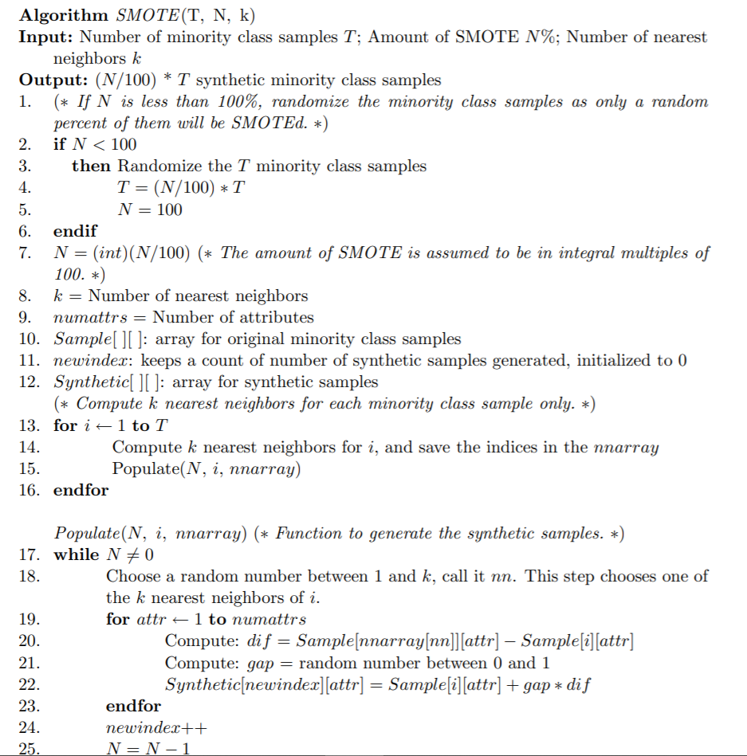

class: logo-slide

---

class: title-slide

## Topics in Classification

### Applications of Data Science - Class 13

### Giora Simchoni

#### `gsimchoni@gmail.com and add #dsapps in subject`

### Stat. and OR Department, TAU
### `r Sys.Date()`

---
```{r child = "../setup.Rmd"}
```

```{r packages, echo=FALSE, message=FALSE, warning=FALSE}
library(tidyverse)
```

class: section-slide

# Topics in Classification

---

# Life isn't perfect

Let's tackle just a few issues:

- Not enough labelled data and data labeling is expensive
- Imbalanced Classes

---

class: section-slide

# Active Learning

---

### Got Data?

```{r, echo=FALSE}
set.seed(42)
```

```{r, warning=FALSE}
n <- 20
x1 <- rnorm(n, 0, 1); x2 <- rnorm(n, 0, 1)
t <- 2 - 4 * x1 + 3 * x2
y <- rbinom(n, 1, 1 / (1 + exp(-t)))
glm_mod <- glm(y ~ x1 + x2, family = "binomial")
```

```{r AL-LR-Example, warning=FALSE, out.width="50%", echo=FALSE}
a <- -glm_mod$coef[1]/glm_mod$coef[3]
b <- -glm_mod$coef[2]/glm_mod$coef[3]
formula1 <- glue::glue("{format(glm_mod$coef[1], digits = 2)} {format(glm_mod$coef[2], digits = 2)} * x1 + {format(glm_mod$coef[3], digits = 2)} * x2 = 0")

tibble(x1 = x1, x2 = x2, y = factor(y)) %>%
  ggplot(aes(x1, x2, color = y)) +
  geom_point() +
  geom_abline(intercept =  a, slope = b) +
  xlim(c(-2.5, 2.5)) +
  ylim(c(-2.5, 2.5)) +
  guides(color = FALSE) +
  geom_text(x = 0, y = 0, label = formula1,
            parse = FALSE, color = "black", size = 5) +
  theme_light() +
  theme(text = element_text(size = 20))
```

---

### Want more?

> The key idea behind *active learning* is that a machine learning algorithm can
achieve greater accuracy with fewer training labels if it is allowed to choose the
data from which it learns. An active learner may pose *queries*, usually in the form
of unlabeled data instances to be labeled by an *oracle* (e.g., a human annotator).
Active learning is well-motivated in many modern machine learning problems,
where unlabeled data may be abundant or easily obtained, but labels are difficult,
time-consuming, or expensive to obtain.

([Settles, 2010](http://burrsettles.com/pub/settles.activelearning.pdf))

> You want data? Well data costs!

(No one, ever)

---

### Where this is going


---

### Active Learning Scenarios

1. **Membership Query Synthesis**: You get to choose which (maybe theoretical) points you'd want $y$ labelled for.
2. **Stream-Based Selective Sampling**: You get 1 point at a time and decide which ones you'd like to query and which to discard.
3. **Pool-Based Sampling**: You have a large collecetion of unlabelled points at your disposal, you need to send the "best ones" for labelling


---

### Uncertainty Sampling

.insight[
`r emo::ji("bulb")` For a 2-class dataset, the observations your model is most uncertain of are...
]

```{r AL-LR-Example2, ref.label = "AL-LR-Example", echo = FALSE, out.width = "50%", warning=FALSE}

```

---

### Uncertainty Sampling Measures

Let $\hat{y}_i$ be the predicted classes with $i$th highest score (probability), for observations $x$ under some model $\theta$.

So $\hat{y}_1 = \arg\max{P_{\theta}(y|x)}$ are the actual predicted classes, $\hat{y}_2$ are the second choices, etc.

* Least Confidence: Choose those observations for which $P_{\theta}(\hat{y}_1|x)$ is smallest:

$x^*_{LC} = \arg\min{P_{\theta}(\hat{y}_1|x)}$

.insight[
`r emo::ji("bulb")` For a 2-class balanced dataset, this means...
]

---

* Margin Sampling: Choose those observations for which the margin between the two highest scores is smallest:

$x^*_M = \arg\min{P_{\theta}(\hat{y}_1|x) - P_{\theta}(\hat{y}_2|x)}$

.insight[
`r emo::ji("bulb")` For a 2-class balanced dataset, this means...
]

* Entropy: Choose the observations for which entropy is highest:

$x^*_H = \arg\max-{\sum_i P_{\theta}(\hat{y}_i|x) \log[P_{\theta}(\hat{y}_i|x)]}$

We will talk more about entropy in Neural Networks, let's minimize negative entropy.

.insight[
`r emo::ji("bulb")` For a 2-class balanced dataset, this means...
]

---

### Example: The `spotify_songs` data from HW3

```{r, message=FALSE}
spotify_songs <- read_csv('https://raw.githubusercontent.com/rfordatascience/tidytuesday/master/data/2020/2020-01-21/spotify_songs.csv')

spotify_songs %>% count(playlist_genre)
```

Let's try to classify the genre of a song!

---

We'll take only the 12 audio features as predictors, and choose each `track_id` once (remember each song appears a few times?):

```{r, message=FALSE, warning=FALSE}
library(tidymodels)

predictors <- 12:23

spotify_songs <- spotify_songs %>%
  group_by(track_id) %>%
  sample_n(1) %>%
  ungroup() %>%
  distinct(track_name, .keep_all = TRUE) %>%
  select(track_id, track_name, track_artist, playlist_genre, predictors) %>%
  mutate(playlist_genre = recode(playlist_genre, "r&b" = "rnb"))

set.seed(42)
sptfy_split_obj <- spotify_songs %>%
  initial_split(prop = 0.8)
sptfy_tr <- training(sptfy_split_obj)
sptfy_te <- testing(sptfy_split_obj)
```

---

Plot twist! We only have 10 songs from each genre!

```{r}
sptfy_tr_small <- sptfy_tr %>%
  group_by(playlist_genre) %>%
  sample_n(10) %>%
  ungroup()

sptfy_tr_small %>% count(playlist_genre)
```

Muhaha!

---

We'll also have a pool of songs to query, `sptfy_tr_large`:

```{r}
sptfy_tr_large <- sptfy_tr %>%
  anti_join(sptfy_tr_small, by = "track_id")
```

We `bake()` the 3 datasets with the small sample params recipe:

```{r}
sptfy_rec <- recipe(playlist_genre ~ ., data = sptfy_tr_small) %>%
  update_role(track_id, track_name, track_artist,
              new_role = "id") %>%
  step_normalize(all_numeric(), -has_role("id")) %>%
  step_string2factor(playlist_genre) %>%
  prep(sptfy_tr_small, strings_as_factors = FALSE)

sptfy_tr_small <- juice(sptfy_rec)
sptfy_tr_large <- bake(sptfy_rec, new_data = sptfy_tr_large)
sptfy_te <- bake(sptfy_rec, new_data = sptfy_te)
```

---

Let's build a simple GBT model:

```{r, warning=FALSE}
mod_spec <- boost_tree(mode = "classification", trees = 100) %>%
  set_engine("xgboost")

mod_fit <- mod_spec %>%
  fit(playlist_genre ~ ., data = sptfy_tr_small %>%
        select(-track_id, -track_name, -track_artist))

mod_pred <- mod_fit %>%
  predict(new_data = sptfy_tr_large, type = "prob")

mod_pred
```

---

Test accuracy?

```{r}
mod_te_pred_class <- mod_fit %>%
      predict(new_data = sptfy_te) %>%
      bind_cols(sptfy_te)

mod_te_pred_class %>%
  accuracy(truth = playlist_genre, estimate = .pred_class)
```

```{r, echo=FALSE}
baseline_acc <- mod_te_pred_class %>%
  accuracy(truth = playlist_genre, estimate = .pred_class) %>%
  pull(.estimate)
```


Remember this model was built on 60 of almost 19K available unique songs!

---

Test Recall and Precision:

```{r}
mod_te_pred_class %>%
  group_by(playlist_genre) %>%
  accuracy(truth = playlist_genre, estimate = .pred_class) %>%
  select(playlist_genre, recall = .estimate) %>%
  bind_cols(
    mod_te_pred_class %>%
      group_by(.pred_class) %>%
      accuracy(truth = playlist_genre, estimate = .pred_class) %>%
      select(precision = .estimate)
  )
```

---

Build a function which will take each row of predicted probs and return a list of 3 uncertainty metrics:

```{r}
uncertainty_lc <- function(probs) {
  max(probs)
}

uncertainty_m <- function(probs) {
  o <- order(probs, decreasing = TRUE)
  probs[o[1]] - probs[o[2]]
}

uncertainty_h <- function(probs) {
  sum(probs * log(probs + 0.000001))
}

uncertainty <- function(...) {
  probs <- c(...)
  list(
    lc = uncertainty_lc(probs),
    margin = uncertainty_m(probs),
    entropy = uncertainty_h(probs)
  )
}
```

---

```{r}
mod_unc <- mod_pred %>% pmap_dfr(uncertainty)

mod_unc
```

Obviously these are correlated:

---

.pull-left[

```{r AL-MR-Lc-Margin, out.width="100%"}
mod_unc %>% sample_n(1000) %>%
  ggplot(aes(lc, margin)) +
  geom_point() +
  theme_light() +
  theme(text =
          element_text(size = 14))
```

]

.pull-right[

```{r AL-MR-Lc-Entropy, out.width="100%"}
mod_unc %>% sample_n(1000) %>%
  ggplot(aes(lc, entropy)) +
  geom_point() +
  theme_light() +
  theme(text =
          element_text(size = 14))
```

]

---

Which are the top 10 songs in terms of each metric the model is most curious about?

```{r}
sptfy_tr_large_with_unc <- sptfy_tr_large %>%
  bind_cols(mod_unc) %>%
  select(track_name, track_artist, playlist_genre, lc, margin, entropy)

sptfy_tr_large_with_unc %>%
  top_n(-10, lc) %>%
  arrange(lc, track_name)
```

---

```{r}
sptfy_tr_large_with_unc %>%
  top_n(-10, margin) %>%
  arrange(margin, track_name)
```

---

```{r}
sptfy_tr_large_with_unc %>%
  top_n(-10, entropy) %>%
  arrange(entropy, track_name)
```

---

So far it's only interesting. Will sending the observations our model is most curious about to the "oracle" prove to increase test accuracy better than random observations? See full code in slides Rmd files.

```{r, echo=FALSE}
active_learning_uncertainty_iteration <- function(i, unc_metric, n, debug = TRUE) {
  if (debug) {
    print(str_c(i, n, nrow(mod_unc), nrow(sptfy_tr_small),
              nrow(sptfy_tr_large), as.character(rlang::enquo(unc_metric))[2],
              sep = " "))
  }
  
  mod_unc <<- mod_unc %>%
    mutate(random = sample(1:n(), n()))
  
  sptfy_added <- sptfy_tr_large %>%
    bind_cols(mod_unc) %>%
    arrange({{unc_metric}}) %>%
    slice(1:n) %>%
    select(-lc,-margin, -entropy, -random)

  sptfy_tr_large <<- sptfy_tr_large %>%
    anti_join(sptfy_added, by = "track_id")
  
  sptfy_tr_small <<- sptfy_tr_small %>%
    bind_rows(sptfy_added)
  
  mod_fit <- mod_spec %>%
    fit(playlist_genre ~ ., data = sptfy_tr_small %>%
          select(-track_id, -track_name, -track_artist))
  
  mod_unc <<- mod_fit %>%
    predict(new_data = sptfy_tr_large,
                  type = "prob") %>%
    pmap_dfr(uncertainty)
  
  acc <- mod_fit %>%
    predict(new_data = sptfy_te) %>%
    bind_cols(sptfy_te) %>%
    accuracy(truth = playlist_genre, estimate = .pred_class) %>%
    pull(.estimate)
  
  return(acc)
}

active_learning_uncertainty <- function(unc_metric, n = 100, iter = 10) {
  sptfy_tr_small_copy <<- sptfy_tr_small
  sptfy_tr_large_copy <<- sptfy_tr_large
  mod_unc_copy <<- mod_unc
  accuracies <- map_dbl(1:iter,
                     active_learning_uncertainty_iteration,
                     unc_metric = {{unc_metric}},
                     n = n)
  sptfy_tr_small <<- sptfy_tr_small_copy
  sptfy_tr_large <<- sptfy_tr_large_copy
  mod_unc <<- mod_unc_copy
  return(c(baseline_acc, accuracies))
}
```

```{r, echo=FALSE, eval=FALSE}
n <- 100
n_seq <- seq(0, 10*n, n)
simul_uncertainty <- bind_rows(
  tibble(unc_metric = "lc", n = n_seq, acc = active_learning_uncertainty(lc)),
  tibble(unc_metric = "margin", n = n_seq,acc = active_learning_uncertainty(margin)),
  tibble(unc_metric = "entropy", n = n_seq,acc = active_learning_uncertainty(entropy)),
  tibble(unc_metric = "random", n = n_seq, acc = active_learning_uncertainty(random))
)
```

```{r Simul-Unc, echo=FALSE, fig.asp=0.5, out.width="100%"}
simul_uncertainty <- read_rds("../data/AL_simul_uncertainty.rds")

n <- 100
n_seq <- seq(0, 10*n, n)

simul_uncertainty %>%
  ggplot(aes(n, acc, color = unc_metric)) +
  geom_point() +
  geom_line() +
  labs(x = "No. of added observations", y = "Test Accuracy", color = "uncertainty") +
  scale_x_continuous(breaks = n_seq) +
  scale_y_continuous(breaks = seq(0.3, 0.5, 0.02),
                     labels = percent_format(accuracy = 1)) +
  theme_light()
```

---

### Query by Commity (QBC)

Similar to ensemble models, we have a committee of models:

$C = \{\theta_1, ..., \theta_C\}$

Which observations the commitee is most uncertain of? E.g.

$x^*_{VE} = \arg\max-{\sum_i \frac{V(\hat{y}_i|x)}{|C|}\log{\frac{V(\hat{y}_i|x)}{|C|}}}$

Where $V(\hat{y}_i|x)$ is the number of votes for $\hat{y}_i$.

How do you get a committee?
- Different models
- Bagging
- Same model, different subsets of features
- Same model, different params

---

Let's do 6 GBT models, each receiving 2 different consecutive features:

```{r}
fit_sub_model <- function(i, tr, te) {
  mod_fit <- mod_spec %>%
    fit(playlist_genre ~ ., data = tr %>%
          select(playlist_genre, (2 + i * 2):(3 + i * 2)))

  mod_fit %>%
    predict(new_data = te)
}
mod_pred <- map_dfc(1:6, fit_sub_model,
                    tr = sptfy_tr_small, te = sptfy_tr_large)
mod_pred
```

---

```{r}
mod_qbc <- mod_pred %>%
  mutate(probs = pmap(
    select(., starts_with(".pred")),
    function(...) table(c(...)) / 6),
    vote_entropy = map_dbl(probs, uncertainty_h),
    vote_margin = map_dbl(probs, uncertainty_m))

sptfy_tr_large_with_qbc <- sptfy_tr_large %>%
  bind_cols(mod_qbc) %>%
  select(track_name, track_artist, playlist_genre,
         starts_with(".pred"), vote_entropy)

sptfy_tr_large_with_qbc %>%
  top_n(-10, vote_entropy) %>%
  arrange(vote_entropy) %>%
  select(starts_with(".pred"))
```

---

Will sending the observations our commitee is in most disagreement about to the "oracle" prove to increase test accuracy better than random observations? See full code in slides Rmd files.

```{r, echo=FALSE}
active_learning_qbc_iteration <- function(i, qbc_metric, n, debug = TRUE) {
  if (debug) {
    print(str_c(i, n, nrow(mod_qbc), nrow(sptfy_tr_small),
              nrow(sptfy_tr_large), as.character(rlang::enquo(qbc_metric))[2],
              sep = " "))
  }
  
  mod_qbc <<- mod_qbc %>%
    select(-starts_with(".pred"), -probs) %>%
    mutate(random = sample(1:n(), n()))
  
  sptfy_added <- sptfy_tr_large %>%
    bind_cols(mod_qbc) %>%
    arrange({{qbc_metric}}) %>%
    slice(1:n) %>%
    select(-vote_entropy, -vote_margin, -random)

  sptfy_tr_large <<- sptfy_tr_large %>%
    anti_join(sptfy_added, by = "track_id")
  
  sptfy_tr_small <<- sptfy_tr_small %>%
    bind_rows(sptfy_added)
  
  mod_fit <- mod_spec %>%
    fit(playlist_genre ~ ., data = sptfy_tr_small %>%
          select(-track_id, -track_name, -track_artist))
  
  mod_qbc <<- map_dfc(1:6, fit_sub_model,
                      tr = sptfy_tr_small, te = sptfy_tr_large) %>%
    mutate(probs = pmap(
    select(., starts_with(".pred")),
    function(...) table(c(...)) / 6),
    vote_entropy = map_dbl(probs, uncertainty_h),
    vote_margin = map_dbl(probs, uncertainty_m))
  
  acc <- mod_fit %>%
    predict(new_data = sptfy_te) %>%
    bind_cols(sptfy_te) %>%
    accuracy(truth = playlist_genre, estimate = .pred_class) %>%
    pull(.estimate)
  
  return(acc)
}

active_learning_qbc <- function(qbc_metric, n = 100, iter = 5) {
  sptfy_tr_small_copy <<- sptfy_tr_small
  sptfy_tr_large_copy <<- sptfy_tr_large
  mod_qbc_copy <<- mod_qbc
  accuracies <- map_dbl(1:iter,
                     active_learning_qbc_iteration,
                     qbc_metric = {{qbc_metric}},
                     n = n)
  sptfy_tr_small <<- sptfy_tr_small_copy
  sptfy_tr_large <<- sptfy_tr_large_copy
  mod_qbc <<- mod_qbc_copy
  return(c(baseline_acc, accuracies))
}
```

```{r, echo=FALSE, eval=FALSE}
n <- 100
n_seq <- seq(0, 5*n, n)
simul_qbc <- bind_rows(
  tibble(qbc_metric = "vote entropy", n = n_seq,
         acc = active_learning_qbc(vote_entropy)),
  tibble(qbc_metric = "vote margin", n = n_seq,
         acc = active_learning_qbc(vote_margin)),
  tibble(qbc_metric = "random", n = n_seq,
         acc = active_learning_qbc(random))
)
```

```{r Simul-QBC, echo=FALSE, fig.asp=0.5, out.width="100%"}
simul_qbc <- read_rds("../data/AL_simul_qbc.rds")

n <- 100
n_seq <- seq(0, 5*n, n)

simul_qbc %>%
  ggplot(aes(n, acc, color = qbc_metric)) +
  geom_point() +
  geom_line() +
  labs(x = "No. of added observations", y = "Test Accuracy", color = "QBC") +
  scale_x_continuous(breaks = n_seq) +
  scale_y_continuous(breaks = seq(0.3, 0.50, 0.02),
                     labels = percent_format(accuracy = 1)) +
  theme_light()
```

---

### Other Active Learning Metrics

- Expected Model Change
- Expected Error Reduction
- Variance Reduction
- And more...

---

class: section-slide

# Imbalanced Classes

---

### Typical examples of Imbalanced Classes scenarios

- Rare diseases: [this](https://www.kaggle.com/c/hivprogression) dataset contains genetic data for 1,000 HIV patients, 206 out of 1,000 patients improved after 16 weeks of therapy
- Conversion/Sell/CTR rates: [this](https://www.kaggle.com/c/avazu-ctr-prediction) dataset contains 10 days of Click-Through-Rate data for Avazu mobile ads, ~6.8M clicked out of ~40.4M
- Fraud detection: [this](https://www.kaggle.com/mlg-ulb/creditcardfraud) dataset contains credit card transactions for a major European CC, 492 frauds out of 284,807 transactions

---

### What's so difficult about imbalanced classes?

```{r}
okcupid_pets <- as_tibble(read_rds("../data/okcupid3_imp_mice.rds"))

idx <- read_rds("../data/okcupid3_idx.rda")
train_idx <- idx$train_idx
valid_idx <- idx$valid_idx
test_idx <- idx$test_idx

ok_train <- okcupid_pets[train_idx, ]
ok_valid <- okcupid_pets[valid_idx, ]

ok_train %>%
  count(pets) %>%
  mutate(pct = round(n / sum(n), 2))
```

.insight[
`r emo::ji("bulb")` What's a sure way to get 84% accuracy?
]

---

```{r, echo=FALSE, message=FALSE, warning=FALSE}
library(pROC)

report_accuracy_and_auc <- function(obs, pred, cutoff = 0.5) {
  roc_obj <- roc(obs, pred, levels = c("dogs", "cats"))
  AUC <- as.numeric(auc(roc_obj))
  res <- coords(roc_obj, x = cutoff,
                ret = c("accuracy", "recall", "precision",
                        "specificity", "npv"),
                transpose = TRUE)
  glue::glue("AUC: {format(AUC, digits = 3)}
  ACC: {format(res['accuracy'], digits = 3)}
  Cats: Recall: {format(res['recall'], digits = 3)}
        Precision: {format(res['precision'], digits = 3)}
  Dogs: Recall: {format(res['specificity'], digits = 3)}
        Precision: {format(res['npv'], digits = 3)}")
}
```

```{r}
mod_glm <- glm(pets ~ ., data = ok_train, family = "binomial")
pred_glm <- 1 - predict(mod_glm, ok_valid, type = "response")

pred_glm_class <- ifelse(pred_glm > 0.5, "cats", "dogs")
true_class <- ok_valid$pets

table(true_class, pred_glm_class)
report_accuracy_and_auc(true_class, pred_glm)
```

---

### Remedies for Imbalanced Classes

- Model level
  - Tuning parameters and Cutoff choice
  - Cost-aware training: Case weights and Prior probabilities
- Data level
  - Down sampling
  - Up sampling
  - Get more data and features from minority class, similar to Active Learning
- Change of Framework
  - Anomaly Detection
- One final word of wisdom

---

### Tuning parameters and cutoff choice

A general good approach would be:

1. Choose a  model to maximize AUC on one part of the training dataset (using resampling)
2. Choose a cutoff score on another part of the training dataset
3. Fitting the entire thing on all training set and checking on test set

But. You could incorporate your initial goal even into (1), making the cutoff another tuning parameter that would maximize:

- Recall(cats): If never missing a cat person (the minority class) is your job .font80percent[(while maintaining acceptable level of Precision(cats))]
- Precision(cats): If you don't have room for error when you say a person is a cat person .font80percent[(while maintaining acceptable level of Precision(cats))]
- Some other metric like F1-score

---

Let us choose a model by maximizing AUC then present our client with a few potential cutoffs.

We'll begin by splitting our training set into two:

```{r}
ok_split <- initial_split(ok_train, prop = 0.7, strata = pets)

ok_train1 <- training(ok_split)
ok_train2 <- testing(ok_split)

dim(ok_train1)
dim(ok_train2)
```

---

Use the first training set to choose a GBT model to maximize AUC with 5-fold CV:

```{r, warning=FALSE}
library(tune)

mod_gbt_spec <- boost_tree(mode = "classification",
                           mtry = tune(),
                           min_n = tune(),
                           learn_rate = tune(),
                           trees = 1000) %>%
  set_engine("xgboost")

gbt_grid <- grid_regular(mtry(range(10, 50)),
                         min_n(range(10, 100)),
                         learn_rate(range(-3, -1)),
                         levels = 3)
rec_gbt <- recipe(pets ~ ., data = ok_train1) %>%
  step_dummy(all_nominal(), -all_outcomes()) %>%
  prep(ok_train1)

cv_splits <- vfold_cv(juice(rec_gbt), v = 5, strata = pets)
```

---

```{r, eval=FALSE}
tune_res <- tune_grid(recipe(pets~., data = juice(rec_gbt)),
                      model = mod_gbt_spec,
                      resamples = cv_splits,
                      grid = gbt_grid,
                      control = control_grid(verbose = TRUE),
                      metrics = metric_set(roc_auc))
```

```{r Imbalanced-AUC-Res, echo=FALSE, out.width="100%", fig.asp=0.5}
# cv_gbt <- tune_res %>%
#   collect_metrics()

cv_gbt <- read_rds("../data/okcupid_pets_cv_gbt.rds")

cv_gbt %>%
  mutate(min_n = factor(min_n)) %>%
  ggplot(aes(mtry, mean, color = min_n)) +
  geom_point() +
  geom_line() +
  facet_wrap(. ~ learn_rate) +
  labs(y = "AUC") +
  theme_light()
```

```{r, eval=FALSE, echo=FALSE}
tune_res %>%
  collect_metrics() %>%
  mutate(min_n = factor(min_n)) %>%
  ggplot(aes(mtry, mean, color = min_n)) +
  geom_point() +
  geom_line() +
  facet_wrap(. ~ learn_rate) +
  labs(y = "AUC") +
  theme_light()
```

---

Fit the best model on all of `ok_train1` and get scores on `ok_train2`:

```{r}
mod_gbt_spec <- mod_gbt_spec %>%
  update(mtry = 30, trees = 1000,
         min_n = 10, learn_rate = 0.01)
mod_gbt <- mod_gbt_spec %>%
  fit(pets ~ ., data = juice(rec_gbt))

pred_gbt <- mod_gbt %>%
  predict(new_data = bake(rec_gbt, ok_train2), type = "prob") %>%
  pull(.pred_cats)
```

---

You can use the ROC curve to understad the behavior of the cutoff:

```{r, eval=FALSE, echo=FALSE}
roc_obj <- roc(ok_train2$pets, pred_gbt, levels = c("dogs", "cats"))
coords(roc_obj, x = c(0.01, 0.05, 0.1, 0.17, 0.3, 0.5, 0.7, 0.75, 0.8),
                ret = c("accuracy", "recall", "precision",
                        "specificity", "npv"),
                transpose = TRUE)
```

```{r, eval=FALSE, echo=FALSE}
roc_gbt <- roc_curve(tibble(truth = ok_train2$pets, cats = pred_gbt),
                     truth, cats)

autoplot(roc_gbt) +
  labs(x = "1 - Recall(Dogs)", y = "Recall(Cats)") +
  annotate("text", x = 1 - 0.19, y = 0.969, label = "Cut: 0.05\nRecall:97%\nPerc:19%", size = 3, hjust = 0) +
    annotate("text", x = 1 - 0.95, y = 0.05, label = "Cut: 0.80\nRecall:1%\nPerc:71%", size = 3, hjust = 0) +
    annotate("text", x = 1 - 0.73, y = 0.72, label = "Cut: 0.17\nRecall:72%\nPerc:34%", size = 3, hjust = 0)
```

```{r Imbalanced-AUC-ROC, echo=FALSE, out.width="60%"}
roc_gbt <- read_rds("../data/okcupid_pets_roc_gbt.rds")

autoplot(roc_gbt) +
  labs(x = "1 - Recall(Dogs)", y = "Recall(Cats)") +
  annotate("text", x = 1 - 0.19, y = 0.969, label = "Cut: 0.05\nRecall:97%\nPerc:19%", size = 5, hjust = 0) +
    annotate("text", x = 1 - 0.95, y = 0.05, label = "Cut: 0.80\nRecall:1%\nPerc:71%", size = 5, hjust = 0) +
    annotate("text", x = 1 - 0.73, y = 0.72, label = "Cut: 0.17\nRecall:72%\nPerc:34%", size = 5, hjust = 0)
```

---

Maybe better, draw a histogram of `cats` score and mark the cutoffs there:

```{r Imbalanced-Score-Host, out.width="100%", fig.asp=0.5, echo=FALSE}
ggplot(tibble(cats_score = pred_gbt), aes(cats_score)) +
  geom_histogram(bins = 50) +
  labs(x = "Score(cat)", y = "Frequency") +
  theme_light() +
  geom_vline(xintercept = 0.05, lty = 2, col = "red", lwd = 1) +
  geom_vline(xintercept = 0.17, lty = 2, col = "red", lwd = 1) +
  geom_vline(xintercept = 0.8, lty = 2, col = "red", lwd = 1) +
  annotate("text", x = 0.05 + 0.01, y = 100, label = "Cut: 0.05\nRecall:97%\nPerc:19%", size = 3.5, col = "white", hjust = 0) +
  annotate("text", x = 0.17 + 0.01, y = 200, label = "Cut: 0.17\nRecall:72%\nPerc:34%", size = 3.5, col = "red", hjust = 0) +
  annotate("text", x = 0.8 + 0.01, y = 200, label = "Cut: 0.80\nRecall:1%\nPerc:71%", size = 3.5, col = "red", hjust = 0)
```

---

Lastly, train on entire training set and evaluate on test set:

```{r, message=FALSE}
mod_gbt <- mod_gbt_spec %>%
  fit(pets ~ ., data = bake(rec_gbt, ok_train))
pred_gbt <- mod_gbt %>%
  predict(new_data = bake(rec_gbt, ok_valid), type = "prob") %>%
  pull(.pred_cats)
pred_gbt_class <- ifelse(pred_gbt > 0.17, "cats", "dogs")
true_class <- ok_valid$pets
table(true_class, pred_gbt_class)
report_accuracy_and_auc(true_class, pred_gbt, cutoff = 0.17)
```

---

### Cost aware training: Case weights

For example, in `glm()` you can simply specify a `weights` param:

> when the elements of weights are positive integers *w_i*, each response *y_i* is the mean of *w_i* unit-weight observations

```{r}
pets_weights <- rep(1, nrow(ok_train))
pets_weights[which(ok_train$pets == "cats")] <- 5

mod_glm <- glm(pets ~ ., data = ok_train,
               family = "binomial", weights = pets_weights) #<<

pred_glm <- 1 - predict(mod_glm, ok_valid, type = "response")

pred_glm_class <- ifelse(pred_glm > 0.5, "cats", "dogs")
true_class <- ok_valid$pets
```

---

```{r, message=FALSE}
table(true_class, pred_glm_class)
report_accuracy_and_auc(true_class, pred_glm)
```

But this is almost equivalent to up sampling.

A more intelligent use of class weights would be something like using the `class.weights` parameter in `e1071::svm()`

---

### Cost aware training: Prior probabilities

**Small Detour: Naive Bayes**

You know Bayes' Theorem, right?

$P(A|B) = \frac{P(B|A)P(A)}{P(B)}$

or

$posterior = \frac{likelihood \cdot prior}{evidence}$

So what would be the posterior probability of class $C_k$ given that we've seen observation $x_i$?

$P(C_k|x_i) = \frac{P(x_i|C_k)P(C_k)}{P(x_i)}$

---

$P(C_k|x_i) = \frac{P(x_i|C_k)P(C_k)}{P(x_i)}$

In words: the likelihood of seeing an observation like $x_i$ in all class $C_k$ observations, times the prior of class $C_k$ observations, divided by the evidence seeing an observation like $x_i$ in general.

.insight[
`r emo::ji("bulb")` What increases $P(C_k|x_i)$? What decreases it?
]

But if we have, say 100 predictors, each categorical with 2 levels - we'd have to pre-compute $2^{100}$ possible for each $C_k$!

---

Enter *Naive* Bayes:

Assume that all predictors $X$  are mutually independent, conditional on the class $C_k$, and so:

$P(x_i|C_k) = \prod_{j = 1}^pP(x_{ij}|C_k)$

And so:

$P(C_k|x_i) = \frac{\prod P(x_{ij}|C_k)P(C_k)}{P(x_i)}$

And we can further expand: $P(x_i) = \sum_k P(x_{i}|C_k)P(C_k)$

.insight[
`r emo::ji("bulb")` How would you compute $P(x_{ij}|C_k)$ when $x_{ij}$ is continuous?
]

---

```{r, message=FALSE, warning=FALSE}
library(naivebayes)

mod_nb <- naive_bayes(pets ~ ., data = ok_train)

pred_nb <- predict(mod_nb, ok_valid, type = "prob")[, "cats"]

pred_nb_class <- ifelse(pred_nb > 0.5, "cats", "dogs")
table(true_class, pred_nb_class)
report_accuracy_and_auc(true_class, pred_nb)
```

---

BTW, *are* our features mutually independent?

```{r Imbalanced-Cor-Matrix, out.width="50%"}
ok_train %>%
  filter(pets == "cats") %>%
  select_if(is.numeric) %>%
  cor() %>%
  corrplot::corrplot()
```

---

In the context of imbalanced classes you could just give a 5 times more weight to the score of cats by specifying different prior probabilities $P(C_k)$:

```{r, message=FALSE, warning=FALSE}
mod_nb <- naive_bayes(pets ~ ., data = ok_train, prior = c(5, 1))

pred_nb <- predict(mod_nb, ok_valid, type = "prob")[, "cats"]

pred_nb_class <- ifelse(pred_nb > 0.5, "cats", "dogs")
table(true_class, pred_nb_class)
report_accuracy_and_auc(true_class, pred_nb)
```

---

### Down Sampling

Yes, down sampling the majority class, usually to make it the same amount as the minority class (but you can tune this parameter as any other).

You'd be surprised.

```{r}
rec_gbt <- recipe(pets ~ ., data = ok_train) %>%
  step_dummy(all_nominal(), -all_outcomes()) %>%
  step_downsample(pets, under_ratio = 1) %>% #<<
  prep(ok_train)
```

---

.warning[
`r emo::ji("warning")` Never down-sample the testing set! Look at the `skip` parameter.
]

```{r}
juice(rec_gbt) %>% count(pets)
bake(rec_gbt, ok_valid) %>% count(pets)
```

---

```{r, message=FALSE}
mod_gbt <- mod_gbt_spec %>%
  fit(pets ~ ., data = juice(rec_gbt))
pred_gbt <- mod_gbt %>%
  predict(new_data = bake(rec_gbt, ok_valid), type = "prob") %>%
  pull(.pred_cats)
pred_gbt_class <- ifelse(pred_gbt > 0.5, "cats", "dogs")

table(true_class, pred_gbt_class)
report_accuracy_and_auc(true_class, pred_gbt)
```

---

### Up Sampling

The main disadvantage of down sampling is of course the loss of data.

Will replicating (minority class) data do any better?

```{r, message=FALSE}
rec_gbt <- recipe(pets ~ ., data = ok_train) %>%
  step_dummy(all_nominal(), -all_outcomes()) %>%
  step_upsample(pets, over_ratio = 1) %>% #<<
  prep(ok_train)

mod_gbt <- mod_gbt_spec %>%
  fit(pets ~ ., data = juice(rec_gbt))
pred_gbt <- mod_gbt %>%
  predict(new_data = bake(rec_gbt, ok_valid), type = "prob") %>%
  pull(.pred_cats)
pred_gbt_class <- ifelse(pred_gbt > 0.5, "cats", "dogs")
```

---

```{r, message=FALSE}
table(true_class, pred_gbt_class)
report_accuracy_and_auc(true_class, pred_gbt)
```

---

### SMOTE

[Chawla et. al. (2002)](https://arxiv.org/pdf/1106.1813.pdf) developed SMOTE (Synthetic Minority Over-sampling Technique) which is a up sampling technique.

The authors claim that a hybrid combination of SMOTE and regular down sampling works best, that's why SMOTE is sometimes referred to as a "hybrid" sampling algo itself.

But the up sampling does not simply replicates the minority class...

---

It synthesizes them!



---

If you want to stay in the `tidymodels` framework you can download the `themis` package for extra recipes for dealing with unbalanced data:

```{r, message=FALSE, warning=FALSE}
library(themis)

n <- 100
x1 <- rnorm(n, 0, 1); x2 <- rnorm(n, 0, 1)
t <- 2 - 4 * x1 + 3 * x2
y <- rbinom(n, 1, 1 / (1 + exp(-t)))

df <- tibble(x1 = x1, x2 = x2, y = factor(y))
df %>% count(y)

df_smoted <- recipe(y ~ ., data = df) %>%
  step_smote(y, over_ratio = 1) %>%
  prep(df) %>%
  juice()
```

---

```{r, message=FALSE, warning=FALSE}
df_smoted %>% count(y)
```

```{r SMOTE-simulation, echo=FALSE, warning=FALSE, out.width="100%", fig.asp=0.5}
df %>% mutate(type = "Original") %>%
  bind_rows(df_smoted %>% mutate(type = "SMOTE")) %>%
  ggplot(aes(x1, x2, color = y)) +
  geom_point() +
  xlim(c(-2.5, 2.5)) +
  ylim(c(-2.5, 2.5)) +
  guides(color = FALSE) +
  theme_light() +
  theme(text = element_text(size = 10)) +
  facet_wrap(. ~ type)
```

---

Let's do a hybrid of down sampling and SMOTE on our data:

```{r}
rec_gbt <- recipe(pets ~ ., data = ok_train) %>%
  step_dummy(all_nominal(), -all_outcomes()) %>%
  step_downsample(pets, under_ratio = 1.5) %>%
  step_smote(pets, over_ratio = 1) %>%
  prep(ok_train)

juice(rec_gbt) %>% count(pets)

mod_gbt <- mod_gbt_spec %>%
  fit(pets ~ ., data = juice(rec_gbt))
pred_gbt <- mod_gbt %>%
  predict(new_data = bake(rec_gbt, ok_valid), type = "prob") %>%
  pull(.pred_cats)
pred_gbt_class <- ifelse(pred_gbt > 0.5, "cats", "dogs")
```

---

```{r, message=FALSE}
table(true_class, pred_gbt_class)
report_accuracy_and_auc(true_class, pred_gbt)
```

---

### Other Up Sampling Methods

- ADASYN
- Borderline SMOTE
- ROSE
- Depends on data (e.g. with images it is common to perform image augmentation: flip, crop, rotate, blur it)

### Change of Framework

- Anomaly Detection

---

### One final word of wisdom

- It's Ok for a model to not know!

- The optimal choice would be for a classification model to output a *score*, rather than a class, and have the client's system interpret that score for different applications

- However, if a class output is required, consider outputting a $k+1$ class: "I don't know"

- In the case of classifying cats vs. dogs people - it makes sense!

- For a two-class problem, you would have not one cutoff on the score, but two: Below cutoff 1 classify as "Dogs", above "Cats" and in the middle: "I don't know"

- As long as you make a decision regarding at least X% of the data

---

Let's see this on the `ok_valid` test set using our last SMOTEd model (but notice to tune these cutoffs you would need an extra set of untouched data!):

```{r}
upper <- 0.65
lower <- 0.35
pred_gbt_class <- ifelse(pred_gbt > upper, "cats",
                         ifelse(pred_gbt < lower, "dogs", NA))
table(true_class, pred_gbt_class)
```

---

```{r}
report_accuracy_and_auc2 <- function(obs, pred, lower = 0.35, upper = 0.65) {
  pred_class <- ifelse(pred > upper, "cats",
                         ifelse(pred < lower, "dogs", NA))
  cm <- table(true_class, pred_class)
  recall_cats <- cm[1, 1] / sum(cm[1,])
  recall_dogs <- cm[2, 2] / sum(cm[2,])
  prec_cats <- cm[1, 1] / sum(cm[,1])
  prec_dogs <- cm[2, 2] / sum(cm[,2])
  acc <- sum(diag(cm)) / sum(cm)
  pred_pct <- sum(cm) / length(obs)
  glue::glue("Predicted: {format(pred_pct, digits = 3)}
  ACC: {format(acc, digits = 3)}
  Cats: Recall: {format(recall_cats, digits = 3)}
        Precision: {format(prec_cats, digits = 3)}
  Dogs: Recall: {format(recall_dogs, digits = 3)}
        Precision: {format(prec_dogs, digits = 3)}")
}

report_accuracy_and_auc2(true_class, pred_gbt)
```

