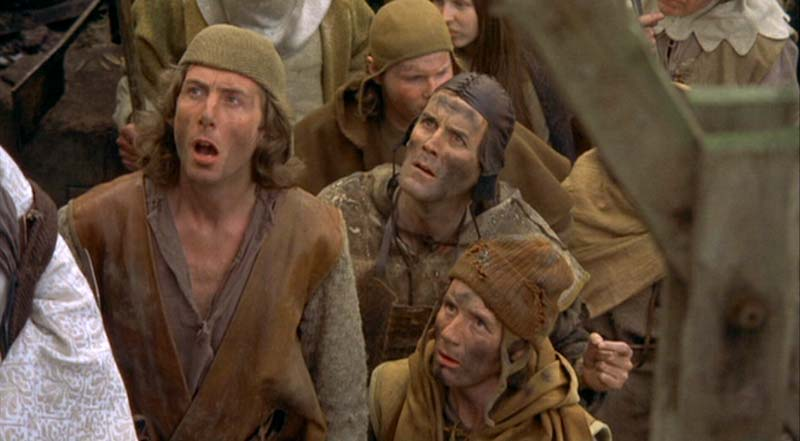
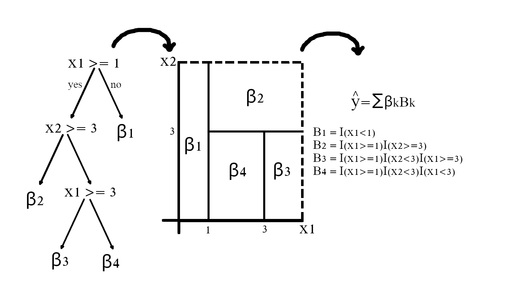
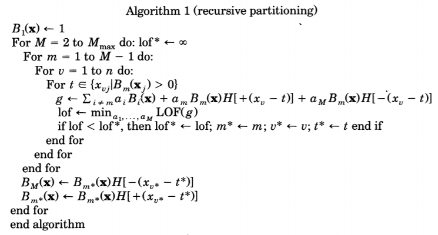
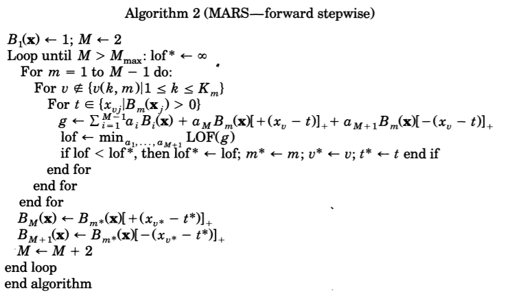
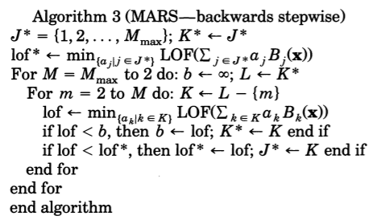
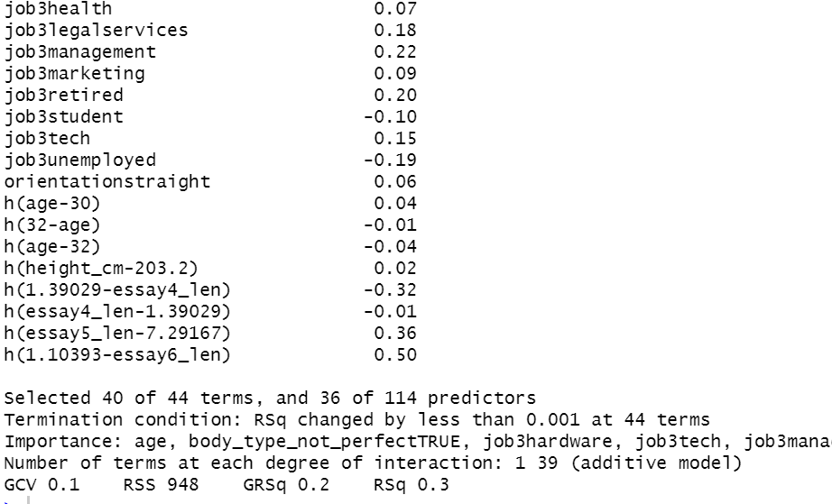
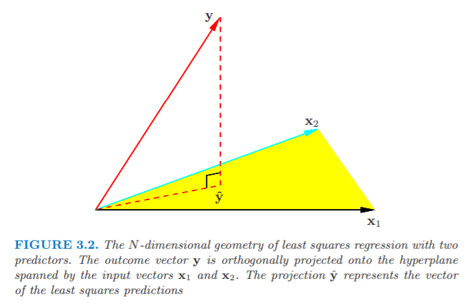

class: logo-slide

---

class: title-slide

## Topics in Regression

### Applications of Data Science - Class 14

### Giora Simchoni

#### `gsimchoni@gmail.com and add #dsapps in subject`

### Stat. and OR Department, TAU
### `r Sys.Date()`

---
```{r child = "../setup.Rmd"}
```

```{r packages, echo=FALSE, message=FALSE, warning=FALSE}
library(tidyverse)
```

class: section-slide

# MARS
#### (Multivariate Adaptive Regression Splines)
---

### What's the No. 1 complaint about LR?

```{r Bad-LR, echo=FALSE, out.width="50%"}
x1 <- seq(0, 3, 0.1)
y1 <- 9 * x1 + rnorm(length(x1), sd = 3)
x2 <- seq(3, 8, 0.1)
y2 <- 33 - 2 * x2 + rnorm(length(x2), sd = 3)
x <- c(x1, x2)
y <- c(y1, y2)
lm1 <- lm(y ~ x)
plot(x, y)
abline(lm1$coef, col = "red")
```

$\hat{y} = 12 + 1.5x$

---

### It would have been much nicer if we could...

```{r LR-Good, echo=FALSE, out.width="50%"}
plot(x, y)
lines(x1, 9 * x1, col = "red")
lines(x2, 33 - 2 * x2, col = "red")
```

$$\hat{y} = [9x]I(x < 3) + [33 - 2x]I(x \gt 3) = \\
= 27 - 9\max(0, 3 - x) - 2\max(0, x - 3) = \\
27 - 9[-(x-3)]_+ - 2[+(x-3)]_+$$

---

### The Hinge Function

$h(x - c) = [(x - c)]_+ = max(0, x - c)$

Where $c$ would be called a knot.

```{r Hinge, out.width="40%", echo = FALSE}
x1 <- seq(0, 8, 0.1)
plot(x1, pmax(0, x1 - 3), type = "l", main = "h(x-3)", xlab = "x", ylab = "h(x-3)")
```

.insight[
`r emo::ji("bulb")` If you know about Deep Learning this would be called...
]

---

### MARS via `earth`

```{r, echo=FALSE}
set.seed(42)
x1 <- seq(0, 3, 0.1)
y1 <- 9 * x1 + rnorm(length(x1), sd = 1)
x2 <- seq(3, 8, 0.1)
y2 <- 33 - 2 * x2 + rnorm(length(x2), sd = 1)
x <- c(x1, x2)
y <- c(y1, y2)
```

```{r, warning=FALSE, message=FALSE}
library(earth)

mod_mars <- earth(y ~ x, degree = 1)

summary(mod_mars)
```

.insight[
`r emo::ji("bulb")` Why on earth is the package for MARS called... `r emo::ji("person_facepalming")`
]

---

### This is exactly like

```{r}
X <- data.frame(y, h1 = pmax(0, x - 3.1), h2 = pmax(0, 3.1 - x))

head(X)

lm(y ~ h1 + h2, data = X)
```

---

### And which method knows how to scan X for the best partition?



---

### What's the No. 1 complaint about Trees?

```{r Bad-Trees, echo=FALSE, out.width="50%"}
plot(x, y)
lines(x1, rep(mean(y1), length(x1)), col = "red")
lines(x2, rep(mean(y2), length(x2)), col = "red")
```

---

### Why are CART also called "Recursive Partitioning"?



---

### From CART to MARS

Let $B_m(X)= \prod_{k=1}^{K_m}I(X_{v(km)} - t_{km} \ge 0)$

Following [Friedman (1991)](https://projecteuclid.org/euclid.aos/1176347963), let:

$$H(z) =
  \begin{cases}
   1 & \mbox{if } z \ge 0 \\
   0 & \mbox{otherwise}
 \end{cases}$$

So: $B_m(X)= \prod_{k=1}^{K_m}H[s_{km}(X_{v(km)} - t_{km})]$ where $s_{km}=\pm 1$

And: $\hat{y} = g(X)$

And: $LOF(g)$ is the Lack of Fit function for $g(X)$, typically the $SSE$ critetion

And: Switch all our $\beta$s to $\alpha$s

---

Then the growing of trees algorithm is really...



---

### Why gotta be H?



---

### More than H changed on the way to MARS

* Most important: NOT removing the parent $B_{m*}(X)$, we can always go back to the parent and split it *again*, allowing for additive models such as $\hat{y} = 6 + 5[-(x_1-4)]_+ - 2[+(x_2-3)]_+$

.insight[
`r emo::ji("bulb")` Can you do this with a tree?
]

* The generalized form is actually $[\pm(x-t)]^q_+$ where $q$ is usually 1 but *can be* 2 or 3

.insight[
`r emo::ji("bulb")` What if $q=0$?
]

---

* At each step of adding to $B_{m}(X)$ only variables which have not yet participated in this path are added

.insight[
`r emo::ji("bulb")` How is it different from trees and why do you think this was added?
]

* For "growing" and "pruning" the $LOF(g)$ used by MARS is $GCV$ (Generalized Cross Validation) which is a penalized version of $SSE$ which is out of scope

* Easily extensible to GLM via the proper link function, e.g. for Logistic Regression: $logit(p) = \sum_k \beta_k B_k$

* And more...

---

### "Pruning" MARS

Another advantage of MARS is that once the full model has been "grown", **each and every** term is candidate for pruning from the formula, not whole pairs:



The forward pass adds terms in pairs, but the pruning (backward pass) typically discards one side of the pair and so terms are often not seen in pairs in the final model.

---

### Predicting OKCupid Income

```{r, echo=FALSE}
okcupid2_imp_mice <- read_rds("../data/okcupid2_imp_mice.rds")
idx <- read_rds("../data/okcupid2_idx.rda")
train_idx <- idx$train_idx
valid_idx <- idx$valid_idx
test_idx <- idx$test_idx

okcupid2_imp_mice_train <- okcupid2_imp_mice[train_idx, ]
okcupid2_imp_mice_valid <- okcupid2_imp_mice[valid_idx, ]

rmse <- function(obs, pred) sqrt(mean((obs - pred)^2))

report_rmse_and_cor <- function(obs, pred) {
  RMSE <- rmse(obs, pred)
  CORR <- cor(obs, pred)
  glue::glue("RMSE: {format(RMSE, digits = 3)}
       CORR: {format(CORR, digits = 3)}")
}
```

```{r}
mod_mars <- earth(income ~ ., data = okcupid2_imp_mice_train, degree = 1)

summary(mod_mars, digits = 2)
```

---



```{r}
pred_mars <- predict(mod_mars, okcupid2_imp_mice_valid)
report_rmse_and_cor(okcupid2_imp_mice_valid$income, pred_mars)
```

---

### Pros and Cons

Pros:

- Flexible, built-in interactions
- Highly interpretable
- Little pre-processing of predictors needed
- Handle all types of predictors (continuous, categorical)
- Feature selection built-in (but when predictors are correlated...)
- Good variance-bias tradeoff

Cons:
- Greedy
- The resulting fitted function may not be smooth (not differentiable along hinges)
- No built-in CI for variables params

---

class: section-slide

# CCA
#### (Canonical Correlation Analysis)

---

### What is Linear Regression, really?



.font80percent[
([ESL II](https://web.stanford.edu/~hastie/Papers/ESLII.pdf))
]

$y = X\beta + \epsilon \rightarrow \hat{y} = X\hat\beta = X(X'X)^{-1}X'y = Hy$

"We project $y$ to the space spanned by $X$..."

"We seek a linear combination of $X$ that would be closest to $y$..."

---

### What if $y$ is $Y$?

If $Y$ is multi-dimensional (not a single vector, but a matrix of $nxq$ dependent variables), we get the same result with a $\hat{B}_{pxq}$ matrix:

$Y = XB + E \rightarrow \hat{Y} = X\hat{B} = X(X'X)^{-1}X'Y = HY$

And if the columns of $X$ are linearly independent this is equivalent to $q$ separate linear regressions:

```{r, eval=FALSE}
n <- 1000
x1 <- rnorm(n)
x2 <- rnorm(n)
x3 <- rnorm(n)

y1 <- 0 + 1 * x1 + 2 * x2 + 3 * x3 + rnorm(n)
y2 <- 1 + 2 * x1 + 3 * x2 + 4 * x3 + rnorm(n)
Y <- cbind(y1, y2)

lm(Y ~ x1 + x2 + x3)
```

---

```{r, echo=FALSE}
n <- 1000
x1 <- rnorm(n)
x2 <- rnorm(n)
x3 <- rnorm(n)

y1 <- 0 + 1 * x1 + 2 * x2 + 3 * x3 + rnorm(n)
y2 <- 1 + 2 * x1 + 3 * x2 + 4 * x3 + rnorm(n)
Y <- cbind(y1, y2)

lm(Y ~ x1 + x2 + x3)
```

Though harder to interpret geometrically, it isn't that different:

"We project each of $Y$'s columns to the space spanned by $X$..."

"We seek a few linear combinations of $X$ that would be closest to each of $Y$'s columns..."

`r emo::ji("right_arrow")` But in case of multi-dimensional $Y$ could we not find linear combinations **of $Y$** that would be closest to linear combinations of $X$?

---

### What is Pearson correlation coefficient, really?

$$r=Corr(x, y) = \frac{Cov(x, y)}{\sqrt{Var(x)}\sqrt{Var(y)}} =\frac{\sum(x_i - \bar x)(y_i - \bar y)}{\sqrt{\sum(x_i - \bar x)^2}\sqrt{\sum(y_i - \bar y)^2}}$$

If we assume $x$ and $y$ are standardized (centered and scaled) to have mean 0 and variance $\frac{1}{n - 1}$ (they have a L2 norm of 1), we could write:

$r = \sum x_i y_i \space s.t. \space \sum x_i = 0;\sum y_i = 0; \sum x^2_i=1; \sum y^2_i=1$

Or:

$r = x'y \space s.t. \space \sum x_i = 0;\sum y_i = 0; x'x=1; y'y=1$

---

```{r}
center_vec <- function(x) x - mean(x)
norm_vec <- function(x) sqrt(sum(x^2))
x_scaled <- center_vec(x1) / norm_vec(center_vec(x1))
y_scaled <- center_vec(y1) / norm_vec(center_vec(y1))

glue::glue("pearson: {format(cor(x1, y1), digits = 3)}
x'y: {format(t(x_scaled) %*% y_scaled, digits = 3)}")
```

So the Pearson's $r$ can be viewed as the dot product between $x$ and $y$, when scaled.

And the dot product between two vectors with L2 norm of 1 is actually the cosine of the angle between them. The higher the correlation, the larger the cosine, the smaller the angle between them, which gives another interpretation for correlation.

---

### What does correlation have to do with regression?

$y = a + bx + \epsilon \rightarrow y = X\beta + \epsilon$

And we're intereseted in $\hat{b}$ which is $\hat \beta_2$.

$$\hat \beta = (X'X)^{-1}X'y = \\
(\begin{bmatrix}
1 & ... & 1\\
x_1 & ... & x_n
\end{bmatrix} \begin{bmatrix}
1 & x_1\\
\vdots & \vdots \\
1 & x_n
\end{bmatrix})^{-1} \begin{bmatrix}
1 & ... & 1\\
x_1 & ... & x_n
\end{bmatrix} \begin{bmatrix}
y_1\\
\vdots \\
y_n
\end{bmatrix}$$

It's not that hard to get that:

$\hat{b} = \hat \beta_2 = \frac{\sum(x_i - \bar x)(y_i - \bar y)}{\sum(x_i - \bar x)^2}$

But that means...

---

$$\hat{b} = \hat \beta_2 = \frac{\sum(x_i - \bar x)(y_i - \bar y)\sqrt{\sum(y_i - \bar y)^2}}{\sum(x_i - \bar x)^2\sqrt{\sum(y_i - \bar y)^2}} \\
=\frac{\sum(x_i - \bar x)(y_i - \bar y)\sqrt{\sum(y_i - \bar y)^2}}{\sqrt{\sum(x_i - \bar x)^2}\sqrt{\sum(y_i - \bar y)^2}\sqrt{\sum(x_i - \bar x)^2}} \\
=\frac{Cov(x, y)}{\sqrt{Var(x)}\sqrt{Var(y)}}\frac{s_y}{s_x} = r\frac{s_y}{s_x}$$

So the Pearson's $r$ is the regression coefficient when regressing $y$ against $x$, and vice versa, times a different factor! .font80percent[(And the same if they are standardized to have the same variance)]

```{r, eval=FALSE, echo=FALSE}
x1_scaled <- scale(x1); y1_scaled <- scale(y1)

glue::glue("pearson: {format(cor(x1_scaled, y1_scaled)[1, 1], digits = 3)}
b_y: {format(lm(x1_scaled ~ y1_scaled)$coef[2], digits = 3)}; b_x: {format(lm(y1_scaled ~ x1_scaled)$coef[2], digits = 3)}")
```

```{r}
lm_yx <- lm(y1 ~ x1); lm_xy <- lm(x1 ~ y1); s_x = sd(x1); s_y = sd(y1)

glue::glue("pearson: {format(cor(x1, y1), digits = 3)}
b_y * s_x / s_y: {format(lm_yx$coef[2] * s_x/s_y, digits = 3)}; b_x * s_y / s_x: {format(lm_xy$coef[2] * s_y/s_x, digits = 3)}")
```

---

### And now, CCA

- Let $X_{nxp}$ be a matrix of $n$ observations with $p$ random variables and $Y_{nxq}$ matrix of the same $n$ observations with $q$ different random variables.

- For example, $X$ represents $n$ people answering $p$ questions in questionnaire A measuring stress, and $Y$ represents the same $n$ people answering $q$ in questionnaire B also measuring stress.

- Canonical Correlation Analysis seeks to find linear combinations of $Y$ and of $X$ that would be "closest" in the common space.

- Whether you understand "closest" via correlation (small angle) or via "regression" (small sum of squares) it is the same thing.

- A typical result would be $Corr(x_1, \frac{y_1+y_2+y_3}{3})=0.8$, meaning question 1 of questionnaire A is "very" correlated with the average of questions 1, 2 and 3 of questionnaire B.

---

We want a "viewpoint" $u \in R^p$ to look at high-dimensional $X$, and a "viewpoint" $v \in R^q$ to look at high-dimensional $Y$, such that:

$(u, v) = \text{argmax}_{u,v}{Corr(Xu, Yv)} = \text{argmax}_{u,v}{\frac{Cov(Xu, Yv)}{\sqrt{Var(xu)}\sqrt{Var(Yv)}}}$

Writing $Corr(Xu, Yv)$ as we did:

$(0) \space (u, v)= \text{argmax}_{u,v}{Corr(Xu, Yv)} = \text{argmax}_{u,v}u'X'Yv$

$\text{ s.t. }\sum_i{X_{ij}}=0 \space\forall j;\sum_i{Y_{il}}=0 \space\forall l;u'X'Xu=1;v'Y'Yv=1$

Applying the Lagrange multipliers technique to this optimization gives:

$L = u'X'Yv - \frac{\theta}{2}(u'X'Xu - 1) - \frac{\tau}{2}(v'Y'Yv - 1)\rightarrow max_{u,v}$

(where the $\sum_i{X_{ij}}=0$ terms are dropped since they won't have an effect on $u$ and $v$)

---

Taking derivatives with respect to $u$ and $v$ and comparing to 0 we obtain the equations:

$(1) \space X'Yv - \theta X'Xu = 0 \space$
$(2) \space Y'Xu - \tau Y'Yv = 0$

Multiplying equation (1) by $u$, and equation (2) by $v$, and subtracting equation (2) from equation (1) we get: $\theta u'X'Xu = \tau v'Y'Yv$

However, $u'X'Xu = v'Y'Yv = 1$, so we get:

$\theta = \tau = u'X'Yv = Corr(Xu, Yv) = r$

Equations (1) and (2) now become:

$(3) \space X'Yv - rX'Xu = 0  \space$
$(4) \space Y'Xu - rY'Yv = 0$

If we assume $Y'Y$ and $X'X$ are invertible we can write:

$(5) \space v = \frac{1}{r}(Y'Y)^{-1}Y'Xu \space$ 
$(6) \space u = \frac{1}{r}(X'X)^{-1}X'Yv$

---

Substituting for $v$ in equation (3):

$(X'X)^{-1}X'Y(Y'Y)^{-1}Y'Xu = r^2u$

If we write $A = (X'X)^{-1}X'Y(Y'Y)^{-1}Y'X$ we see that:

$Au = r^2u$

is a simple eigenproblem.

Here the first $k$ canonical correlations $r_1, ..., r_k$ are the square roots of the first ordered $k$ eigenvalues of the matrix $A = (X'X)^{-1}X'Y(Y'Y)^{-1}Y'X$ and the first $k$ weight vectors $u_1, ..., u_k$ are the associated eigenvectors, where $k = \min(p, q)$.

Similarly, $v_1, ..., v_k$ are the eigenvectors of the matrix $B = (Y'Y)^{-1}Y'X(X'X)^{-1}X'Y$, or we can put in (5) any $u_i$ and $r_i$, to give $v_i$.

---

### The beauty of CCA

CCA can be viewed as a unified framework for dimensionality reduction in multivariate data analysis, and it generalizes other methods:
- If we let $X = Y$ and change the constraints to be $u'u = 1$ we get Principal Components Analysis (PCA), i.e. finding directions of maximum variance in $X$ (or let $X$ predict itself)
- If we let $Y'Y = I$ we get a result equivalent to multivariate linear regression
- If $X'X = I$ and $Y'Y = I$ we get symmetrical Partial Least Squares (PLS), i.e. $u$ and $v$ would maximize the sample covariance $u'X'Yv$

---

### CCA: A Simple Example

We have 20 middle-aged men, some data regarding their physique and some data regarding their fitness results:

```{r, message=FALSE}
fitness <- read_csv("../data/fitness.csv")

head(fitness)
```

What is the relationship between a man's physique and his fitness results?

---

We have a *really* heavy guy, and a guy who *really* likes to jump:

.pull-left[
```{r Fitness-Weight-Waist, out.width="100%"}
ggplot(fitness, aes(weight, waist)) +
  geom_point() +
  theme_light()
```
]

.pull-right[
```{r Fitness-Jums-Situps, out.width="100%"}
ggplot(fitness, aes(jumps, situps)) +
  geom_point() +
  theme_light()
```
]

---

```{r}
fitness <- fitness %>% slice(-14, -20)
X <-  fitness %>%
  select(weight, waist, pulse) %>% as.matrix()
Y <- fitness %>%
  select(chins, situps, jumps) %>% as.matrix()

mod_cca <- cancor(X, Y)

mod_cca
```

---

What does this mean?

- The first canonical pair shows a strong negative relationship between waist size and no. of chins (the larger the waist, the less chins)
- The effect waist size has on chins is mildly suppressed by weight and pulse
- But this DOES NOT mean weight is positively correlated with chins, only that it is LESS negatively correlated (check this)
- Anyway 20 observations... don't cite this.

Also make sure you get the same correlation on the projected $X$ and projected $Y$:

```{r}
Xu = X %*% mod_cca$xcoef[, 1]
Yv = Y %*% mod_cca$ycoef[, 1]
cor(Xu, Yv)[1, 1]
```

---

```{r Fitness-Max-Corr, out.width="50%"}
tibble(Xu, Yv) %>%
  ggplot(aes(Xu, Yv)) +
  geom_point() +
  theme_light()
```

---

### CCA: A Problem

What if $p$ and/or $q$ are very large?

.font80percent[
Example: a researcher in order to understand a complex disease, would want to find relations between the expressions of many genes (like, tens of thousands) and the variations in many DNA-markers for this disease
]

- all multiplications, inversions and eigendecompositions of matrices (e.g. $(Y'Y)^{−1}$) are long and unstable
- as these Regression-like solutions tend to be, $u$ and $v$ will not be sparse, will probably have all elements different from zero, making interpretation very difficult

---

### Sparse CCA

[Witten, Tibshirani and Hastie (2009)](https://www.ncbi.nlm.nih.gov/pubmed/19377034) developed one possible approach, Diagnoal Penalized CCA (or DP-CCA)

General approach for decomposing matrices with penalties, "Penalized Matrix Decomposition" (PMD). They show how Sparse CCA can be achieved by essentially performing what they call $PMD(L1,L1)$ on the covariance matrix $X'Y$, with some modifications to (0):

- Treat $X'X$ and $Y'Y$ as the identity matrix $I$, a step that has proven to be beneficial in high-dimensional problems where we expect sparsity
- Loosen up the variance constraint, the L2 norm constraint, to be $\leq 1$ rather than $=1$, to make the problem convex
- Add the Lasso penalty, controlling the L1 norm of $u$ and $v$, which tends to bring sparse solutions

---

(0) then becomes:

$$(u, v)= 
\text{argmax}_{u,v}{Corr(Xu, Yv)} \approx
\text{argmax}_{u,v}u'X'Yv$$

$$\text{ s.t. }u'u\leq1;v'v\leq1; ||u||_1\leq c_1; ||v||_1\leq c_2$$

With $c_1$ and $c_2$ being penalty parameters which can be chosen via cross-validation.

And from here the problem is solved iteratively:

---

Assuming some $v$ vector, the problem becomes very similar to the LASSO problem:

$u = \text{argmax}_{u}u'X'Yv\text{ s.t. }u'u\leq1;||u||_1\leq c_1$

We are "regressing" $X$ on $Yv$ (which is now a given vector!) to get an update for vector $u$, with this $u$ "regressing" $Y$ on $Xu$ to get an update for vector $v$, and so on until convergence.

Using Regression also means high speed!

These are $u_1$ and $v_1$. To get the next pair of $u_2$ and $v_2$, they repeat the process on the "remainder" of the $X'Y$ covariance matrix, once you subtract the resulting $u_1'X'Yv_1\cdot u_1\cdot v_1'$ matrix from it. And so on:

$X'Y^{k+1} \leftarrow X'Y^{k} - u_1'X'Yv_1\cdot u_1\cdot v_1'$

---

### CCA: A Modern Example

Using the [`chorrrds`](https://r-music.rbind.io/posts/2018-08-19-chords-analysis-with-the-chorrrds-package/) package I scraped the Brazilian site [CifraClub](https://www.cifraclub.com.br/) for the chords and lyrics of thousands of Rock songs:

```{r}
chords_lyrics <- read_rds("../data/chords_lyrics.rds")
X <- chords_lyrics$X
Y <- chords_lyrics$Y

dim(X)
dim(Y)
```

.font80percent[
for the script including some basic pre-processing see [here](http://giorasimchoni.com/2018/10/11/2018-10-06-a-million-bright-ambassadors-of-morning/).
]

Are there interesting relations between chords and lyrics of Rock songs?

---

What's in $X$?

```{r}
X[1:5, 1:3]
```

What's in $Y$?

```{r}
Y[1:5, 1:3]
```

---

### DP-CCA in R

```{r, message=FALSE, warning=FALSE}
library(PMA)

K <- 10
scca <- CCA(X, Y, K = 10, niter = 100, trace = FALSE)

print(scca)
```

The first pair of $u$ and $v$ has 9 non-zero chords (out of `r ncol(X)`!) correlated with 206 non-zero words (out of `r ncol(Y)`!), and a correlation of 0.448.

---

The top 5 chords in terms of absolute weights and corresponding weights are:

```{r SCCA-u1}
k <- 1
important_id <- which(scca$u[, k] != 0)
important_id_order <- order(abs(scca$u[important_id, k]), decreasing = TRUE)
important_id <- important_id[important_id_order[1:5]]
important_id <- important_id[!is.na(important_id)]
colnames(X)[important_id]
scca$u[important_id, k]
```

---

The top 5 words and corresponding weights are:

```{r SCCA-v1}
important_id <- which(scca$v[, k] != 0)
important_id_order <- order(abs(scca$v[important_id, k]), decreasing = TRUE)
important_id <- important_id[important_id_order[1:5]]
important_id <- important_id[!is.na(important_id)]
colnames(Y)[important_id]
scca$v[important_id, k]
```

If you know some chords this pattern makes perfect sense! The A5, B5, D5 etc. chords are also known as Power Chords, usually played with electric guitars, and are used mainly in hard rock songs (think Guns n Roses), where words such as "hell", "thunder" and... "blood" are used abundantly.

---

```{r SCCA-Pair1, echo=FALSE, out.width = "100%", warning=FALSE, message=FALSE, fig.asp=0.8}
library(patchwork)

weights_tibble <- function(m1, m2) {
  as_tibble(m1) %>%
    mutate(label = colnames(m2)) %>%
    mutate_if(is.numeric,
              funs(case_when(. == 0 ~ runif(n(), -0.01, 0.01), TRUE ~ .))) %>%
    select(label, everything())
}

max_weights <- function(tib, k, top, n, col) {
  tn <- ifelse(top, n, -n) 
  suppressMessages(
    tib %>%
      select(1, k + 1) %>%
      top_n(tn) %>%
      slice(1:n) %>%
      mutate(color = col) %>%
      set_names(c("label", "weight", "color"))
  )
}

max_weights_combined <- function(M, k, n, col_top, col_bot) {
  combined <- rbind(
    max_weights(M, k, TRUE, n, col_top),
    max_weights(M, k, FALSE, n, col_bot)
    ) %>%
    mutate(weight = ifelse(abs(weight) <= 0.01, 0, weight)) %>%
    arrange(weight)
  combined$label_factor <- factor(combined$label, levels = as.character(combined$label))
  combined
}

plot_weights_single_side <- function(combined, title) {
  combined %>%
    mutate(pos_label = ifelse(weight > 0, label, NA),
           neg_label = ifelse(weight < 0, label, NA)) %>%
    ggplot(aes(label_factor, weight, fill = color)) +
    geom_bar(stat = "identity", alpha = 0.5) +
    coord_flip() +
    theme_bw() +
    theme(axis.text.y = element_blank(),
          axis.ticks.y = element_blank(),
          plot.title = element_text(
            family = "mono", hjust = 0.05,
            margin = margin(t = 10, b = -15))) +
    ylim(c(-1.1, 1.1)) +
    labs(title = title, y = NULL, x = NULL) +
    scale_fill_identity() +
    scale_color_identity() +
    geom_text(aes(y = weight, label = pos_label, color = color),
              na.rm = TRUE, nudge_y = 0.05, family = "mono", hjust = "left") +
    geom_text(aes(y = weight, label = neg_label, color = color),
              na.rm = TRUE, nudge_y = -0.05, family = "mono", hjust = "right")
}

plot_weights <- function(res, x, y, k, title = NULL) {
  U <- weights_tibble(res$u, x)
  V <- weights_tibble(res$v, y)
  chords_combined <- max_weights_combined(U, k, 5, "darkgreen", "red")
  words_combined <- max_weights_combined(V, k, 5, "blue", "orange")
  p1 <- plot_weights_single_side(chords_combined, "Chords")
  p2 <- plot_weights_single_side(words_combined, "Lyrics")
  p1 + p2 + plot_annotation(title = title)
}

plot_weights(scca, X, Y, 1, "Power chords are correlated with hard rock lyrics")
```

---

```{r SCCA-Pair2, echo=FALSE, out.width = "100%", warning=FALSE, message=FALSE, fig.asp=0.8}
plot_weights(scca, X, Y, 2, "Major chords A, E, B are correlated with Soft Rock happy lyrics")
```