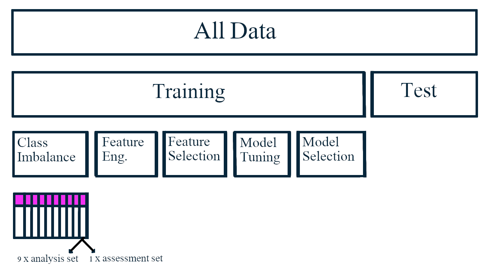
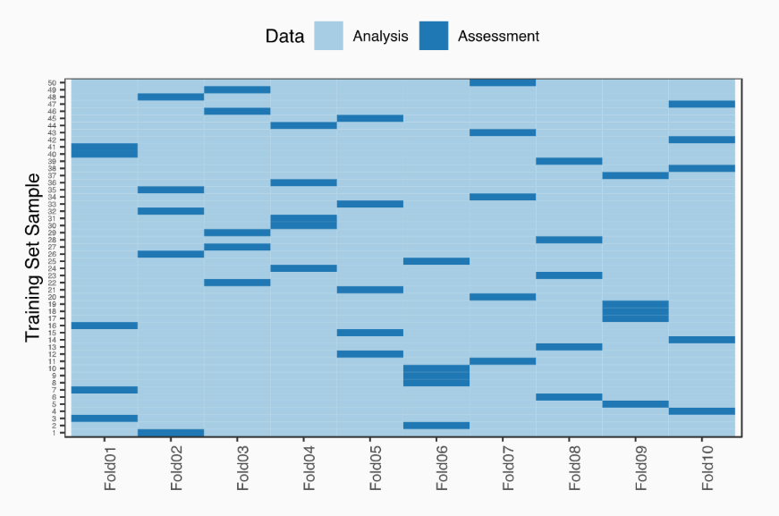
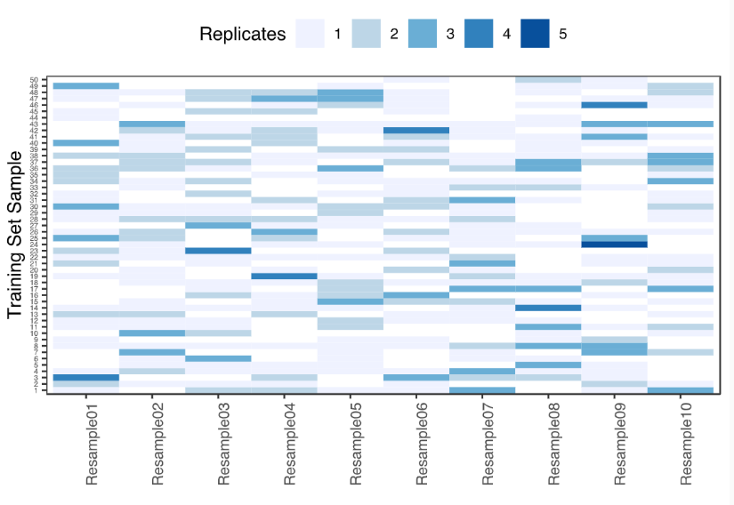
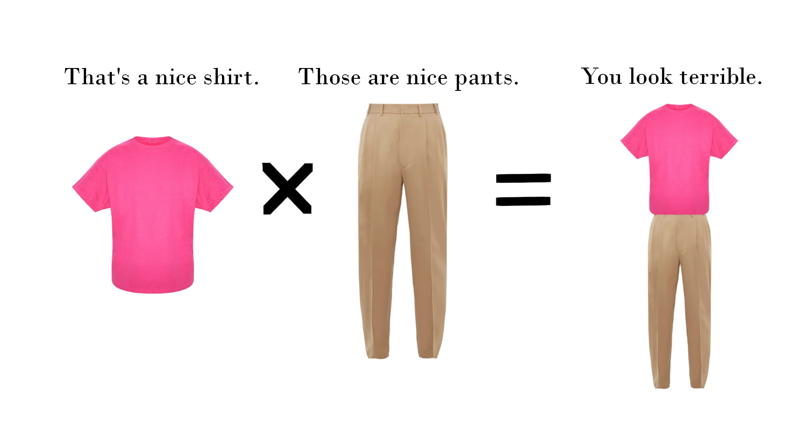
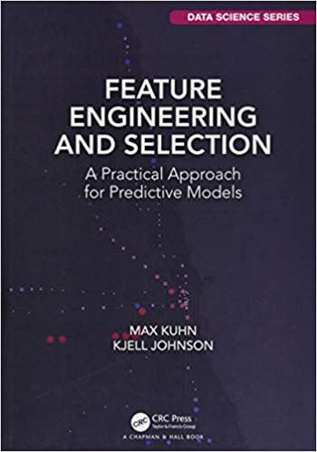

class: logo-slide

---

class: title-slide

## Feature Engineering

### Applications of Data Science - Class 15

### Giora Simchoni

#### `gsimchoni@gmail.com and add #dsapps in subject`

### Stat. and OR Department, TAU
### `r Sys.Date()`

---
```{r child = "../setup.Rmd"}
```

```{r packages, echo=FALSE, message=FALSE, warning=FALSE}
library(tidyverse)
library(glue)
```

class: section-slide

# What can you possibly teach us about Feature Engineering?

---

Our two previous modeling attempts, with [Modeling in the Tidyverse](https://dsapps-2020.github.io/Class_Slides/u1_d05-modeling/u1_d05-modeling.html) and in [The Trees](https://dsapps-2020.github.io/Class_Slides/u3_d01-trees/u3_d01-trees.html) where problematic.

- Using a "sinked" split, not using `set.seed()` - reproducible but wasteful
- "Lazy" feature engineering, not using the entire data, not creative
- No interactions
- Test once, on the same validation set, for everything
- Data "leakage" from training set to validation set (when imputing missing values)
- Sometimes tuning params, sometimes not
- No pre-processing of features, if at all by a hunch
- Not thinking about Multicollinearity where it hurts (regession)
- Almost no treatment of class imbalance in classification
- Chaotic feature selection

---

Reminder: We have two tasks, Regression and Classification:

1. Predict the income of an OKCupid user (from those who reported income)
2. Predict if an OKCupid user is a Cats or Dogs person, where:

```{r}
cats_categories <- c("has cats", "likes cats", "dislikes dogs and has cats",
                     "dislikes dogs and likes cats")
dogs_categories <- c("has dogs", "likes dogs", "has dogs and dislikes cats",
                     "likes dogs and dislikes cats")
```

And 80% of users are Dogs people, so we have class imbalance.

---

On our validation set we got...

- Regression Task

Model       | RMSE | R
------------|------|--
LM          | 0.35 | 0.5
LM-L2       | 0.35 | 0.5
LM-L1       | 0.35 | 0.5
CART        | 0.36 | 0.45
Bagging     | 0.37 | 0.44
RF          | 0.35 | 0.49
GBT-gbm     | 0.35 | 0.5
GBT-XGBOOST | 0.35 | 0.5

---

- Classification Task

Model     | AUC | Accuracy | Recall Dogs | Precision Dogs | Recall Cats | Precision Cats
----------|-----|----------|-------------|----------------|-------------|----------
GLM       | 0.74|  0.68    |  0.68       |  0.92          |  0.66       |  0.26
GLM-EN    | 0.74|  0.67    |  0.67       |  0.92          |  0.67       |  0.26
CART      | 0.67|  0.75    |  0.79       |  0.9           |  0.49       |  0.28
GBT+Cutoff| 0.74|  0.70    |  0.71       |  0.9           |  0.65       |  0.32

And we were not impressed.

---

class: section-slide

# Resampling/Cross-Validation

---

### Resampling done right

The main goal of resampling: No Surprises.

(By generating multiple versions of our data, and watching how our model behaves on unseen fresh data again. And again. And again.)

- Resampling is a key principle when developing a ML solution
- All ML practitioners are aware of the menace of overfitting
- But resampling should also be made for:
  - Feature engineering and transformation .font80percent[(should I use the Box-Cox or Yeo-Johnson transformation?)]
  - Feature selection .font80percent[(Should I use 2nd-order intearctions here?)]
  - Choosing imputation strategy .font80percent[(Simply use the median or regress?)]
  - Tuning parameters .font80percent[(100 or 500 trees?)]
  - Model selection .font80percent[(LM or MARS?)]
  
---

- A good resampling scheme will:
  - Have more than one train/valid/test samples!*
  - Be stratified (usually by dependent variable distribution)
  - Use a (paired/repeated/within) statistical test on resamples to reach a decision, or at least a proper plot
  - Avoid data "leakage" and not include the test set!
  - Encompass all steps in model building
  - Ideally (when data is Big) perform each step on a different part *of the training data*

.insight[
`r emo::ji("bulb")` &ast; How many resamples?

`-` The higher the number the lower the variance of performance metric

`-` The higher the number the less data used in each resample, the higher the bias of performance metric
]

---

### Ideally (yes, I know)



---

### And don't forget

Only once we decide on the final pre-processing, features, model and parameters, will we fit the model two more times:
  1. On the entire training data, then test on the testing data and get a realistic metric of performance
  2. On the *entire* data, right before deployment to production
  
---

### Many approaches to resampling

But two most common:

1. V-fold Cross Validation (+ optionally repeating n times)
2. Bootstrap Samples

---

#### V-fold Cross Validation



.font80percent[
[Applied Machine Learning Workshop at Rstudio-conf 2019 / Max Kuhn](https://github.com/topepo/rstudio-conf-2019)
]

---

#### Bootstrap Samples



.insight[
`r emo::ji("bulb")` What is the probability of entering a fold (at least once)?
]

---

class: section-slide

# Let's Start from the Very Beginning

---

#### OkCupid from scratch

```{r, message=FALSE}
okcupid <- read_csv("../data/okcupid.csv.zip")

cats_categories <- c("has cats", "likes cats", "dislikes dogs and has cats",
                     "dislikes dogs and likes cats")
dogs_categories <- c("has dogs", "likes dogs", "has dogs and dislikes cats",
                     "likes dogs and dislikes cats")

okcupid <- okcupid %>%
  mutate(pets = case_when(
           pets %in% cats_categories ~ "cats",
           pets %in% dogs_categories ~ "dogs",
           TRUE ~ NA_character_)) %>%
  drop_na(pets) %>%
  na_if(-1) %>%
  select(-last_online)

okcupid[which(is.na(okcupid$height)), "height"] <- 70 # you don't wanna know
```

---

Using `rsample::initial_split(okcupid, strata = pets)` would have been better, but if we do it now we won't have the same test data to compare.

```{r}
idx <- read_rds("../data/okcupid3_idx.rda")
train_idx <- idx$train_idx
valid_idx <- idx$valid_idx
test_idx <- idx$test_idx

okcupid_train <- okcupid[train_idx, ]
okcupid_valid <- okcupid[valid_idx, ]
okcupid_test <- okcupid[test_idx, ]
```

And let us bind `okcupid_train` and `okcupid_valid` together because we are going to use resampling anyway:

```{r}
okcupid_train <- bind_rows(okcupid_train, okcupid_valid)

glue("train no. of rows: {nrow(okcupid_train)}
     test no. of rows: {nrow(okcupid_test)}")
```

---

See that the class balance is more or less the same:

```{r}
okcupid_train %>% count(pets) %>% mutate(pct = n / sum(n))

okcupid_test %>% count(pets) %>% mutate(pct = n / sum(n))
```

Good enough .font80percent[(we could also drop a few cat people at random if they're too much in the test group)].

We stash our test data aside, kiss it good bye, we shall not see it again before the final assessment of our model.

---

#### That manager again.

Manager mentions casually: oh, and by the way, this model thingy of yours. Yeah, we need it to run in, like 10 milliseconds per user. Marketing team needs that, don't ask me why, and we can't have the users wait.

You: penalized logistic regression it is `r emo::ji("smirking face")`

No one mentioned cats/dogs recall/precision to be of any particular importance, so we decide to maximize AUC and take care of cutoff later.

---

We explore the training data .font80percent[(skipping here at least a couple of hours in which we actually explore the data, I'm assuming we already know quite a bit!)]:

```{r}
glimpse(okcupid_train)
```

---

```{r Ok_Naniar, warning=FALSE, out.width="100%", fig.asp=0.5}
library(naniar)

vis_miss(okcupid_train %>%
           sample_frac(0.2) %>%
           select(-starts_with("essay")))
```

---

#### Q & A

Q: What type of variables do we have?

A: Numeric: age, height income; Text: essays; Categorical: all others


Q: Can our model(s) handle missing values?

A: Probably gonna use `glmnet` so: NO.


Q: Are missing values a serious issue here?

A: Oh yes. `income` 80+% missing, `offspring` 50+% missing. Gonna have to take care of it.

---

#### Q & A

Q: Can our model(s) handle categorical values?

A: Probably gonna use `glmnet` so: NO.


Q: Categorical variables with many levels?

A: Oh yes. `speaks` has over 2K. And there are those `essay`s.


Q: Numeric variables skewed?

A: Income, but all you need is log.


Q: Classes imbalance scenario?

A: Pretty imbalanced, 5 dogs people for every 1 cat person. Gonna have to take care of it.

---

#### You have to have a strategy

Strategy: Divide training data into 6 samples for 6 main decision/steps/tunings:

1. Missing data imputation
2. Class imbalance treatment
3. Feature Engineering for `essay` data
4. Looking into interactions
4. Model Tuning
5. Cutoff choice

.insight[
`r emo::ji("bulb")` We assume these decisions are additive or independent of each other. Does it have to be and what can we do if we suspect not? (Remember we are a Statisticians!)
]

---

Looking at our strategy, we decide the 12.7K observations need not split evenly between steps.

- Cutoff choice is "peanuts" compared to the other decisions, let's decide in advance that at this stage we would fit the chosen model on ~12K previously seen observations and choose a cutoff by looking at the remaining ~700 observations
- Missing data imputation, class imbalance and interaction steps will each be given 2K observations
- Model tuning 3K observations
- Text feature engineering and selection 3K observations
- Total: 12,729 training observations

---

We wish to make sure our samples are stratified by `pets`, so we'll use `initial_split()` in stages:

```{r, message=FALSE, warning=FALSE}
library(tidymodels)

set.seed(42)
ok_cutoff_split <- initial_split(okcupid_train,
                                 strata = pets, prop = (729 - 1)/12729)
ok_tr_cutoff <- training(ok_cutoff_split)
ok_train <- testing(ok_cutoff_split)

set.seed(42)
ok_missing_split <- initial_split(ok_train,
                                  strata = pets, prop = (2000 - 1)/12000)
ok_tr_missing <- training(ok_missing_split)
ok_train <- testing(ok_missing_split)

set.seed(42)
ok_imbalance_split <- initial_split(ok_train,
                                  strata = pets, prop = (2000 - 1)/10000)
ok_tr_imbalance <- training(ok_imbalance_split)
ok_train <- testing(ok_imbalance_split)
```

---

```{r, message=FALSE, warning=FALSE}
set.seed(42)
ok_interaction_split <- initial_split(ok_train,
                                      strata = pets, prop = (2000 - 1)/8000)
ok_tr_interaction <- training(ok_interaction_split)
ok_train <- testing(ok_interaction_split)

set.seed(42)
ok_tuning_split <- initial_split(ok_train,
                                  strata = pets, prop = (3000 - 1)/6000)
ok_tr_tuning <- training(ok_tuning_split)
ok_tr_eng <- testing(ok_tuning_split)
```

```{r, echo=FALSE}
tibble(
  name = c("missing", "imbalance", "engineering", "interaction",
           "tuning", "cutoff", "test"),
  df = list(ok_tr_missing, ok_tr_imbalance, ok_tr_eng,
            ok_tr_interaction, ok_tr_tuning, ok_tr_cutoff, okcupid_test)) %>%
  mutate(n_rows = map_dbl(df, nrow),
         cats_rate = map_dbl(df, ~mean(.x$pets == "cats")))
```

---

class: section-slide

# Dealing with Missing Data

---


### Missing Data

.font80percent[We could fill an entire semester on this subject!]

- What causes a missing datum?
  - Survey data
  - Merging data sources
  - Failure of measurement

---

- What is the missing data mechanism?
  - See [Little & Rubin (2019)](https://www.amazon.com/Statistical-Analysis-Missing-Probability-Statistics-ebook/dp/B07Q25CNSD/ref=sr_1_1?crid=2P6ERH22YRKUL&dchild=1&keywords=statistical+analysis+with+missing+data&qid=1587103544&s=books&sprefix=statistical+ana%2Cstripbooks-intl-ship%2C286&sr=1-1) seminal work
  - MCAR: "on some days the weighing scale batteries drained and we couldn't take the mice weight"
  - MAR: "on the 2024 elections poll a massive Facebook campaign called all women to refuse to cooperate with the Seker-Sheker company due to allegations of sexual harassment by the company's head Dani Marom"
  - MNAR: "some of the drug addicts under study missed the final few meetings in the treatment group and their data were discarded"
  
.insight[
`r emo::ji("bulb")` How would you asses the missing data mechanism in your dataset?
]

---

Exploring percent missingness

```{r Ok-Miss1, out.width="100%", fig.asp=0.5}
gg_miss_var(ok_tr_missing %>%
              select(-starts_with("essay")),
            show_pct = TRUE)
```

---

Exploring percent missingness by a predictor

```{r Ok-Miss2, out.width="100%", fig.asp=0.5, warning=FALSE}
gg_miss_var(ok_tr_missing %>%
              select(-starts_with("essay")),
            facet = sex, show_pct = TRUE)
```

---

Exploring missingness between a predictor and the response (categorical) variable

```{r}
ok_tr_missing %>%
    mutate(income_missing = is.na(income)) %>%
    count(income_missing, pets) %>%
  pivot_wider(id_cols = pets,
              names_from = income_missing,
              values_from = n) %>%
  mutate(pct_missing = `TRUE` / (`TRUE` + `FALSE`))
```

---

But we can do better

```{r Ok-Miss3, out.width="100%", fig.asp=0.5, echo=FALSE}
pct_missing <- function(predictor, pet) {
  ok_tr_missing %>%
    filter(pets == pet) %>%
    select(all_of(predictor)) %>%
    is.na() %>%
    mean()
}
pct_missing_gap <- function(predictor) {
  pct_missing(predictor, "dogs") - pct_missing(predictor, "cats")
}
predictors <- colnames(ok_tr_missing %>% select(-pets))

tibble(predictor = predictors,
       pct_miss_gap = map_dbl(predictor, pct_missing_gap),
       gap_positive = pct_miss_gap >= 0) %>%
  mutate(predictor = fct_reorder(predictor, pct_miss_gap)) %>%
  ggplot(aes(pct_miss_gap, predictor, fill = gap_positive)) +
  geom_col() +
  geom_vline(xintercept = 0) +
  guides(fill = FALSE) +
  labs(x = NULL, y = NULL, title = "%Missing: Dogs - Cats") +
  scale_x_continuous(labels = percent_format()) +
  theme_light()
```

---

Exploring missingness between two (categorical) predictors

```{r Ok-Miss4, out.width="90%", fig.asp=0.5, warning=FALSE, message=FALSE}
library(ggmosaic)

ok_tr_missing %>%
  mutate(body_type_missing = is.na(body_type)) %>%
  ggplot() +
  geom_mosaic(aes(x = product(body_type_missing, status),
                  fill = body_type_missing)) +
  labs(x = NULL, y = NULL) + theme_light()
```

---

Girl, you don't always need a plot...

```{r}
ok_tr_missing %>%
    mutate(body_type_missing = is.na(body_type)) %>%
    count(body_type_missing, status) %>%
  pivot_wider(id_cols = status,
              names_from = body_type_missing,
              values_from = n) %>%
  mutate(pct_missing = `TRUE` / (`TRUE` + `FALSE`))
```

---

The same with `body_type` missingness by `drugs`:

```{r}
ok_tr_missing %>%
    mutate(body_type_missing = is.na(body_type),
           drugs_missing = is.na(drugs)) %>%
    count(body_type_missing, drugs_missing) %>%
  pivot_wider(id_cols = drugs_missing,
              names_from = body_type_missing,
              values_from = n) %>%
  mutate(pct_missing = `TRUE` / (`TRUE` + `FALSE`))
```

---

But we can do better with a co-occurrence plot or a heatmap

```{r Ok-Miss5, out.width="100%", fig.asp=0.5}
ok_tr_missing %>%
  count(drugs, body_type) %>%
  ggplot(aes(drugs, body_type)) +
  geom_point(aes(size = n)) +
  theme_light()
```

---

Exploring missingness between numerical and categorical predictors

```{r Ok-Miss6, out.width="100%", fig.asp=0.5}
ok_tr_missing %>%
  mutate(bodytype_missing = is.na(body_type)) %>%
  ggplot(aes(bodytype_missing, age)) +
  geom_violin() +
  facet_wrap(. ~ sex) +
  theme_light()
```

---

Exploring missingness between two numerical predictors (borrowing `airquality` data)

```{r Ok-Miss7, out.width="50%"}
ggplot(airquality, aes(Ozone, Solar.R)) +
  naniar::geom_miss_point() +
  theme_light()
```

---

When the data is large you could perform PCA on the binary missing/non-missing matrix:

```{r Ok-Miss8-Cache, eval=FALSE}
binary_mat <- ok_tr_missing %>%
  select(-pets) %>%
  mutate_all(is.na)

prcomp(binary_mat) %>%
  pluck("rotation") %>%
  as_tibble() %>%
  select(PC1, PC2) %>%
  bind_cols(
    tibble(
      predictor = colnames(binary_mat),
      pct_missing = binary_mat %>% colSums() / nrow(ok_tr_missing) 
    )
  ) %>%
  mutate(label = ifelse(PC1 < -0.3 | PC2 > 0.3, predictor, "")) %>%
  ggplot(aes(PC1, PC2)) +
  geom_point(aes(size = pct_missing), color = "lightblue", alpha = 0.5) +
  ggrepel::geom_text_repel(aes(label = label)) +
  theme_light()
```

---

```{r Ok-Miss8, out.width="80%", echo=FALSE}
binary_mat <- ok_tr_missing %>%
  select(-pets) %>%
  mutate_all(is.na)

prcomp(binary_mat) %>%
  pluck("rotation") %>%
  as_tibble() %>%
  select(PC1, PC2) %>%
  bind_cols(
    tibble(
      predictor = colnames(binary_mat),
      pct_missing = binary_mat %>% colSums() / nrow(ok_tr_missing) 
    )
  ) %>%
  mutate(label = ifelse(PC1 < -0.3 | PC2 > 0.3, predictor, "")) %>%
  ggplot(aes(PC1, PC2)) +
  geom_point(aes(size = pct_missing), color = "lightblue", alpha = 0.5) +
  ggrepel::geom_text_repel(aes(label = label)) +
  theme_light()
```

---

#### Definitely not in MCAR land

- Keep the data missing, drop it all or impute values?
  - Very much depends on the mechanism of missing data
  - "Drop it all" only if you're "data rich" and assume MCAR
  - Keep or impute: can your model handle missing values?
  - "It's not a bug, it's a feature!": a new category or an additional variable
  - Use resampling to test the best strategy!

---

- How to impute?
  - Very much depends on the mechanism of missing data
  - Mean/median value if MCAR
  - kNN imputation
  - Iterative Regression/Classification algos (EM algorithm)
  - Use resampling to test the best strategy!

- What do you do with missing values in the response variable?
  - Semi-supervised Learning
  - Active Learning
  
---

Let's choose between 2 x 3 x 3 = 18 strategies:

1. Missing categorical features
  - adding an "unknown" category
  - imputing the most common category
2. The `income` feature:
  - Dropping it (it is 80% missing!!)
  - Log transofrmation, imputing the mean
  - Log transformation, kNN Imputation
3. The `essay` features:
  - Dropping  them
  - Adding `essay` length where a missing `essay` has length 0
  - Adding `essay` length where a missing `essay` has length 0 and adding "is_missing" feature to each `essay`

---

Use `step_mutate_*()` or add what you need beforehand.

```{r}
ok_tr_missing2 <- ok_tr_missing %>%
  select(-starts_with("essay")) %>%
  bind_cols(
    ok_tr_missing %>%
      transmute_at(vars(essay0:essay9),
            list("len" = ~ifelse(is.na(.x), 0, str_length(.x))))
  ) %>%
  bind_cols(
    ok_tr_missing %>%
      transmute_at(vars(essay0:essay9),
            list("isna" = ~ifelse(is.na(.x), 1, 0)))
  ) %>%
  rename_at(vars(contains("_len")),
            list(~paste("len", gsub("_len", "", .),
                        sep = "_") ) ) %>%
  rename_at(vars(contains("_isna")),
            list(~paste("isna", gsub("_isna", "", .),
                        sep = "_") ) ) %>%
  mutate_if(is.character, as.factor)
```

---

Defining recipes .font80percent[(without `prep()`!)], let's start with 2 to simplify.

```{r}
rec_miss_unk_none_none <- recipe(pets ~ ., data = ok_tr_missing2) %>%
  update_role(income, contains("essay"), new_role = "discarded") %>%
  step_normalize(all_numeric(), -has_role("discarded")) %>%
  step_other(all_nominal(), -has_role("discarded"), other = "other1") %>%
  step_novel(all_nominal(), -has_role("discarded"), -all_outcomes()) %>%
  step_unknown(all_nominal(), -has_role("discarded"), -all_outcomes()) %>%
  step_dummy(all_nominal(), -all_outcomes(),
             -has_role("discarded"), one_hot = FALSE)

rec_miss_mode_none_none <- recipe(pets ~ ., data = ok_tr_missing2) %>%
  update_role(income, contains("essay"), new_role = "discarded") %>%
  step_normalize(all_numeric(), -has_role("discarded")) %>%
  step_other(all_nominal(), -has_role("discarded"), other = "other1") %>%
  step_novel(all_nominal(), -has_role("discarded"), -all_outcomes()) %>%
  step_modeimpute(all_nominal(), -has_role("discarded"), -all_outcomes()) %>%
  step_dummy(all_nominal(), -all_outcomes(),
             -has_role("discarded"), one_hot = FALSE)
```

.font80percent[(pretty sure `step_rm` is a way to discard predictors altogether)]

---

Defining resamples

```{r}
set.seed(42)
cv_splits_missing <- vfold_cv(ok_tr_missing2, v = 10, strata = pets)

cv_splits_missing
```

---

Applying (two) recipes to all splits

```{r}
cv_splits_missing$rec_miss_unk_none_none <- map(
  cv_splits_missing$splits, prepper, recipe = rec_miss_unk_none_none)
cv_splits_missing$rec_miss_mode_none_none <- map(
  cv_splits_missing$splits, prepper, recipe = rec_miss_mode_none_none)

map_dbl(cv_splits_missing$rec_miss_unk_none_none, ~nrow(.$term_info))
```

```{r}
cv_splits_missing$rec_miss_unk_none_none[[1]]$term_info %>%
  filter(str_detect(variable, "speaks"))
```

---

Defining the model specification

```{r}
mod_lr <- logistic_reg() %>%
  set_engine("glmnet")
```

Fitting the model to all splits

```{r}
fit_lr <- function(rec_obj) 
  fit(mod_lr, pets ~ .,
      data = juice(rec_obj, all_predictors(), all_outcomes()))

cv_splits_missing$mod_lr_unk <- map(
  cv_splits_missing$rec_miss_unk_none_none, fit_lr)
cv_splits_missing$mod_lr_mode <- map(
  cv_splits_missing$rec_miss_mode_none_none, fit_lr)
```

---

Predicting on assessment data of each split

```{r}
pred_lr <- function(split_obj, rec_obj, model_obj) {
  mod_data <- bake(rec_obj,
                   new_data = assessment(split_obj),
                   all_predictors(), all_outcomes()) 
  out <- mod_data %>% select(pets)
  out$predicted <- predict(model_obj, mod_data, type = "prob",
                           penalty = 0.0001)$.pred_cats
  out
}

cv_splits_missing$pred_unk <- 
  pmap(
    lst(
      split_obj = cv_splits_missing$splits, 
      rec_obj = cv_splits_missing$rec_miss_unk_none_none, 
      model_obj = cv_splits_missing$mod_lr_unk
    ),
    pred_lr)
cv_splits_missing$pred_mode <- pmap(lst(
  split_obj = cv_splits_missing$splits,
  rec_obj = cv_splits_missing$rec_miss_mode_none_none,
  model_obj = cv_splits_missing$mod_lr_mode
),
pred_lr)
```

---

Measuring the AUC of each split

```{r}
cv_splits_missing$step_unknown <- map_dfr(
  cv_splits_missing$pred_unk, roc_auc, pets, predicted)$.estimate
cv_splits_missing$step_mode <- map_dfr(
  cv_splits_missing$pred_mode, roc_auc, pets, predicted)$.estimate
```

---

Comparing AUCs with a plot

```{r Ok-Miss9, out.width="90%", fig.asp=0.5}
cv_splits_missing %>%
  select(id, step_unknown, step_mode) %>%
  pivot_longer(cols = c(step_unknown, step_mode),
               names_to = "recipe", values_to = "auc") %>%
  ggplot(aes(recipe, auc, group = id, color = id)) +
  geom_line() +
  geom_point() +
  guides(color = FALSE) + theme_light()
```

---

Comparing AUCs with a statistical test (paired T test)

```{r}
t.test(cv_splits_missing$step_unknown,
       cv_splits_missing$step_mode, paired = TRUE)
```

---

Let's move on to 2 x 2 recipes, adding 2 more recipes for treating the `income` variable with mean imputation, with `step_unknown()` and `step_modeimpute()`.

```{r}
rec_miss_unk_mean_none <- recipe(pets ~ ., data = ok_tr_missing2) %>%
  update_role(contains("essay"), new_role = "discarded") %>%
  step_log(income, offset = 1) %>%
  step_meanimpute(income) %>%
  step_normalize(all_numeric(), -has_role("discarded")) %>%
  step_other(all_nominal(), -has_role("discarded"), other = "other1") %>%
  step_novel(all_nominal(), -has_role("discarded"), -all_outcomes()) %>%
  step_unknown(all_nominal(), -has_role("discarded"), -all_outcomes()) %>%
  step_dummy(all_nominal(), -all_outcomes(),
             -has_role("discarded"), one_hot = FALSE)

rec_miss_mode_mean_none <- recipe(pets ~ ., data = ok_tr_missing2) %>%
  update_role(contains("essay"), new_role = "discarded") %>%
  step_log(income, offset = 1) %>%
  step_meanimpute(income) %>%
  step_normalize(all_numeric(), -has_role("discarded")) %>%
  step_other(all_nominal(), -has_role("discarded"), other = "other1") %>%
  step_novel(all_nominal(), -has_role("discarded"), -all_outcomes()) %>%
  step_modeimpute(all_nominal(), -has_role("discarded"), -all_outcomes()) %>%
  step_dummy(all_nominal(), -all_outcomes(),
             -has_role("discarded"), one_hot = FALSE)
```

---

Our approach with 2 recipes does not scale, and we don't need to keep all data just final AUC for each recipe. We are writing a `train_recipe()` function!

```{r}
lst_recs <- list("unknown_none" = rec_miss_unk_none_none,
                 "mode_none" = rec_miss_mode_none_none,
                 "unknown_mean" = rec_miss_unk_mean_none,
                 "mode_mean" = rec_miss_mode_mean_none)

train_recipe <- function(rec, rec_name, splits) {
  splits_prepped <- map(splits, prepper, recipe = rec)
  splits_fit <- map(splits_prepped, fit_lr)
  splits_pred <- pmap(
    lst(
      split_obj = splits, 
      rec_obj = splits_prepped, 
      model_obj = splits_fit
    ),
    pred_lr
  )
  res <- map_dfr(splits_pred, roc_auc, pets, predicted)$.estimate
  names(res) <- rec_name
  res
}
```

---

Training multiple recipes, saving the AUC for each recipe, each split.

```{r}
cv_splits_missing <- cv_splits_missing %>%
  bind_cols(
    map2_dfc(lst_recs, names(lst_recs), train_recipe,
             splits = cv_splits_missing$splits)
  )
```

Processing the results into a nice table:

```{r}
cv_res_missing <- cv_splits_missing %>%
    pivot_longer(cols = names(lst_recs),
                 names_to = "recipe", values_to = "AUC") %>%
  select(id, recipe, AUC) %>%
  separate(recipe, c("categorical", "income"))

cv_res_missing
```

---

Comparing AUCs with a plot

```{r, echo=FALSE}
cv_res_missing_meds <- cv_res_missing %>%
  group_by(income, categorical) %>%
  summarise(AUC = mean(AUC), id = "All")
```

```{r Ok-Miss10, out.width="100%", fig.asp=0.5}
cv_res_missing %>%
  ggplot(aes(income, AUC, group = id, color = id)) +
  geom_line() + geom_line(data = cv_res_missing_meds, color = "black", alpha = 0.2, lwd = 2) +
  geom_point() + geom_point(data = cv_res_missing_meds, color = "black", alpha = 0.2, size = 5, pch = 17) +
    guides(color = FALSE) + facet_wrap(. ~ categorical) +
    theme_light()
```

---

Comparing AUCs with a statistical test (2x2 Repeated measures ANOVA)

```{r}
aov_missing <- aov(
  AUC ~ factor(categorical) * factor(income) + Error(factor(id)),
  data = cv_res_missing)
print(summary(aov_missing))
```

---

```{r Ok-Miss11, out.width="50%"}
with(cv_res_missing, interaction.plot(categorical, income, AUC))
```

---

Ok, now let's go back to our original idea of 18 recipes... see code in slides Rmd file.

```{r, echo=FALSE}
rec_miss_unk_knn_none <- recipe(pets ~ ., data = ok_tr_missing2) %>%
  update_role(contains("essay"), new_role = "discarded") %>%
  step_log(income, offset = 1) %>%
  step_knnimpute(income,
                 impute_with = imp_vars(
                   sex, age, starts_with("job"),
                   starts_with("education"))) %>%
  step_normalize(all_numeric(), -has_role("discarded")) %>%
  step_other(all_nominal(), -has_role("discarded"), other = "other1") %>%
  step_novel(all_nominal(), -has_role("discarded"), -all_outcomes()) %>%
  step_unknown(all_nominal(), -has_role("discarded"), -all_outcomes()) %>%
  step_dummy(all_nominal(), -all_outcomes(),
             -has_role("discarded"), one_hot = FALSE)

rec_miss_mode_knn_none <- recipe(pets ~ ., data = ok_tr_missing2) %>%
  update_role(contains("essay"), new_role = "discarded") %>%
  step_log(income, offset = 1) %>%
  step_knnimpute(income,
                 impute_with = imp_vars(
                   sex, age, height, starts_with("job"),
                   starts_with("education"))) %>%
  step_normalize(all_numeric(), -has_role("discarded")) %>%
  step_other(all_nominal(), -has_role("discarded"), other = "other1") %>%
  step_novel(all_nominal(), -has_role("discarded"), -all_outcomes()) %>%
  step_modeimpute(all_nominal(), -has_role("discarded"), -all_outcomes()) %>%
  step_dummy(all_nominal(), -all_outcomes(),
             -has_role("discarded"), one_hot = FALSE)

rec_miss_unk_none_len <- recipe(pets ~ ., data = ok_tr_missing2) %>%
  update_role(income, starts_with("isna"), new_role = "discarded") %>%
  step_log(starts_with("len"), offset = 1) %>%
  step_normalize(all_numeric(), -has_role("discarded")) %>%
  step_other(all_nominal(), -has_role("discarded"), other = "other1") %>%
  step_novel(all_nominal(), -has_role("discarded"), -all_outcomes()) %>%
  step_unknown(all_nominal(), -has_role("discarded"), -all_outcomes()) %>%
  step_dummy(all_nominal(), -all_outcomes(),
             -has_role("discarded"), one_hot = FALSE)

rec_miss_mode_none_len <- recipe(pets ~ ., data = ok_tr_missing2) %>%
  update_role(income, starts_with("isna"), new_role = "discarded") %>%
  step_log(starts_with("len"), offset = 1) %>%
  step_normalize(all_numeric(), -has_role("discarded")) %>%
  step_other(all_nominal(), -has_role("discarded"), other = "other1") %>%
  step_novel(all_nominal(), -has_role("discarded"), -all_outcomes()) %>%
  step_modeimpute(all_nominal(), -has_role("discarded"), -all_outcomes()) %>%
  step_dummy(all_nominal(), -all_outcomes(),
             -has_role("discarded"), one_hot = FALSE)

rec_miss_unk_mean_len <- recipe(pets ~ ., data = ok_tr_missing2) %>%
  update_role(starts_with("isna"), new_role = "discarded") %>%
  step_log(income, starts_with("len"), offset = 1) %>%
  step_meanimpute(income) %>%
  step_normalize(all_numeric(), -has_role("discarded")) %>%
  step_other(all_nominal(), -has_role("discarded"), other = "other1") %>%
  step_novel(all_nominal(), -has_role("discarded"), -all_outcomes()) %>%
  step_unknown(all_nominal(), -has_role("discarded"), -all_outcomes()) %>%
  step_dummy(all_nominal(), -all_outcomes(),
             -has_role("discarded"), one_hot = FALSE)

rec_miss_mode_mean_len <- recipe(pets ~ ., data = ok_tr_missing2) %>%
  update_role(starts_with("isna"), new_role = "discarded") %>%
  step_log(income, starts_with("len"), offset = 1) %>%
  step_meanimpute(income) %>%
  step_normalize(all_numeric(), -has_role("discarded")) %>%
  step_other(all_nominal(), -has_role("discarded"), other = "other1") %>%
  step_novel(all_nominal(), -has_role("discarded"), -all_outcomes()) %>%
  step_modeimpute(all_nominal(), -has_role("discarded"), -all_outcomes()) %>%
  step_dummy(all_nominal(), -all_outcomes(),
             -has_role("discarded"), one_hot = FALSE)

rec_miss_unk_knn_len <- recipe(pets ~ ., data = ok_tr_missing2) %>%
  update_role(starts_with("isna"), new_role = "discarded") %>%
  step_log(income, starts_with("len"), offset = 1) %>%
  step_knnimpute(income,
                 impute_with = imp_vars(
                   sex, age, height, starts_with("job"),
                   starts_with("education"))) %>%
  step_normalize(all_numeric(), -has_role("discarded")) %>%
  step_other(all_nominal(), -has_role("discarded"), other = "other1") %>%
  step_novel(all_nominal(), -has_role("discarded"), -all_outcomes()) %>%
  step_unknown(all_nominal(), -has_role("discarded"), -all_outcomes()) %>%
  step_dummy(all_nominal(), -all_outcomes(),
             -has_role("discarded"), one_hot = FALSE)

rec_miss_mode_knn_len <- recipe(pets ~ ., data = ok_tr_missing2) %>%
  update_role(starts_with("isna"), new_role = "discarded") %>%
  step_log(income, starts_with("len"), offset = 1) %>%
  step_knnimpute(income,
                 impute_with = imp_vars(
                   sex, age, height, starts_with("job"),
                   starts_with("education"))) %>%
  step_normalize(all_numeric(), -has_role("discarded")) %>%
  step_other(all_nominal(), -has_role("discarded"), other = "other1") %>%
  step_novel(all_nominal(), -has_role("discarded"), -all_outcomes()) %>%
  step_modeimpute(all_nominal(), -has_role("discarded"), -all_outcomes()) %>%
  step_dummy(all_nominal(), -all_outcomes(),
             -has_role("discarded"), one_hot = FALSE)

###

rec_miss_unk_none_isna <- recipe(pets ~ ., data = ok_tr_missing2) %>%
  update_role(income, new_role = "discarded") %>%
  step_log(starts_with("len"), offset = 1) %>%
  step_normalize(all_numeric(), -has_role("discarded")) %>%
  step_other(all_nominal(), -has_role("discarded"), other = "other1") %>%
  step_novel(all_nominal(), -has_role("discarded"), -all_outcomes()) %>%
  step_unknown(all_nominal(), -has_role("discarded"), -all_outcomes()) %>%
  step_dummy(all_nominal(), -all_outcomes(),
             -has_role("discarded"), one_hot = FALSE)

rec_miss_mode_none_isna <- recipe(pets ~ ., data = ok_tr_missing2) %>%
  update_role(income, new_role = "discarded") %>%
  step_log(starts_with("len"), offset = 1) %>%
  step_normalize(all_numeric(), -has_role("discarded")) %>%
  step_other(all_nominal(), -has_role("discarded"), other = "other1") %>%
  step_novel(all_nominal(), -has_role("discarded"), -all_outcomes()) %>%
  step_modeimpute(all_nominal(), -has_role("discarded"), -all_outcomes()) %>%
  step_dummy(all_nominal(), -all_outcomes(),
             -has_role("discarded"), one_hot = FALSE)

rec_miss_unk_mean_isna <- recipe(pets ~ ., data = ok_tr_missing2) %>%
  step_log(income, starts_with("len"), offset = 1) %>%
  step_meanimpute(income) %>%
  step_normalize(all_numeric(), -has_role("discarded")) %>%
  step_other(all_nominal(), -has_role("discarded"), other = "other1") %>%
  step_novel(all_nominal(), -has_role("discarded"), -all_outcomes()) %>%
  step_unknown(all_nominal(), -has_role("discarded"), -all_outcomes()) %>%
  step_dummy(all_nominal(), -all_outcomes(),
             -has_role("discarded"), one_hot = FALSE)

rec_miss_mode_mean_isna <- recipe(pets ~ ., data = ok_tr_missing2) %>%
  step_log(income, starts_with("len"), offset = 1) %>%
  step_meanimpute(income) %>%
  step_normalize(all_numeric(), -has_role("discarded")) %>%
  step_other(all_nominal(), -has_role("discarded"), other = "other1") %>%
  step_novel(all_nominal(), -has_role("discarded"), -all_outcomes()) %>%
  step_modeimpute(all_nominal(), -has_role("discarded"), -all_outcomes()) %>%
  step_dummy(all_nominal(), -all_outcomes(),
             -has_role("discarded"), one_hot = FALSE)

rec_miss_unk_knn_isna <- recipe(pets ~ ., data = ok_tr_missing2) %>%
  step_log(income, starts_with("len"), offset = 1) %>%
  step_knnimpute(income,
                 impute_with = imp_vars(
                   sex, age, height, starts_with("job"),
                   starts_with("education"))) %>%
  step_normalize(all_numeric(), -has_role("discarded")) %>%
  step_other(all_nominal(), -has_role("discarded"), other = "other1") %>%
  step_novel(all_nominal(), -has_role("discarded"), -all_outcomes()) %>%
  step_unknown(all_nominal(), -has_role("discarded"), -all_outcomes()) %>%
  step_dummy(all_nominal(), -all_outcomes(),
             -has_role("discarded"), one_hot = FALSE)

rec_miss_mode_knn_isna <- recipe(pets ~ ., data = ok_tr_missing2) %>%
  step_log(income, starts_with("len"), offset = 1) %>%
  step_knnimpute(income,
                 impute_with = imp_vars(
                   sex, age, height, starts_with("job"),
                   starts_with("education"))) %>%
  step_normalize(all_numeric(), -has_role("discarded")) %>%
  step_other(all_nominal(), -has_role("discarded"), other = "other1") %>%
  step_novel(all_nominal(), -has_role("discarded"), -all_outcomes()) %>%
  step_modeimpute(all_nominal(), -has_role("discarded"), -all_outcomes()) %>%
  step_dummy(all_nominal(), -all_outcomes(),
             -has_role("discarded"), one_hot = FALSE)
```

```{r}
lst_recs <- list("unknown_none_none" = rec_miss_unk_none_none,
                 "mode_none_none" = rec_miss_mode_none_none,
                 "unknown_mean_none" = rec_miss_unk_mean_none,
                 "mode_mean_none" = rec_miss_mode_mean_none,
                 "unknown_knn_none" = rec_miss_unk_knn_none,
                 "mode_knn_none" = rec_miss_mode_knn_none,
                 "unknown_none_len" = rec_miss_unk_none_len,
                 "mode_none_len" = rec_miss_mode_none_len,
                 "unknown_mean_len" = rec_miss_unk_mean_len,
                 "mode_mean_len" = rec_miss_mode_mean_len,
                 "unknown_knn_len" = rec_miss_unk_knn_len,
                 "mode_knn_len" = rec_miss_mode_knn_len,
                 "unknown_none_isna" = rec_miss_unk_none_isna,
                 "mode_none_isna" = rec_miss_mode_none_isna,
                 "unknown_mean_isna" = rec_miss_unk_mean_isna,
                 "mode_mean_isna" = rec_miss_mode_mean_isna,
                 "unknown_knn_isna" = rec_miss_unk_knn_isna,
                 "mode_knn_isna" = rec_miss_mode_knn_isna
                 )
```

---

```{r}
set.seed(42)
cv_splits_missing <- vfold_cv(ok_tr_missing2, v = 10, strata = pets)
```

```{r, eval=FALSE}
cv_splits_missing <- cv_splits_missing %>%
  bind_cols(
    map2_dfc(lst_recs, names(lst_recs), train_recipe,
             splits = cv_splits_missing$splits)
  )
```

```{r, echo=FALSE}
cv_res_missing <- read_rds("../data/Ok_missing_cv_res_auc.rds")
```

```{r, eval=FALSE}
cv_res_missing <- cv_splits_missing %>%
    pivot_longer(cols = names(lst_recs),
                 names_to = "recipe", values_to = "AUC") %>%
  select(id, recipe, AUC) %>%
  separate(recipe, c("categorical", "income", "essay"))
```

---

Again, see the plot .font80percent[(how would you plot a 2x3x3 experiment results?)].

```{r, echo=FALSE}
cv_res_missing_meds <- cv_res_missing %>%
  group_by(income, essay) %>%
  summarise(AUC = median(AUC), id = "All")
```

```{r Ok-Miss12, out.width="90%", fig.asp=0.5}
cv_res_missing %>%
  group_by(id, income, essay) %>%
  summarise(AUC = mean(AUC)) %>%
  ggplot(aes(income, AUC, group = id, color = id)) +
    geom_line() + geom_line(data = cv_res_missing_meds, color = "black", alpha = 0.2, lwd = 2) +
  geom_point() + geom_point(data = cv_res_missing_meds, color = "black", alpha = 0.2, size = 5, pch = 17) +
    guides(color = FALSE) + facet_wrap(. ~ essay) +
    theme_light()
```

---

Repeated measures ANOVA

```{r}
aov_missing <- aov(
  AUC ~ factor(categorical) * factor(income) + factor(essay) + Error(factor(id)),
  data = cv_res_missing)
summary(aov_missing)
```

---

Or you can just look at the mean numbers...

```{r}
cv_res_missing %>%
  group_by(categorical, income, essay) %>%
  summarise(AUC = mean(AUC)) %>%
  arrange(-AUC) %>%
  head(10)
```

.insight[
`r emo::ji("bulb")` So what would you do?
]

---

class: section-slide

# Class Imbalance

---

### Class Imbalance

.font80percent[(We already gave a decent review in [last class](https://dsapps-2020.github.io/Class_Slides/u3_d02-classtopics/u3_d02-classtopics.html))]

We'll choose between 3 strategies:
- Upsample
- Downsample
- SMOTE and Downsample

---

```{r}
ok_tr_imbalance2 <- ok_tr_imbalance %>%
  select(-starts_with("essay")) %>%
  bind_cols(
    ok_tr_imbalance %>%
      transmute_at(vars(essay0:essay9),
            list("len" = ~ifelse(is.na(.x), 0, str_length(.x))))
  ) %>%
  bind_cols(
    ok_tr_imbalance %>%
      transmute_at(vars(essay0:essay9),
            list("isna" = ~ifelse(is.na(.x), 1, 0)))
  ) %>%
  rename_at(vars(contains("_len")),
            list(~paste("len", gsub("_len", "", .),
                        sep = "_"))) %>%
  rename_at(vars(contains("_isna")),
            list(~paste("isna", gsub("_isna", "", .),
                        sep = "_"))) %>%
  mutate_if(is.character, as.factor)
```

---

```{r, warning=FALSE, message=FALSE}
library(themis)

rec_imb_upsample <- recipe(pets ~ ., data = ok_tr_imbalance2) %>%
  update_role(starts_with("isna"), new_role = "discarded") %>%
  step_log(income, starts_with("len"), offset = 1) %>%
  step_meanimpute(income) %>%
  step_normalize(all_numeric(), -has_role("discarded")) %>%
  step_other(all_nominal(), -has_role("discarded"), other = "other1") %>%
  step_novel(all_nominal(), -has_role("discarded"), -all_outcomes()) %>%
  step_modeimpute(all_nominal(), -has_role("discarded"), -all_outcomes()) %>%
  step_dummy(all_nominal(), -all_outcomes(),
             -has_role("discarded"), one_hot = FALSE) %>%
  step_upsample(pets, over_ratio = 1)

rec_imb_downsample <- recipe(pets ~ ., data = ok_tr_imbalance2) %>%
  update_role(starts_with("isna"), new_role = "discarded") %>%
  step_log(income, starts_with("len"), offset = 1) %>%
  step_meanimpute(income) %>%
  step_normalize(all_numeric(), -has_role("discarded")) %>%
  step_other(all_nominal(), -has_role("discarded"), other = "other1") %>%
  step_novel(all_nominal(), -has_role("discarded"), -all_outcomes()) %>%
  step_modeimpute(all_nominal(), -has_role("discarded"), -all_outcomes()) %>%
  step_dummy(all_nominal(), -all_outcomes(),
             -has_role("discarded"), one_hot = FALSE) %>%
  step_downsample(pets, under_ratio = 1)
```

---

```{r, warning=FALSE, message=FALSE}
rec_imb_smote <- recipe(pets ~ ., data = ok_tr_imbalance2) %>%
  update_role(starts_with("isna"), new_role = "discarded") %>%
  step_log(income, starts_with("len"), offset = 1) %>%
  step_meanimpute(income) %>%
  step_normalize(all_numeric(), -has_role("discarded")) %>%
  step_other(all_nominal(), -has_role("discarded"), other = "other1") %>%
  step_novel(all_nominal(), -has_role("discarded"), -all_outcomes()) %>%
  step_modeimpute(all_nominal(), -has_role("discarded"), -all_outcomes()) %>%
  step_dummy(all_nominal(), -all_outcomes(),
             -has_role("discarded"), one_hot = FALSE) %>%
  step_downsample(pets, under_ratio = 1.5) %>%
  step_smote(pets, over_ratio = 1)
```

---

CV splits

```{r}
set.seed(42)
cv_splits_imbalance <- vfold_cv(ok_tr_imbalance2, v = 10, strata = pets)

lst_recs <- list("upsample" = rec_imb_upsample,
                 "downsample" = rec_imb_downsample,
                 "smote" = rec_imb_smote)
```

```{r}
cv_splits_imbalance <- cv_splits_imbalance %>%
  bind_cols(
    map2_dfc(lst_recs, names(lst_recs), train_recipe,
             splits = cv_splits_imbalance$splits)
  )
```

---

```{r}
cv_res_imbalance <- cv_splits_imbalance %>%
    pivot_longer(cols = names(lst_recs),
                 names_to = "recipe", values_to = "AUC") %>%
  select(id, recipe, AUC)
```

Repeated measures ANOVA:

```{r}
aov_imbalance <- aov(
  AUC ~ factor(recipe) + Error(factor(id)),
  data = cv_res_imbalance)
print(summary(aov_imbalance))
```

---

Plotting...

```{r, echo=FALSE}
cv_res_imbalance_meds <- cv_res_imbalance %>%
  group_by(recipe) %>%
  summarise(AUC = median(AUC), id = "All")
```

```{r Ok-Imb1, out.width="100%", fig.asp=0.5}
cv_res_imbalance %>%
  ggplot(aes(recipe, AUC, group = id, color = id)) +
    geom_line() + geom_line(data = cv_res_imbalance_meds, color = "black", alpha = 0.2, lwd = 2) +
  geom_point() + geom_point(data = cv_res_imbalance_meds, color = "black", alpha = 0.2, size = 5, pch = 17) +
    guides(color = FALSE) +
    theme_light()
```

---

```{r}
print(cv_res_imbalance %>%
        group_by(recipe) %>%
        summarise(mean_auc = mean(AUC)))
```

.insight[
`r emo::ji("bulb")` So what would you do?
]

---

class: section-slide

# Feat. Engineering and Selection

---

### If anything, remember:

1. Don't be lazy.
2. Be creative.
3. Use resampling!

Let's divide to:
1. Categorical Features
2. Continuous Features
3. Interactions

---

class: section-slide

# Categorical Variables

---

### Making dummy variables

.font80percent[(In the case your model can accept categorical levels, skip to the next section - Dealing with categorical variables with many levels)]

- One hot encoding: $k$ dummy vars for $k$ levels
- Non one hot encoding: $k - 1$ dummy vars for $k$ levels
- Different Contrasts schemes .font80percent[(e.g. for ordered categorical variables ("low", "medium", "high"))]
- Feature Hashing

---

```{r}
set.seed(42)
df <- tibble(
  x1 = factor(c(rep("a", 4), rep("b", 4))),
  y = runif(8)
)

one_hot <- recipe(y ~ x1, data = df) %>%
  step_dummy(all_nominal(), one_hot = TRUE) %>%
  prep(df) %>%
  juice()

non_one_hot <- recipe(y ~ x1, data = df) %>%
  step_dummy(all_nominal(), one_hot = FALSE) %>%
  prep(df) %>%
  juice()
```

---

```{r}
head(one_hot)
```

```{r}
head(non_one_hot)
```

---

When dealing with linear regression, you should be very careful what you input into the `lm` engine of your choice and how you interpret results!

```{r}
summary(lm(y ~ ., data = non_one_hot))
```

```{r}
print(mean(df$y) + (mean(df$y[df$x1 == "a"]) - mean(df$y)))
print(mean(df$y[df$x1 == "a"]))
print(mean(df$y[df$x1 == "b"]) - mean(df$y[df$x1 == "a"]))
```

---

This is like:

```{r}
summary(lm(y ~ ., data = df))
```

---

But:

```{r}
summary(lm(y ~ ., data = one_hot))
```

---

```{r}
summary(lm(y ~ . - 1, data = one_hot))
```

---

This is like:

```{r}
summary(lm(y ~ . - 1, data = df))
```

---

Plot thickens (check your `options("contrasts")`!):

```{r}
summary(lm(y ~ ., data = df, contrasts = list(x1 = "contr.sum")))
```

---

Two variables...

```{r}
set.seed(42)
df <- tibble(
  x1 = factor(c(rep("a", 6), rep("b", 6))),
  x2 = factor(rep(c(rep("c", 2), rep("d", 2), rep("e", 2)), 2)),
  y = runif(12)
)

one_hot <- recipe(y ~ x1 + x2, data = df) %>%
  step_dummy(all_nominal(), one_hot = TRUE) %>%
  prep(df) %>%
  juice()

non_one_hot <- recipe(y ~ x1 + x2, data = df) %>%
  step_dummy(all_nominal(), one_hot = FALSE) %>%
  prep(df) %>%
  juice()
```

---

```{r}
head(one_hot)
```

```{r}
head(non_one_hot)
```

---

```{r}
summary(lm(y ~ ., data = non_one_hot))
```

---

Same as:

```{r}
summary(lm(y ~ ., data = df))
```

---

```{r}
print(mean(df$y) +
        (mean(df$y[df$x1 == "a"]) - mean(df$y)) +
        (mean(df$y[df$x2 == "c"]) - mean(df$y)))
print(mean(df$y[df$x1 == "a"]) + mean(df$y[df$x2 == "c"]) - mean(df$y))
print(mean(df$y[df$x1 == "b"]) - mean(df$y[df$x1 == "a"]))
print(mean(df$y[df$x2 == "d"]) - mean(df$y[df$x2 == "c"]))
print(mean(df$y[df$x2 == "e"]) - mean(df$y[df$x2 == "c"]))
```

---

```{r}
summary(lm(y ~ ., data = one_hot))
```

---

```{r}
print(mean(df$y[df$x1 == "b"]) + mean(df$y[df$x2 == "e"]) - mean(df$y))
print(mean(df$y[df$x1 == "a"]) - mean(df$y[df$x1 == "b"]))
print(mean(df$y[df$x2 == "c"]) - mean(df$y[df$x2 == "e"]))
print(mean(df$y[df$x2 == "d"]) - mean(df$y[df$x2 == "e"]))
```

---

```{r}
summary(lm(y ~ . - 1, data = one_hot))
```

---

```{r}
print(mean(df$y[df$x1 == "a"]) + mean(df$y[df$x2 == "e"]) - mean(df$y))
print(mean(df$y[df$x1 == "b"]) + mean(df$y[df$x2 == "e"]) - mean(df$y))
print(mean(df$y[df$x2 == "c"]) - mean(df$y[df$x2 == "e"]))
print(mean(df$y[df$x2 == "d"]) - mean(df$y[df$x2 == "e"]))
```

---

### Categorical variables with many levels

```{r}
ok_tr_eng %>% count(location)
```

---

#### Many dangers lurk
- OVERFITTING!
- Unseen levels
- Zero variance variables
- Size of $p$

#### We'll talk about

- The "Other" and "New" Strategy
- Clustering
- Feature Hashing
- Supervised Numerical Encoding
- Dimensionality Reduction (Embeddings)
- Text Features

---

#### The "Other" and "New" Strategy

- "Other": in many scenarios in which a categorical feature has many levels, some of these are so scarce it is doubtful if they have any predictive power - consider grouping them into one "Other" level
- "New": therefore there might be many levels not seen during training, only during testing - consider adding a (zero variance) "New" level

---

What % threshold should you use for "Other"?
- `step_other()` default is 5% (i.e. any level with less than 5% occurrence is grouped into one super-level "Other")
- or tune it!

```{r}
recipe(pets ~ ., data = ok_tr_eng %>% select(pets, location)) %>%
  step_other(all_nominal(), threshold = 0.05) %>%
  step_novel(all_nominal()) %>%
  prep(ok_tr_eng) %>%
  juice() %>%
  count(location)
```

---

You can also insert some creativeness (or plain common sense) in your "Other" strategy:

```{r, eval=FALSE}
education2 = case_when(
           education == "graduated from high school" ~ "high_school",
           education == "graduated from two-year college" ~ "college",
           education == "graduated from college/university" ~ "degree1",
           education == "graduated from masters program" ~ "degree2",
           education == "graduated from ph.d program" ~ "degree3",
           education == "working on two-year college" ~ "student0",
           education == "working on college/university" ~ "student1",
           education == "working on masters program" ~ "student2",
           education == "working on ph.d program" ~ "student3",
           is.na(education) ~ NA_character_,
           TRUE ~ "other"
)
```

---

#### Clustering

- Manual clustering, using expert knowledge and common sense
- Unsupervised clustering, where it makes sense (e.g. Topic Modeling with [LDA](https://en.wikipedia.org/wiki/Latent_Dirichlet_allocation) on text data)

.insight[
`r emo::ji("bulb")` How would you cluster `location`?
]

The `sign` feature is also a great example:

```{r}
ok_tr_eng %>% count(sign)
```

---

```{r}
signs <- c("leo", "libra", "cancer", "virgo", "scorpio", "gemini",
           "taurus", "aries", "pisces", "aquarius", "sagittarius", "capricorn")

recipe(pets ~ ., data = ok_tr_eng %>% select(pets, sign)) %>%
  step_mutate(sign = str_extract(sign, str_c(signs, collapse = "|"))) %>%
  step_unknown(sign) %>%
  prep(ok_tr_eng) %>%
  juice() %>%
  count(sign)
```

---

#### Feature Hashing

Suppose I told you "God, just group the locations by the number of times the letter 'l' appears in them!"

```{r}
recipe(pets ~ ., data = ok_tr_eng %>% select(pets, location)) %>%
  step_mutate(location = factor(str_count(location, "l"))) %>%
  prep(ok_tr_eng) %>%
  juice() %>%
  count(location)
```

---

```{r}
recipe(pets ~ ., data = ok_tr_eng %>% select(pets, location)) %>%
  step_mutate(locationL = factor(str_count(location, "l"))) %>%
  step_dummy(locationL) %>%
  prep(ok_tr_eng) %>%
  juice() %>%
  select(starts_with("location"))
```

---

It's not a good idea because
- Differenet `location`s map to the same bin ("collision"), masking possible effect
- The distribution isn't even

But there are advantages too!
- I *did* reduce the dimensionality from 100 to 6 dummy variables
- Fast
- Generalizes well: any new `location` can be mapped this way
- Scales: I can do this for millions of `location`s, no dictionary needed to store in memory

---

- Feature Hashing (or "hashing trick") does something similar more intelligently
- It lets you choose the hashing algo and no. of features you'd like (the more - the less chance of collision)

```{r, warning=FALSE, message=FALSE}
library(textrecipes)

recipe(pets ~ ., data = ok_tr_eng %>% select(pets, location)) %>%
  step_tokenize(location) %>%
  step_texthash(location, signed = FALSE, num_terms = 2^4) %>%
  prep(ok_tr_eng) %>%
  juice()
```

---

- Particularly useful for fast and furious feature engineering of text (see later)
- Beware of columns with zero variance, consider binning them to a "New" category
- Powerful methods like `xgboost` can handle 2^20+ no. of terms easily

.insight[
`r emo::ji("bulb")` Why would this work in spite of collisions?

What is still a major disadvantage? Hint: `r emo::ji("present")`.
]

---

#### Supervised Numerical Encoding

Here's another crazy idea for you:

- For regression, replace a category with $y$'s mean in this category
- For classification, replace a category with the log odds of $y$ in this category

---

Thus, changing a categorical variable with many levels into a single numerical variable (or a few for a few classes).

```{r, warning=FALSE, message=FALSE}
library(embed)

recipe(pets ~ ., data = ok_tr_eng %>% select(pets, location)) %>%
  step_mutate(location2 = location) %>%
  step_lencode_glm(location, outcome = vars(pets)) %>%
  prep(ok_tr_eng) %>%
  juice()
```

---

Make sure you get what just happened

```{r}
mv <- ok_tr_eng$location == "mountain view, california"
p <- mean(ok_tr_eng$pets[mv] == "cats")
log(p / (1 - p))
```

---

But...
- What if a specific location has just 1-2 samples in training set?
- "self-fulfilling prophecy"

The first issue can be somewhat alleviated using a Bayesian approach, *shrinking* somewhat coefficients towards their prior when n is small:

```{r, warning=FALSE}
recipe(pets ~ ., data = ok_tr_eng %>% select(pets, location)) %>%
  step_mutate(location2 = location) %>%
  step_lencode_bayes(location, outcome = vars(pets)) %>%
  prep(ok_tr_eng %>% head(100)) %>%
  juice()
```

---

#### Dimensionality Reduction (Embeddings)

See our `word2vec` detour when we learned about [Networks Community Detection](https://dsapps-2020.github.io/Class_Slides/u2_d04-community/u2_d04-community.html).

If you have `tensorflow` and `keras` installed, you could train your own embeddings to turn each `location` into a `num_terms` long vector of features:

```{r, eval=FALSE}
recipe(pets ~ ., data = ok_tr_eng %>% select(pets, location)) %>%
  step_mutate(location2 = location) %>%
  step_embed(location, outcome = vars(pets), num_terms = 10,
             options = embed_control(epochs = 10)) %>%
  prep(ok_tr_eng) %>%
  juice()
```

---

Alternatively you could use pre-trained embeddings for text variables such as `essay`s using `step_word_embedding()` from the `textrecipes` package (where `my_embeddings` are your pre-trained embeddings:

```{r, eval=FALSE}
recipe(pets ~ ., data = ok_tr_eng %>% select(pets, location)) %>%
  step_tokenize(location) %>%
  step_word_embeddings(location, embeddings = my_embeddings) %>%
  prep(ok_tr_eng) %>%
  juice()
```

---

Or, perform PCA on the dummay variables matrix, keeping only a few of the firt PCs as features:

```{r}
recipe(pets ~ ., data = ok_tr_eng %>% select(pets, location)) %>%
  step_mutate(old_location = location) %>%
  step_dummy(location) %>%
  step_normalize(all_numeric()) %>%
  step_pca(starts_with("location"), num_comp = 10) %>%
  prep(ok_tr_eng) %>%
  juice()
```

---

#### Text Features

Extracting textual features could be the subject of an entire class or even a course.

Just to demonstrate how worthwhile being creative can get here let us just add two textual features here, `n_cat` and `n_dog` in all `essay`s:

```{r}
ok_tr_eng2 <- ok_tr_eng %>%
  mutate_at(vars(essay0:essay9),
            list("len" = ~ifelse(is.na(.x), 0, str_length(.x)))) %>%
  rename_at(vars(contains("_len")),
            list(~paste("len", gsub("_len", "", .), sep = "_") ) )
```

---

```{r}
rec_eng_notext <- recipe(pets ~ ., data = ok_tr_eng2) %>%
  step_log(income, starts_with("len"), offset = 1) %>%
  step_meanimpute(income) %>%
  step_normalize(all_numeric(), -has_role("discarded")) %>%
  step_other(all_nominal(), -has_role("discarded"), other = "other1") %>%
  step_novel(all_nominal(), -has_role("discarded"), -all_outcomes()) %>%
  step_modeimpute(all_nominal(), -has_role("discarded"), -all_outcomes()) %>%
  step_dummy(all_nominal(), -all_outcomes(),
             -has_role("discarded"), one_hot = FALSE) %>%
  step_upsample(pets, over_ratio = 1)

str_count_na <- function(string, pattern = "") {
  n <- str_count(string, pattern)
  ifelse(is.na(n), 0, n)
}
```

---

```{r}
rec_eng_catdog <- recipe(pets ~ ., data = ok_tr_eng2) %>%
  step_mutate(essays = pmap_chr(
    list(essay0, essay1, essay2, essay3, essay4, essay5,
         essay6, essay7, essay8, essay9), str_c),
              n_cat = str_count_na(essays, "cat"),
              n_dog = str_count_na(essays, "dog")) %>%
  update_role(starts_with("essay"), new_role = "discarded") %>%
  step_log(income, starts_with("len"), offset = 1) %>%
  step_meanimpute(income) %>%
  step_normalize(all_numeric(), -has_role("discarded")) %>%
  step_other(all_nominal(), -has_role("discarded"), other = "other1") %>%
  step_novel(all_nominal(), -has_role("discarded"), -all_outcomes()) %>%
  step_modeimpute(all_nominal(), -has_role("discarded"), -all_outcomes()) %>%
  step_dummy(all_nominal(), -all_outcomes(),
             -has_role("discarded"), one_hot = FALSE) %>%
  step_upsample(pets, over_ratio = 1)
```

---

```{r, echo=FALSE, eval=FALSE}
set.seed(42)
cv_splits_eng <- vfold_cv(ok_tr_eng2, v = 10, strata = pets)

lst_recs <- list("notext" = rec_eng_notext,
                 "catdog" = rec_eng_catdog)

cv_splits_eng <- cv_splits_eng %>%
  bind_cols(
    map2_dfc(lst_recs, names(lst_recs), train_recipe,
             splits = cv_splits_eng$splits)
  )
```


```{r Ok-FES1-Cache, out.width="100%", fig.asp = 0.5, eval=FALSE, echo=FALSE}
cv_splits_eng %>%
    pivot_longer(cols = names(lst_recs),
                 names_to = "recipe", values_to = "AUC") %>%
  select(id, recipe, AUC) %>%
  ggplot(aes(recipe, AUC, group = id, color = id)) +
  geom_line() +
  geom_point() +
  guides(color = FALSE) +
  theme_light()
```

```{r, Ok-FES1, out.width="100%", fig.asp = 0.5, echo=FALSE}
cv_res_catdog <- read_rds("../data/Ok_catdog_cv_res_auc.rds")

cv_res_catdog_meds <- cv_res_catdog %>%
  group_by(recipe) %>%
  summarise(AUC = median(AUC), id = "All")

cv_res_catdog %>%
  ggplot(aes(recipe, AUC, group = id, color = id)) +
  geom_line() +
  geom_line(data = cv_res_catdog_meds, color = "black",
            alpha = 0.2, lwd = 2) +
  geom_point() +
  geom_point(data = cv_res_catdog_meds, color = "black",
             alpha = 0.2, size = 5, pch = 17) +
  guides(color = FALSE) +
  theme_light()
```

---

#### Text Features: some ideas for you

- not just words: do cat people tend to use more the letter "z"? no. of commas, no. of dot-dot-dots, no. of links, no. of hashtags, no. of extra spaces, no. of digits
- to stem or not to stem?
  - "plays", "playing", ["playa"](https://www.urbandictionary.com/define.php?term=Playa)
- sentiment features
  - not just no. of "hate" vs. love
  - also no. of "you" and "I"
- stop words or not to stop words?
- TF-IDF or not to TF-IDF
- Feature Hashing
- n-grams: "I love my cats"
- topics

---

#### Using `textrecipes` + `textfeatures`

- The `textrecipes` package lets you calculate a few features with a single `step_textfeature()`
- The `extract_functions` parameter accepts a named list of functions you wish to define on your text data
- By default it will accept `count_functions` list from the [`textfeatures`](https://textfeatures.mikewk.com/reference/textfeatures.html) by Mike Kearney, which gets you basic counts like `n_words`, `n_digits` etc.

---

But `textfeatures` also has via the `textfeatures()` function:
  - basic sentiment features like `sent_bing`
  - first word2vec 2-200 dimensions!

```{r}
print(textfeatures:::sentiment_bing("I hate cats!"))
print(textfeatures:::sentiment_bing("I love cats! Hate dogs though."))

print(textfeatures::word_dims(
  "Why would Kim Jong-un insult me by calling me \"old,\""))
```

---

```{r}
ok_tr_eng2 <- ok_tr_eng2 %>%
  mutate(essays = pmap_chr(
    list(essay0, essay1, essay2, essay3, essay4, essay5,
         essay6, essay7, essay8, essay9), str_c))

my_text_funs <- c(textfeatures::count_functions,
                      "sent_bing" = textfeatures:::sentiment_bing)
```

---

```{r}
recipe(pets ~ ., data = ok_tr_eng2 %>% select(pets, essays)) %>%
  update_role(essays, new_role = "discarded") %>%
  step_textfeature(essays, prefix = "t",
                   extract_functions = my_text_funs) %>%
  step_mutate_at(starts_with("t_"), fn = ~ifelse(is.na(.x), 0, .x)) %>%
  prep(ok_tr_eng2 %>% head(10)) %>%
  juice() %>%
  select(t_essays_n_uq_words, t_essays_n_hashtags, t_essays_sent_bing)
```

---

#### Text Features: but the words are most important

We'll take [Kuhn & Johnson (2019)](http://www.feat.engineering/index.html) approach, and:

1. Filter 1-gram tokens (words) with at least X occurrences
2. Calculate the odds ratio $\frac{P(w|cats)}{1- P(w|cats)} / \frac{P(w|dogs)}{1- P(w|dogs)}$ where $P(w|cats)$ is the % of cats people who used the word $w$ at least once in all essays
3. Calculate a p-value with a FDR correction
4. Choose words with OR of at least |2| and FDR value of maximum $10^{-5}$

Then use resampling to see if these have any effect on AUC.

---

```{r, warning=FALSE, message=FALSE}
library(tidytext)

tidy_essays <- ok_tr_eng2 %>%
  mutate(id = 1:n()) %>%
  select(id, pets, essays) %>%
  unnest_tokens(word, essays) %>%
  filter(!word %in% stop_words$word,
         str_detect(word, "[a-z]"))

tidy_essays %>% head()
```

---

```{r}
min_n_words <- tidy_essays %>%
  count(id, word) %>%
  count(word) %>%
  filter(n > 50) %>%
  pull(word)

print(c("cat", "dog", "cats", "dogs") %in% min_n_words)
```

```{r}
n_cats_people <- sum(ok_tr_eng2$pets == "cats")
n_dogs_people <- sum(ok_tr_eng2$pets == "dogs")

fisher_test <- function(cats, dogs) {
  cont_tab <- matrix(c(cats, n_cats_people - cats,
                       dogs, n_dogs_people - dogs),
                     ncol = 2, nrow = 2)
  ft <- fisher.test(cont_tab)
  list(OR = ft$estimate, p_val = ft$p.value)
}
```

---

```{r}
or_res <- tidy_essays %>%
  filter(word %in% min_n_words) %>%
  count(id, word, pets) %>%
  count(word, pets) %>%
  pivot_wider(id_cols = word, names_from = pets,
              values_from = n, values_fill = list(cats = 0, dogs = 0)) %>%
  mutate(fisher_obj = map2(cats, dogs, fisher_test))

or_res <- or_res %>%
  bind_cols(
    bind_rows(or_res$fisher_obj)
  ) %>%
  mutate(fdr = p.adjust(p_val, method = "fdr"))

or_res
```

---

```{r}
cd_words <- or_res %>%
  arrange(fdr) %>%
  filter(fdr < 10e-4)

cd_words
```

---

So these will be our four options for handling text:

1. Not
2. Text features (zero for `NA`)
3. Text features + our flagged words counts (zero for `NA`)
4. Feature Hashing

---

```{r}
count_words <- function(essays) {
  counts <- map(cd_words$word, ~str_count_na(essays, .x))
  names(counts) = str_c("w_", cd_words$word)
  counts
}

ok_tr_eng3 <- ok_tr_eng2 %>%
  bind_cols(
    map_dfr(ok_tr_eng2$essays, count_words)
  ) %>%
  select(-starts_with("essay"), -starts_with("len_essay")) %>%
  bind_cols(ok_tr_eng2 %>% select(essays)) %>%
  mutate_if(is.character, as.factor)
```

---

```{r}
rec_eng_notext <- recipe(pets ~ ., data = ok_tr_eng3) %>%
  update_role(starts_with("w_"), essays, new_role = "discarded") %>%
  step_log(income, offset = 1) %>%
  step_meanimpute(income) %>%
  step_normalize(all_numeric(), -has_role("discarded")) %>%
  step_other(all_nominal(), -has_role("discarded"), other = "other1") %>%
  step_novel(all_nominal(), -has_role("discarded"), -all_outcomes()) %>%
  step_modeimpute(all_nominal(), -has_role("discarded"), -all_outcomes()) %>%
  step_dummy(all_nominal(), -all_outcomes(),
             -has_role("discarded"), one_hot = FALSE) %>%
  step_upsample(pets, over_ratio = 1)

rec_eng_textfeat <- recipe(pets ~ ., data = ok_tr_eng3) %>%
  update_role(starts_with("w_"), essays, new_role = "discarded") %>%
  step_textfeature(essays, prefix = "t",
                   extract_functions = my_text_funs) %>%
  step_mutate_at(starts_with("t_"), fn = ~ifelse(is.na(.x), 0, .x)) %>%
  step_log(income, starts_with("t_"), -t_essays_sent_bing, offset = 1) %>%
  step_meanimpute(income) %>%
  step_zv(all_numeric()) %>%
  step_normalize(all_numeric(), -has_role("discarded")) %>%
  step_other(all_nominal(), -has_role("discarded"), other = "other1") %>%
  step_novel(all_nominal(), -has_role("discarded"), -all_outcomes()) %>%
  step_modeimpute(all_nominal(), -has_role("discarded"), -all_outcomes()) %>%
  step_dummy(all_nominal(), -all_outcomes(),
             -has_role("discarded"), one_hot = FALSE) %>%
  step_upsample(pets, over_ratio = 1)
```

---

```{r}
rec_eng_fulltext <- recipe(pets ~ ., data = ok_tr_eng3) %>%
  update_role(essays, new_role = "discarded") %>%
  step_textfeature(essays, prefix = "t",
                   extract_functions = my_text_funs) %>%
  step_mutate_at(starts_with("t_"), fn = ~ifelse(is.na(.x), 0, .x)) %>%
  step_log(income, starts_with("t_"), -t_essays_sent_bing, offset = 1) %>%
  step_meanimpute(income) %>%
  step_zv(all_numeric()) %>%
  step_normalize(all_numeric(), -has_role("discarded")) %>%
  step_other(all_nominal(), -has_role("discarded"), other = "other1") %>%
  step_novel(all_nominal(), -has_role("discarded"), -all_outcomes()) %>%
  step_modeimpute(all_nominal(), -has_role("discarded"), -all_outcomes()) %>%
  step_dummy(all_nominal(), -all_outcomes(),
             -has_role("discarded"), one_hot = FALSE) %>%
  step_upsample(pets, over_ratio = 1)

rec_eng_hashtext <- recipe(pets ~ ., data = ok_tr_eng3) %>%
  update_role(starts_with("w_"), essays, new_role = "discarded") %>%
  step_tokenize(essays) %>%
  step_tokenfilter(essays, min_times = 10) %>%
  step_texthash(essays, num_terms = 2^11) %>%
  step_log(income, offset = 1) %>%
  step_meanimpute(income) %>%
  step_zv(all_numeric()) %>%
  step_normalize(all_numeric(), -has_role("discarded")) %>%
  step_other(all_nominal(), -has_role("discarded"), other = "other1") %>%
  step_novel(all_nominal(), -has_role("discarded"), -all_outcomes()) %>%
  step_modeimpute(all_nominal(), -has_role("discarded"), -all_outcomes()) %>%
  step_dummy(all_nominal(), -all_outcomes(),
             -has_role("discarded"), one_hot = FALSE) %>%
  step_upsample(pets, over_ratio = 1)
```

---

```{r}
set.seed(42)
cv_splits_eng <- vfold_cv(ok_tr_eng3, v = 10, strata = pets)

lst_recs <- list("notext" = rec_eng_notext,
                 "textfeat" = rec_eng_textfeat,
                 "fulltext" = rec_eng_fulltext,
                 "hashtext" = rec_eng_hashtext)
```

```{r, eval=FALSE}
cv_res_eng <- cv_splits_eng %>%
  bind_cols(
    map2_dfc(lst_recs, names(lst_recs), train_recipe,
             splits = cv_splits_eng$splits)
  ) %>%
  pivot_longer(cols = names(lst_recs),
                 names_to = "recipe", values_to = "AUC") %>%
  select(id, recipe, AUC)

cv_res_eng_meds <- cv_res_eng %>%
  group_by(recipe) %>%
  summarise(AUC = median(AUC), id = "All")
```

```{r, echo=FALSE}
cv_res_eng <- read_rds("../data/Ok_eng_cv_res_auc.rds")

cv_res_eng_meds <- cv_res_eng %>%
  group_by(recipe) %>%
  summarise(AUC = mean(AUC), id = "All")
```

---

### Haven't forgot about our other categorical variables

Let's use some common sense (see code!).

```{r, echo=FALSE}
full_features <- function(df) {
  ethnicities_keep <- c("white", "asian", "hispanic / latin", "black", "indian",
                        "pacific islander", "middle eastern", "native american")

  not_perfect <- c("a little extra", "average", "curvy", "full figured",
                   "overweight", "rather not say")

signs <- c("leo", "libra", "cancer", "virgo", "scorpio", "gemini", "taurus",
           "aries", "pisces", "aquarius", "sagittarius", "capricorn")

narrow_category <- function(category, sep = " ") {
  if (is.na(category)) return(NA_character_)
  split_var <- str_split(category, sep)
  if (length(split_var[[1]]) == 1) return(category)
  return(split_var[[1]][2])
}

df2 <- df %>%
  mutate_at(vars(essay0:essay9),
            list("len" = ~ifelse(is.na(.x), 0, str_length(.x)))) %>%
  rename_at(vars(contains("_len")),
            list(~paste("len", gsub("_len", "", .), sep = "_"))) %>%
  mutate(
    essays = pmap_chr(
      list(essay0, essay1, essay2, essay3, essay4, essay5,
           essay6, essay7, essay8, essay9), str_c),
    offspring_no_kids = str_detect(offspring, "t have kids"),
    offspring_one_kid = str_detect(offspring, "has a kid"),
    offspring_many_kids = str_detect(offspring, "has kids"),
    offspring_wants_kids = str_detect(offspring,"wants them|want them|wants more|want more|wants kids|want kids"),
    religion_not2serious = str_detect(religion, "not too serious"),
    religion_laughing = str_detect(religion, "laughing"),
    religion_somewhat = str_detect(religion, "somewhat"),
    religion = case_when(
      str_detect(religion, "agnosticism") |
        str_detect(religion, "atheism") ~ "atheist",
      str_detect(religion, "buddhism") ~ "buddhist",
      str_detect(religion, "christianity") |
        str_detect(religion, "catholicism") ~ "christian",
      str_detect(religion, "judaism") ~ "jewish",
      str_detect(religion, "hinduism") ~ "hindu",
      str_detect(religion, "islam") ~ "muslim",
      TRUE ~ NA_character_),
    part_black = str_detect(ethnicity, "black"),
    part_white = str_detect(ethnicity, "white"),
    part_asian = str_detect(ethnicity, "asian"),
    part_hispanic = str_detect(ethnicity, "hispanic"),
    ethnicity = ifelse(ethnicity %in% ethnicities_keep, ethnicity, "other"),
    body_type_not_perfect = body_type %in% not_perfect,
    diet = map_chr(diet, narrow_category),
    sign_fun = str_detect(sign, "fun"),
    sign_not_matter = str_detect(sign, "but it does"),
    sign_matters = str_detect(sign, "matters"),
    sign = str_extract(sign, str_c(signs, collapse = "|")),
    speaks_spanish = str_detect(speaks, "spanish"),
    speaks_french = str_detect(speaks, "french"),
    speaks_german = str_detect(speaks, "german"),
    speaks_chinese = str_detect(speaks, "chinese"),
    speaks_fluently = str_detect(speaks, "fluently"),
    education_kind = case_when(
      str_detect(education, "^dropped") ~ "dropped",
      str_detect(education, "^graduated") ~ "graduated",
      str_detect(education, "^working") ~ "working",
      TRUE ~ "other"),
    education = case_when(
      education == "graduated from high school" ~ "high_school",
      education == "graduated from two-year college" ~ "college",
      education == "graduated from college/university" ~ "degree1",
      education == "graduated from masters program" ~ "degree2",
      education == "graduated from ph.d program" ~ "degree3",
      education == "working on two-year college" ~ "student0",
      education == "working on college/university" ~ "student1",
      education == "working on masters program" ~ "student2",
      education == "working on ph.d program" ~ "student3",
      is.na(education) ~ NA_character_,
      TRUE ~ "other"),
    job = map_chr(job, narrow_category, sep = " / "),
    location = case_when(
      location == "san francisco, california" ~ "sf",
      location == "oakland, california" ~ "oakland",
      location == "berkeley, california" ~ "berkeley",
      TRUE ~ "other_location"
    )
  ) %>%
  mutate_if(is.logical, as.factor) %>%
  mutate_if(is.character, as.factor) %>%
  select(-speaks, -offspring, -matches("^essay[0-9]"))

  df2 <- df2 %>%
    bind_cols(
      map_dfr(df2$essays, count_words)
    )
}
```

```{r}
ok_tr_eng4 <- full_features(ok_tr_eng)

colnames(ok_tr_eng4)
```

---

```{r}
rec_eng_commonsense <- recipe(pets ~ ., data = ok_tr_eng4) %>%
  update_role(essays, new_role = "discarded") %>%
  step_textfeature(essays, prefix = "t",
                   extract_functions = my_text_funs) %>%
  step_mutate_at(starts_with("t_"), fn = ~ifelse(is.na(.x), 0, .x)) %>%
  step_log(income, starts_with("len_"), starts_with("t_"),
           -t_essays_sent_bing, offset = 1) %>%
  step_meanimpute(income) %>%
  step_zv(all_numeric()) %>%
  step_normalize(all_numeric(), -has_role("discarded")) %>%
  step_other(all_nominal(), -has_role("discarded"), other = "other1") %>%
  step_novel(
    body_type, diet, drugs, job, sign, religion, smokes, drinks, education) %>%
  step_modeimpute(all_nominal(), -has_role("discarded"), -all_outcomes()) %>%
  step_dummy(all_nominal(), -all_outcomes(),
             -has_role("discarded"), one_hot = FALSE) %>%
  step_upsample(pets, over_ratio = 1)
```

---

```{r}
set.seed(42)
cv_splits_eng2 <- vfold_cv(ok_tr_eng4, v = 10, strata = pets)

lst_recs <- list("commonsense" = rec_eng_commonsense)
```

```{r, eval=FALSE}
cv_res_commonsense <- cv_splits_eng2 %>%
  bind_cols(
    map2_dfc(lst_recs, names(lst_recs), train_recipe,
             splits = cv_splits_eng2$splits)
  ) %>%
  pivot_longer(cols = names(lst_recs),
                 names_to = "recipe", values_to = "AUC") %>%
  select(id, recipe, AUC)

cv_res_commonsense_meds <- cv_res_commonsense %>%
  group_by(recipe) %>%
  summarise(AUC = mean(AUC), id = "All")
```

```{r, echo=FALSE}
cv_res_commonsense <- read_rds("../data/Ok_cs_cv_res_auc2.rds")

cv_res_cs_meds <- cv_res_commonsense %>%
  group_by(recipe) %>%
  summarise(AUC = mean(AUC), id = "All")
```

---

```{r Ok-FES3, out.width="100%", fig.asp=0.5}
cv_res_eng %>%
  bind_rows(cv_res_commonsense) %>%
  mutate(recipe = fct_relevel(recipe,
                              c("notext", "hashtext", "textfeat", "fulltext", "commonsense"))) %>%
  ggplot(aes(recipe, AUC, group = id, color = id)) +
  geom_line() + geom_line(data = cv_res_eng_meds %>% bind_rows(cv_res_cs_meds), color = "black", alpha = 0.2, lwd = 2) +
  geom_point() + geom_point(data = cv_res_eng_meds %>% bind_rows(cv_res_cs_meds), color = "black", alpha = 0.2, size = 5, pch = 17) +
  guides(color = FALSE) + theme_light()
```


---

class: section-slide

# Numerical Variables

---

### What could the problem be?

The problem almost always depends on the combination between models and variables:

- Varied scale (and kNN, SVM) --> `step_center()`, `step_scale()`, `step_normalize()`, `step_range()`
- Bounded range of outcome (e.g. percentage and, well, almost any model) --> `step_logit()`
- Skewed data and outliers (and linear regression, NN, kNN, SVM, but less for Trees)
- Non-linearity (and LR)
- Co-linearity (and LR, NN)

---

### Skewed Data: Common Transformations

#### Box-Cox

In its simplified form:

$$x_i^{(\lambda)} = \begin{cases}
   \frac{x_i^{\lambda} - 1}{\lambda} & \mbox{if }\lambda \ne 0\\
   \ln{x_i} & \mbox{if }\lambda = 0
 \end{cases}$$

---

Originally the Box-Cox transformation was developed to transform a dependent $y$ variable by maximizing the log-likelihood of seeing $y^{(\lambda)}$ in a `lm` against some $X$. 

But $\lambda$ could be estimated in an unsupervised way as well:

```{r Age-BoxCox, out.width="50%"}
MASS::boxcox(ok_tr_eng$age ~ 1)
```

---

```{r Age-BoxCox2, out.width="100%", fig.asp=0.5}
tibble(age = ok_tr_eng$age,
       age_bc = -1/age) %>%
  pivot_longer(starts_with("age"), names_to = "age") %>%
  ggplot(aes(value)) +
  geom_histogram(bins = 30, fill = "red", alpha = 0.5) +
  facet_wrap(~ age, scales = "free") + theme_light()
```

---

#### Yeo-Johnson

Revised Box-Cox to allow for zero and negative values:

$$x_i^{(\lambda)} = \begin{cases}
   \frac{(x_i + 1)^{\lambda} - 1}{\lambda} & \mbox{if }\lambda \ne 0,y \ge 0\\
   \ln{(x_i + 1)} & \mbox{if }\lambda = 0, y \ge 0 \\
   \frac{-[(-x_i + 1)^{2-\lambda} - 1]}{2 - \lambda} & \mbox{if }\lambda \ne 0,y < 0\\
   -\ln{(-x_i + 1)} & \mbox{if }\lambda = 0, y < 0 \\
 \end{cases}$$

Both transformations have `step`s in `recipes`:

```{r, eval=FALSE}
recipe(pets ~ ., data = ok_tr_eng) %>%
  step_BoxCox(income)
```

```{r, eval=FALSE}
recipe(pets ~ ., data = ok_tr_eng) %>%
  step_YeoJohnson(income)
```

---

### Non-Linearity: Basis Expansions and Splines

Let's borrow a continuous $y$ variable like `log(income)` to simplify:

```{r Income-Age-Scatter, warning=FALSE, out.width="100%", fig.asp=0.5}
ggplot(ok_tr_eng, aes(age, log(income))) +
  geom_point() +
  theme_light()
```

Remember MARS?

Perhaps you'd like to *expand* age to two variables: `max(45 - age, 0)` and `max(age - 45, 0)`?

---

You could do this manually in `lm()` like so

```{r}
mod_lm <- lm(log(income) ~ I(pmax(0, 45 - age)) + I(pmax(0, age - 45)),
             data = ok_tr_eng)

summary(mod_lm)
```

---

Or use `splines::bs()` with `degree = 1` and `knots = 45`.

```{r}
library(splines)
mod_lm_bs <- lm(log(income) ~ bs(age, degree = 1, knots = 45),
             data = ok_tr_eng)

summary(mod_lm_bs)
```

---

How will the variables look like?

```{r}
X <- model.matrix(mod_lm)
age_no_na <- ok_tr_eng$age[!is.na(ok_tr_eng$income)]
head(cbind(age_no_na, X), 4)
```

```{r}
X <- model.matrix(mod_lm_bs)
colnames(X)[2:3] <- c("age1", "age2")

head(cbind(age_no_na, X), 4)
```

`splines::bs()` re-parametrizes the variables but it is the same model!

---

How will the fit look like?

```{r Income-Age-Scatter2, warning=FALSE, out.width="100%", fig.asp=0.5}
ggplot(ok_tr_eng[!is.na(ok_tr_eng$income), ]) +
  geom_point(aes(age, log(income))) +
  geom_line(aes(age, mod_lm_bs$fit), color = "red", lwd = 2, alpha = 0.4) +
  theme_light()
```

---

Or with a simple cubic spline with one knot in `bs()`

```{r Income-Age-Scatter3, warning=FALSE, out.width="100%", fig.asp=0.5, echo=F}
mod_lm_bs2 <- lm(log(income) ~ bs(age, knots = 45), data = ok_tr_eng)
ggplot(ok_tr_eng[!is.na(ok_tr_eng$income), ]) +
  geom_point(aes(age, log(income))) +
  geom_line(aes(age, mod_lm_bs2$fit), color = "red", lwd = 2, alpha = 0.4) +
  theme_light()
```

---

Manually with `step_relu()`

```{r}
recipe(income ~ age, ok_tr_eng) %>%
  step_naomit(income) %>%
  step_relu(age, shift = 45, reverse = TRUE) %>%
  step_relu(age, shift = 45) %>%
  prep() %>%
  juice() %>%
  head()
```

---

For splines and polynomial regression use `step_bs()`, `step_ns()` and `step_poly()`

```{r}
recipe(income ~ age, ok_tr_eng) %>%
  step_naomit(income) %>%
  step_bs(age, degree = 3) %>%
  prep() %>%
  juice() %>%
  head()
```

---

### Co-linearity: Consider reducing dimensionality

> A conventional thought process is that the more predictors that are included, the better chance the model will have to find the signal. But this is not the case; including irrelevant predictors can have detrimental effects on the final model. The negative impacts include:
- increasing the computational time required for training a model
- decreasing the predictive performance
- complicating the predictor importance calculation.
By including any potential predictor, we end up with a sub-optimal model.

[Kuhn & Johnson (2019)](http://www.feat.engineering/index.html)

---

Common *dimensionality reduction* methods (some of which we've talked about!):
- PCA, Kernel PCA, Sparse PCA --> `step_pca()`, `step_kpca()`
- NMF --> `step_nnmf()`
- PLS --> `step_pls()`

All of these will find some projection matrix $B_{pxk}$ where $k$ is the number of columns (e.g. PCs) to choose and would typically be much lower than $p$, the original dimension.

You would then project your $X$ matrix like so: $X^* = XB$ (in most methods $X^*$ columns would also be linearly independent, or "close" to it), and you would fit your data on this transformed $X^*$

.warning[
`r emo::ji("warning")` No guarantee for improvement in performance! In fact...
]

.insight[
`r emo::ji("bulb")` What is an alternative to reduce dimensionality?
]

---

class: section-slide

# Interaction Effects

---

### What is Interaction?



---

### But seriously

```{r}
lm_int <- lm(log(income) ~ sex + height + sex:height,
             data = ok_tr_interaction %>% filter(between(height, 60, 80)))
summary(lm_int)
```

---

```{r Height-Sex-Interaction, warning=FALSE, message = FALSE, out.width="100%", fig.asp=0.5}
ok_tr_interaction %>% filter(between(height, 60, 80)) %>%
  ggplot(aes(height, log(income), color = sex)) +
  geom_point() +
  geom_smooth(method = "lm")
```

.insight[
`r emo::ji("bulb")` How would you visualize an interaction between two continuous features? Two categorical? Three?...
]

---

#### You get an interaction! You get an interaction!

With the last `rec_eng_commonsense` recipe we reached over 150 features.

So all two-way interactions would mean adding... over 11K features. All three-way interactions would mean adding... over 550K features.

.insight[
`r emo::ji("bulb")` What danger comes to mind? How would you defend yourself?

Which models surface interactions naturally? What about our model?

Should you include interaction terms before or after pre-processing?
]

---

Obviously, we need some control for this exploding no. of features:
- Expert knowledge .font80percent[(e.g. when it comes to income most variables probably interact with...?)]
- Heredity principle
- Resampling, Penalize
- When $p$ is huge: Two-Stage Modeling combined with your favorite Feature Selection approach
- Whatever you choose, visualize!

---

So these will be our four options for handling interactions:

1. Not
2. Adding only interactions between `sex` and everything
3. Two Stage: Screening all "main effects" features selected by a single `glmnet` stage then all two-way interactions of those features
4. Two Stage: Screening all two-way interactions by multiple comparisons of a `glm` main effects model vs. main effects + interaction, combined with FDR adjustment for the p-value
5. All two-way interactions `r emo::ji("sunglasses")` .font80percent[(with a `step_nzv()` though)]

---

For stages 3 and 4 let's use previously available data.

```{r}
ok_tr_combined <- bind_rows(
  ok_tr_missing,
  ok_tr_imbalance,
  ok_tr_eng
  )
ok_tr_combined <- full_features(ok_tr_combined)
```

---

For stage 3 need to screen out "main effects" features which passed `glmnet`


```{r}
main_data <- rec_eng_commonsense %>% prep(ok_tr_combined) %>% juice()

mod_lr_res <- mod_lr %>%
  fit(pets ~ ., data = main_data) %>%
  pluck("fit") %>%
  tidy()

mod_lr_res
```

---

We can plot no. of features selected by `glmnet` by lambda

```{r Interaction-Stage3-Glmnet, out.width="100%", fig.asp=0.5}
mod_lr_res %>%
  count(lambda) %>%
  ggplot(aes(lambda, n)) +
  geom_line(lwd = 2, color = "red", alpha = 0.5) +
  labs(y = "N features selected by glmnet") +
  theme_light()
```

---

We see a plateau around 12-15 features, let's choose those.

```{r}
mod_lr_res %>%
  filter(step == 8) %>%
  select(term, estimate) %>%
  arrange(-abs(estimate))
```

---

These make sense, let's choose them as our main effects from which we pick all two-way interactions.

```{r}
main_effects <- mod_lr_res %>%
  filter(step == 8, term != "(Intercept)") %>%
  pull(term)
```

For stage 4 we need to iterate over all possible two-way interactions, each time adding one into a full main effects `glm` model, getting the p-value, and applying FDR adjustment.

---

```{r, eval=FALSE}
extract_interaction_p_val <- function(var1, var2) {
  pb$tick()$print()
  int_term <- str_c(var1, ":", var2)
  mod_formula <- formula(str_c("pets ~ . + ", int_term))
  mod_glm <- glm(mod_formula,
                 data = main_data %>% select(-ends_with("_new")),
                 family = "binomial")
  mod_summary <- summary(mod_glm)
  p_val <- tidy(mod_glm) %>%
    filter(term == int_term) %>%
    pull(p.value)
  if (length(p_val) == 0) {
    return(NA_real_)
  }
  p_val
}

all_vars <- colnames(main_data %>% select(-ends_with("_new")))
all_ints <- t(combn(all_vars[-which(all_vars == "pets")], 2))
colnames(all_ints) <- c("var1", "var2")
all_ints <- as_tibble(all_ints)

pb <- progress_estimated(nrow(all_ints))
all_ints <- all_ints %>%
  mutate(p_val = map2_dbl(var1, var2, extract_interaction_p_val),
         fdr = p.adjust(p_val, method = "fdr"))
```

```{r, echo=FALSE}
all_ints <- read_rds("../data/Ok_interaction_fdr2.rds")
```

---

Let's filter only the *most* convincing interactions.

```{r}
pairwise_ints <- all_ints %>%
  arrange(fdr) %>%
  filter(fdr < 10e-6)

pairwise_ints
```

---

```{r W_Dog-Interaction, out.width="90%", fig.asp=0.5}
main_data %>%
  group_by(sex_m, pets) %>%
  summarise(mean_w_dog = mean(w_dog)) %>% ungroup() %>%
  mutate(gender = factor(ifelse(sex_m == 0, "women", "men"))) %>%
  ggplot(aes(pets, mean_w_dog, color = gender)) +
  geom_line(aes(group = gender)) + geom_point() +
  theme_light()
```

.insight[
`r emo::ji("bulb")` Try stating what you see in words.
]

---

```{r}
ok_tr_interaction2 <- full_features(ok_tr_interaction)

rec_int_noint <- rec_eng_commonsense

rec_int_sex <- recipe(pets ~ ., data = ok_tr_interaction2) %>%
  update_role(essays, new_role = "discarded") %>%
  step_textfeature(essays, prefix = "t",
                   extract_functions = my_text_funs) %>%
  step_mutate_at(starts_with("t_"), fn = ~ifelse(is.na(.x), 0, .x)) %>%
  step_log(income, starts_with("len_"), starts_with("t_"),
           -t_essays_sent_bing, offset = 1) %>%
  step_meanimpute(income) %>%
  step_zv(all_numeric()) %>%
  step_other(all_nominal(), -has_role("discarded"), other = "other1") %>%
  step_novel(
    body_type, diet, drugs, job, sign, religion, smokes, drinks, education) %>%
  step_modeimpute(all_nominal(), -has_role("discarded"), -all_outcomes()) %>%
  step_dummy(all_nominal(), -all_outcomes(),
             -has_role("discarded"), one_hot = FALSE) %>%
  step_interact(~starts_with("sex"):all_numeric()) %>%
  step_normalize(all_numeric(), -has_role("discarded")) %>%
  step_nzv(all_numeric(), freq_cut = 99/1) %>%
  step_upsample(pets, over_ratio = 1)
```

---

```{r}
# pairwise interactions string code from Max Kuhn's workshop:
# https://github.com/topepo/FES/blob/master/07_Detecting_Interaction_Effects/7_04_The_Brute-Force_Approach_to_Identifying_Predictive_Interactions/ames_glmnet.R

topmain_ints <- t(combn(main_effects, 2))
colnames(topmain_ints) <- c("var1", "var2")
topmain_ints <- topmain_ints %>% 
  as_tibble() %>%
  mutate(
    term = str_c(var1, ":", var2)
  ) %>% 
  pull(term) %>% 
  paste(collapse = "+")

topmain_ints <- str_c("~", topmain_ints)
topmain_ints <- as.formula(topmain_ints)

topmain_ints
```

---

```{r}
rec_int_topmain <- recipe(pets ~ ., data = ok_tr_interaction2) %>%
  update_role(essays, new_role = "discarded") %>%
  step_textfeature(essays, prefix = "t",
                   extract_functions = my_text_funs) %>%
  step_mutate_at(starts_with("t_"), fn = ~ifelse(is.na(.x), 0, .x)) %>%
  step_log(income, starts_with("len_"), starts_with("t_"),
           -t_essays_sent_bing, offset = 1) %>%
  step_meanimpute(income) %>%
  step_zv(all_numeric()) %>%
  step_other(all_nominal(), -has_role("discarded"), other = "other1") %>%
  step_novel(
    body_type, diet, drugs, job, sign, religion, smokes, drinks, education) %>%
  step_modeimpute(all_nominal(), -has_role("discarded"), -all_outcomes()) %>%
  step_dummy(all_nominal(), -all_outcomes(),
             -has_role("discarded"), one_hot = FALSE) %>%
  step_interact(topmain_ints) %>%
  step_normalize(all_numeric(), -has_role("discarded")) %>%
  step_nzv(all_numeric(), freq_cut = 99/1) %>%
  step_upsample(pets, over_ratio = 1)
```

---

```{r, echo=FALSE}
topint_ints <- pairwise_ints %>% 
  as_tibble() %>% 
  mutate(
    term = str_c(var1, ":", var2)
  ) %>% 
  pull(term) %>% 
  paste(collapse = "+")

topint_ints <- str_c("~", topint_ints)
topint_ints <- as.formula(topint_ints)
```


```{r}
rec_int_topints <- recipe(pets ~ ., data = ok_tr_interaction2) %>%
  update_role(essays, new_role = "discarded") %>%
  step_textfeature(essays, prefix = "t",
                   extract_functions = my_text_funs) %>%
  step_mutate_at(starts_with("t_"), fn = ~ifelse(is.na(.x), 0, .x)) %>%
  step_log(income, starts_with("len_"), starts_with("t_"),
           -t_essays_sent_bing, offset = 1) %>%
  step_meanimpute(income) %>%
  step_zv(all_numeric()) %>%
  step_other(all_nominal(), -has_role("discarded"), other = "other1") %>%
  step_novel(
    body_type, diet, drugs, job, sign, religion, smokes, drinks, education) %>%
  step_modeimpute(all_nominal(), -has_role("discarded"), -all_outcomes()) %>%
  step_dummy(all_nominal(), -all_outcomes(),
             -has_role("discarded"), one_hot = FALSE) %>%
  {if (!"smokes_when.drinking" %in% .$var_info$variable)
    step_mutate(., smokes_when.drinking = 0)} %>%
  step_interact(topint_ints) %>%
  step_normalize(all_numeric(), -has_role("discarded")) %>%
  step_nzv(all_numeric(), freq_cut = 99/1) %>%
  step_upsample(pets, over_ratio = 1)
```

---

```{r}
rec_int_all <- recipe(pets ~ ., data = ok_tr_interaction2) %>%
  update_role(essays, new_role = "discarded") %>%
  step_textfeature(essays, prefix = "t",
                   extract_functions = my_text_funs) %>%
  step_mutate_at(starts_with("t_"), fn = ~ifelse(is.na(.x), 0, .x)) %>%
  step_log(income, starts_with("len_"), starts_with("t_"),
           -t_essays_sent_bing, offset = 1) %>%
  step_meanimpute(income) %>%
  step_zv(all_numeric()) %>%
  step_other(all_nominal(), -has_role("discarded"), other = "other1") %>%
  step_novel(
    body_type, diet, drugs, job, sign, religion, smokes, drinks, education) %>%
  step_modeimpute(all_nominal(), -has_role("discarded"), -all_outcomes()) %>%
  step_dummy(all_nominal(), -all_outcomes(),
             -has_role("discarded"), one_hot = FALSE) %>%
  step_interact(~all_numeric():all_numeric()) %>%
  step_normalize(all_numeric(), -has_role("discarded")) %>%
  step_nzv(all_numeric(), freq_cut = 95/5) %>%
  step_upsample(pets, over_ratio = 1)
```

---

```{r}
set.seed(42)
cv_splits_int <- vfold_cv(ok_tr_interaction2, v = 10, strata = pets)

lst_recs <- list("noint" = rec_int_noint,
                 "sex" = rec_int_sex,
                 "topmain" = rec_int_topmain,
                 "topints" = rec_int_topints,
                 "all" = rec_int_all)
```

```{r, eval=FALSE}
cv_res_int <- cv_splits_int %>%
  bind_cols(
    map2_dfc(lst_recs, names(lst_recs), train_recipe,
             splits = cv_splits_int$splits)
  ) %>%
  pivot_longer(cols = names(lst_recs),
               names_to = "recipe", values_to = "AUC") %>%
  select(id, recipe, AUC)

cv_res_int_meds <- cv_res_int %>%
  group_by(recipe) %>%
  summarise(AUC = mean(AUC), id = "All")
```

```{r, echo=FALSE}
cv_res_int <- read_rds("../data/Ok_int_cv_res_auc2.rds")

cv_res_int_meds <- cv_res_int %>%
  group_by(recipe) %>%
  summarise(AUC = mean(AUC), id = "All")
```

---

```{r Ok-Int, out.width="100%", fig.asp=0.5}
cv_res_int %>%
  mutate(recipe = fct_relevel(recipe, c("noint", "sex", "topmain", "topints", "all"))) %>%
  ggplot(aes(recipe, AUC, group = id, color = id)) +
  geom_line() + geom_line(data = cv_res_int_meds, color = "black", alpha = 0.2, lwd = 2) +
  geom_point() + geom_point(data = cv_res_int_meds, color = "black", alpha = 0.2, size = 5, pch = 17) +
  guides(color = FALSE) + theme_light()
```

---

class: section-slide

# Tuning Params

---

### Everything is a Tunable

.insight[
`r emo::ji("bulb")` I can think of at least 5 semi-random quantitative decisions so far, can you?
]

But let us simply vary Elastic Net $\alpha$ and $\lambda$:

$\min_{\beta_0, \beta}\frac{1}{N}\sum_{i = 1}^N w_i l(y_i,\beta_0 + \beta^Tx_i) + \lambda[(1-\alpha)||\beta||^2_2/2 + \alpha||\beta||_1]$

```{r, warning=FALSE, message=FALSE}
library(tune)

mod_en_tune <- logistic_reg(penalty = tune(),
                            mixture = tune()) %>%
  set_engine("glmnet")

en_grid <- grid_regular(penalty(range(-6, 0)),
                        mixture(range(0, 1)), levels = c(7, 11))
```

---

```{r}
ok_tr_tuning2 <- full_features(ok_tr_tuning)

set.seed(42)
cv_splits_tune <- vfold_cv(ok_tr_tuning2, v = 10, strata = pets)
```

```{r, eval=FALSE}
tune_res <- tune_grid(object = mod_en_tune,
                      preprocessor = rec_int_topints,
                      resamples = cv_splits_tune,
                      grid = en_grid,
                      metrics = metric_set(roc_auc))

collect_metrics_tune_res <- collect_metrics(tune_res)

collect_metrics_tune_res
```

```{r echo=FALSE}
collect_metrics_tune_res <- read_rds("../data/Ok_tune_res_collect.rds")
show_best_tune_res <- read_rds("../data/Ok_tune_res_showbest.rds")

collect_metrics_tune_res
```

---

```{r Ok-Tune, out.width="100%", fig.asp=0.5}
collect_metrics_tune_res %>%
  mutate(auc = mean, mixture = factor(mixture)) %>%
  ggplot(aes(penalty, auc, color = mixture)) +
  geom_line() + geom_point() +
  theme_light()
```

---

```{r, eval=FALSE}
show_best(tune_res, n = 10, metric = "roc_auc")
```

```{r, echo=FALSE}
show_best_tune_res
```

.insight[
`r emo::ji("bulb")` So what would you do?
]

---

class: section-slide

# Cutoff choice

---

### The model is there.

Remember it is best to predict a score, let the model's "clients" choose what to do with that score.

Also remember the "I don't know" strategy!

But if we must, let us provide:
- a score to maximize precision of `cats` .font80percent[(while maintaing acceptable levels of recall)]
- a score to maximize recall of `cats` .font80percent[(while maintaing acceptable levels of precision)]
- a middle score

---

```{r}
ok_tr_combined <- full_features(
  bind_rows(
    ok_tr_missing,
    ok_tr_imbalance,
    ok_tr_eng,
    ok_tr_interaction,
    ok_tr_tuning))

ok_tr_cutoff2 <- full_features(ok_tr_cutoff)

rec_cutoff <- rec_int_topints %>%
  prep(ok_tr_combined)

ok_tr_for_cutoff <- rec_cutoff %>%
  juice()

ok_te_for_cutoff <- rec_cutoff %>%
  bake(ok_tr_cutoff2)

mod_lr_cutoff <- logistic_reg(penalty = 0.01, mixture = 1) %>%
  set_engine("glmnet")

mod_lr_cutoff <- mod_lr_cutoff %>%
  fit(pets ~ ., data = ok_tr_for_cutoff)

pred_cutoff <-  mod_lr_cutoff %>%
  predict(new_data = ok_te_for_cutoff, penalty = 0.01, type = "prob") %>%
  mutate(truth = ok_te_for_cutoff$pets)
```

---

```{r, warning=FALSE, message=FALSE}
library(pROC)

cutoffs <- seq(0.1, 0.9, 0.1)

roc_obj <- roc(pred_cutoff$truth, pred_cutoff$.pred_cats,
               levels = c("dogs", "cats"))
coords(roc_obj, x = cutoffs,
                ret = c("accuracy", "recall", "precision",
                        "specificity", "npv"),
                transpose = TRUE)
```

---

class: section-slide

# Predict on Test set

---

### Long time no see!

```{r}
set.seed(42)
random_cats_to_get_rid_of <- okcupid_test %>%
  mutate(id = 1:n()) %>%
  filter(pets == "cats") %>%
  sample_n(40) %>%
  pull(id)

okcupid_test2 <- okcupid_test %>%
  mutate(id = 1:n()) %>%
  filter(!id %in% random_cats_to_get_rid_of) %>%
  select(-id)
okcupid_test2 <- full_features(okcupid_test2)

okcupid_test2 %>% count(pets) %>% mutate(pct = n / sum(n))
```

---

```{r}
okcupid_test_baked <- rec_cutoff %>%
  bake(okcupid_test2)

mod_lr_test <- logistic_reg(penalty = 0.01, mixture = 1) %>%
  set_engine("glmnet")

mod_lr_test <- mod_lr_test %>%
  fit(pets ~ ., data = ok_tr_for_cutoff)

pred_test <-  mod_lr_test %>%
  predict(new_data = okcupid_test_baked, penalty = 0.01, type = "prob") %>%
  mutate(truth = okcupid_test_baked$pets)
```

```{r}
roc_auc(pred_test, truth, .pred_cats)
```

---

```{r Ok-Test-ROC-Curve, out.width="60%"}
roc_lr <- roc_curve(
  tibble(truth = pred_test$truth, cats = pred_test$.pred_cats),
  truth, cats)

autoplot(roc_lr) +
  labs(x = "1 - Recall(Dogs)", y = "Recall(Cats)")
```

---

```{r, message=FALSE}
roc_obj <- roc(pred_test$truth, pred_test$.pred_cats,
               levels = c("dogs", "cats"))

cutoffs <- c(0.3, 0.5, 0.9)

coords(roc_obj, x = cutoffs,
                ret = c("accuracy", "recall", "precision",
                        "specificity", "npv"),
                transpose = TRUE)
```

---

### What *is* the model?

```{r}
tidy(mod_lr_test) %>%
  filter(near(lambda, 0.01, tol = 0.0005)) %>%
  arrange(-abs(estimate)) %>%
  select(term, estimate, lambda) %>%
  head(20)
```

---

### What did we achieve?

- `r emo::ji("heavy_check_mark")` Reproducible model
- `r emo::ji("heavy_check_mark")` Dependable model
- `r emo::ji("heavy_check_mark")` Explainable model
- `r emo::ji("heavy_check_mark")` Small and Fast as hell model
- `r emo::ji("cross_mark")` Impressive model

### Is that the end?

No.

.insight[
`r emo::ji("bulb")` What *didn't* we do?
]

---

### Few Excellent Books

.pull-left[


]

.pull-right[



]