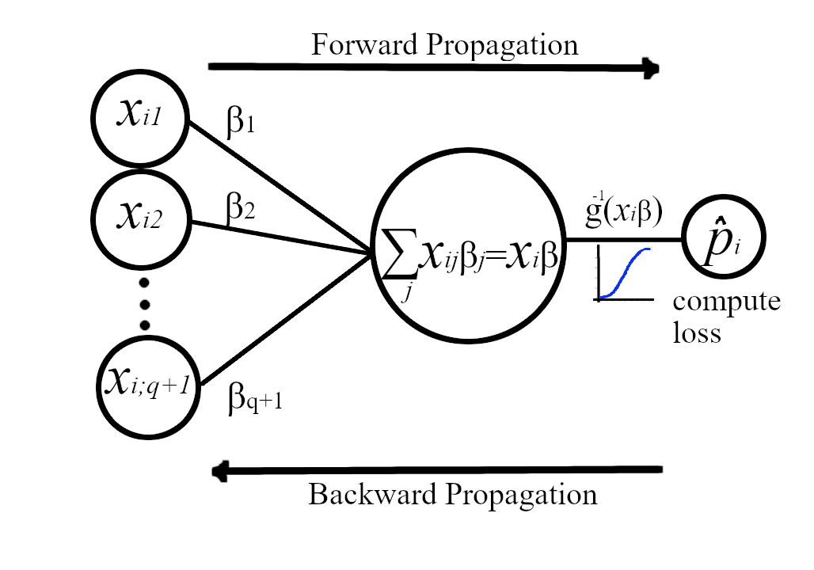
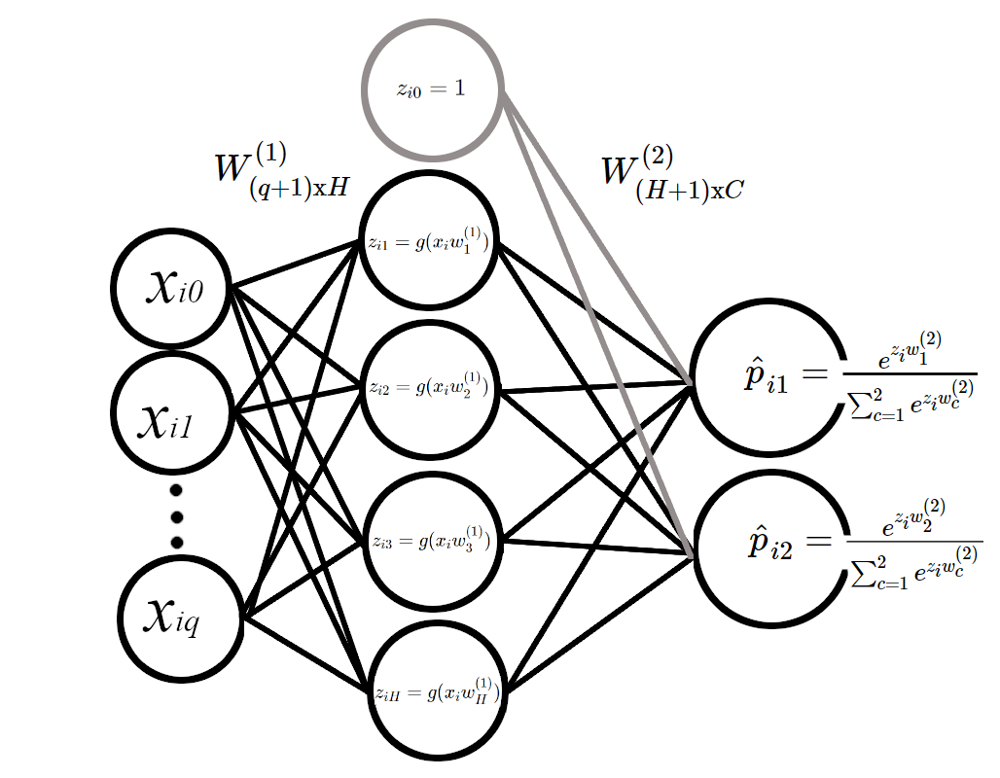
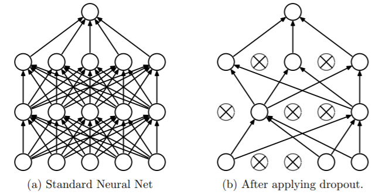
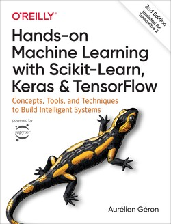

class: logo-slide

---

class: title-slide

### Demystifying Deep Neural Networks

### Applications of Data Science - Class 16

### Giora Simchoni

#### `gsimchoni@gmail.com and add #dsapps in subject`

### Stat. and OR Department, TAU
### `r Sys.Date()`

---
```{r child = "../setup.Rmd"}
```

```{r packages, echo=FALSE, message=FALSE, warning=FALSE}
library(tidyverse)
```

```{python, echo=FALSE, message=FALSE, warning=FALSE}
# Seed value (can actually be different for each attribution step)
seed_value= 0

# 1. Set `PYTHONHASHSEED` environment variable at a fixed value
import os
os.environ['PYTHONHASHSEED']=str(seed_value)

# 2. Set `python` built-in pseudo-random generator at a fixed value
import random
random.seed(seed_value)

# 3. Set `numpy` pseudo-random generator at a fixed value
import numpy as np
np.random.seed(seed_value)

# 4. Set `tensorflow` pseudo-random generator at a fixed value
import tensorflow as tf
tf.random.set_seed(seed_value)

# 5. Configure a new global `tensorflow` session
# from keras import backend as K
# session_conf = tf.ConfigProto(intra_op_parallelism_threads=1, inter_op_parallelism_threads=1)
# sess = tf.Session(graph=tf.get_default_graph(), config=session_conf)
# K.set_session(sess)
```

class: section-slide

# Logistic Regression as *we* know it

---

### LR as GLM

- We observe $y_1, ..., y_n$ binary outcomes, therefore we say $Y_i \sim Bernoulli(p_i)$ and $P(Y_i) = p_i^{y_i}(1-p_i)^{1-y_i}$
- We have $X_{n\text{x}(q + 1)}$ matrix of $q$ predictors for each observation + a $\vec{1}$ column for the intercept, let each row be $x_i$
- We wish to estimate a vector of weights for each of the $q+1$ predictors $\beta_{(q+1)\text{x}1}$, such that some function of $x_i\beta$ explains $E(Y_i)=P(Y_i=1)=p_i$
- We choose some *link function* $g$ and model *this* transformation of $E(Y_i)$
- Typically for this case $g$ is the logit function: $logit(p_i) = log(\frac{p_i}{1-p_i})=x_i\beta$

---

- And so we can write:

$E(Y_i)= P(Y_i=1|x_i;\beta) = p_i = g^{-1}(x_i\beta) = \frac{1}{1+e^{-x_i\beta}}$

- Also note that now we can write:

$P(Y_i|X;\beta) =  [g^{-1}(x_i\beta)]^{y_i}[1- g^{-1}(x_i\beta)]^{1-y_i} = (\frac{1}{1+e^{-x_i\beta}})^{y_i}(\frac{e^{-x_i\beta}}{1+e^{-x_i\beta}})^{1-y_i}$

- Once we get our estimate $\hat\beta$:
1. We could "explain" $Y_i$, the size and direction of each component of $\hat\beta$ indicating the contribution of that predictor to the *log-odds* of $Y_i$ being $1$
2. We could "predict" probability of new observation $x_i$ having $Y_i=1$ by fitting a probability $\hat p_i=\frac{1}{1+e^{-x_i\hat\beta}}$, where typically if $\hat p_i > 0.5$, or $x_i\hat\beta > 0$, we predict $Y_i=1$

---

### How to fit the model? MLE

Under the standard Maximum Likelihood approach we assume $Y_i$ are also *independent* and so their joint "likelihood" is:

$L(\beta|X, y) = \prod_{i = 1}^n{P(Y_i|X;\beta)} = \prod_{i = 1}^n[g^{-1}(x_i\beta)]^{y_i}[1- g^{-1}(x_i\beta)]^{1-y_i}$

The $\hat\beta$ we choose is the vector maximizing $L(\beta|X, y)$, only we take the log-likelihood which is easier to differentiate:

$l(\beta|X, y)=\sum_{i=1}^n\ln{P(Y_i|X;\beta)} =$
$\sum_{i=1}^n y_i\ln[g^{-1}(x_i\beta)] + (1-y_i)\ln[1- g^{-1}(x_i\beta)] =$

This looks Ok but let us improve a bit just for easier differentiation:

$\sum_{i=1}^n \ln[1- g^{-1}(x_i\beta)] + y_i\ln[\frac{g^{-1}(x_i\beta)}{1- g^{-1}(x_i\beta)}]=$
$\sum_{i=1}^n -\ln[1+ e^{x_i\beta}] + y_ix_i\beta$

---

### Life is like a box of chocolates

Differentiate:

$\frac{\partial l(\beta|X, y)}{\partial \beta_j} = \sum_{i=1}^n-\frac{1}{1+e^{x_i\beta}}e^{x_i\beta}x_{ij} + y_ix_{ij}=\sum_{i=1}^n x_{ij}(y_i-g^{-1}(x_i\beta))$

Or in matrix notation:

$\frac{\partial l(\beta|X, y)}{\partial \beta}=X^T(y - g^{-1}(X\beta))$

We would like to equate this with $\vec0$ and get $\hat\beta$ but there's no closed solution...

At which point usually the Newton-Raphson method comes to the rescue.

But let's look at simple gradient descent:

---

### Gradient De(A)scent

- Instead of maximizing log-likelihood, let's minimize minus log-likelihood $-l(\beta)$
- We'll start with an initial guess $\hat\beta_{t=0}$
- The partial derivatives vector of $-l(\beta)$ at point $\hat\beta_t$ (a.k.a the *gradient* $-\nabla l(\hat\beta_t)$) points to the direction of where $-l(\beta)$ has its steepest descent
- We'll go a small $alpha$ step down that direction: $\hat\beta_{t+1}=\hat\beta_t -\alpha \cdot[-\nabla l(\hat\beta_t)]$
- We do this for $I$ iterations or until some stopping rule indicating $\hat\beta$ has converged

---

### Show me that it's working

```{python LR-Sim-Ideal0, fig.show = "hide"}
import numpy as np
import matplotlib.pyplot as plt

n = 1000
q = 2
X = np.random.normal(size = n * q).reshape((n, q))
# X_with_intercept = np.hstack((np.ones(n).reshape((n, 1)), X))
beta = np.arange(1, q + 1) # [1, 2]
p = 1 / (1 + np.exp(-np.dot(X, beta)))
y = np.random.binomial(1, p, size = n)


X1 = np.linspace(-4, 4) # for plotting

def plot_sim(plot_beta_hat=True):
  plt.clf()
  plt.scatter(X[:, 0], X[:, 1], c = y)
  plt.plot(X1, -X1 * beta[0]/beta[1], linestyle = '--', color = 'red')
  if plot_beta_hat:
    plt.plot(X1, -X1 * beta_hat[0]/beta_hat[1], linestyle = '--')
  plt.xlabel('X1')
  plt.ylabel('X2')
  if plot_beta_hat:
    title = 'Guess: %.2f * X1 + %.2f * X2 = 0' % (beta_hat[0], beta_hat[1])
  else:
    title = 'Ideal: 1 * X1 + 2 * X2 = 0'
  plt.title(title)
  plt.show()

plot_sim(False)
```

---

```{python LR-Sim-Ideal, ref.label = "LR-Sim-Ideal0", echo = FALSE, out.width = "70%"}

```

---
`sklearn` should solve this easily:

```{python}
from sklearn.linear_model import LogisticRegression

lr = LogisticRegression(penalty='none', fit_intercept=False, max_iter=100)
lr.fit(X, y)
lr.coef_
```

---

With Gradient Descent let's start with initial guess

```{python LR-Sim-Guess, out.width = "50%"}
beta_hat = np.ones(q) # [1, 1]

plot_sim()
```

---

Let's do 1 iteration:

```{python LR-Sim-Guess1, out.width = "50%"}
alpha = 0.01

p_hat = 1 / (1 + np.exp(-np.dot(X, beta_hat)))
grad = -np.dot(X.T, (y - p_hat))
beta_hat = beta_hat - alpha * grad

plot_sim()
```

---

Let's do 50 more:

```{python LR-Sim-Guess10, out.width = "50%"}
for i in range(10):
  p_hat = 1 / (1 + np.exp(-np.dot(X, beta_hat)))
  grad = -np.dot(X.T, (y - p_hat))
  beta_hat = beta_hat - alpha * grad

plot_sim()
```

---

We didn't need to compute $-l(\beta)$ but let's:

```{python LR-Loss0, fig.show="hide"}
alpha = 0.001
beta_hat = np.array([-2.5, -2.5])
betas = [beta_hat]
ls = []
for i in range(50):
  p_hat = 1 / (1 + np.exp(-np.dot(X, beta_hat)))
  l_minus = -np.sum(y * np.log(p_hat) + (1 - y) * np.log(1 - p_hat))
  ls.append(l_minus)
  grad = -np.dot(X.T, (y - p_hat))
  beta_hat = beta_hat - alpha * grad
  betas.append(beta_hat)

plt.plot(range(50), ls)
plt.xlabel("Iteration")
plt.ylabel("-l(beta)")
plt.show()
```

---

```{python LR-Loss, ref.label = "LR-Loss0", echo=FALSE, out.width="70%"}

```

---

Even fancier, visualize the actual Gradient Descent in the $\beta$ space:

```{python LR-Descent0, fig.show="hide"}
betas_arr = np.array(betas)
m = 10
beta1 = np.linspace(-3.0, 3.0, m)
beta2 = np.linspace(-3.0, 3.0, m)
B1, B2 = np.meshgrid(beta1, beta2)
L = np.zeros((m, m))
for i in range(m):
  for j in range(m):
    beta_hat = np.array([beta1[i], beta2[j]])
    p_hat = 1 / (1 + np.exp(-np.dot(X, beta_hat)))
    L[i, j] = -np.sum(y * np.log(p_hat) + (1 - y) * np.log(1 - p_hat))
fig, ax = plt.subplots(1,1)
cp = ax.contourf(B1, B2, L)
cb = fig.colorbar(cp)
ax.set_title('-l(beta) Gradient Descent')
ax.set_xlabel('beta1')
ax.set_ylabel('beta2')
ax.plot(betas_arr[:, 0], betas_arr[:, 1], marker='x', color ='white')
ax.plot([beta[0]], [beta[1]], marker='x', color='red', markersize=20, markeredgewidth=5)
plt.show()
```

---

```{python LR-Descent, ref.label = "LR-Descent0", echo=FALSE, out.width="70%"}

```

---

class: section-slide

# Logistic Regression as Neural Network

---

### Call me by your name

1. Call our $-l(\beta)$ "Cross Entropy"
2. Call $g^{-1}(X\beta)$ the "Sigmoid Function"
3. Call computing $\hat p_i$ and $-l(\hat\beta)$ a "Forward Propagation" or "Feed Forward" step
4. Call the differentiation of $-l(\hat\beta)$ a "Backward Propagation" step
5. Call our $\beta$ vector $W_{(q+1)\text{x}1}$, a weight matrix
6. Add *Stochastic* Gradient Descent
7. Draw a diagram with circles and arrows, call these "Neurons", say something about the brain

And you have a Neural Network*.

.font80percent[*Ok, We'll add some stuff later]

---

### Cross Entropy

For discrete probability distributions $P(X)$ and $Q(X)$ with the same support $x \in \mathcal X$ Cross Entropy could be seen as a metric of the "distance" between distributions:

$H(P, Q) = -E_P[\log(Q)] = -\sum _{x\in {\mathcal{X}}}P(X=x)\log[Q(X=x)]$

In case $X$ has two categories, and $p_1=P(X=x_1)$, $p_2=1-p_1$ and same for $q_1,q_2$:

$H(P, Q) = -[p_1\log(q_1) + (1-p_1)\log(1-q_1)]$

If we let $p_1=y_i$ and $q_1=\hat p_i=g^{-1}(x_i\hat\beta)$ we get:

$H(y_i, \hat p_i) = -[y_i\log(\hat p_i) + (1-y_i)\log(1-\hat p_i)] =$
$-[y_i\ln[g^{-1}(x_i\hat\beta)] + (1-y_i)\ln[1- g^{-1}(x_i\hat\beta)]]$

Which is exactly the contribution of the $i\text{th}$ observation to $-l(\hat\beta)$.

---

### Sigmoid Function

If $g(p)$ is the logit function, its inverse would be the sigmoid function:

$g(p) = logit(p) = \log(\frac{p}{1-p}); \space\space g^{-1}(z) = sigmoid(z) =\frac{1}{1+e^{-z}}$

So: $g^{-1}(g(p)) = sigmoid(logit(p)) = p$

```{python Sigmoid, out.width="50%", echo=FALSE}
plt.clf()
plt.plot(X1, 1 / (1 + np.exp(-X1)))
plt.show()
```

---

### Forward/Backward Propagation

Recall that each iteration of Gradient Descent included:

1. Forward step: Calculating the loss $-l(\hat\beta)$
2. Backward step: Calculate the gradient $-\nabla l(\hat\beta_t)$
3. Gradient Descent: $\hat\beta_{t+1}=\hat\beta_t -\alpha \cdot[-\nabla l(\hat\beta_t)]$

```{python, eval=FALSE}
# forward step
p_hat = 1 / (1 + np.exp(-np.dot(X, beta_hat)))
l_minus = -np.sum(y * np.log(p_hat) + (1 - y) * np.log(1 - p_hat))
# backward step
grad = -np.dot(X.T, (y - p_hat))
# descent
beta_hat = beta_hat - alpha * grad
```

Why "Forward", why "Backward"?...

---

### Reminder: Chain Rule

In our case differentiating $l(\beta)$ analytically was... manageable.

As the NN architecture becomes more complex there is need to generalize this, and break down the derivative into (backward) steps.

Recall that according to the Chain Rule, if $y = y(x) = f(g(h(x)))$ then:

$y'(x)=f'(g(h(x)) \cdot g'(h(x)) \cdot h'(x)$

Or if you prefer, if $z = z(x); \space u = u(z); \space y = y(u)$ then:

$\frac{dy}{dx} = \frac{dy}{du} \cdot \frac{du}{dz} \cdot \frac{dz}{dx}$

---

Let's re-write $-l(\beta)$ as a composite function:

- Multiplying $\beta$ by $x_i$ will be $z_i = z(\beta) = x_i\beta$
- Applying the sigmoid $g^{-1}$ will be $p_i = g^{-1}(z_i) = \frac{1}{1 + e^{-z_i}}$
- Calculating the (minus) Cross Entropy will be: $l_i = l(p_i) = y_i\ln(p_i) + (1-p_i)\ln(1 - p_i)$
- So one element of $-l(\beta)$ will be: $l_i(p_i(z_i(\beta)))$

Hence, Forward.

Now $-l(\beta)$ is the sum of (minus) cross entropies: $-l(\beta) = -\sum_i l_i(p_i(z_i(\beta)))$

And we could differentiate using the chain rule like so:

$-\frac{\partial l(\beta)}{\partial \beta_j} = -\sum_i\frac{\partial l_i}{\partial p_i} \cdot \frac{\partial p_i}{\partial z_i} \cdot \frac{\partial z_i}{\partial \beta_j}$

Hence, Backward.

---

Each of these is simpler to calculate:

$\frac{\partial l_i}{\partial p_i}= \frac{y_i - p_i}{p_i(1-p_i)}$

$\frac{\partial p_i}{\partial z_i} = p_i(1-p_i)$

$\frac{\partial z_i}{\partial \beta_j}=x_{ij}$

And so:

$-\frac{\partial l(\beta)}{\partial \beta_j} = - \sum_i \frac{y_i - p_i}{p_i(1-p_i)} \cdot p_i(1-p_i) \cdot x_{ij}$

Which is excatly what we got analytically but now we can write our Gradient Descent iteration as a list of forward/backward steps:

---

```{python}
def forward(X, y, beta_hat):
  z = np.dot(X, beta_hat)
  p_hat = 1 / (1 + np.exp(-z))
  l = y * np.log(p_hat) + (1 - y) * np.log(1 - p_hat)
  l_minus = -np.sum(l)
  return p_hat, l_minus

def backward(X, y, p_hat):
  dldz = y - p_hat
  dzdb = X.T
  grad = -np.dot(dzdb, dldz)
  return grad

def gradient_descent(alpha, beta_hat, grad):
  return beta_hat - alpha * grad

def optimize(X, y, alpha, beta_hat):
  p_hat, l = forward(X, y, beta_hat)
  grad = backward(X, y, p_hat)
  beta_hat = gradient_descent(alpha, beta_hat, grad)
  return l, beta_hat

def lr_nn(X, y, epochs):
  beta_hat = np.array([-2.5, -2.5])
  alpha = 0.001
  for i in range(epochs):
    l, beta_hat = optimize(X, y, alpha, beta_hat)
  return l, beta_hat
```

---

### Stochastic Gradient Descent

```{python, eval=FALSE}
def lr_nn(X, y, epochs):
  beta_hat = np.random.rand(X.shape[1])
  alpha = 0.001
  batch_size = 100
  n = X.shape[0]
  steps = int(n / batch_size)
  for i in range(epochs):
    print('epoch %d:' % i)
    permute = np.random.permutation(n)
    X_perm = X[permute, :]
    y_perm = y[permute]
    for j in range(steps):
      start = j * batch_size
      l, beta_hat = optimize(X_perm[start:start + batch_size, :],
                            y_perm[start:start + batch_size],
                            alpha, beta_hat)
      print('Trained on %d/%d, loss = %d' % (start + batch_size, n, l))
  return l, beta_hat

l, beta_hat = lr_nn(X, y, 10)
```

---

```{python, echo=FALSE}
def lr_nn(X, y, batch_size, epochs):
  beta_hat = np.random.rand(X.shape[1])
  alpha = 0.001
  n = X.shape[0]
  steps = int(n / batch_size)
  for i in range(epochs):
    print('epoch %d/%d:' % (i + 1, epochs))
    permute = np.random.permutation(n)
    X_perm = X[permute, :]
    y_perm = y[permute]
    for j in range(steps):
      start = j * batch_size
      end = start + batch_size
      l, beta_hat = optimize(X_perm[start:end, :],
                            y_perm[start:end],
                            alpha, beta_hat)
      print('  %d/%d, loss = %d' % (end, n, l))
  return l, beta_hat

l, beta_hat = lr_nn(X, y, batch_size=100, epochs=50)
```

---

### Put it in a Neural Network Diagram

Binary Logistic Regression, is in fact a single neuron firing a sigmoid probability-like number between 0 and 1, for each sample:



---

### LR as NN in `Keras`

```{python}
from tensorflow.keras import Sequential
from tensorflow.keras.layers import Dense
from tensorflow.keras.optimizers import SGD

model = Sequential()
model.add(Dense(1, input_shape=(X.shape[1], ),
  activation='sigmoid', use_bias=False))
sgd = SGD(lr=0.1)
model.compile(loss='binary_crossentropy', optimizer=sgd)
model.fit(X, y, batch_size=100, epochs=50)
```

---

See that it makes sense:

```{python}
beta_hat = model.get_weights() # Note Keras gives a list of weights!
beta_hat
```


```{python}
pred = model.predict(X)
pred[:3]
```


```{python}
pred_manual = 1/(1+np.exp(-np.dot(X, beta_hat[0])))
pred_manual[:3]
```

---

### Is that it?

1. No `r emo::ji("happy")`
2. > The knee-jerk response from statisticians was "What's the big deal? A neural network is just another nonlinear model, not too different from many other generalizations of linear models". While this may be true, neural networks brought a new energy to the field. They could be scaled up and generalized in a variety of ways... and innovative learning algorithms for massive data sets."

.font80percent[(*Computer Age Statistical Inference* by Bradley Efron & Trevor Hastie, p. 352)]

---

class: section-slide

# Add Classes

---

### $C$ Neurons for $C$ Classes

Alternatively, we could:
- fit a $\beta$ vector for each class (or let's start talking about $W$)
- have $C$ neurons for $C$ classes
- where the output layer is the *Softmax Function*, to make sure the fitted $\hat p$ sum up to 1:

$\hat p_{i;c} = \text{softmax}(c,W_{(q+1)\text{x}C}, x_i)=\frac{e^{x_iw_c}}{\sum_{c=1}^{C} e^{x_iw_c}}$

Where $x_i$ is the $i$th row of $X$ as before and $w_c$ is the $c$th row of $W^T$ (or $c$th column of $W$)

.insight[
`r emo::ji("bulb")` This would be equivalent to *multinomial logistic regression*!
]

---

So the architecture for 2 classes would be:


---

And in `Keras` we would do:

```{python}
from tensorflow.keras.utils import to_categorical

y_categorical = to_categorical(y)
model = Sequential()
model.add(Dense(2, input_shape=(X.shape[1], ),
  activation='softmax', use_bias=False))
sgd = SGD(lr=0.1)
model.compile(loss='categorical_crossentropy', optimizer=sgd)
model.fit(X, y_categorical, batch_size=100, epochs=50)
```

---

See that it makes sense:

```{python}
W = model.get_weights()
W
```


```{python}
pred = model.predict(X)
pred[:3]
```


```{python}
Z = np.dot(X, W[0])
Z_exp = np.exp(Z)
Z_exp_sum = Z_exp.sum(axis=1)[:, None]
pred_manual = Z_exp / Z_exp_sum
pred_manual[:3]
```

---

class: section-slide

# Add Hidden Layers

---

### Don't Panic.



.font80percent[
Where $g()$ is some non-linear *activation function*, e.g. sigmoid (but not often used).
]

---
- Notice we are not in Logistic Regression land anymore
- I have re-instated the bias terms
- I'm calling `model.summary()` to see no. of params

```{python, eval=FALSE}
model = Sequential()
model.add(Dense(4, input_shape=(X.shape[1], ), activation='sigmoid'))
model.add(Dense(2, activation='softmax'))
sgd = SGD(lr=0.1)
model.compile(loss='categorical_crossentropy', optimizer=sgd)
model.fit(X, y_categorical, batch_size=100, epochs=50, verbose=0)
model.summary()
```

```{python, echo=FALSE}
model = Sequential()
model.add(Dense(4, input_shape=(X.shape[1], ), activation='sigmoid'))
model.add(Dense(2, activation='softmax'))
sgd = SGD(lr=0.1)
model.compile(loss='categorical_crossentropy', optimizer=sgd)
model.fit(X, y_categorical, batch_size=100, epochs=50, verbose=0)
model.summary()
```
---

See that it makes sense:

```{python, echo=FALSE}
W1, b1, W2, b2 = model.get_weights()
W1 = np.vstack([b1, W1])
W2 = np.vstack([b2, W2])
Xb = np.hstack((np.ones(n).reshape((n, 1)), X))
pred = model.predict(X)
```

```{python, eval=FALSE}
W1, b1, W2, b2 = model.get_weights()

W1.shape # (2, 4)
b1.shape # (4,)
W2.shape # (4, 2)
b2.shape # (2,)

W1 = np.vstack([b1, W1])
W2 = np.vstack([b2, W2])

W1.shape # (3, 4)
W2.shape # (5, 2)

# Get X ready with an intercept column
Xb = np.hstack((np.ones(n).reshape((n, 1)), X))
Xb.shape # (1000, 3)

pred = model.predict(X)

pred[:3]
```

```{python, echo=FALSE}
pred[:3]
```

---

```{python}
Z = 1/(1 + np.exp(-np.dot(Xb, W1)))
Zb = np.hstack((np.ones(n).reshape((n, 1)), Z))
Z2_exp = np.exp(np.dot(Zb, W2))
Z2_exp_sum = Z2_exp.sum(axis=1)[:, None]
pred_manual = Z2_exp / Z2_exp_sum

pred_manual[:3]
```

---

### Activation Functions: Tanh

$g(z)=\tanh(z)=\frac{e^z-e^{-z}}{e^z+e^{-z}}$

```{python Tanh, out.width="40%"}
plt.clf()
plt.plot(X1, (np.exp(X1) - np.exp(-X1)) / (np.exp(X1) + np.exp(-X1)))
plt.show()
```

---

### Activation Functions: ReLU

$g(z)=\text{ReLU}(z)=max(z,0)$

```{python ReLU, out.width="40%"}
plt.clf()
plt.plot(X1, np.maximum(X1, 0))
plt.show()
```

---

### Activation Functions: Leaky ReLU

$$g(z)=\text{LReLU}(z)=\begin{cases}
z \ge 0 & z\\
z<0 & \alpha z
\end{cases}$$
 
```{python LeakyReLU, out.width="40%"}
plt.clf()
plt.plot(X1, np.where(X1 > 0, X1, X1 * 0.01))
plt.show()
```

---

class: section-slide

# Add Regularization

---

### L1/L2 Regularization

You might have noticed neural networks intice you to add more and more params.

Therefore, NN are infamous for overfitting the training data, and some kind of regulariztion is a must.

Instead of minimizing some loss $L$ (e.g. Cross Entropy) we add a penalty to the weights: $\min_W{L(y, f(X; W)] + P(W)}$

Where $P(W)$ would typically be:
- $P_{L_2}(W)=\lambda \sum_{ijk}(W^{(k)}_{ij})^2$
- $P_{L_1}(W)=\lambda \sum_{ijk}|W^{(k)}_{ij}|$
- or both (a.k.a Elastic Net, but not quite): $P_{L1L2}(W) = \lambda_1 \sum_{ijk}(W^{(k)}_{ij})^2 + \lambda_2 \sum_{ijk}|W^{(k)}_{ij}|$

---

L1/L2 Regularization in `Keras`:

```{python, eval=FALSE}
from tensorflow.keras import regularizers

model = Sequential()
model.add(Dense(4, input_shape=(X.shape[1], ), activation='relu',
  kernel_regularizer=regularizers.l1(0.01),
  bias_regularizer=regularizers.l2(0.01)))
model.add(Dense(2, activation='softmax',
  kernel_regularizer=regularizers.l1_l2(l1=0.01, l2=0.01)))
sgd = SGD(lr=0.1)
model.compile(loss='categorical_crossentropy', optimizer=sgd)
model.fit(X, y_categorical, batch_size=100, epochs=50, verbose=0)
```

---

### Dropout

How to take neurons with a grain of salt?

During each epoch, individual neurons are either "dropped out" of the net with probability $1-p$ (i.e. their weight is zero) or kept with probability $p$, so that a reduced network is left.



.warning[
`r emo::ji("warning")` During prediction no Dropout is performed, but neurons output is scaled by $p$ to make it identical to their expected outputs at training time.
]

---

Why does it work? You could look at Dropout as an ensemble of neural networks! Each neuron can either count or not at each training step, so after 1K training steps you have virtually trained 1K slightly different models out of $2^N$ possible (where $N$ is no. of neurons).

Dropout in `Keras` (the `rate` parameter is the "fraction of the input units to drop"):

```{python, eval=FALSE}
from tensorflow.keras.layers import Dropout

model = Sequential()
model.add(Dense(4, input_shape=(X.shape[1], ), activation='relu'))
model.add(Dropout(0.2))
model.add(Dense(2, activation='softmax'))
sgd = SGD(lr=0.1)
model.compile(loss='categorical_crossentropy', optimizer=sgd)
model.fit(X, y_categorical, batch_size=100, epochs=50, verbose=0)
```

---

### Early Stopping

Since NN are trained iteratively and are particularly useful on large datasets it is common to monitor the model performance using an additional validation set, or some of the training set. If you see no improvement in the model's performance (e.g. decrease in loss) for a few epochs - stop training.

```{python, eval=FALSE}
from tensorflow.keras.callbacks import EarlyStopping

model = Sequential()
model.add(Dense(4, input_shape=(X.shape[1], ), activation='relu'))
model.add(Dropout(0.2))
model.add(Dense(2, activation='softmax'))
sgd = SGD(lr=0.1)
callbacks = [EarlyStopping(monitor='val_loss', patience=5)]
model.compile(loss='categorical_crossentropy', optimizer=sgd)
model.fit(X, y_categorical, batch_size=100, epochs=50,
  validation_split=0.2, callbacks=callbacks)
```

---

### Batch Normalization

---

class: section-slide

# Keras (The Beloved)

---

### Keras is an API

- [Keras](https://keras.io/) is a high-level API "designed for human beings, not machines" developed by [François Chollet](https://twitter.com/fchollet)
- It bridges to some popular DL backends such as [Tensorflow](https://www.tensorflow.org/), [Theano](http://deeplearning.net/software/theano/), [Apache MXNet](https://mxnet.apache.org/)
- But it is best integrated with Tensorflow, by Google. In fact, the formal docs of Keras now say:

```{python, eval=FALSE}
import tensorflow as tf
from tensorflow import keras
```

- "ease of use does not come at the cost of reduced flexibility"
- Seamless integration with the Pandasverse
- Keras itself has a surprisingly great API in R, by [RStudio](https://keras.rstudio.com/)
- You should know the competition by Facebook: [PyTorch](https://pytorch.org/)

---

### Malaria!

The [Malaria](https://lhncbc.nlm.nih.gov/publication/pub9932) dataset contains over 27K (processed and segmented) cell images with equal instances of parasitized and uninfected cells, from hundreds of patients in Bangaladesh. The images were taken by a mobile application that runs on a standard Android smartphone attached to a conventional light microscope. The goal is "reduce the burden for microscopists in resource-constrained regions and improve diagnostic accuracy".

This dataset is part of the [`tensorflow_dataset`](https://www.tensorflow.org/datasets) library which gives you easy access to dozens of varied datasets.

Here I will take only ~10% of the images as a Numpy array and resize them all to 100x100 pixels, for the sake of speed.

---

```{python Malaria, out.width="65%"}
import tensorflow_datasets as tfds
from skimage.transform import resize

malaria, info = tfds.load('malaria', split='train', with_info=True)
fig = tfds.show_examples(malaria, info)
```

---

```{python}
from sklearn.model_selection import train_test_split

images = []
labels = []
for example in tfds.as_numpy(malaria):
  images.append(resize(example['image'], (100, 100)))
  labels.append(example['label'])
  if len(images) == 2500:
    break
  
X = np.array(images)
y = np.array(labels)

X_train, X_test, y_train, y_test = train_test_split(X, y, test_size=0.20, random_state=42)

X_train = X_train.flatten().reshape((X_train.shape[0], -1))
X_test = X_test.flatten().reshape((X_test.shape[0], -1))

print(X_train.shape)
print(X_test.shape)
```

---

```{python}
from sklearn.linear_model import LogisticRegression

lr = LogisticRegression(penalty='none', max_iter=100, random_state=42)
lr.fit(X_train, y_train)

lr.score(X_test, y_test)
```

---

#### The `Sequential()` API

```{python}
from tensorflow import keras
from tensorflow.keras import Sequential
from tensorflow.keras.layers import Dense, Dropout

model = Sequential()
model.add(Dense(300, input_shape=(30000,), activation='relu'))
model.add(Dense(100, activation='relu'))
model.add(Dense(50, activation='relu'))
model.add(Dense(1, activation='sigmoid'))
```

Alternatively we could:

```{python, echo=FALSE}
keras.backend.clear_session()
```

```{python}
model = Sequential([
  Dense(300, input_shape=(30000,), activation='relu'),
  Dense(100, activation='relu'),
  Dense(50, activation='relu'),
  Dense(1, activation='sigmoid')
])
```

---

Make sure you get these numbers:

```{python}
model.summary()
```

.insight[
`r emo::ji("bulb")` Are you at all worried?
]
---

Access layers and their weights:

```{python}
model.layers
```

```{python}
model.layers[0].name
```

```{python}
W1, b1 = model.get_layer('dense').get_weights()

print(W1.shape)
W1
```

---

Compiling your model:

```{python}
model.compile(loss="binary_crossentropy",
  optimizer="adam",
  metrics=["accuracy"])
```

For more initialization schemes, losses, metrics and optimizers:
- https://keras.io/api/layers/initializers/
- https://keras.io/api/losses/
- https://keras.io/api/optimizers/
- https://keras.io/api/metrics/

---

Fitting the model:

```{python}
from tensorflow.keras.callbacks import EarlyStopping

callbacks = [EarlyStopping(monitor='val_loss', patience=5,
  restore_best_weights=True)]

history = model.fit(X_train, y_train,
  batch_size=100, epochs=50,
  validation_split=0.1, callbacks=callbacks)
```

---

See later the `history` object's many fields.

```{python History, out.width="100%", fig.asp=0.5}
import pandas as pd

pd.DataFrame(history.history).plot()
plt.grid(True)
plt.show()
```

---

Evaluate on test set:

```{python}
model.evaluate(X_test, y_test)
```

```{python}
from sklearn.metrics import confusion_matrix

y_pred = (model.predict(X_test) > 0.5).astype(int).reshape(y_test.shape)
pd.DataFrame(
  confusion_matrix(y_test, y_pred), 
  index=['true:yes', 'true:no'], 
  columns=['pred:yes', 'pred:no']
)
```

---

Tuning params:

```{python}
from tensorflow.keras.layers import InputLayer
from tensorflow.keras.optimizers import SGD

def malaria_model(n_hidden=1, n_neurons=30, lrt=3e-3):
  model = Sequential()
  model.add(InputLayer(input_shape=(30000, )))
  for layer in range(n_hidden):
    model.add(Dense(n_neurons, activation='relu'))
  model.add(Dense(1, activation='sigmoid'))
  model.compile(loss="binary_crossentropy",
    optimizer=SGD(lr=lrt),
    metrics=["accuracy"])
  return model

keras_clf = keras.wrappers.scikit_learn.KerasClassifier(malaria_model)
```

---

```{python, eval=FALSE}
from scipy.stats import reciprocal
from sklearn.model_selection import RandomizedSearchCV

params = {
  'n_hidden': [0, 1, 2, 3],
  'n_neurons': np.arange(1, 100),
  'lrt': reciprocal(3e-4, 3e-2)
}

rnd_search_cv = RandomizedSearchCV(keras_clf, params, cv=5,
  n_iter=10)
rnd_search_cv.fit(X_train, y_train, epochs=50,
  validation_split=0.1, callbacks=callbacks)

print(rnd_search_cv2.best_score_)
print(rnd_search_cv2.best_params_)
```

```{python, echo=FALSE}
# as this takes a while...
print(0.6630000114440918)
print({'lrt': 0.01678485252717544, 'n_hidden': 0, 'n_neurons': 15})
```

See also sklearn's [`GridSearchCV()`](https://scikit-learn.org/stable/modules/generated/sklearn.model_selection.GridSearchCV.html#sklearn.model_selection.GridSearchCV) and [KerasTuner](https://blog.tensorflow.org/2020/01/hyperparameter-tuning-with-keras-tuner.html) for a more robust solution.
---

Saving and restoring a model:

```{python}
model.save('malaria.h5')
```

Then:

```{python}
model = keras.models.load_model('malaria.h5')
model.predict(X_test[:3])
```

The HDF5 model saves the model's architechture and hyperparameters, and all weights matrices and biases.

Also see the `ModelCheckPoint()` callback.

```{python, echo=FALSE}
import os
os.remove('malaria.h5')
```

---

### Few Excellent Books

.pull-left[



]

.pull-right[


]