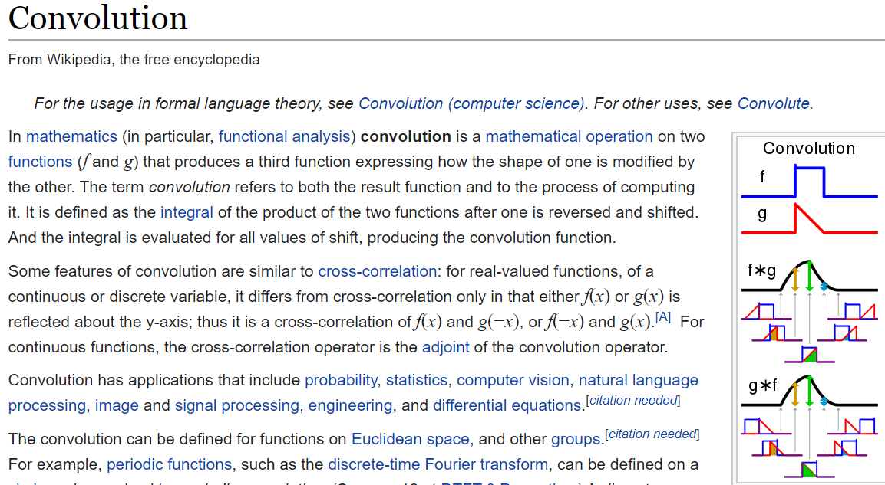
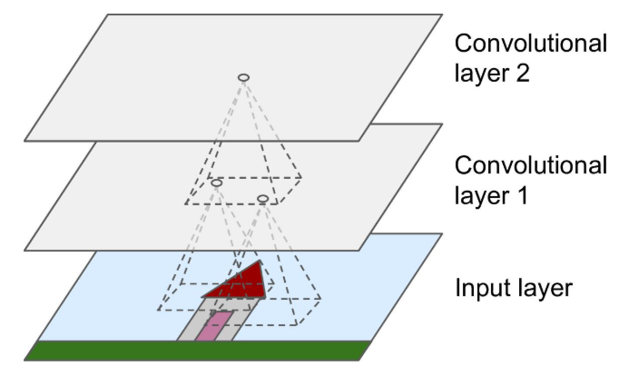
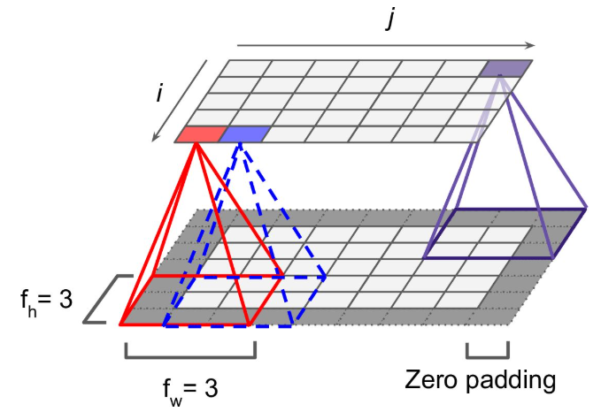
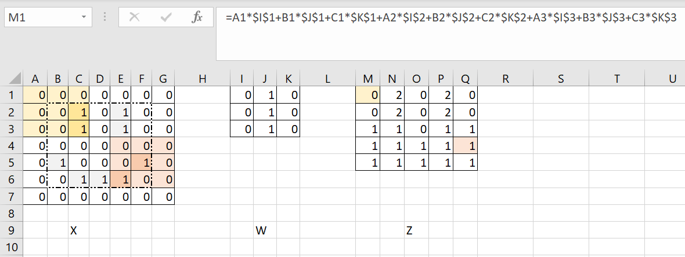
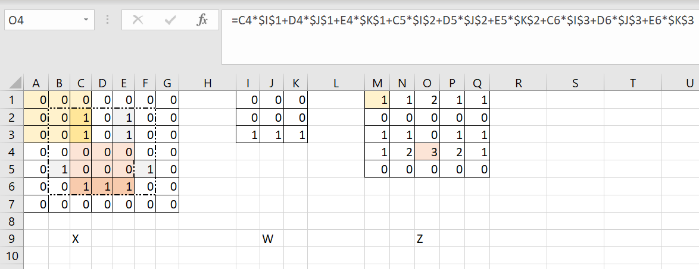
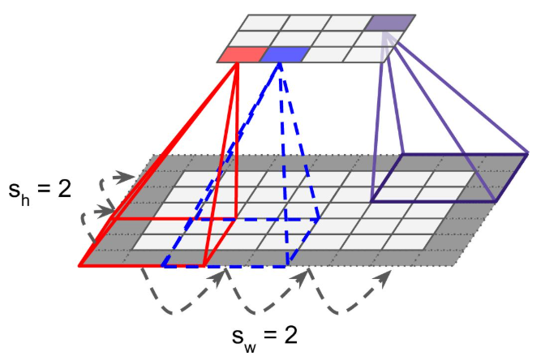
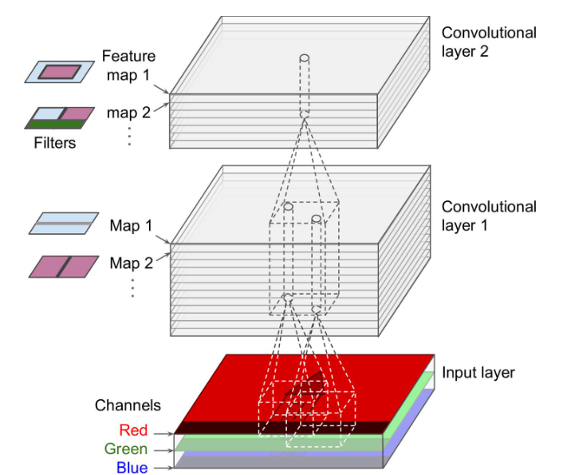
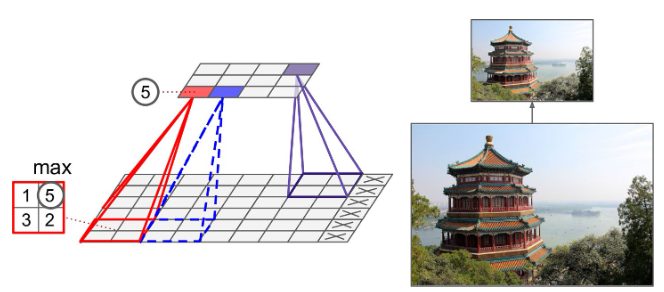
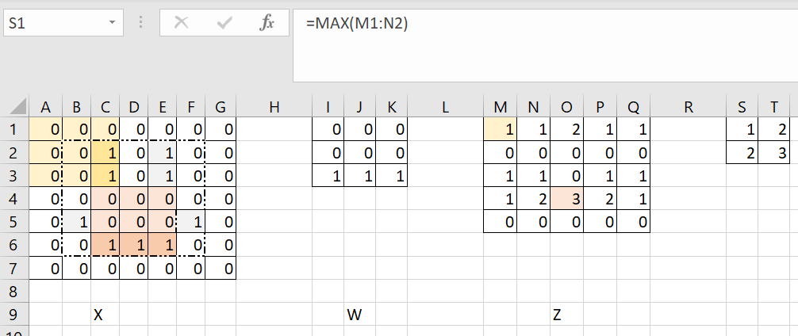
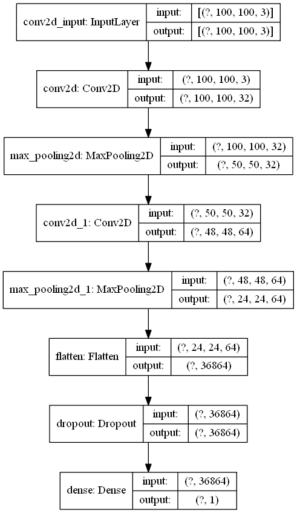

class: logo-slide

---

class: title-slide

### Convolutional Neural Networks

### Applications of Data Science - Class 17

### Giora Simchoni

#### `gsimchoni@gmail.com and add #dsapps in subject`

### Stat. and OR Department, TAU
### `r Sys.Date()`

---
```{r child = "../setup.Rmd"}
```

```{r packages, echo=FALSE, message=FALSE, warning=FALSE}
library(tidyverse)
```

```{python, echo=FALSE, message=FALSE, warning=FALSE}
# Seed value (can actually be different for each attribution step)
seed_value= 0

# 1. Set `PYTHONHASHSEED` environment variable at a fixed value
import os
os.environ['PYTHONHASHSEED']=str(seed_value)

# 2. Set `python` built-in pseudo-random generator at a fixed value
import random
random.seed(seed_value)

# 3. Set `numpy` pseudo-random generator at a fixed value
import numpy as np
np.random.seed(seed_value)

# 4. Set `tensorflow` pseudo-random generator at a fixed value
import tensorflow as tf
tf.random.set_seed(seed_value)

# 5. Configure a new global `tensorflow` session
# from keras import backend as K
# session_conf = tf.ConfigProto(intra_op_parallelism_threads=1, inter_op_parallelism_threads=1)
# sess = tf.Session(graph=tf.get_default_graph(), config=session_conf)
# K.set_session(sess)
```

class: section-slide

# Understanding Images

---

```{python Logo, out.width="60%"}
import matplotlib.pyplot as plt
from matplotlib.image import imread

logo = imread('../DSApps_logo.jpg')

plt.imshow(logo)
plt.show()
```

---

```{python}
print(type(logo))

print(logo.shape)

print(logo[:4, :4, 0])

print(logo.min(), logo.max())

print(logo.dtype, logo.size * logo.itemsize)
```

---

### Red channel

.pull-left[

```{python Logo-Red, out.width="100%"}
red = logo[:, :, 0]
plt.imshow(red,
  cmap='gray')
plt.show()
```

]

.pull-right[
```{python Logo-Red-Hist, out.width="100%"}
fig = plt.hist(red.flatten(),
  color = 'r')
fig = plt.ylim(0, 1700000)
plt.show()
```

]

---

### Green channel

.pull-left[

```{python Logo-Green, out.width="100%"}
green = logo[:, :, 1]
plt.imshow(green,
  cmap='gray')
plt.show()
```

]

.pull-right[
```{python Logo-Green-Hist, out.width="100%"}
fig = plt.hist(green.flatten(),
  color = 'g')
fig = plt.ylim(0, 1700000)
plt.show()
```

]

---

### Blue channel

.pull-left[

```{python Logo-Blue, out.width="100%"}
blue = logo[:, :, 2]
plt.imshow(blue,
  cmap='gray')
plt.show()
```

]

.pull-right[
```{python Logo-Blue-Hist, out.width="100%"}
fig = plt.hist(blue.flatten(),
  color = 'b')
fig = plt.ylim(0, 1700000)
plt.show()
```

]

---

### Until Convolutional Networks

.insight[
`r emo::ji("bulb")` So how many features is that? `r emo::ji("laughing")` `r emo::ji("laughing")` `r emo::ji("laughing")`
]

- In 1998 LeCun et. al. published [LeNet-5](https://ieeexplore.ieee.org/abstract/document/726791) for digit recognition
- But it wasn't until 2012 when Alex Krizhevsky, Ilya Sutskever and Geoffrey Hinton published [AlexNet](https://papers.nips.cc/paper/4824-imagenet-classification-with-deep-convolutional-neural-networks.pdf) when the Deep Learning mania really took off.

Until then:

1. Treat it as a regular high-dimensional ML problem
2. Image feature engineering

---

class: section-slide

# Convolutional Layer (2D)

---

### What is Convolution?



---

### The Convolutional Layer



.font80percent[Source: [Geron 2019](https://www.oreilly.com/library/view/hands-on-machine-learning/9781492032632/)]

- First layer: every neuron has a "receptive field", it is focused on a specific rectangle of the image, usually 2x2, 3x3
- Second layer: every neuron has a receptive field in the first layer
- Etc.

---

### More specifically



.font80percent[Source: [Geron 2019](https://www.oreilly.com/library/view/hands-on-machine-learning/9781492032632/)]

- The $[i,j]$ neuron looks at the rectangle at rows $i$ to $i + f_h - 1$, columns $j$ to $j + f_w - 1$
- Zero Padding: adds 0s around the image to make the next layer the same dimensions

---

### Filters/Features/Kernels

But what does the neuron actually *do*?

All neurons in a layer learn a single *filter* the size of their receptive field, the $f_h, f_w$ rectangle.

Suppose $f_h=f_w=3$ and the first layer learned the $W_{3x3}$ filter:

```{python}
W = np.array(
  [
    [0, 1, 0],
    [0, 1, 0],
    [0, 1, 0]
  ]
)
```

---

$X$ is the 5x5 image, suppose it has a single color channel (i.e. grayscale), sort of a smiley:

```{python}
X = np.array(
  [
    [0,   1,  0,  1,  0],
    [0,   1,  0,  1,  0],
    [0,   0,  0,  0,  0],
    [1,   0,  0,  0,  1],
    [0,   1,  1,  1,  0]
  ]
)
```

Each nuron in the new layer $Z$ would be the sum of elementwise multiplication of all 3x3 pixels/neurons in its receptive field with $W_{3x3}$:

$Z_{i,j} = b + \sum_{u=0}^{f_h-1}\sum_{v=0}^{f_w-1}X_{i+u,j+v}W_{u,v}$

---

### Good God, Excel?



.insight[
`r emo::ji("bulb")` What low-level feature did this layer learn to look for? What pattern will make its neurons most positive (i.e. will "turn them on")?
]

---

### Another filter



.insight[
`r emo::ji("bulb")` What low-level feature did this layer learn to look for? What pattern will make its neurons most positive (i.e. will "turn them on")?
]

---

### Convolving with Tensorflow

```{python}
import tensorflow as tf

ny = imread('images/new_york.jpg').mean(axis=2)
ny4D = np.array([ny.reshape(ny.shape[0], ny.shape[1], 1)])
W4d = W.reshape(W.shape[0], W.shape[0], 1, 1)

ny_convolved = tf.nn.conv2d(ny4D, W4d, strides=1, padding='SAME')
```

---

.pull-left[

```{python NY-Orig, out.width="100%"}
plt.imshow(
  ny,
  cmap = 'gray')
plt.show()
```

]

.pull-right[

```{python NY-Convolved, out.width="100%"}
plt.imshow(
  ny_convolved[0, :, :, 0],
  cmap = 'gray')
plt.show()
```

]

---

### Strides

In many CNN architechtures layers tend to get smaller and smaller using *strides*:



- The $[i,j]$ neuron looks at the rectangle at rows $i \cdot s_h$ to $i \cdot s_h + f_h - 1$, columns $j \cdot s_w$ to $j \cdot s_w + f_w - 1$

---

### Stacking Feature Maps

A convolutional layer is actually a 3D stack of a few of the 2D layers we described (a.k.a *Feature Maps*), each learns a single filter.



.font80percent[Source: [Geron 2019](https://www.oreilly.com/library/view/hands-on-machine-learning/9781492032632/)]

---

- Feature map 1 learns horizontal lines
- Feature map 2 learns vertical lines
- Feature map 3 learns diagonal lines
- Etc.

And each such feature map takes as inputs all feature maps (or color channels) in the previous layer, and sums:

$Z_{i,j,k} = b_k + \sum_{u=0}^{f_h-1}\sum_{v=0}^{f_w-1}\sum_{k'=0}^{f_n-1}X_{i \cdot s_h+u,j \cdot s_w+v, k'} \cdot W_{u,v,k', k}$

Where $f_n$ is the number of feature maps (or color channels) in the previous layer.

- Feature map 1 with $f_h \cdot f_w$ filter $\cdot f_n$ color channels + 1 bias term (it's a filter *cube*!)
- Feature map 2 with $f_h \cdot f_w$ filter $\cdot f_n$ color channels + 1 bias term
- Etc.

---

### And how does the network *learn* these filters?

---

### Too early to rejoice

That's still quite a lot.

- 100 x 100 RGB image
- 100 feature maps in first layer of filter 3x3
- (3 x 3 x 3 + 1) x 100 = 2800 params, not too bad
- But 100 x 100 numbers in each feature map (x 100) = 1M numbers, each say takes 4B, that's 4MB for 1 image for 1 layer
- Each number is a weighted sum of 3 x 3 x 3 = 27 numbers, so that's 1M x 27 = 27M multiplications for 1 layer...

---

### Pooling Layers

A pooling layer "sums up" a convolutional layer, by taking the max or mean of the receptive field.

No params!



.font80percent[Source: [Geron 2019](https://www.oreilly.com/library/view/hands-on-machine-learning/9781492032632/)]

---

Usually with strides $s_w=s_h=f_w=f_h$ and no padding (a.k.a `VALID`):



---

Clearly we're losing info.

.insight[
`r emo::ji("bulb")` A 2x2 max pooling layer would reduce the size of the previous layer by how many percents?
]

But maybe sometimes it's a *good* thing to ignore some neurons? Where did we get this crazy idea?

---

### Why do CNN work?

- No longer a long 1D column of neurons, but 2D, taking into accout spatial realtions between pixels/neurons
- First layer learns very low-level features, second layer learns higher level features, etc.
- Shared weights --> learn feature in one area of the image, generalize it to the entire image
- Less weights --> smaller size, more feasible model, less prone to overfitting
- Invariance by Max Pooling
- Less overfitting by Pooling 

---

class: section-slide

# Back to Malaria!

---

```{python}
import tensorflow_datasets as tfds
from skimage.transform import resize
from sklearn.model_selection import train_test_split

malaria, info = tfds.load('malaria', split='train', with_info=True)

images = []
labels = []
for example in tfds.as_numpy(malaria):
  images.append(resize(example['image'], (100, 100)).astype(np.float32))
  labels.append(example['label'])
  if len(images) == 2500:
    break
  
X = np.array(images)
y = np.array(labels)

X_train, X_test, y_train, y_test = train_test_split(X, y, test_size=0.20, random_state=42)

print(X_train.shape)
print(X_test.shape)
```

---

```{python}
from tensorflow.keras import Sequential
from tensorflow.keras.layers import Dense, Conv2D, MaxPooling2D, Flatten, Dropout
from tensorflow.keras.callbacks import EarlyStopping

model = Sequential()
model.add(Conv2D(32, input_shape=(X_train.shape[1:]),
  kernel_size=(3, 3), padding='same', activation='relu'))
model.add(MaxPooling2D(pool_size=(2, 2)))
model.add(Conv2D(64, kernel_size=(3, 3), activation='relu'))
model.add(MaxPooling2D(pool_size=(2, 2)))
model.add(Flatten())
model.add(Dropout(0.5))
model.add(Dense(1, activation='sigmoid'))
model.compile(loss='binary_crossentropy',
  optimizer='adam', metrics=['accuracy'])
```

---

```{python}
model.summary()
```

---

```{python}
from tensorflow.keras import utils

utils.plot_model(model, 'images/malaria_cnn.png', show_shapes=True)
```



---

```{python, eval=FALSE}
callbacks = [EarlyStopping(monitor='val_loss', patience=5)]
history = model.fit(X_train, y_train, batch_size=100, epochs=50,
  validation_split=0.1, callbacks=callbacks)

# Epoch 1/50
# 
#  1/18 [>.............................] - ETA: 0s - loss: 0.6919 - accuracy: 0.5000
#  2/18 [==>...........................] - ETA: 8s - loss: 0.6895 - accuracy: 0.5600
#  3/18 [====>.........................] - ETA: 11s - loss: 0.7002 - accuracy: 0.5433
#  4/18 [=====>........................] - ETA: 11s - loss: 0.7009 - accuracy: 0.5275
#  5/18 [=======>......................] - ETA: 11s - loss: 0.6954 - accuracy: 0.5420
#  6/18 [=========>....................] - ETA: 10s - loss: 0.6925 - accuracy: 0.5550
#  7/18 [==========>...................] - ETA: 9s - loss: 0.6882 - accuracy: 0.5714 
```

```{python, eval=FALSE, echo=FALSE}
import pandas as pd

pd.DataFrame(history.history).to_csv('malaria_cnn_history.csv', index=False)

y_pred = (model.predict(X_test) > 0.5).astype(int).reshape(y_test.shape)
np.save('y_pred.npy', y_pred)
```
---

```{python, eval=FALSE}
import pandas as pd

pd.read_csv(history.history).plot
plt.grid(True)
plt.show()
```

```{python History, echo=FALSE, out.width="100%", fig.asp=0.5}
import pandas as pd

pd.read_csv('malaria_cnn_history.csv').plot()
plt.grid(True)
plt.show()
```

---

### Last time we got to 66% accuracy after tuning...

```{python, echo=FALSE}
from sklearn.metrics import confusion_matrix

y_pred = np.load('y_pred.npy')
```

```{python, eval=FALSE}
from sklearn.metrics import confusion_matrix

y_pred = (model.predict(X_test) > 0.5).astype(int).reshape(y_test.shape)
```

```{python}
np.mean(y_pred == y_test)
```

```{python}
pd.DataFrame(
  confusion_matrix(y_test, y_pred), 
  index=['true:yes', 'true:no'], 
  columns=['pred:yes', 'pred:no']
)
```

---

### And this is just 10% of the data.

Watch me reach ~94% accuracy with 100% of the data in [Google Colab](https://colab.research.google.com/drive/1i39eWL8e5Gl3rjoulh5WJMVOUgvM8h6_?usp=sharing).


---

### Visualizing filters/kernels/features/weights

```{python, echo=FALSE}
W = np.load('W.npy')
```

```{python, eval=FALSE}
W, b = model.get_layer('conv2d').get_weights()
```

```{python}
W.shape
```


```{python}
W[:, :, 0, 0]
```

---

First filter of 32:

```{python First-Filter, out.width="100%"}
plt.subplot(1,3,1)
plt.imshow(W[:, :, 0, 0], cmap='gray')
plt.subplot(1,3,2)
plt.imshow(W[:, :, 1, 0], cmap='gray')
plt.subplot(1,3,3)
plt.imshow(W[:, :, 2, 0], cmap='gray')
plt.show()
```

---

### Visualizing Feature Maps

```{python Cell, out.width="100%"}
cell = X_test[0, :, :, :].reshape(1, 100, 100, 3)

plt.imshow(cell[0])
plt.show()
```

---

```{python, eval=FALSE}
from tensorflow.keras import Model

model_1layer = Model(inputs=model.inputs,
  outputs=model.layers[0].output)

feature_maps = model_1layer.predict(cell)

feature_maps.shape
```

```{python, echo=FALSE}
feature_maps = np.load('feature_maps.npy')

print(feature_maps.shape)
```

```{python, eval=FALSE}
# source: https://machinelearningmastery.com/how-to-visualize-filters-and-feature-maps-in-convolutional-neural-networks/
width = 8
height = 4
ix = 1
for _ in range(height):
	for _ in range(width):
		ax = plt.subplot(height, width, ix)
		_ = ax.set_xticks([])
		_ = ax.set_yticks([])
		_ = plt.imshow(feature_maps[0, :, :, ix-1], cmap='gray')
		ix += 1
plt.show()
```

---

```{python Feature-Maps, echo=FALSE, out.width="100%"}
width = 8
height = 4
ix = 1
for _ in range(height):
	for _ in range(width):
		ax = plt.subplot(height, width, ix)
		_ = ax.set_xticks([])
		_ = ax.set_yticks([])
		_ = plt.imshow(feature_maps[0, :, :, ix-1], cmap='gray')
		ix += 1
plt.show()
```

---

class: section-slide

# CNN Architectures

---

class: section-slide

# Using Pre-trained Models
